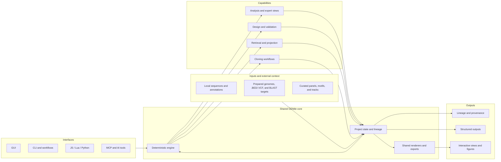

# GENtle

GENtle is a DNA and cloning workbench for both interactive use and automation.
Cloning projects are represented as workflows, with each biotechnical
operation mapped to a deterministic in silico counterpart. The same engine can
therefore execute a workflow, validate its assumptions, and render graphical
protocol cartoons that explain the underlying molecular events.

The same engine also fits into broader computational biology workflows where
external reference data matters. Prepared genome annotations, curated expert
panels, and other imported resources can contribute directly to the same
project state used by the GUI, CLI, and automation, so showcase figures remain
auditable instead of being redrawn by hand.

## How GENtle Fits Together


At a glance, GENtle is organized around one shared deterministic engine and
one project state. Interactive interfaces, scripting routes, and imported
biological context all meet in the same lineage-aware model, which then drives
cloning workflows, retrieval, design, analysis, graphics, and provenance.

The same structure in Mermaid form:



## Showcases

### Gibson Workflow, Mechanism, and Provenance


The first strip is the compact conceptual view: two fragments, 5' chew-back,
annealing across the homologous overlap, polymerase fill-in, and ligase
sealing. It introduces the mechanism at a glance.


The second strip is the factual single-insert view produced from the same
shared engine: one opened destination, one insert, two explicit junctions,
correct 5' chew-back, annealing at both overlaps, polymerase fill-in, and
ligase sealing.


And the same state remains inspectable as provenance: one `Gibson cloning`
operation, two input sequences, two primer outputs, and one assembled product
in the lineage graph.

These README Gibson figures are generated from shared engine routes, not drawn
by hand. The conceptual hero is rendered directly by the built-in
protocol-cartoon engine:

```sh
cargo run --quiet --bin gentle_cli -- \
  protocol-cartoon render-svg \
  gibson.two_fragment \
  docs/figures/gibson_two_fragment_protocol_cartoon.svg
```

The single-insert mechanism strip is likewise rendered directly from the newer
built-in dual-junction protocol cartoon:

```sh
cargo run --quiet --bin gentle_cli -- \
  protocol-cartoon render-svg \
  gibson.single_insert_dual_junction \
  docs/figures/gibson_single_insert_protocol_cartoon.svg
```

The lineage figure comes from the same tutorial baseline plus one deterministic
Gibson apply + lineage export path. Exact regeneration commands for all three
Gibson figures live in [`docs/figures/README.md`](docs/figures/README.md).

The protocol-cartoon command surface intentionally stays canonical under
`protocol-cartoon ...` so scripted and AI-guided use does not need to choose
between overlapping alias names.

### TP53/P53 Isoform Architecture


Curated TP53/p53 isoform architecture showcase: transcript/CDS geometry comes
from the Ensembl 116 TP53 annotation on GRCh38, while isoform labels and
protein-domain blocks come from the curated panel resource in
`assets/panels/tp53_isoforms_v1.json`. The figure is rendered through the same
shared expert-view route used by GENtle interfaces rather than from a
standalone illustration.

The TP53/p53 figure was generated with:

```sh
cargo run --quiet --bin gentle_cli -- \
  workflow @docs/figures/tp53_isoform_architecture.workflow.json
```

### TP73 cDNA vs Genomic Dotplot


Offline TP73 cDNA-vs-genomic showcase: the `NM_001126241.3` transcript is
derived locally from `test_files/tp73.ncbi.gb`, aligned against the same TP73
genomic locus with the shared dotplot engine route, and then rasterized to PNG
for README display while preserving the basepair axis labels. The same graphic
is available interactively in the GUI through a DNA window's `Dotplot map`
mode and standalone `Dotplot` workspace, where it can be used for coordinate
navigation back into the sequence context as a contribution to cloning-oriented
analysis and design.

The TP73 dotplot figure was generated with:

```sh
cargo run --quiet --bin gentle_cli -- \
  --state /tmp/tp73_readme_dotplot.state.json \
  workflow @docs/figures/tp73_cdna_genomic_dotplot.workflow.json

cargo run --quiet --bin gentle_examples_docs -- \
  svg-png \
  docs/figures/tp73_cdna_genomic_dotplot.svg \
  docs/figures/tp73_cdna_genomic_dotplot.png \
  --drop-dotplot-metadata
```

### Guided GUI Testing


GENtle also ships tutorial-backed GUI testing paths. For example, the Gibson
specialist has a dedicated walkthrough in
[`docs/tutorial/gibson_specialist_testing_gui.md`](docs/tutorial/gibson_specialist_testing_gui.md),
and that guide is available directly through the Help window with associated
screenshots, so contributors can validate the rendered cloning representation
against one stable sequence baseline and a reproducible step-by-step test
script rather than ad hoc clicking.

## Ongoing Development

GENtle is under active development. The README should give a useful snapshot
of what is already practical today, while the source of truth for current
implementation status, open gaps, and execution order remains
[`docs/roadmap.md`](docs/roadmap.md).

### PCR and Primer Design Snapshot

| Flavor / workflow | Current support | Main engine route(s) | Current surface |
| --- | --- | --- | --- |
| Standard endpoint PCR | Shipped | `Pcr` | GUI `PCR`, shared-shell/CLI operation payload |
| Advanced PCR | Shipped | `PcrAdvanced` | GUI `PCR Adv`, shared-shell/CLI operation payload |
| Degenerate / randomized primer-library PCR | Shipped inside advanced PCR | `PcrAdvanced` | shared-shell/CLI operation payload |
| PCR mutagenesis | Shipped | `PcrMutagenesis` | GUI `PCR Mut`, shared-shell/CLI operation payload |
| Primer-pair design for one ROI | Shipped | `DesignPrimerPairs` | Engine Ops, CLI/shared-shell report routes |
| Selection-first batch primer-pair design | Shipped | repeated `DesignPrimerPairs` | DNA-window PCR queue + Engine Ops batch results |
| qPCR assay design | Shipped | `DesignQpcrAssays` | Engine Ops, CLI/shared-shell qPCR report routes |
| PCR protocol cartoons | Shipped baseline | `RenderProtocolCartoonSvg` | `pcr.assay.pair`, `pcr.assay.pair.no_product`, `pcr.assay.qpcr` |
| Nested PCR | Planned | future `DesignPrimerPairs` family extension | tracked in roadmap |
| Inverse PCR | Planned | future PCR modality extension | tracked in roadmap |
| Long-range / multiplex / translocation PCR | Planned | future PCR modality extension | tracked in roadmap |

The design direction is to keep these PCR flavors on one deterministic engine
contract family rather than split them into unrelated specialist paths. For
current detail on contracts and GUI behavior, see [`docs/protocol.md`](docs/protocol.md)
and [`docs/gui.md`](docs/gui.md). For what is actively being built next, see
[`docs/roadmap.md`](docs/roadmap.md).

## Principles

- One engine, many interfaces: GUI, CLI, JavaScript, and Lua all use the same core logic.
- Provenance by default: derived results should be traceable and replayable.
- Structured contracts: operations, results, and errors should be machine-readable.
- Thin adapters: biology logic lives in the engine, not in frontend-specific code.

## Documentation

- Architecture: [`docs/architecture.md`](docs/architecture.md)
- Roadmap: [`docs/roadmap.md`](docs/roadmap.md)
- Protocol: [`docs/protocol.md`](docs/protocol.md)
- GUI manual: [`docs/gui.md`](docs/gui.md)
- CLI manual: [`docs/cli.md`](docs/cli.md)
- Tutorial guide: [`docs/tutorial/README.md`](docs/tutorial/README.md)
- Executable tutorial hub: [`docs/tutorial/generated/README.md`](docs/tutorial/generated/README.md)
- Agent interfaces tutorial: [`docs/agent_interfaces_tutorial.md`](docs/agent_interfaces_tutorial.md)
- Acknowledgements: [`ACKNOWLEDGEMENTS.md`](ACKNOWLEDGEMENTS.md)
