# GENtle

GENtle is a DNA and cloning workbench for both interactive use and automation.
Cloning projects are represented as workflows, with each biotechnical
operation mapped to a deterministic in silico counterpart. The same engine can
therefore execute a workflow, validate its assumptions, and render graphical
protocol cartoons that explain the underlying molecular events.

The same engine also fits into broader computational biology workflows where
external reference data matters. Prepared genome annotations, curated expert
panels, and other imported resources can contribute directly to the same
project state used by the GUI, CLI, and automation, so showcase figures remain
auditable instead of being redrawn by hand.

Today, that already means GENtle can:

- plan and review Gibson assemblies with explicit overlaps, primer suggestions,
  lineage-visible outputs, and ordered multi-insert previews
- execute PCR, advanced PCR, PCR mutagenesis, primer-pair design, and qPCR
  assay design through one shared engine family
- render factual protocol cartoons and lineage graphs from the same project
  state instead of relying on hand-drawn figures
- keep GUI, CLI, and automation routes aligned on the same deterministic
  contracts

## What To Trust Today

Use this as a task-oriented confidence map rather than assuming every visible
menu item is equally mature.

### Recommended now

- Single-insert Gibson specialist work: destination-first planning, preview,
  apply, reopen-from-lineage, and SVG/cartoon export.
- Core PCR, primer-pair, and qPCR engine routes when you already know the task
  and want deterministic execution plus an inspectable report trail.
- Prepared-genome region/gene extraction and the linked visualization/export
  paths once the reference has been prepared locally.
- Explanation/export surfaces such as lineage SVG, protocol cartoons, dotplot
  SVG, and isoform-architecture figures.

### Works with caveats

- Multi-insert Gibson preview/review is useful, but execution currently
  requires a defined destination opening; `existing_termini` is still the
  single-fragment handoff path.
- Primer3-backed primer workflows are available, but the internal backend is
  still the most deterministic default and deeper backend-parity work is
  ongoing.
- GUI-first and manual/hybrid tutorials are good learning aids, but generated
  executable tutorials remain the higher-confidence reference when
  reproducibility matters most.

### Exploratory / not yet first choice

- Broader cloning routine families outside the strongest current
  Gibson/restriction baselines.
- Direct GUI feature editing and exon/intron/transcript-boundary curation.
- guideRNA workflows, richer virtual-PCR/off-target workflows, and deeper
  assay families such as LAMP or KASP/PACE genotyping.

## Operations, Routines, and Specialists

GENtle is intentionally layered so cloning logic stays deterministic without
forcing every user to work at the same level of abstraction.

| Layer | Quick read |
| --- | --- |
| **Operations** | Atomic deterministic state transitions such as `Digest`, `Ligation`, `Pcr`, `DesignPrimerPairs`, `DesignQpcrAssays`, and `ExtractGenomeRegion`.<br><sub>Meet them in GUI Engine Ops, the shared shell, and CLI JSON/workflow execution.</sub> |
| **Routines** | Named, typed workflow patterns with explainability and preflight, like `gibson.two_fragment_overlap_preview`, `golden_gate.type_iis_single_insert`, `gateway.bp_single_insert`, and `restriction.digest_ligate_extract_sticky`.<br><sub>Meet them in `Patterns -> Routine Assistant...`, `routines list/explain/compare`, and `macros template-run --validate-only`.</sub> |
| **Specialists** | Guided task-specific windows built on the same engine and routine ideas, such as `Patterns -> Gibson...`, the DNA-window PCR tools, and the Routine Assistant.<br><sub>Best when you want planning and review help without dropping to raw operation payloads.</sub> |
| **Explanation artifacts** | Factual outputs generated from the same project state, including protocol cartoons, the lineage graph, and exported reports.<br><sub>These are the SVG/PNG figures and reports surfaced in the README, exports, Help, and tutorials.</sub> |

The intended usage is:

1. Use operations when you already know the exact atomic steps you want.
2. Use routines when you want GENtle to help choose, explain, preflight, and
   bind a named cloning workflow.
3. Use specialists when a workflow deserves a focused GUI for planning,
   review, and export, but should still land on the same shared engine
   contracts underneath.

This is why the same project can simultaneously hold raw operations, named
routine logic, specialist review state, generated cartoons, and
lineage/provenance without those becoming separate worlds.

This architecture is still evolving. Some domains already have richer
specialists than the generic routine layer, and some routine families are much
deeper than others. The important current invariant is not that every surface
looks identical yet, but that they are converging on the same deterministic
engine, the same typed preflight logic, and the same inspectable project
state.

## How GENtle Fits Together


At a glance, GENtle is organized around one shared deterministic engine and
one project state. Interactive interfaces, scripting routes, and imported
biological context all meet in the same lineage-aware model, which then drives
cloning workflows, retrieval, design, analysis, graphics, and provenance.

## What It Already Shows

GENtle can not only perform cloning tasks, but also explain them from the
same deterministic project state and render those explanations graphically.
All of the figures below were produced by GENtle itself through shared engine
routes, without manual redrawing or post-hoc illustration.

### Simplest Blunt-End Clone

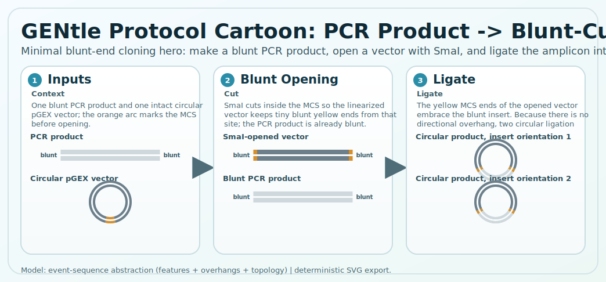

This is the smallest fully offline cloning slice now documented in the
repository: amplify one blunt 250 bp PCR product, start from one intact
circular pGEX vector with its MCS highlighted, open that vector with the blunt
cutter `SmaI`, and let GENtle show the two blunt-ligation orientations that
follow from a non-directional insert while the yellow MCS-derived vector ends
embrace the insert in the ligation panel. The two circular products are also
given opposite strand patterns there, so one orientation reads as
solid-over-dotted and the other as dotted-over-solid at a glance. The PCR
insert keeps the same strand cue already in the input and opening panels, so
the ligation outcome reads as a continuation of the same duplex.

The concrete replayable workflow lives in
[`docs/figures/pgex_blunt_pcr_ligation.workflow.json`](docs/figures/pgex_blunt_pcr_ligation.workflow.json).
It uses the linear FASTA
[`test_files/pGEX_3X.fa`](test_files/pGEX_3X.fa) as the PCR template, the
circular GenBank record
[`test_files/pGEX-3X.gb`](test_files/pGEX-3X.gb) as the vector to digest, and
also writes the actual lineage companion figure
[`docs/figures/pgex_blunt_pcr_ligation_lineage.svg`](docs/figures/pgex_blunt_pcr_ligation_lineage.svg).
The hero above is the matching conceptual strip rendered from
[`docs/examples/protocol_cartoon/pcr_blunt_vector_ligation_template.json`](docs/examples/protocol_cartoon/pcr_blunt_vector_ligation_template.json).

Regenerate both from the repository root with:

```sh
cargo run --quiet --bin gentle_cli -- \
  --state /tmp/pgex_blunt_pcr_ligation.state.json \
  workflow @docs/figures/pgex_blunt_pcr_ligation.workflow.json

cargo run --quiet --bin gentle_cli -- \
  protocol-cartoon render-template-svg \
  docs/examples/protocol_cartoon/pcr_blunt_vector_ligation_template.json \
  docs/figures/pgex_blunt_pcr_ligation_hero.svg
```

### Known-Insert PCR Checks

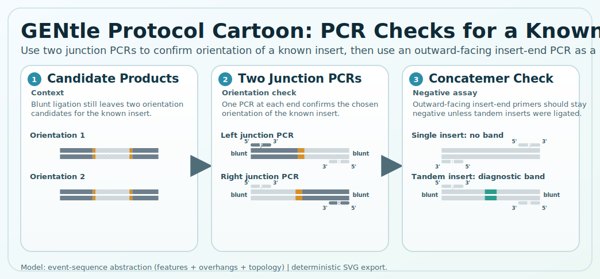

For a known insert, the next practical checks after a non-directional blunt
ligation are still PCR-based. Here GENtle keeps the same pGEX blunt-clone
story, but switches from build logic to verification logic: two junction PCRs,
one at each end, confirm the chosen insert orientation, and an outward-facing
insert-end PCR stays negative unless multiple inserts were taken up in tandem.

This conceptual strip is rendered from
[`docs/examples/protocol_cartoon/pcr_blunt_junction_pcr_template.json`](docs/examples/protocol_cartoon/pcr_blunt_junction_pcr_template.json).
Regenerate it from the repository root with:

```sh
cargo run --quiet --bin gentle_cli -- \
  protocol-cartoon template-validate \
  docs/examples/protocol_cartoon/pcr_blunt_junction_pcr_template.json

cargo run --quiet --bin gentle_cli -- \
  protocol-cartoon render-template-svg \
  docs/examples/protocol_cartoon/pcr_blunt_junction_pcr_template.json \
  docs/figures/pgex_blunt_junction_pcr_hero.svg
```

### Unknown Insert with Degenerate Primers

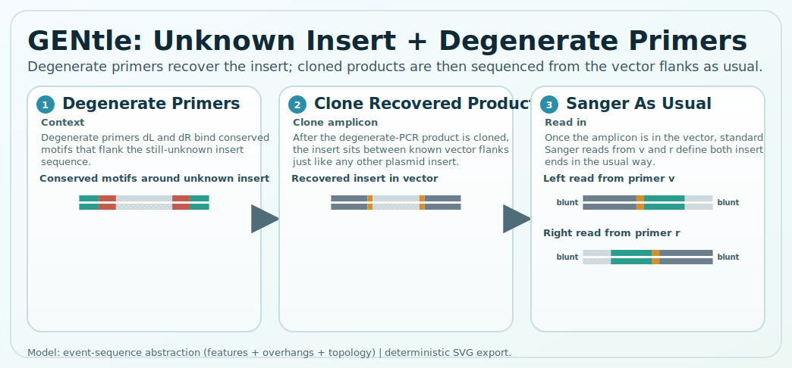

If the insert sequence is not known in advance, GENtle can instead illustrate
the recovery step with degenerate primers placed on conserved motifs. Once
that PCR product has been cloned, sequencing becomes ordinary again: the known
vector primers on both sides read into the insert from the familiar flanks,
and Sanger confirmation proceeds as usual.

This conceptual strip is rendered from
[`docs/examples/protocol_cartoon/pcr_blunt_sequence_confirmation_template.json`](docs/examples/protocol_cartoon/pcr_blunt_sequence_confirmation_template.json).
Regenerate it from the repository root with:

```sh
cargo run --quiet --bin gentle_cli -- \
  protocol-cartoon template-validate \
  docs/examples/protocol_cartoon/pcr_blunt_sequence_confirmation_template.json

cargo run --quiet --bin gentle_cli -- \
  protocol-cartoon render-template-svg \
  docs/examples/protocol_cartoon/pcr_blunt_sequence_confirmation_template.json \
  docs/figures/pgex_blunt_sequence_confirmation_hero.svg
```

### Gibson Workflow, Mechanism, and Provenance


The first strip is the compact conceptual view: two fragments, 5' chew-back,
annealing across the homologous overlap, polymerase fill-in, and ligase
sealing. It introduces the mechanism at a glance.


The second strip is the factual single-insert view produced from the same
shared engine: one opened destination, one insert, two explicit junctions,
correct 5' chew-back, annealing at both overlaps, polymerase fill-in, and
ligase sealing.


And the same state remains inspectable as provenance: one `Gibson cloning`
operation, two input sequences, two primer outputs, and one assembled product
in the lineage graph. This figure is not a screenshot; it is the SVG export of
the same lineage graph that becomes available in the GUI after Gibson apply,
via `File -> Export DALG SVG...` or the graph-canvas context menu entry
`Save Graph as SVG...`.

Current limitation: multi-insert execution currently requires a defined
destination opening; `existing_termini` remains the single-fragment handoff
path.

These README Gibson figures are generated from shared engine routes, not drawn
by hand. Together they answer three different questions:

1. What is Gibson at a glance?
2. What exact mechanism is GENtle modeling?
3. What concrete artifacts did the project produce?

The conceptual hero is rendered directly by the built-in protocol-cartoon
engine:

```sh
cargo run --quiet --bin gentle_cli -- \
  protocol-cartoon render-svg \
  gibson.two_fragment \
  docs/figures/gibson_two_fragment_protocol_cartoon.svg
```

The single-insert mechanism strip is likewise rendered directly from the newer
built-in dual-junction protocol cartoon:

```sh
cargo run --quiet --bin gentle_cli -- \
  protocol-cartoon render-svg \
  gibson.single_insert_dual_junction \
  docs/figures/gibson_single_insert_protocol_cartoon.svg
```

The lineage figure comes from the same tutorial baseline plus one deterministic
Gibson apply + GUI/CLI-shared lineage export path. Exact regeneration commands
for all three Gibson figures live in [`docs/figures/README.md`](docs/figures/README.md).

The protocol-cartoon command surface intentionally stays canonical under
`protocol-cartoon ...` so scripted and AI-guided use does not need to choose
between overlapping alias names.

### Rack Placement, Gel Readout, and 3D Print Path

| Linked physical carrier | README gel readout |
| --- | --- |
| 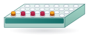 | 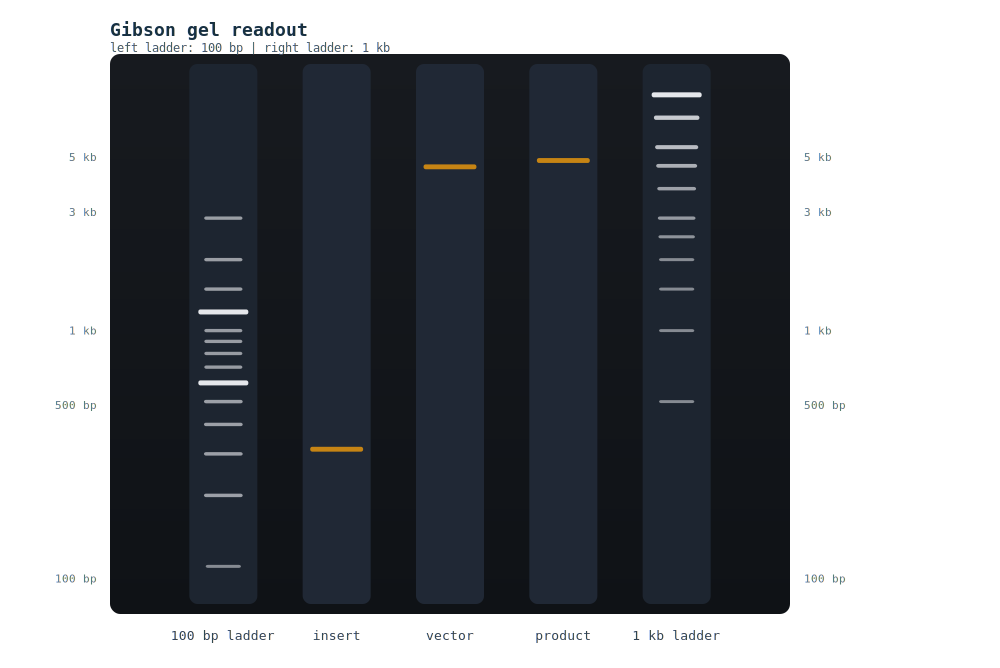 |

The same single-insert Gibson state can now also be projected into one linked
physical carrier and one linked analytical readout. The rack hero is not a
screenshot: it is a README-focused SVG derived from the deterministic isometric
rack export that the saved rack draft produces automatically. Its restored
legend keeps the link back to the cloning experiment visible again:
`Gibson arrangement` plus `DNA ladder`.

The gel companion is generated from the same saved Gibson state, but the README
version uses a deliberate analytical lane order: `insert -> vector -> product`.
That puts the insert directly next to the finer `100 bp` ladder on the left,
while the heavier vector and assembled-product bands sit next to each other for
a more immediate before/after size comparison. A broader `1 kb` ladder on the
right still keeps the larger plasmid-sized bands grounded, and the hero now
restores side size annotations so the band scale stays legible without bringing
back the full technical audit view. Taken together, the two figures make it
much clearer why the rack placement and gel readout belong together even though
the wet-lab carrier and analytical lane order are not the same thing.

The same shared physical template and arrangement state also drive fabrication
SVG, carrier-label, and OpenSCAD export.

Regenerate them with:

```sh
cargo run --quiet --bin gentle_cli -- \
  --state /tmp/gibson_rack_hero.state.json \
  workflow @docs/examples/workflows/gibson_arrangements_baseline.json

cargo run --quiet --bin gentle_cli -- \
  --state /tmp/gibson_rack_hero.state.json \
  racks isometric-svg \
  rack-1 \
  docs/figures/gibson_single_insert_rack_isometric.svg \
  --template pipetting_pcr_tube_rack

python3 docs/figures/render_rack_isometric_hero.py \
  docs/figures/gibson_single_insert_rack_isometric.svg \
  docs/figures/gibson_single_insert_rack_hero.svg

cargo run --quiet --bin gentle_cli -- \
  --state /tmp/gibson_rack_hero.state.json \
  render-pool-gel-svg \
  - \
  docs/figures/gibson_single_insert_arrangement_gel.svg \
  --containers container-2,container-1,container-5 \
  --ladders "GeneRuler 100bp DNA Ladder Plus,Plasmid Factory 1kb DNA Ladder"

python3 docs/figures/render_serial_gel_hero.py \
  docs/figures/gibson_single_insert_arrangement_gel.svg \
  docs/figures/gibson_single_insert_arrangement_gel_hero.svg \
  "100 bp ladder" insert vector product "1 kb ladder"
```

The corresponding GUI/CLI tutorial for this export lives in
[`docs/tutorial/gibson_physical_rack_gui.md`](docs/tutorial/gibson_physical_rack_gui.md).

### Overlap-Extension PCR Substitution Mechanism


This hero strip shows the six-step overlap-extension substitution flow:
template+insert setup, chimeric primer assignment (`a`..`f`), three first-step
PCR products (`AB`, `CD`, `EF`), denaturation, overlap annealing with
strand-specific gaps, and polymerase fill to one continuous duplex product.

The figure is rendered from the built-in protocol-cartoon route:

```sh
cargo run --quiet --bin gentle_cli -- \
  protocol-cartoon render-svg \
  pcr.oe.substitution \
  docs/figures/pcr_overlap_extension_substitution_fig1_style.svg
```

### TP73 Dotplot Views

| Pairwise cDNA vs genome | Shared-exon anchored isoforms |
| --- | --- |
|  | 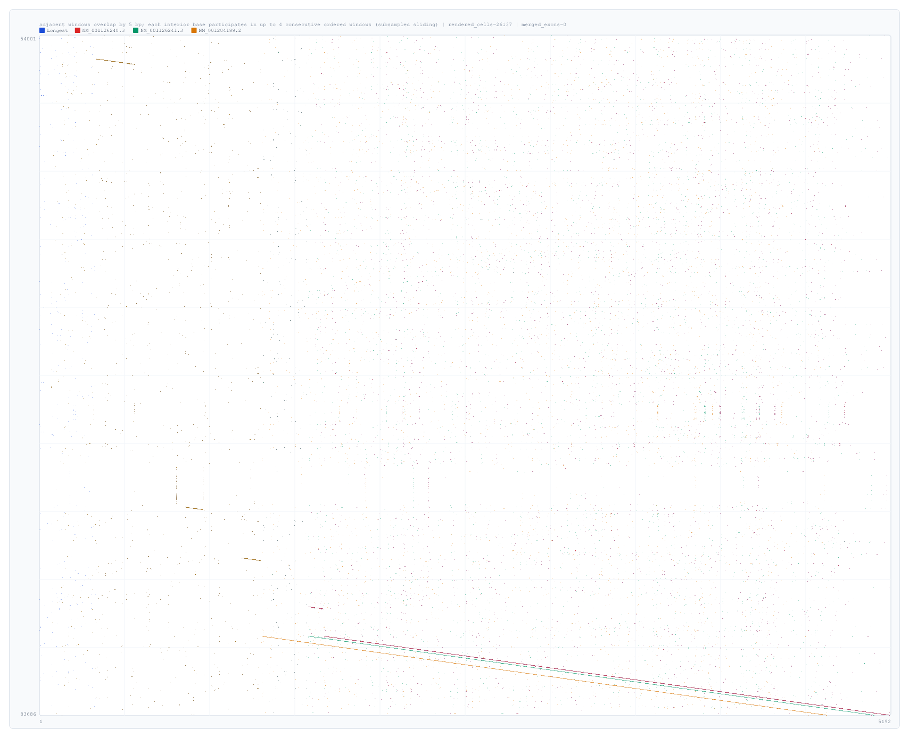 |

The README dotplot story now stays on one locus: TP73. The left panel is the
simple pairwise baseline, with `NM_001126241.3` derived locally from
`test_files/tp73.ncbi.gb` and aligned back to the same TP73 genomic locus. The
right panel is the more integrated multi-isoform view: the longest curated TP73
transcript (`NM_005427.4`) is overlaid with variants `NM_001126240.3`,
`NM_001126241.3`, and `NM_001204189.2`, all against the same genomic
reference, while the shared exon `55034..55276` is anchored to one common
x-position. That makes downstream splice losses and retained exon chains easier
to compare at a glance without leaving the shared dotplot engine route.

Both figures remain available interactively in the GUI through a DNA window's
`Dotplot map` mode and the standalone `Dotplot` workspace, where the same
payloads can be re-rendered with alternative overlay x-axis layouts.
For the visual grammar alone, the repository also carries a tiny synthetic
anchored teaching figure in
[`docs/figures/toy_shared_exon_anchor_dotplot.png`](docs/figures/toy_shared_exon_anchor_dotplot.png),
documented in [`docs/figures/README.md`](docs/figures/README.md).

For a cross-gene reading, the repository now also carries an anchored p53
family comparison:

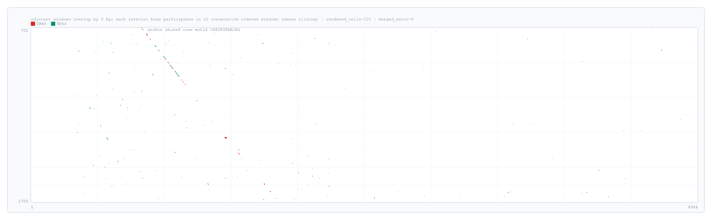

Here TP73 stays on the shared Y-axis as the reference sequence, while TP63 and
TP53 are overlaid on the X-axis and aligned by the conserved motif
`CATGTGTAACAG`. This uses the same engine-owned dotplot payload plus the new
`query_anchor_bp` overlay x-axis mode, so the family comparison is a true
shared contract rather than a special README-only drawing.

The TP73 README dotplot figures were generated with:

```sh
cargo run --quiet --bin gentle_cli -- \
  --state /tmp/tp73_readme_dotplot.state.json \
  workflow @docs/figures/tp73_cdna_genomic_dotplot.workflow.json

cargo run --quiet --bin gentle_examples_docs -- \
  svg-png \
  docs/figures/tp73_cdna_genomic_dotplot.svg \
  docs/figures/tp73_cdna_genomic_dotplot.png \
  --drop-dotplot-metadata

cargo run --quiet --bin gentle_cli -- \
  --state /tmp/tp73_anchor_readme.state.json \
  workflow @docs/figures/tp73_multi_isoform_anchor_dotplot.workflow.json

cargo run --quiet --bin gentle_examples_docs -- \
  svg-png \
  docs/figures/tp73_multi_isoform_anchor_dotplot.svg \
  docs/figures/tp73_multi_isoform_anchor_dotplot.png \
  --drop-dotplot-metadata

cargo run --quiet --bin gentle_cli -- \
  --state /tmp/p53_family_anchor.state.json \
  workflow @docs/figures/p53_family_query_anchor_dotplot.workflow.json

cargo run --quiet --bin gentle_examples_docs -- \
  svg-png \
  docs/figures/p53_family_query_anchor_dotplot.svg \
  docs/figures/p53_family_query_anchor_dotplot.png \
  --drop-dotplot-metadata
```

### TP73 Upstream TF Score Tracks

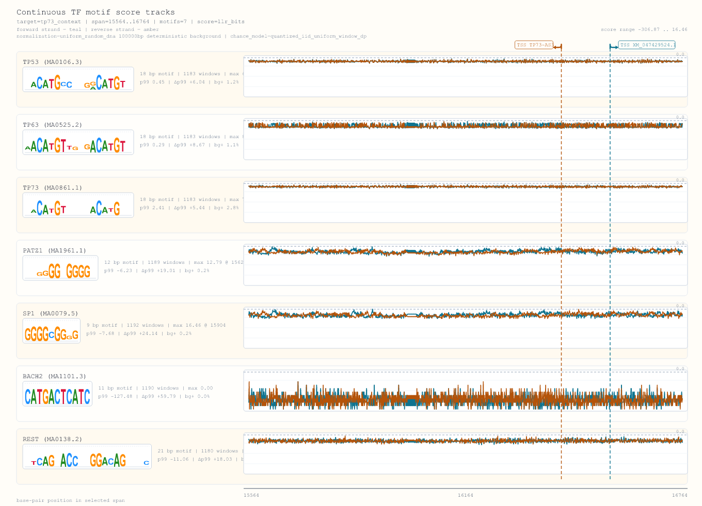

GENtle can now also export the continuous TFBS/PSSM score-track plot itself as a
shared figure, not just as a GUI-only panel or JSON array dump. This TP73
example uses the local `test_files/tp73.ncbi.gb` locus and shows one
promoter-proximal internal transcript-start neighborhood (`15564..16764`),
covering `1000 bp` upstream plus `200 bp` into the transcribed region around
the internal TP73 start at `XM_047429524.1`, for `TP53`, `TP63`, `TP73`,
`PATZ1`, `SP1`, `BACH2`, and `REST`. When a transcription start is immediately
adjacent to or inside the rendered window, the shared export now marks it with
a short hooked arrow so strand direction reads directly from the figure. The
figure is deliberately rendered without negative clipping, because in this slice
`SP1` provides the clearest positive support while the other requested factors
are still informative as full continuous score traces rather than being
flattened to zero.

The figure was generated with:

```sh
cargo run --quiet --bin gentle_cli -- \
  --state /tmp/tp73_upstream_tfbs_score_tracks.state.json \
  workflow @docs/figures/tp73_upstream_tfbs_score_tracks.workflow.json

cargo run --quiet --bin gentle_examples_docs -- \
  svg-png \
  docs/figures/tp73_upstream_tfbs_score_tracks.svg \
  docs/figures/tp73_upstream_tfbs_score_tracks.png
```

### TERT Promoter Tail-Calibrated TFBS Tracks

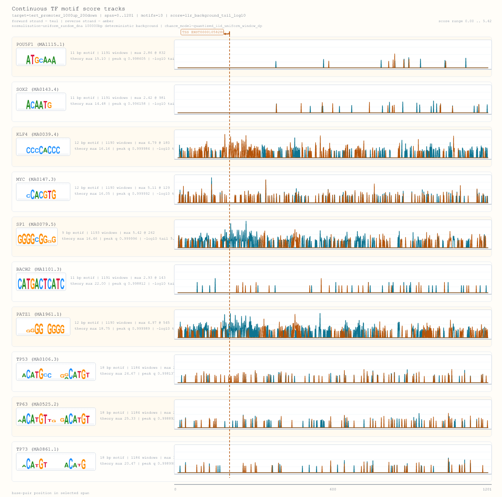

GENtle can also carry the same TFBS score-track machinery into a real promoter
case study and keep the genomic anchor visible. This TERT example is derived
through GENtle’s own internal promoter-slice path (`1000 bp` upstream plus
`200 bp` into the transcribed region) rather than by pasting an external
sequence into the plotter. The stacked figure uses one tail-calibrated
`llr_background_tail_log10` view for the requested factors
`POU5F1 (MA1115.2)`, `SOX2 (MA0143.5)`, `KLF4 (MA0039.5)`,
`MYC (MA0147.4)`, `SP1 (MA0079.5)`, `BACH2 (MA1101.3)`,
`PATZ1 (MA1961.2)`, `TP53 (MA0106.3)`, `TP63 (MA0525.2)`, and
`TP73 (MA0861.2)`, and it keeps the transcription start site explicit as one
shared dashed line with a single kinked top arrow so the whole plot still
reads as one DNA span instead of ten independent traces.

In this TERT slice, `SP1 (MA0079.5)` and `MYC (MA0147.4)` stand out most
clearly in the tail-calibrated track view, while `PATZ1 (MA1961.2)`,
`TP63 (MA0525.2)`, and `KLF4 (MA0039.5)` stay visible as
secondary-but-real tail events instead of collapsing into random-looking
texture.

### TERT Promoter Synchrony View

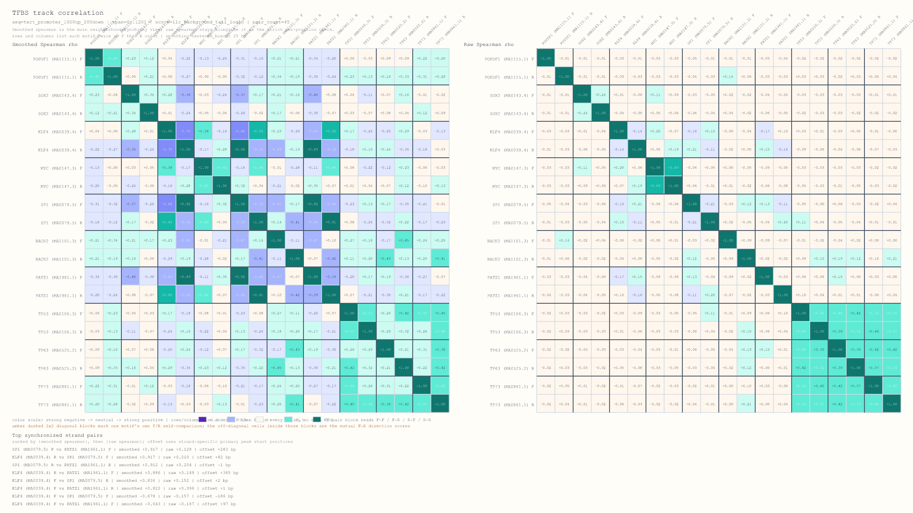

The same shared report can also be rendered as a synchrony view. For promoter
work like this, GENtle now offers both Pearson and Spearman on the exact and
smoothed per-position signals. This README figure uses Spearman because the
track values are clearly non-normal and often tied by clipping/background
thresholding, so rank-based correlation is the more honest default summary.

That makes the TERT story easier to read: we can see not just which motifs
peak, but which ones peak in the same neighborhoods. In the current slice,
`SP1 (MA0079.5)` and `PATZ1 (MA1961.2)` form the strongest synchronized pair,
with `KLF4 (MA0039.5)` also tracking the same neighborhood.

### Stateless Sequence Inspection

GENtle now also has a very small state-optional inspection slice for direct DNA
questions: paste or embed one ASCII sequence, then ask for restriction sites,
TFBS hits, or continuous TFBS score tracks without first creating a stored
sequence record.

Canonical offline workflow example:

- [`docs/examples/workflows/inline_sequence_inspection_stateless_offline.json`](docs/examples/workflows/inline_sequence_inspection_stateless_offline.json)

Matching GUI/CLI tutorial:

- [`docs/tutorial/stateless_sequence_inspection_gui_cli.md`](docs/tutorial/stateless_sequence_inspection_gui_cli.md)

Matching ClawBio workflow request:

- [`integrations/clawbio/skills/gentle-cloning/examples/request_workflow_inline_sequence_inspection_stateless.json`](integrations/clawbio/skills/gentle-cloning/examples/request_workflow_inline_sequence_inspection_stateless.json)

Replay the canonical workflow from the repository root with:

```sh
cargo run --quiet --bin gentle_cli -- \
  workflow @docs/examples/workflows/inline_sequence_inspection_stateless_offline.json
```

This writes four portable artifacts from one synthetic inline sequence:

- restriction-site JSON
- TFBS-hit JSON
- TFBS score-track JSON
- TFBS score-track SVG

### Ongoing Work With ClawBio


Ongoing integration work with ClawBio now also has a dedicated hero image:
ClawBio raises the pharmacogenomic alert around `VKORC1` / `rs9923231`, and
GENtle turns that into a concrete promoter-fragment and luciferase-reporter
design story. The left panel explains the reverse-strand promoter interval to
take forward, while the right panel shows the study construct as a real GENtle
circular-map export rather than a standalone illustration.

### Guided GUI Tutorials


GENtle also ships guided GUI tutorials. For example, the Gibson specialist has
a dedicated walkthrough in
[`docs/tutorial/gibson_specialist_testing_gui.md`](docs/tutorial/gibson_specialist_testing_gui.md),
and that guide is available directly through the Help window with associated
screenshots. This keeps the interactive workflow teachable and reproducible:
users can follow a stable step-by-step path inside the GUI, and contributors
still gain a concrete reference sequence baseline for validation when needed.

## Ongoing Development

GENtle is already practically useful, but it is still evolving in public. Some
areas already have deeper specialists and richer visual explanation than
others, and some generic routine families are still catching up with the
strongest GUI flows.

The README aims to show what is genuinely working today. The source of truth
for current implementation status, open gaps, and execution order remains
[`docs/roadmap.md`](docs/roadmap.md).

Build note:
- default Rust builds now focus on GUI/CLI/MCP/docs paths
- embedded JavaScript and Lua shells are optional Cargo feature targets
  (`js-interface`, `lua-interface`)
- release packaging builds enable `script-interfaces`, so tagged release builds
  include the embedded scripting adapter feature set even though default local
  builds stay lean
- the Python wrapper in `integrations/python/gentle_py` remains a separate
  `gentle_cli`-based integration rather than a Rust build dependency

### PCR and Primer Design Snapshot

| Flavor / workflow | Current support | Main engine route(s) | Current surface |
| --- | --- | --- | --- |
| Standard endpoint PCR | Shipped | `Pcr` | GUI `PCR`, shared-shell/CLI operation payload |
| Advanced PCR | Shipped | `PcrAdvanced` | GUI `PCR Adv`, shared-shell/CLI operation payload |
| Degenerate / randomized primer-library PCR | Shipped inside advanced PCR | `PcrAdvanced` | shared-shell/CLI operation payload |
| PCR mutagenesis | Shipped | `PcrMutagenesis` | GUI `PCR Mut`, shared-shell/CLI operation payload |
| Primer-pair design for one ROI | Shipped | `DesignPrimerPairs` | Engine Ops, CLI/shared-shell report routes |
| Insertion-first anchored pair design | Shipped (engine contract) | `DesignInsertionPrimerPairs` | CLI/shared-shell `op`/workflow payloads (GUI form pending) |
| Selection-first batch primer-pair design | Shipped | repeated `DesignPrimerPairs` | DNA-window PCR queue + Engine Ops batch results |
| qPCR assay design | Shipped | `DesignQpcrAssays` | PCR Designer qPCR mode, Engine Ops, CLI/shared-shell qPCR report routes |
| PCR protocol cartoons | Shipped baseline | `RenderProtocolCartoonSvg` | `pcr.assay.pair`, `pcr.assay.pair.no_product`, `pcr.assay.pair.with_tail`, `pcr.assay.qpcr` |
| Nested PCR | Planned | future `DesignPrimerPairs` family extension | tracked in roadmap |
| Inverse PCR | Planned | future PCR modality extension | tracked in roadmap |
| Long-range / multiplex / translocation PCR | Planned | future PCR modality extension | tracked in roadmap |

This is an area where GENtle is already operational but still deepening. The
core PCR engine family is shipped; richer specialist UX, broader modality
coverage, and more showcase-grade explanation layers are still being expanded.

The design direction is to keep these PCR flavors on one deterministic engine
contract family rather than split them into unrelated specialist paths. In the
layering above, that means:

- PCR execution lives in engine operations such as `Pcr`, `PcrAdvanced`,
  `PcrMutagenesis`, `DesignPrimerPairs`, and `DesignQpcrAssays`
- PCR deep-dive GUI work lives in specialists and DNA-window tools
- PCR explanation lives in shared protocol-cartoon outputs such as
  `pcr.assay.pair`, `pcr.assay.pair.no_product`,
  `pcr.assay.pair.with_tail`, and `pcr.assay.qpcr`

The qPCR strip below is included as a supporting figure rather than a hero
image. It is strongest as an assay-planning cartoon: panels 1 to 3 show the
sequence-grounded setup GENtle models directly, while panel 4 should be read
more lightly as quantification context than as a detailed fluorescence-physics
model.

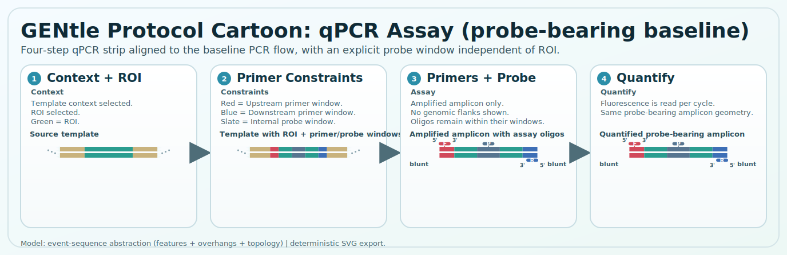

qPCR now has two clear command-line entry points:

- use `primers seed-qpcr-from-feature ...` or `primers seed-qpcr-from-splicing ...`
  to derive a deterministic `DesignQpcrAssays` setup payload from existing
  sequence context
- use `protocol-cartoon render-svg pcr.assay.qpcr ...` to export the
  built-in probe-bearing qPCR strip for reports, ClawBio/OpenClaw bundles, or
  README-style promotion

For current detail on contracts and GUI behavior, see
[`docs/protocol.md`](docs/protocol.md) and [`docs/gui.md`](docs/gui.md). For
what is actively being built next, see [`docs/roadmap.md`](docs/roadmap.md).
## Principles

- One engine, many interfaces: GUI, CLI, JavaScript, and Lua all use the same core logic.
- Provenance by default: derived results should be traceable and replayable.
- Structured contracts: operations, results, and errors should be machine-readable.
- Thin adapters: biology logic lives in the engine, not in frontend-specific code.

## Documentation

- Installation: [`INSTALL.md`](INSTALL.md)
- Container guide: [`docs/container.md`](docs/container.md)
- Contributing: [`CONTRIBUTING.md`](CONTRIBUTING.md)
- Architecture: [`docs/architecture.md`](docs/architecture.md)
- Roadmap: [`docs/roadmap.md`](docs/roadmap.md)
- Protocol: [`docs/protocol.md`](docs/protocol.md)
- GUI manual: [`docs/gui.md`](docs/gui.md)
- CLI manual: [`docs/cli.md`](docs/cli.md)
- Tutorial guide: [`docs/tutorial/README.md`](docs/tutorial/README.md)
- Executable tutorial hub: [`docs/tutorial/generated/README.md`](docs/tutorial/generated/README.md)
- Agent interfaces tutorial: [`docs/agent_interfaces_tutorial.md`](docs/agent_interfaces_tutorial.md)
- Acknowledgements: [`ACKNOWLEDGEMENTS.md`](ACKNOWLEDGEMENTS.md)
