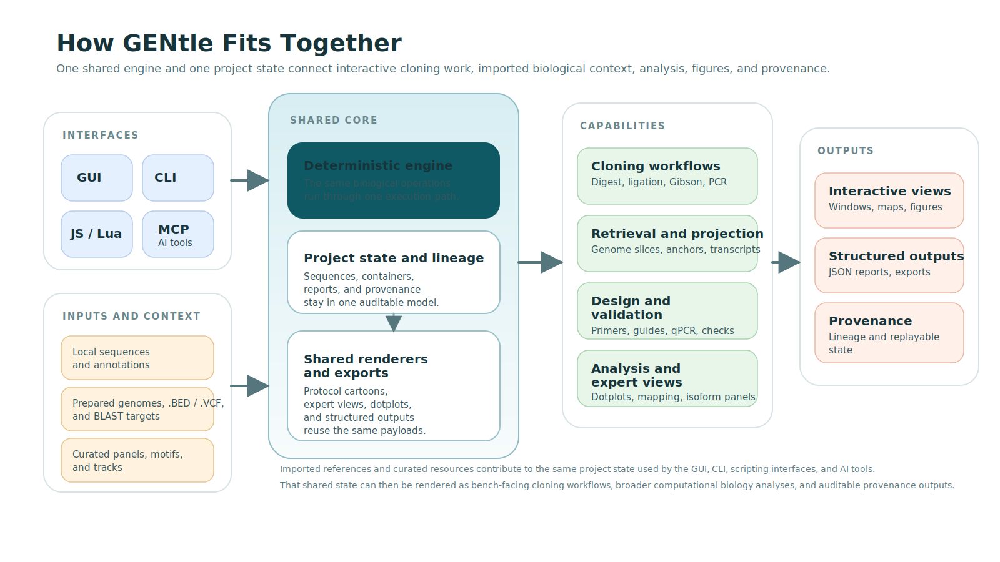
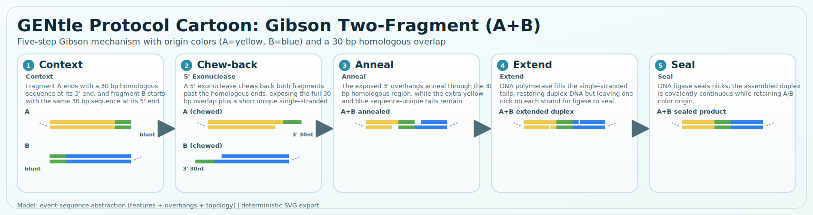
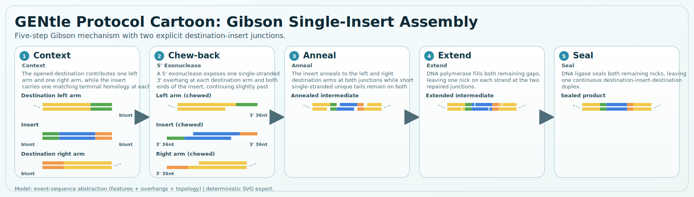
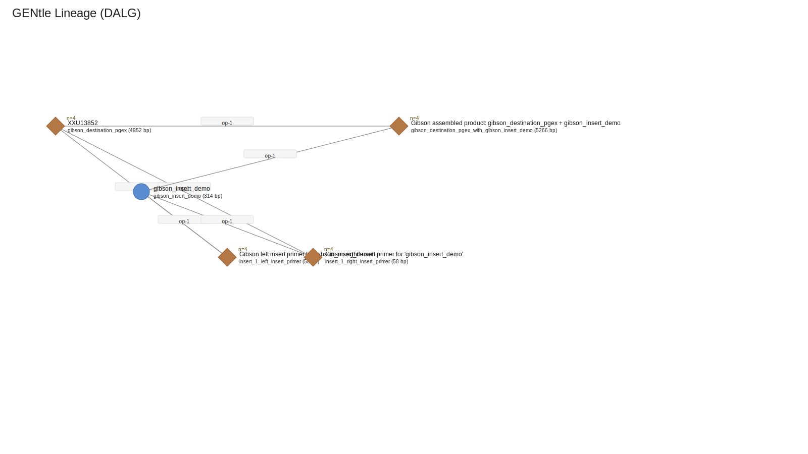
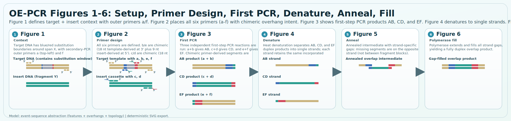
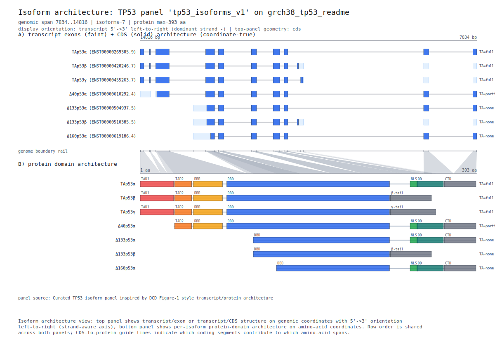
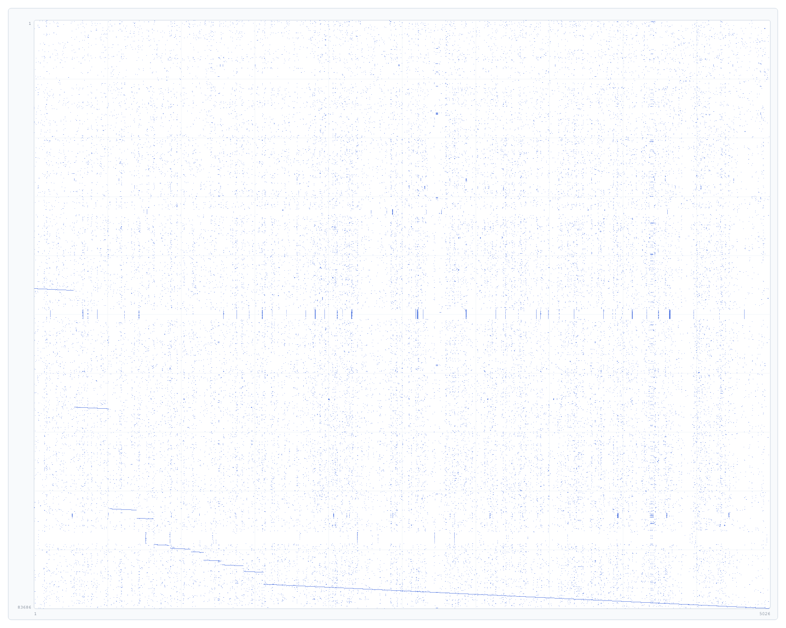
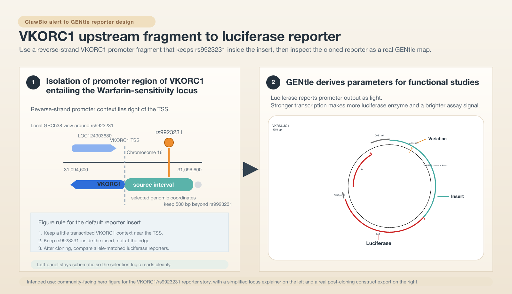
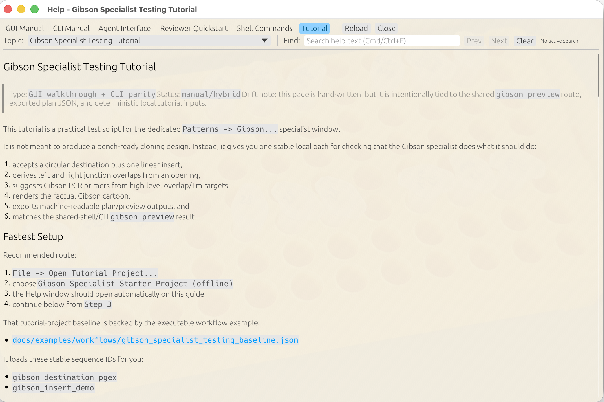

# GENtle

GENtle is a DNA and cloning workbench for both interactive use and automation.
Cloning projects are represented as workflows, with each biotechnical
operation mapped to a deterministic in silico counterpart. The same engine can
therefore execute a workflow, validate its assumptions, and render graphical
protocol cartoons that explain the underlying molecular events.

The same engine also fits into broader computational biology workflows where
external reference data matters. Prepared genome annotations, curated expert
panels, and other imported resources can contribute directly to the same
project state used by the GUI, CLI, and automation, so showcase figures remain
auditable instead of being redrawn by hand.

Today, that already means GENtle can:

- plan and review Gibson assemblies with explicit overlaps, primer suggestions,
  lineage-visible outputs, and ordered multi-insert previews
- execute PCR, advanced PCR, PCR mutagenesis, primer-pair design, and qPCR
  assay design through one shared engine family
- render factual protocol cartoons and lineage graphs from the same project
  state instead of relying on hand-drawn figures
- keep GUI, CLI, and automation routes aligned on the same deterministic
  contracts

## What To Trust Today

Use this as a task-oriented confidence map rather than assuming every visible
menu item is equally mature.

### Recommended now

- Single-insert Gibson specialist work: destination-first planning, preview,
  apply, reopen-from-lineage, and SVG/cartoon export.
- Core PCR, primer-pair, and qPCR engine routes when you already know the task
  and want deterministic execution plus an inspectable report trail.
- Prepared-genome region/gene extraction and the linked visualization/export
  paths once the reference has been prepared locally.
- Explanation/export surfaces such as lineage SVG, protocol cartoons, dotplot
  SVG, and isoform-architecture figures.

### Works with caveats

- Multi-insert Gibson preview/review is useful, but execution currently
  requires a defined destination opening; `existing_termini` is still the
  single-fragment handoff path.
- Primer3-backed primer workflows are available, but the internal backend is
  still the most deterministic default and deeper backend-parity work is
  ongoing.
- GUI-first and manual/hybrid tutorials are good learning aids, but generated
  executable tutorials remain the higher-confidence reference when
  reproducibility matters most.

### Exploratory / not yet first choice

- Broader cloning routine families outside the strongest current
  Gibson/restriction baselines.
- Direct GUI feature editing and exon/intron/transcript-boundary curation.
- guideRNA workflows, richer virtual-PCR/off-target workflows, and deeper
  assay families such as LAMP or KASP/PACE genotyping.

## Operations, Routines, and Specialists

GENtle is intentionally layered so cloning logic stays deterministic without
forcing every user to work at the same level of abstraction.

| Layer | Quick read |
| --- | --- |
| **Operations** | Atomic deterministic state transitions such as `Digest`, `Ligation`, `Pcr`, `DesignPrimerPairs`, `DesignQpcrAssays`, and `ExtractGenomeRegion`.<br><sub>Meet them in GUI Engine Ops, the shared shell, and CLI JSON/workflow execution.</sub> |
| **Routines** | Named, typed workflow patterns with explainability and preflight, like `gibson.two_fragment_overlap_preview`, `golden_gate.type_iis_single_insert`, `gateway.bp_single_insert`, and `restriction.digest_ligate_extract_sticky`.<br><sub>Meet them in `Patterns -> Routine Assistant...`, `routines list/explain/compare`, and `macros template-run --validate-only`.</sub> |
| **Specialists** | Guided task-specific windows built on the same engine and routine ideas, such as `Patterns -> Gibson...`, the DNA-window PCR tools, and the Routine Assistant.<br><sub>Best when you want planning and review help without dropping to raw operation payloads.</sub> |
| **Explanation artifacts** | Factual outputs generated from the same project state, including protocol cartoons, the lineage graph, and exported reports.<br><sub>These are the SVG/PNG figures and reports surfaced in the README, exports, Help, and tutorials.</sub> |

The intended usage is:

1. Use operations when you already know the exact atomic steps you want.
2. Use routines when you want GENtle to help choose, explain, preflight, and
   bind a named cloning workflow.
3. Use specialists when a workflow deserves a focused GUI for planning,
   review, and export, but should still land on the same shared engine
   contracts underneath.

This is why the same project can simultaneously hold raw operations, named
routine logic, specialist review state, generated cartoons, and
lineage/provenance without those becoming separate worlds.

This architecture is still evolving. Some domains already have richer
specialists than the generic routine layer, and some routine families are much
deeper than others. The important current invariant is not that every surface
looks identical yet, but that they are converging on the same deterministic
engine, the same typed preflight logic, and the same inspectable project
state.

## How GENtle Fits Together



At a glance, GENtle is organized around one shared deterministic engine and
one project state. Interactive interfaces, scripting routes, and imported
biological context all meet in the same lineage-aware model, which then drives
cloning workflows, retrieval, design, analysis, graphics, and provenance.

## What It Already Shows

GENtle can not only perform cloning tasks, but also explain them from the
same deterministic project state and render those explanations graphically.
All of the figures below were produced by GENtle itself through shared engine
routes, without manual redrawing or post-hoc illustration.

### Gibson Workflow, Mechanism, and Provenance



The first strip is the compact conceptual view: two fragments, 5' chew-back,
annealing across the homologous overlap, polymerase fill-in, and ligase
sealing. It introduces the mechanism at a glance.



The second strip is the factual single-insert view produced from the same
shared engine: one opened destination, one insert, two explicit junctions,
correct 5' chew-back, annealing at both overlaps, polymerase fill-in, and
ligase sealing.



And the same state remains inspectable as provenance: one `Gibson cloning`
operation, two input sequences, two primer outputs, and one assembled product
in the lineage graph. This figure is not a screenshot; it is the SVG export of
the same lineage graph that becomes available in the GUI after Gibson apply,
via `File -> Export DALG SVG...` or the graph-canvas context menu entry
`Save Graph as SVG...`.

Current limitation: multi-insert execution currently requires a defined
destination opening; `existing_termini` remains the single-fragment handoff
path.

These README Gibson figures are generated from shared engine routes, not drawn
by hand. Together they answer three different questions:

1. What is Gibson at a glance?
2. What exact mechanism is GENtle modeling?
3. What concrete artifacts did the project produce?

The conceptual hero is rendered directly by the built-in protocol-cartoon
engine:

```sh
cargo run --quiet --bin gentle_cli -- \
  protocol-cartoon render-svg \
  gibson.two_fragment \
  docs/figures/gibson_two_fragment_protocol_cartoon.svg
```

The single-insert mechanism strip is likewise rendered directly from the newer
built-in dual-junction protocol cartoon:

```sh
cargo run --quiet --bin gentle_cli -- \
  protocol-cartoon render-svg \
  gibson.single_insert_dual_junction \
  docs/figures/gibson_single_insert_protocol_cartoon.svg
```

The lineage figure comes from the same tutorial baseline plus one deterministic
Gibson apply + GUI/CLI-shared lineage export path. Exact regeneration commands
for all three Gibson figures live in [`docs/figures/README.md`](docs/figures/README.md).

The protocol-cartoon command surface intentionally stays canonical under
`protocol-cartoon ...` so scripted and AI-guided use does not need to choose
between overlapping alias names.

### Overlap-Extension PCR Substitution Mechanism



This hero strip shows the six-step overlap-extension substitution flow:
template+insert setup, chimeric primer assignment (`a`..`f`), three first-step
PCR products (`AB`, `CD`, `EF`), denaturation, overlap annealing with
strand-specific gaps, and polymerase fill to one continuous duplex product.

The figure is rendered from the built-in protocol-cartoon route:

```sh
cargo run --quiet --bin gentle_cli -- \
  protocol-cartoon render-svg \
  pcr.oe.substitution \
  docs/figures/pcr_overlap_extension_substitution_fig1_style.svg
```

### TP53/P53 Isoform Architecture



Curated TP53/p53 isoform architecture showcase: transcript/CDS geometry comes
from the Ensembl 116 TP53 annotation on GRCh38, while isoform labels and
protein-domain blocks come from the curated panel resource in
`assets/panels/tp53_isoforms_v1.json`. The figure is rendered through the same
shared expert-view route used by GENtle interfaces rather than from a
standalone illustration.

The TP53/p53 figure was generated with:

```sh
cargo run --quiet --bin gentle_cli -- \
  workflow @docs/figures/tp53_isoform_architecture.workflow.json
```

### TP73 cDNA vs Genomic Dotplot



Offline TP73 cDNA-vs-genomic showcase: the `NM_001126241.3` transcript is
derived locally from `test_files/tp73.ncbi.gb`, aligned against the same TP73
genomic locus with the shared dotplot engine route, and then rasterized to PNG
for README display while preserving the basepair axis labels. The same graphic
is available interactively in the GUI through a DNA window's `Dotplot map`
mode and standalone `Dotplot` workspace, where it can be used for coordinate
navigation back into the sequence context as a contribution to cloning-oriented
analysis and design.

The TP73 dotplot figure was generated with:

```sh
cargo run --quiet --bin gentle_cli -- \
  --state /tmp/tp73_readme_dotplot.state.json \
  workflow @docs/figures/tp73_cdna_genomic_dotplot.workflow.json

cargo run --quiet --bin gentle_examples_docs -- \
  svg-png \
  docs/figures/tp73_cdna_genomic_dotplot.svg \
  docs/figures/tp73_cdna_genomic_dotplot.png \
  --drop-dotplot-metadata
```

### Ongoing Work With ClawBio



Ongoing integration work with ClawBio now also has a dedicated hero image:
ClawBio raises the pharmacogenomic alert around `VKORC1` / `rs9923231`, and
GENtle turns that into a concrete promoter-fragment and luciferase-reporter
design story. The left panel explains the reverse-strand promoter interval to
take forward, while the right panel shows the study construct as a real GENtle
circular-map export rather than a standalone illustration.

### Guided GUI Tutorials



GENtle also ships guided GUI tutorials. For example, the Gibson specialist has
a dedicated walkthrough in
[`docs/tutorial/gibson_specialist_testing_gui.md`](docs/tutorial/gibson_specialist_testing_gui.md),
and that guide is available directly through the Help window with associated
screenshots. This keeps the interactive workflow teachable and reproducible:
users can follow a stable step-by-step path inside the GUI, and contributors
still gain a concrete reference sequence baseline for validation when needed.

## Ongoing Development

GENtle is already practically useful, but it is still evolving in public. Some
areas already have deeper specialists and richer visual explanation than
others, and some generic routine families are still catching up with the
strongest GUI flows.

The README aims to show what is genuinely working today. The source of truth
for current implementation status, open gaps, and execution order remains
[`docs/roadmap.md`](docs/roadmap.md).

Build note:
- default Rust builds now focus on GUI/CLI/MCP/docs paths
- embedded JavaScript and Lua shells are optional Cargo feature targets
  (`js-interface`, `lua-interface`)
- release packaging builds enable `script-interfaces`, so tagged release builds
  include the embedded scripting adapter feature set even though default local
  builds stay lean
- the Python wrapper in `integrations/python/gentle_py` remains a separate
  `gentle_cli`-based integration rather than a Rust build dependency

### PCR and Primer Design Snapshot

| Flavor / workflow | Current support | Main engine route(s) | Current surface |
| --- | --- | --- | --- |
| Standard endpoint PCR | Shipped | `Pcr` | GUI `PCR`, shared-shell/CLI operation payload |
| Advanced PCR | Shipped | `PcrAdvanced` | GUI `PCR Adv`, shared-shell/CLI operation payload |
| Degenerate / randomized primer-library PCR | Shipped inside advanced PCR | `PcrAdvanced` | shared-shell/CLI operation payload |
| PCR mutagenesis | Shipped | `PcrMutagenesis` | GUI `PCR Mut`, shared-shell/CLI operation payload |
| Primer-pair design for one ROI | Shipped | `DesignPrimerPairs` | Engine Ops, CLI/shared-shell report routes |
| Insertion-first anchored pair design | Shipped (engine contract) | `DesignInsertionPrimerPairs` | CLI/shared-shell `op`/workflow payloads (GUI form pending) |
| Selection-first batch primer-pair design | Shipped | repeated `DesignPrimerPairs` | DNA-window PCR queue + Engine Ops batch results |
| qPCR assay design | Shipped | `DesignQpcrAssays` | Engine Ops, CLI/shared-shell qPCR report routes |
| PCR protocol cartoons | Shipped baseline | `RenderProtocolCartoonSvg` | `pcr.assay.pair`, `pcr.assay.pair.no_product`, `pcr.assay.pair.with_tail`, `pcr.assay.qpcr` |
| Nested PCR | Planned | future `DesignPrimerPairs` family extension | tracked in roadmap |
| Inverse PCR | Planned | future PCR modality extension | tracked in roadmap |
| Long-range / multiplex / translocation PCR | Planned | future PCR modality extension | tracked in roadmap |

This is an area where GENtle is already operational but still deepening. The
core PCR engine family is shipped; richer specialist UX, broader modality
coverage, and more showcase-grade explanation layers are still being expanded.

The design direction is to keep these PCR flavors on one deterministic engine
contract family rather than split them into unrelated specialist paths. In the
layering above, that means:

- PCR execution lives in engine operations such as `Pcr`, `PcrAdvanced`,
  `PcrMutagenesis`, `DesignPrimerPairs`, and `DesignQpcrAssays`
- PCR deep-dive GUI work lives in specialists and DNA-window tools
- PCR explanation lives in shared protocol-cartoon outputs such as
  `pcr.assay.pair`, `pcr.assay.pair.no_product`,
  `pcr.assay.pair.with_tail`, and `pcr.assay.qpcr`

For current detail on contracts and GUI behavior, see
[`docs/protocol.md`](docs/protocol.md) and [`docs/gui.md`](docs/gui.md). For
what is actively being built next, see [`docs/roadmap.md`](docs/roadmap.md).
## Principles

- One engine, many interfaces: GUI, CLI, JavaScript, and Lua all use the same core logic.
- Provenance by default: derived results should be traceable and replayable.
- Structured contracts: operations, results, and errors should be machine-readable.
- Thin adapters: biology logic lives in the engine, not in frontend-specific code.

## Documentation

- Installation: [`INSTALL.md`](INSTALL.md)
- Container guide: [`docs/container.md`](docs/container.md)
- Contributing: [`CONTRIBUTING.md`](CONTRIBUTING.md)
- Architecture: [`docs/architecture.md`](docs/architecture.md)
- Roadmap: [`docs/roadmap.md`](docs/roadmap.md)
- Protocol: [`docs/protocol.md`](docs/protocol.md)
- GUI manual: [`docs/gui.md`](docs/gui.md)
- CLI manual: [`docs/cli.md`](docs/cli.md)
- Tutorial guide: [`docs/tutorial/README.md`](docs/tutorial/README.md)
- Executable tutorial hub: [`docs/tutorial/generated/README.md`](docs/tutorial/generated/README.md)
- Agent interfaces tutorial: [`docs/agent_interfaces_tutorial.md`](docs/agent_interfaces_tutorial.md)
- Acknowledgements: [`ACKNOWLEDGEMENTS.md`](ACKNOWLEDGEMENTS.md)
