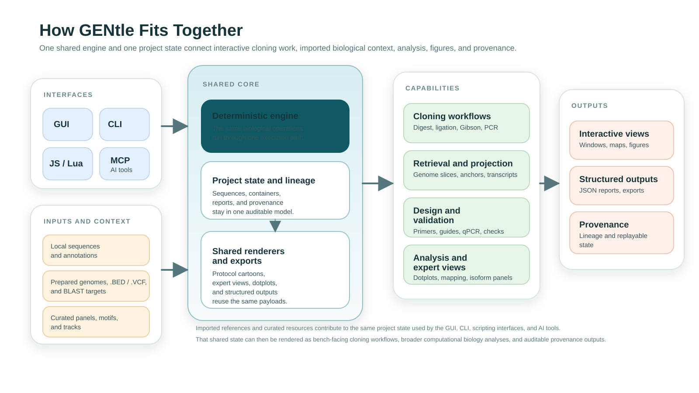

# GENtle

<p align="center">
  <a href="https://github.com/smoe/gentle_rs/actions/workflows/ci.yml"></a>
  
  
  <a href="copyright"></a>
</p>

<p align="center">
  <a href="INSTALL.md"><strong>Install</strong></a> &middot;
  <a href="docs/tutorial/generated/README.md"><strong>Five-minute tutorials</strong></a> &middot;
  <a href="docs/gui.md"><strong>GUI manual</strong></a> &middot;
  <a href="docs/cli.md"><strong>CLI manual</strong></a> &middot;
  <a href="docs/tutorial/01-01_agent_interfaces.md"><strong>Agent interfaces</strong></a> &middot;
  <a href="docs/showcase.md"><strong>Showcase</strong></a>
</p>

GENtle is an open-source desktop and automation workbench for planning,
simulating, inspecting, and documenting DNA cloning and sequence-context
workflows. One deterministic engine powers the GUI, CLI, Python, JavaScript,
Lua, MCP, and curated agent handoffs, so interactive decisions and automated
runs share the same project state, reports, and provenance.

Both an **inner agent** in the running application and **outer agents** in
separate automation environments are prepared to work with GENtle's routine
catalog. They can discover routines, help bind their inputs, run deterministic
preflight, request confirmation where required, execute approved steps, and
return the resulting reports without creating a second implementation of the
biology.

> **Internal preview:** GENtle is already useful for research planning and
> reproducible in silico work, but interfaces and project files may still
> evolve. Inspect generated designs before taking them to the bench. The
> [maturity map](#what-to-trust-today) distinguishes recommended, caveated,
> and exploratory workflows.

### One Project, Two Agent Positions

<table>
  <tr>
    <th width="50%">Outer agent: reproducible artifact</th>
    <th width="50%">Inner agent: live project context</th>
  </tr>
  <tr>
    <td><a href="docs/figures/tp73_outer_agent_evidence_viewer.svg"></a></td>
    <td><a href="docs/screenshots/tp73_inner_agent_evidence_viewer.png"></a></td>
  </tr>
  <tr>
    <td>An external agent can discover and run the headless workflow, then receive this SVG plus structured reports and provenance.</td>
    <td>The in-application Agent Assistant works against the same active project while the user inspects its GRCh38.p14 anchor, evidence groups, and sequence map.</td>
  </tr>
</table>

Both panels show local bases `1..1200` of the same 83,686 bp TP73 project.
The current GUI renderer keeps transcript paths running to the viewport edge
when their connected exon lies outside the visible span, so zooming no longer
makes an intron look like an unexplained gap. Click either panel for the
full-size view; exact generation and capture provenance is recorded in the
[figure catalog](docs/figures/README.md#tp73-inner-and-outer-agent-views).

## Start Here

| I want to... | Start with |
| --- | --- |
| Use the desktop application | [Install GENtle](INSTALL.md), run `cargo run --bin gentle`, then choose `File -> Open Tutorial Project...` |
| Try a short executable example | [Executable tutorial hub](docs/tutorial/generated/README.md) |
| Automate a workflow | [CLI manual](docs/cli.md) and `cargo run --bin gentle_cli -- capabilities` |
| Connect an AI tool | [Agent interfaces tutorial](docs/tutorial/01-01_agent_interfaces.md) and [MCP/agent architecture](docs/agent_interface.md) |
| Run headlessly in a container | [Container guide](docs/container.md) |
| Contribute code or documentation | [Contributing guide](CONTRIBUTING.md) |

A minimal source-build check is:

```sh
cargo check -q
cargo run --bin gentle_cli -- capabilities
cargo run --bin gentle
```

An existing RNA mapping report can feed its accepted target-gene reads directly
into the allele-aware evidence screen:

```sh
cargo run --bin gentle_cli -- --project project.gentle.json allele-hash-screen \
  --gene FUS --from-rna-report REPORT_ID --transcript-fasta transcripts.fa \
  --variant-table variants.tsv --out allele-screen
```

Salmon `unmapped_names` and mapping SAM inputs can select additional cohorts,
but still require the original FASTA/FASTQ via `--read-file` or `--read-pair`.
See the [CLI manual](docs/cli.md) for the complete contract.

Tagged internal releases may provide a macOS DMG or Windows ZIP on the
[releases page](https://github.com/smoe/gentle_rs/releases). Linux users can
build from source or use the documented container route. See
[`INSTALL.md`](INSTALL.md) for platform details and optional external tools.

## Why GENtle

- **One engine, many interfaces.** GUI actions, shell commands, workflows,
  scripts, and agent tools converge on shared biological operations.
- **Project state rather than disconnected files.** Sequences, annotations,
  containers, arrangements, reports, lineage, and imported evidence remain
  linked.
- **Explanations from the computation.** Protocol cartoons, lineage graphs,
  dotplots, expert views, and structured reports are derived from the same
  state that produced the result.
- **Genome context when cloning needs it.** Prepared references, genome
  anchors, GFF/GTF annotation, BED/BigWig/VCF tracks, repeats, motifs, and RNA
  evidence can inform the same project.
- **Reproducibility by construction.** Operations and results are
  machine-readable, deterministic where inputs are fixed, and exportable for
  review.

## What To Trust Today

These labels describe implementation maturity, not biological validation.
Users remain responsible for reviewing designs, assumptions, and experimental
conditions.

| Maturity | Good current uses |
| --- | --- |
| **Recommended** | Single-insert Gibson planning/apply/reopen/export; core PCR, primer-pair, and qPCR routes; prepared-genome extraction; read-only GenBank/EMBL/SnapGene import; genome/evidence visualization; lineage, protocol-cartoon, dotplot, TFBS, isoform, and gel exports |
| **Useful with caveats** | Multi-insert Gibson previews; Primer3-backed design; manual/hybrid tutorials; broader routine-family comparisons |
| **Exploratory** | Direct feature-boundary curation; guideRNA and richer off-target workflows; less mature cloning families; future LAMP, KASP/PACE, long-range, multiplex, and translocation PCR modalities |

The detailed release gate and open work live in the
[`roadmap`](docs/roadmap.md). Completed changes are recorded in the
[`changelog`](docs/CHANGELOG.md).

## How GENtle Fits Together



Interactive interfaces and imported biological context meet in one shared
engine. The resulting project state drives cloning, retrieval, design,
analysis, rendering, and provenance rather than leaving each frontend to
reimplement the biology.

### Operations, Routines, and Specialists

| Layer | Meaning | Typical entry point |
| --- | --- | --- |
| **Operations** | Atomic state transitions such as digest, ligation, PCR, primer design, and genome extraction | Engine Ops, workflow JSON, shared shell |
| **Routines** | Named workflow patterns with preflight and explanation | Routine Assistant, `routines list`, macro templates |
| **Specialists** | Guided task-specific interfaces built on shared engine paths | Gibson, PCR Designer, Splicing Expert, genome dialogs |
| **Explanation artifacts** | Figures and reports derived from project state | SVG/PNG/JSON exports, lineage, protocol cartoons |

Use an operation when the exact atomic step is known, a routine when GENtle
should help bind and explain a workflow, and a specialist when the task
benefits from focused interactive review.

## Selected Workflows

The full scientific and technical gallery is in the
[`GENtle showcase`](docs/showcase.md). Exact figure-generation commands and
asset provenance are maintained in
[`docs/figures/README.md`](docs/figures/README.md).

### Cloning with explicit mechanism and lineage


GENtle can plan and apply a destination-first Gibson assembly, retain explicit
overlaps and primer suggestions, reopen the operation from lineage, and render
the modeled mechanism. The same state can produce protocol cartoons, lineage
graphs, container arrangements, rack layouts, and gel readouts.

[See the complete cloning and physical-workflow examples.](docs/showcase.md#cloning-and-verification)

### Genome-anchored isoform interpretation


Prepared references and genome anchors let GENtle compare transcript isoforms,
splice structure, repeats, interval tracks, microarray evidence, TFBS support,
and nucleotide sequence without losing assembly or coordinate provenance.

[See TP73 and TERT genome-context examples.](docs/showcase.md#genome-and-regulatory-context)

### Primer and qPCR planning


The shared PCR family covers endpoint PCR, advanced PCR, mutagenesis,
selection-first primer-pair design, and probe-bearing qPCR assay design.
Reports preserve sequence constraints, candidate diagnostics, products, and
links to later oligo-order planning.

[See the PCR, qPCR, and TP73 isoform-selector examples.](docs/showcase.md#pcr-primer-and-qpcr-design)

### Curated agent handoff


MCP exposes typed tools plus capability metadata to compatible agent hosts.
ClawBio/OpenClaw uses a narrower curated request/result wrapper. The VKORC1
example turns a pharmacogenomic prompt into an inspectable promoter-fragment
and reporter-planning bundle without bypassing confirmation or provenance.

[See the complete agent-handoff story.](docs/showcase.md#agent-and-clawbio-handoffs)

## Interfaces

| Interface | Best suited to | Where to learn more |
| --- | --- | --- |
| **GUI** | Interactive sequence inspection, specialist workflows, project review | [GUI manual](docs/gui.md) |
| **CLI and shared shell** | Reproducible workflows, batch work, automation | [CLI manual](docs/cli.md) |
| **MCP** | AI hosts that need typed tools, capability discovery, and structured errors | [Agent interfaces](docs/tutorial/01-01_agent_interfaces.md) |
| **Python** | Notebooks and Python automation through `gentle_cli` | [Python integration](integrations/python/README.md) |
| **JavaScript and Lua** | Embedded scripting when the optional features are enabled | [CLI manual](docs/cli.md) |
| **ClawBio/OpenClaw** | Curated cloning-skill requests and reproducibility bundles | [ClawBio integration](integrations/clawbio/README.md) |

First-class buttons and named tools differ by interface, but all interfaces
retain a path to the shared engine. The
[`GUI/CLI/MCP parity matrix`](docs/gui_cli_mcp_parity.md) distinguishes engine
reachability from intentionally curated presentation.

### Inner and Outer Agents

**Inner agent: the in-application Agent Assistant.** It receives the active
project summary and works through shared `agents`, `routines`, shell,
operation, and workflow paths. The user chats inside GENtle; the agent may ask
for missing information, compare routines, or offer reviewed commands for
confirmation or permitted execution.

**Outer agents: separate automation environments.** Codex, Claude-style coding
agents, MCP hosts, ClawBio/OpenClaw, and similar processes use MCP capability
discovery, CLI help/capabilities, the shared shell, or curated skill requests.
The external environment discovers what GENtle can do, supplies project/state
context, invokes the same routine and preflight machinery, and collects
structured artifacts.

The routines themselves are prepared and described by GENtle, including the
typed catalog in `assets/cloning_routines.json` and shared
`routines list`, `routines explain`, `routines compare`, template-binding, and
execution routes. Neither kind of agent is expected to automate the GUI by
guessing where to click. Both operate through these shared descriptions and
commands, and both retain confirmation boundaries for mutating operations,
external handoffs, and purchases. A reply that only asks a question or chats
does not imply that anything is ready to execute.

The [Agent Assistant and agent interfaces tutorial](docs/tutorial/01-01_agent_interfaces.md)
shows who runs what, where capability discovery happens, and how inner and
outer agents differ from direct CLI use.

## Installation and Optional Tools

The core GUI, CLI, MCP server, and documentation paths need only Git and a Rust
toolchain for a source build. JavaScript and Lua are optional Cargo features;
the Python package is a separate CLI-backed integration.

Advanced workflows can use BLAST+, Primer3, ViennaRNA/RNAPKIN,
`bigWigToBedGraph`, and external legacy SHA-1 verification tools when present.
None is required for the first GUI launch. Installation, executable overrides,
containers, and platform notes are centralized in [`INSTALL.md`](INSTALL.md).

## Project Status

- Current package version: `0.1.0-internal.10`.
- Active release story: a genome-anchored TP73 evidence viewer with inspectable
  exon, repeat, array, BED, TFBS, and coordinate-build provenance.
- Default builds include GUI, CLI, MCP, and documentation paths.
- Release packaging enables the JavaScript and Lua adapter bundle.
- Generated showcase figures come from GENtle engine outputs and/or versioned
  deterministic repository tooling. They are not manually redrawn.

See the [`roadmap`](docs/roadmap.md) for the current acceptance gate, the
[`release guide`](docs/release.md), the
[`v0.1.0-internal.10` release notes](docs/release_notes/release_notes_v0.1.0-internal.10.md),
and the complete [`release-note index`](docs/release_notes/) for notable
user-facing changes.

## Principles

- **One deterministic core:** biology and workflow logic belongs in the
  engine, not in GUI, CLI, Python, JavaScript, Lua, MCP, or agent adapters.
- **Provenance by default:** derived results should remain traceable and
  replayable.
- **Machine-readable behavior:** operations, results, errors, readiness, and
  capabilities should be structured as well as human-readable.
- **Thin, purposeful interfaces:** each interface may emphasize different
  tasks without inventing different biological behavior.
- **Human confirmation at consequential boundaries:** agent and service
  handoffs must not silently turn suggestions into experiments or purchases.

## Documentation

| Topic | Document |
| --- | --- |
| Installation | [`INSTALL.md`](INSTALL.md) |
| Guided tutorials | [`docs/tutorial/README.md`](docs/tutorial/README.md) |
| Executable tutorial hub | [`docs/tutorial/generated/README.md`](docs/tutorial/generated/README.md) |
| GUI | [`docs/gui.md`](docs/gui.md) |
| CLI and scripting | [`docs/cli.md`](docs/cli.md) |
| Agent, MCP, and local LLM interfaces | [`docs/tutorial/01-01_agent_interfaces.md`](docs/tutorial/01-01_agent_interfaces.md) |
| Architecture and protocol | [`docs/architecture.md`](docs/architecture.md), [`docs/protocol.md`](docs/protocol.md) |
| Showcase and figure provenance | [`docs/showcase.md`](docs/showcase.md), [`docs/figures/README.md`](docs/figures/README.md) |
| Container deployment | [`docs/container.md`](docs/container.md) |
| Contributing | [`CONTRIBUTING.md`](CONTRIBUTING.md) |
| Roadmap | [`docs/roadmap.md`](docs/roadmap.md) |

## License and Credits

GENtle is distributed under **GPL-2.0-or-later**. Bundled third-party data may
carry additional attribution or redistribution terms; see [`copyright`](copyright)
for the authoritative file-by-file record.

Project history and contributors are recognized in
[`ACKNOWLEDGEMENTS.md`](ACKNOWLEDGEMENTS.md).
