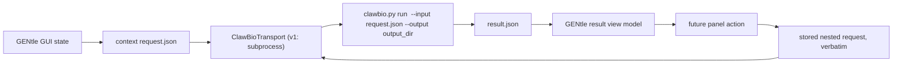

# ClawBio / GENtle Integration Contract

GENtle should not become EDITtoTrEMBL by itself. Instead, GENtle can provide the graphical state surface for a ClawBio-side skill system that revives the EDITtoTrEMBL idea with modern structured contracts: declared intents, inputs, outputs, workflow states, and valid next actions.

The boundary follows a federation pattern: two independent systems coordinate
through a typed, versioned contract, with each side authoritative over its own
domain. ClawBio owns skills, intent routing, execution, dependency reasoning,
safety policy, `workflow_state`, and `suggested_actions`. GENtle owns visible
sequence/project context, selected regions, loaded-resource references, result
display, and the entry-point UX.

Federation is bidirectional in principle. The v1 GUI-surface adapter uses one
call topology: GENtle writes a request JSON, invokes
`clawbio.py run <skill> --input <request.json> --output <output_dir>` through a
synchronous transport, and reads `result.json`. Later topologies can add a local
transport to an already-running ClawBio or a ClawBio-side `gentle-view` skill
without changing the request/result model. Both are out of scope for v1.

## GENtle GUI-Surface Adapter

The first GENtle-side slice is intentionally small:

- export only a compact GUI context payload;
- dispatch through a `ClawBioTransport` trait with a synchronous
  `dispatch(spec, cancel_token)` method;
- ship one implementation, `SubprocessTransport`;
- parse `result.json` into a renderable view model while keeping the raw result;
- carry nested `suggested_actions[].request` payloads opaquely when a future
  panel dispatches follow-up actions.

The `CancelToken` is `Arc<AtomicBool>`-backed and exposes
`is_cancelled() -> bool`. The subprocess transport owns the `Child`, polls it
periodically, and calls `Child::kill()` if the token is set. No async runtime,
HTTP service, socket protocol, embedded planner, shell-snippet execution from
action payloads, or report-prose parsing is part of v1.

GENtle does not choose skills automatically in v1. A future ClawBio planner owns
skill selection, but this subprocess topology must still pass a skill argument;
GENtle therefore uses a configured or user-selectable skill alias, defaulting to
`gentle-cloning`. This is a v1 limitation, not a routing layer.

Scratch output lives on the GENtle side under a persistent run root such as
`~/.gentle/clawbio_runs/<skill>_<timestamp>/`, compatible with ClawBio's
output-bundle convention. If a ClawBio request or nested action contains a
`provenance` field, GENtle carries it verbatim and does not construct, inspect,
or enforce it.

Minimal data flow:



Minimal context payload:

```json
{
  "current_sequence_id": "seq-id-or-null",
  "selected_region": {
    "start_0based": 100,
    "end_0based": 250,
    "strand": null
  },
  "active_project_id": "project path or unsaved",
  "resources": [
    {
      "kind": "genome_sequence_anchor",
      "genome_id": "GRCh38.p14",
      "chromosome": "1",
      "start_1based": 3569084,
      "end_1based": 3652765,
      "anchor_verified": true,
      "catalog_path": "data/genomes/catalog.json",
      "cache_dir": "~/.gentle/genomes"
    }
  ]
}
```

When no sequence is loaded or no region is selected, the same payload remains
valid with null sequence/selection fields and an empty `resources[]` list. Full
feature tables, complete annotation lists, project serialization, dependency
planning, safety filtering, remote upload consent, audit logs, and
EDITtoTrEMBL-like cycle/dependency reasoning remain ClawBio-only or future
work.

## Existing Skill Wrapper

The repository also carries the ClawBio-side `gentle-cloning` skill wrapper in
`integrations/clawbio/skills/gentle-cloning/`. That wrapper remains a thin
adapter around deterministic `gentle_cli` command surfaces and is the default
alias used by the GENtle-side subprocess transport.

## Wire Schemas

Current schemas:

- Request: `gentle.clawbio_skill_request.v1`
- Result: `gentle.clawbio_skill_result.v1`
- Skill info: `gentle.clawbio_skill_info.v1`
- Runtime intents: `gentle.clawbio_skill_intents_runtime.v1`
- Intent descriptor: `clawbio.skill_intents.v1`

Versioning stance:

- Additive request modes, result fields, runtime-intent rows, or warnings do
  not require a v1 schema bump.
- A backward-incompatible shape change, field removal, or semantic change to an
  existing field requires a new schema.
- Deprecated request modes remain accepted for at least one release window and
  emit `warnings[]` naming the preferred thin form.

ClawBio should read `INTENTS.json` from disk at startup. It should call
`mode: "intents"` only when it wants to compare the installed wrapper's
descriptor hash with a local snapshot or during an explicit refresh/dev check.
Startup should not require a working GENtle runtime.

## Runtime Intent Refresh

Request:

```json
{
  "schema": "gentle.clawbio_skill_request.v1",
  "mode": "intents"
}
```

Result payload in `stdout_json`:

- `schema`: `gentle.clawbio_skill_intents_runtime.v1`
- `descriptor_sha256`: hash of installed `INTENTS.json`
- `supported_request_modes`: wrapper modes accepted by this installation
- `routes[]`: `intent_id`, trigger terms, request modes, examples, slot needs

This mode is wrapper-owned and does not invoke `gentle_cli`.

## Mode Audit

| Mode | Class | Stance |
| --- | --- | --- |
| `skill-info` | wrapper concern | Keep; metadata without runtime dependency. |
| `intents` | wrapper concern | Keep; runtime descriptor/hash surface without runtime dependency. |
| `version` | thin pass-through | Keep; maps to `gentle_cli --version`. |
| `capabilities` | thin pass-through plus probe | Keep; maps to `capabilities` and best-effort `ui intents`. |
| `state-summary` | thin pass-through | Keep; maps to `state-summary`. |
| `shell` | thin pass-through | Keep as preferred generic command surface. |
| `op` | thin pass-through | Keep as preferred operation surface. |
| `workflow` | wrapper concern | Keep; resolves workflow paths and bundles artifacts. |
| `raw` | thin pass-through | Keep for advanced callers that already know CLI argv. |
| `protein-residue-genomic-coordinates` | thin typed op | Keep; maps to one operation payload. |
| `gene-protein-2d-gel` | wrapper concern | Keep; parameterized workflow synthesis plus artifact naming. |
| `agent-plan` | safety wrapper | Keep for now; carries planner options and confirmation boundaries. |
| `agent-execute-plan` | safety wrapper | Keep for now; carries stored plan execution options. |
| `primer-preflight` | shell normalizer | Deprecate; prefer `mode: "shell"`. |
| `primer-seed-from-feature` | shell normalizer | Deprecate; prefer `mode: "shell"`. |
| `primer-seed-from-splicing` | shell normalizer | Deprecate; prefer `mode: "shell"`. |
| `primer-design` | shell normalizer | Deprecate; prefer `mode: "shell"`. |
| `primer-report-list` | shell normalizer | Deprecate; prefer `mode: "shell"`. |
| `primer-report-show` | shell normalizer | Deprecate; prefer `mode: "shell"`. |
| `primer-report-export` | shell normalizer | Deprecate; prefer `mode: "shell"`. |
| `qpcr-seed-from-feature` | shell normalizer | Deprecate; prefer `mode: "shell"`. |
| `qpcr-seed-from-splicing` | shell normalizer | Deprecate; prefer `mode: "shell"`. |
| `qpcr-design` | shell normalizer | Deprecate; prefer `mode: "shell"`. |
| `qpcr-report-list` | shell normalizer | Deprecate; prefer `mode: "shell"`. |
| `qpcr-report-show` | shell normalizer | Deprecate; prefer `mode: "shell"`. |
| `qpcr-report-export` | shell normalizer | Deprecate; prefer `mode: "shell"`. |
| `cdna-pcr-test` | shell normalizer | Deprecate; prefer `mode: "shell"`. |
| `cdna-qpcr-test` | shell normalizer | Deprecate; prefer `mode: "shell"`. |
| `transcript-qpcr-panel` | shell normalizer | Deprecate; prefer `mode: "shell"`. |
| `restriction-cloning-pcr-handoff` | shell normalizer | Deprecate; prefer `mode: "shell"`. |
| `restriction-cloning-pcr-handoff-seed` | shell normalizer | Deprecate; prefer `mode: "shell"`. |
| `restriction-cloning-vector-suggestions` | shell normalizer | Deprecate; prefer `mode: "shell"`. |
| `restriction-cloning-handoff-list` | shell normalizer | Deprecate; prefer `mode: "shell"`. |
| `restriction-cloning-handoff-show` | shell normalizer | Deprecate; prefer `mode: "shell"`. |
| `restriction-cloning-handoff-export` | shell normalizer | Deprecate; prefer `mode: "shell"`. |
| `pcr-protocol-cartoon` | shell normalizer | Deprecate; prefer `mode: "shell"`. |
| `exon-skip-plan` | shell normalizer | Deprecate; prefer `mode: "shell"`. |
| `exon-skip-materialize` | shell normalizer | Deprecate; prefer `mode: "shell"`. |

Class meaning:

- Thin pass-through: one request shape maps directly to one CLI shell/op/workflow
  surface.
- Shell normalizer: wrapper convenience over a shared shell family. These stay
  accepted but should not grow new biology or routing semantics.
- Wrapper concern: path resolution, artifact bundling, runtime descriptor
  exposure, or presentation metadata that belongs at the ClawBio wrapper layer.

## Deprecation Table

Deprecated in `v0.1.0-internal.8`, earliest removal `v0.1.0-internal.10`:

- Primer/qPCR/report/CDNA modes listed above as shell normalizers.
- Restriction-cloning handoff helper modes listed above as shell normalizers.
- `transcript-qpcr-panel`, `pcr-protocol-cartoon`,
  `exon-skip-plan`, and `exon-skip-materialize`.

Each deprecated mode still executes and adds a `warnings[]` entry naming the
equivalent `mode: "shell"` form.

## Drift Guards

CI checks should keep the following in sync:

- every `route.plan[].input` in `INTENTS.json` resolves under `examples/`;
- every `examples/*.json` file is either routed or explicitly allowlisted as a
  bootstrap/follow-on/dev example;
- `SKILL.md` front-matter `trigger_keywords` is generated from
  `INTENTS.json` trigger terms plus `trigger_keyword_additions.json`;
- `mode: "intents"` reports the same descriptor routes and request modes the
  installed wrapper supports.

Regenerate trigger keywords with:

```bash
python3 scripts/generate_clawbio_trigger_keywords.py --write
```

Verify without writing:

```bash
python3 scripts/generate_clawbio_trigger_keywords.py --check
```

## Service Scope Neutrality

The shared engine default for `services handoff` is provider-neutral
`scope = "default"`. ClawBio-specific calls should pass `--scope clawbio`
explicitly. Omitting `--scope` is accepted but emits a warning so callers can
update without losing backward compatibility.
