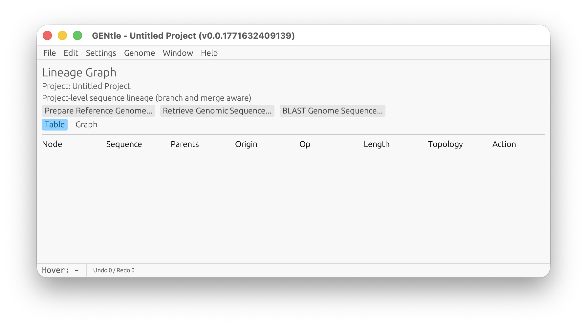
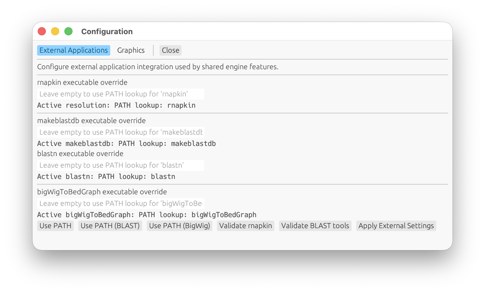
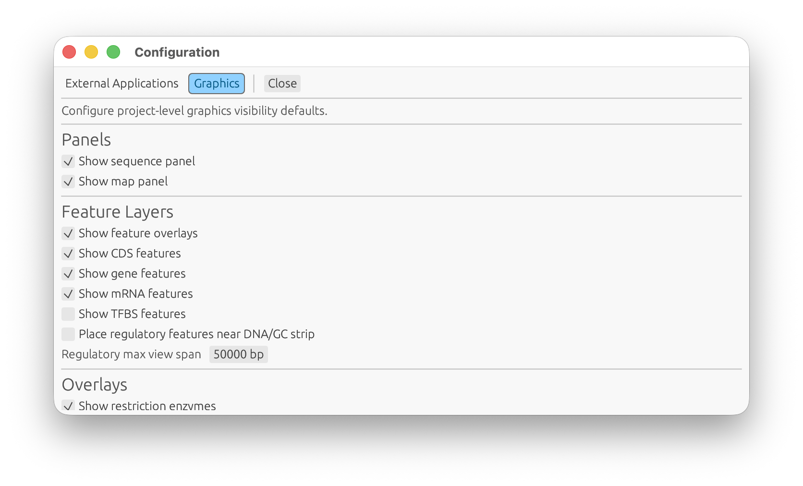
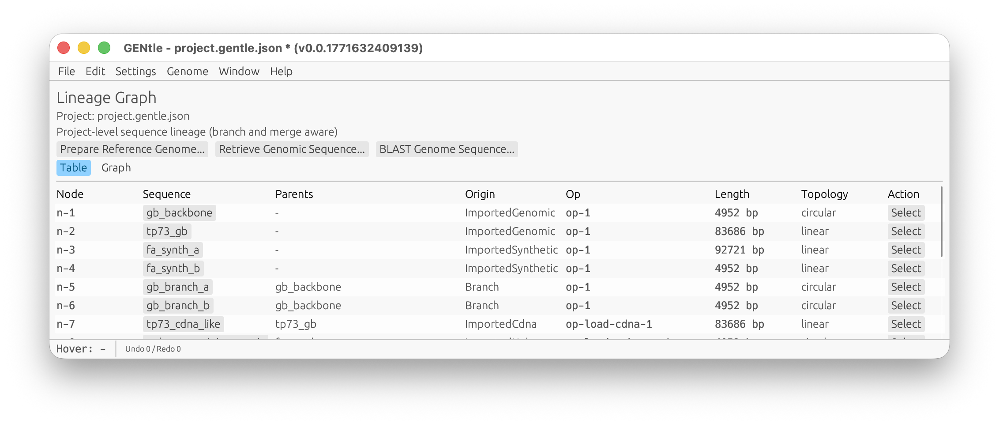
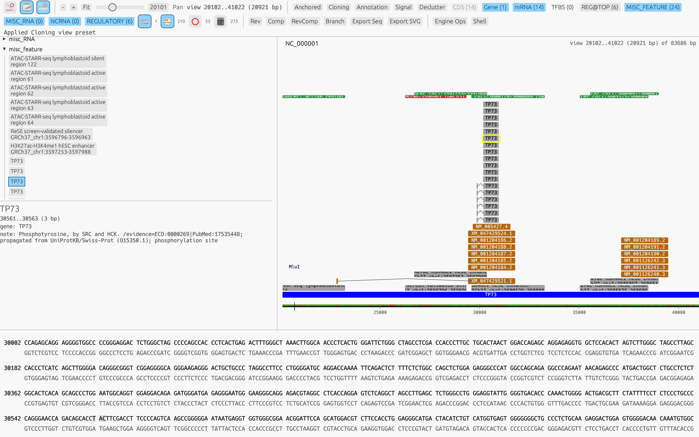
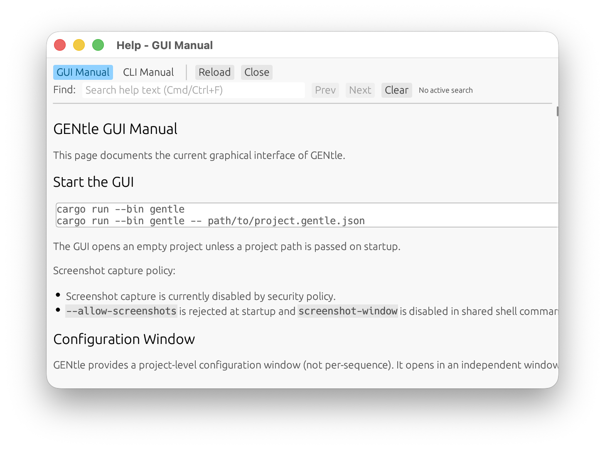
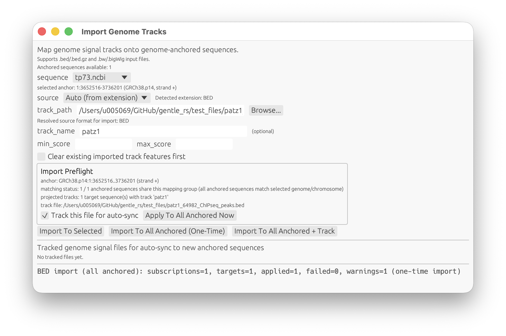

# GENtle GUI Manual

This page documents the current graphical interface of GENtle.

## Start the GUI

```bash
cargo run --bin gentle
cargo run --bin gentle -- path/to/project.gentle.json
```

The GUI opens an empty project unless a project path is passed on startup.

Example startup window:



Screenshot capture policy:

- Screenshot capture is currently disabled by security policy.
- `--allow-screenshots` is rejected at startup and `screenshot-window` is
  disabled in shared shell command execution.

## Configuration Window

GENtle provides a project-level configuration window (not per-sequence).
It opens in an independent window/viewport, separate from the main project window.

Access:

- Main window menu: `File -> Configuration...` or `Settings -> Configuration...`
- macOS app menu: `GENtle -> GENtle Settings...`
- Shortcut: `Cmd+,`

Tabs:

- `External Applications`
  - Configure external executable overrides for:
    - `rnapkin` (`GENTLE_RNAPKIN_BIN`)
    - `makeblastdb` (`GENTLE_MAKEBLASTDB_BIN`)
    - `blastn` (`GENTLE_BLASTN_BIN`)
    - `bigWigToBedGraph` (`GENTLE_BIGWIG_TO_BEDGRAPH_BIN`)
  - Validate executable availability/version from within the UI.
- `Graphics`
  - Configure project-level display visibility defaults (panels, feature layers, overlays).
  - Configure optional `Window Styling (experimental)`:
    - enable subtle themed backdrops
    - optional per-window image watermark paths (`main`, `sequence`, `pool`, `configuration`, `help`)
    - tint/image opacity controls
  - Applies to sequence windows through the shared engine display state.
  - `Apply + Refresh Open Windows` forces immediate refresh of all currently open sequence windows.

Persistence:

- Configuration is persisted in an app settings file at `~/.gentle_gui_settings.json`.
- Saved settings are restored on app startup.

Configuration screenshots:




## Main window layout

A DNA window is split into two visual areas:

- DNA map panel: graphical map (circular or linear)
- Sequence panel: text-oriented sequence rows

Both panels can be shown/hidden from the toolbar.

The project main window (lineage page) supports two views:

- `Table`: tabular lineage view with per-sequence actions
- `Graph`: node/edge lineage visualization
- `Containers`: container list with kind/member-count, open actions, and per-container gel export
- `Arrangements`: serial lane setups across containers, with arrangement-level gel export

Project overview screenshot:



Sequence window screenshot:



Global productivity controls:

- Status bar (bottom of main window) shows:
  - hovered control stable name (when available)
  - undo/redo availability counters
  - latest app/job status message
- `Edit -> Undo` / `Redo` and `Window -> Show Operation History` expose
  operation-level history controls.
- `Window -> Show Background Jobs` opens a centralized progress panel for
  long-running tasks (prepare/import/BLAST).
- `Cmd/Ctrl+K` opens the Command Palette.

Node click behavior in lineage `Graph` view:

- Single-click: selects a node (highlight only).
- Double-click on a single-sequence node: opens that sequence window.
- Double-click on a pool node: opens a pool-context window (Engine Ops visible,
  pool member distribution available).

## Toolbar buttons

The top toolbar in each DNA window provides these controls (left to right):

1. Circular/Linear toggle
   - Switches DNA map topology visualization between circular and linear.
2. Show/Hide sequence panel
   - Shows or hides the sequence text panel.
3. Show/Hide map panel
   - Shows or hides the graphical DNA map.
4. CDS
   - Shows or hides CDS feature rendering.
5. Gene
   - Shows or hides gene feature rendering.
6. mRNA
   - Shows or hides mRNA feature rendering.
7. Show/Hide TFBS
   - Toggles computed TFBS annotations.
   - Default is off.
8. Show/Hide restriction enzymes
   - Toggles restriction enzyme cut-site markers and labels.
9. Show/Hide GC content
   - Toggles GC-content visualization overlay.
10. Show/Hide ORFs
   - Toggles open reading frame overlays.
11. Show/Hide methylation sites
   - Toggles methylation-site markers.
12. Export Seq
   - Exports the active sequence via engine `SaveFile`.
   - Output format is inferred from filename extension (`.gb/.gbk` => GenBank, `.fa/.fasta` => FASTA).
13. Export SVG
   - Exports the active sequence map via engine `RenderSequenceSvg`.
14. Export RNA SVG (ssRNA only)
   - Exports RNA secondary-structure SVG via shared engine operation `RenderRnaStructureSvg`.
   - Shown only when active sequence is single-stranded RNA (`molecule_type` `RNA`/`ssRNA`).
15. Engine Ops
   - Shows/hides strict operation controls for explicit engine workflows.
16. Shell
   - Shows/hides the in-window GENtle Shell panel.
   - Uses the same shared command parser/executor as `gentle_cli shell`.

Hovering any button shows a tooltip in the UI.

## RNA Structure (ssRNA)

When the active sequence is single-stranded RNA (`molecule_type` `RNA`/`ssRNA`),
the DNA window shows an `RNA Structure (rnapkin)` panel in the top area.

Features:

- `Refresh RNA Structure`
  - Runs `rnapkin` through shared engine APIs to fetch text output and refresh SVG preview.
- `Export RNA SVG`
  - Saves a chosen SVG path through engine operation `RenderRnaStructureSvg`.
- Textual report
  - Shows command metadata and `stdout`/`stderr` from `rnapkin`.
- SVG preview
  - Displays rendered structure image in-panel.

Runtime dependency:

- `rnapkin` must be installed and reachable in `PATH`, or
- set `GENTLE_RNAPKIN_BIN` to the `rnapkin` executable path.

## GENtle Shell (GUI)

The DNA-window toolbar includes a `Shell` button that opens a command panel.

Behavior:

- Uses shared command parsing/execution (`src/engine_shell.rs`).
- Same command set as CLI `gentle_cli shell`.
- Shows a command preview before execution.
- Maintains command output history in the panel.

Supported commands:

- Open `Help -> Shell Commands`.
- This reference is generated from `docs/glossary.json` and shows both:
  - usage syntax
  - task summary/description
- Use the `Interface` selector in that view to filter commands by language/access path:
  - `All`
  - `GUI shell`
  - `CLI shell`
  - `CLI direct`
  - `JS`
  - `Lua`

Common examples:

- `help` — show help catalog or command-specific help.
- `state-summary` — summarize loaded sequences/containers/metadata.
- `render-svg SEQ_ID linear|circular OUTPUT.svg` — export map SVG.
- `genomes prepare GENOME_ID ...` — prepare reference genome cache/index.
- `tracks import-bed SEQ_ID PATH ...` — project BED track onto anchored sequence.
- `candidates generate SET_NAME SEQ_ID --length N ...` — create candidate set.
- `guides oligos-export GUIDE_SET_ID OUTPUT_PATH ...` — export guide oligo set.

Status output note:

- `genomes status` / `helpers status` include optional
  `nucleotide_length_bp`, `molecular_mass_da`, and `molecular_mass_source`
  alongside source-type/source-path fields.

Screenshot command status:

- `screenshot-window OUTPUT.png` is currently disabled by security policy.
- Manual documentation updates remain the active path for image artifacts.

## Agent Assistant

GENtle provides a standalone `Agent Assistant` window for structured support from
configured external/internal agent systems.

Access:

- main menu: `File -> Agent Assistant...`
- command palette action: `Agent Assistant`
- shortcut: `Cmd+Shift+A`

Behavior:

- loads systems from catalog JSON (default `assets/agent_systems.json`)
- system selection is a dropdown from catalog entries
- unavailable systems remain selectable and show the reason
- `OpenAI API key` field in this window is a session-only override
  - enter your key as `sk-...`
  - click `Clear Key` to remove it from current session
  - the key is not persisted to disk by GENtle settings
- if set, GUI key overrides `OPENAI_API_KEY` for requests started from this window
- `Base URL override` field is a session-only endpoint override for
  `native_openai` and `native_openai_compat`
  - use this for local endpoints such as `http://localhost:11964` or
    `http://localhost:11964/v1`
  - click `Clear URL` to remove it from current session
- `Model override` field is a session-only model-name override for
  `native_openai` and `native_openai_compat`
  - use this to force a concrete model id
  - `unspecified` means no override
  - click `Clear Model` to remove it from current session
- `timeout_sec` is a session-only request timeout override
  - applies to stdio and native agent transports
  - maps to `GENTLE_AGENT_TIMEOUT_SECS`
  - empty/`0` means default timeout
- `connect_timeout_sec` / `read_timeout_sec` are session-only transport controls
  - map to `GENTLE_AGENT_CONNECT_TIMEOUT_SECS` and `GENTLE_AGENT_READ_TIMEOUT_SECS`
  - empty/`0` keeps defaults
- `max_retries` / `max_response_bytes` are session-only guardrails
  - map to `GENTLE_AGENT_MAX_RETRIES` and `GENTLE_AGENT_MAX_RESPONSE_BYTES`
  - `max_retries=0` disables retries for the request
  - empty keeps defaults
- if model remains `unspecified`, GENtle blocks requests until you pick a
  discovered model or set a concrete override
- `Discover Models` queries the current endpoint and populates a model dropdown
  for explicit selection
- prompt templates are available via one-click `Insert` / `Append` buttons
  before the prompt editor
- optional `Include state summary` injects current project summary context
- optional `Allow auto execute` only applies to suggestions marked with `auto`
- `Ask Agent` runs in background and reports status in `Background Jobs`
- response panel can include:
  - assistant message text
  - follow-up questions
  - suggested shared-shell commands with per-row `Run` action
- execution is always per suggestion (row-run, explicit all, or explicit auto);
  there is no global always-execute mode
- each executed suggestion is logged with status/output in the same window

OpenAI setup (explicit):

1. Open `File -> Agent Assistant...`.
2. Choose system `OpenAI GPT-5 (native HTTP)` from the dropdown.
3. Paste your API key into `OpenAI API key` (format `sk-...`).
4. Enter prompt text and click `Ask Agent`.
5. If you prefer environment setup instead of GUI key field, launch GENtle with:

```bash
export OPENAI_API_KEY=sk-...
cargo run --bin gentle
```

Local LLM setup (Jan/Msty/OpenAI-compatible endpoint):

1. Open `File -> Agent Assistant...`.
2. Select one of:
   - `Local Llama (OpenAI-compatible)`
   - `Jan Local (template)`
   - `Msty Local (template)`
3. Set `Base URL override` to your local endpoint, e.g. `http://localhost:11964`.
4. Optionally set `timeout_sec` for slow local models (for example `600`).
5. Click `Discover Models` and select one discovered model from the dropdown
   (or set `Model override` directly, for example `deepseek-r1:8b`).
6. Optionally set persistent defaults in `assets/agent_systems.json`.
7. If your local service expects no key, keep `OpenAI API key` empty.
8. Ask agent as usual.
9. For local root URLs (such as `http://localhost:11964`), GENtle will try both:
   - `/chat/completions`
   - `/v1/chat/completions`

Common failure interpretation:

- `AGENT_ADAPTER_UNAVAILABLE ... status=429 ... code=insufficient_quota`
  - connection/auth path works, but OpenAI API project quota is exhausted
  - fix billing/quota at:
    - `https://platform.openai.com/usage`
    - `https://platform.openai.com/settings/organization/billing/overview`
  - this is separate from ChatGPT plan credits

What to send the agent (recommended):

- Domain bootstrap docs for local models:
  - `docs/ai_cloning_primer.md`
  - `docs/ai_task_playbooks.md`
  - `docs/ai_prompt_contract.md`
  - `docs/examples/ai_cloning_examples.md`
- Optional compact glossary extension:
  - `docs/ai_glossary_extensions.json`

Copy/paste prompt template for users:

```text
Objective:
<what you want, in one sentence>

Context:
<project sequence/genome/helper IDs and why this region matters>

Inputs:
- seq_id / genome_id / helper_id: ...
- anchors or coordinates: ...
- feature labels/kinds: ...

Constraints:
- length: ...
- GC range: ...
- motifs/restriction sites to require/avoid: ...
- strand assumptions: ...

Output wanted:
- plan
- exact gentle_cli shell commands
- verification checks

Execution policy:
chat-only | ask-before-run | allow-auto-exec
```

Prompt examples:

- \"Generate 20 bp candidates between TP53 start/end on `grch38_tp53`, keep GC 40-80%, maximize distance from CDS boundaries, return top 25 with exact commands, ask-before-run.\"
- \"Check BLAST specificity for sequence `ACGT...` against `homo_sapiens_grch38_ensembl_116`, task `blastn-short`, max hits 20, chat-only.\"
- \"Import `/path/peaks.bed.gz` onto anchored `tp53_region`, then keep candidates within 200 bp of imported track features, provide commands and stop before execution.\"

## Candidate-Set Workflow (Engine Ops + GUI Shell)

Candidate-set generation/scoring/filtering is backed by shared engine
operations and available in two GUI paths:

- `Engine Ops -> Candidate sets (scoring/filtering)` dedicated form panel
- GUI shell (`candidates ...` command family, including `candidates macro`)

Recommended flow in one sequence window:

1. Generate a seed set:
   - Engine Ops panel: fill `set`, `seq`, `length`, `step`, optional feature filters, then `Generate`
   - Shell equivalent: `candidates generate sgrnas my_seq --length 20 --step 1 --limit 10000`
2. Optionally generate a set between local anchors:
   - Engine Ops panel: `Generate set between anchors` section (Anchor A/B by
     position or feature boundary with `start|end|middle`)
   - Shell equivalent: `candidates generate-between-anchors ...`
3. Add derived metrics:
   - Engine Ops panel: `Score expr` and `Score distance`
   - Shell equivalents:
     - `candidates score sgrnas gc_bias "100 * (gc_fraction - at_fraction)"`
     - `candidates score-distance sgrnas dist_gene --feature-kind gene`
4. Run optimizer primitives (optional):
   - Shell equivalents:
     - `candidates score-weighted ...`
     - `candidates top-k ...`
     - `candidates pareto ...`
5. Filter into explicit subsets:
   - Engine Ops panel: `Filter` with value and/or quantile bounds
   - Shell equivalents:
     - `candidates filter sgrnas sgrnas_gc_ok --metric gc_bias --min -20 --max 20`
     - `candidates filter sgrnas_gc_ok sgrnas_top --metric dist_gene --max-quantile 0.25`
6. Combine subsets:
   - Engine Ops panel: `Apply set-op` (`union`/`intersect`/`subtract`)
   - Shell equivalent: `candidates set-op intersect sgrnas_top other_set final_set`
7. Inspect/paginate/export:
   - Engine Ops panel: page controls (`limit`/`offset`, `Prev`/`Next`), local sort key, and `Export selected set as JSON`
   - Shell equivalent: `candidates show final_set --limit 50 --offset 0`
8. Optional macro execution:
   - Engine Ops panel: `Run candidates macro` with multiline script
   - Shell equivalent: `candidates macro SCRIPT_OR_@FILE`
9. Optional persistent macro templates:
   - Shell equivalents:
     - `candidates template-put ...`
     - `candidates template-run ...`
10. Optional full-operation workflow macros:
   - Shell equivalents:
     - `macros template-put ...`
     - `macros template-import assets/cloning_patterns.json`
     - `macros template-run ...`
     - `macros run --file cloning_flow.gsh --transactional`
   - These scripts can orchestrate non-candidate operations through `op ...` and
     `workflow ...` statements.

Persistence:

- In-memory candidate sets are tracked at
  `metadata["candidate_sets"]` (`gentle.candidate_sets.v1`).
- On save, candidate sets are externalized into a sidecar index + JSONL store;
  project metadata stores a reference schema (`gentle.candidate_sets.ref.v1`).
- On project load, sidecar-backed candidate sets are rehydrated automatically.

## Documentation automation status

- Auto-updated documentation with embedded graphics is explicitly postponed.
- Current policy is manual documentation updates with optional manual screenshot
  artifacts.

## About GENtle

Two About entries exist on macOS:

- `Help -> About GENtle`: custom GENtle About window (icon + version/build text)
- app menu `GENtle -> About GENtle`: standard macOS About panel

The custom window and CLI `--version` share the same text payload.

## Open windows and focus

GENtle tracks open native windows and can raise a selected one to front.

- Main project window menu: `Windows -> <window name>` jumps directly to that window
- `Windows` includes project, sequence/pool, and auxiliary windows
  (Help, Configuration, Prepare Genome, Retrieve, BLAST, Track Import,
  Agent Assistant, Operation History)
- Shortcut: `Cmd+Backtick` focuses the main project window

## Help manuals

The `Help` menu now includes:

- `GUI Manual`: opens `docs/gui.md` in an in-app markdown viewer
- `CLI Manual`: opens `docs/cli.md` in an in-app markdown viewer
- `Shell Commands`: generated command reference from `docs/glossary.json`
  (usage + task summary per command)
- on macOS, app menu `GENtle -> GENtle Help...` opens the same help window
- help now opens in its own native window (separate viewport), not as an overlay in the project window
- Shell command reference includes an `Interface` selector:
  - `All`
  - `GUI shell`
  - `CLI shell`
  - `CLI direct`
  - `JS`
  - `Lua`

Help content loading behavior:

- if `docs/gui.md` / `docs/cli.md` exists at runtime, GUI loads those files
- otherwise GUI falls back to embedded copies compiled into the app binary
- shell-command help content is generated from the structured glossary source
  `docs/glossary.json`

Markdown image support:

- image rendering is enabled in the help viewer
- use standard markdown image syntax (``)
- relative image paths in `docs/*.md` are resolved relative to the markdown file location
- `Reload` in the help window reloads markdown + images from disk
- help viewer supports in-window text search (`Cmd/Ctrl+F` focuses search box)
- search UI includes match count and `Prev`/`Next` navigation

Help window screenshot:



## Map interactions

The DNA map supports mouse interactions:

- Hover: highlights/inspects map elements
- Click: selects a feature
- Double-click: creates a sequence selection from the clicked feature or restriction site

### Linear DNA map: zoom and pan (mouse/touchpad)

When the sequence is in linear mode and your pointer is over the map:

- Zoom with vertical scroll:
  - mouse wheel up/down
  - touchpad two-finger vertical swipe
- Pan with horizontal scroll:
  - touchpad two-finger horizontal swipe
  - on many mice/systems: Shift + mouse wheel
- Zoom is centered around the current cursor position on the map.

Toolbar alternatives (linear mode):

- `-`: zoom out
- `+`: zoom in
- `Fit`: reset view to full sequence
- `Pan` slider: move the current viewport left/right

Notes:

- The map reacts to scroll only while hovered.
- Scroll direction follows your OS/input-device settings (for example natural
  scrolling).

### Lineage graph: zoom and pan (mouse/touchpad)

In `Main window -> Graph` view:

- Zoom:
  - hold `Cmd` (macOS) or `Ctrl` (Windows/Linux), then scroll vertically
    over the graph
  - or use `-`, `+`, `Reset`, `Fit`, and the `Zoom` slider above the graph
  - `Reset Layout` restores default node placement after manual moves
- Pan:
  - use scrollbars, mouse wheel, or touchpad scrolling in the graph viewport
  - hold `Space` and drag on empty graph background
- Node layout:
  - drag a node with the mouse to reposition it
  - double-click a node to open it (`pool` nodes open pool view)
  - single-click selects a node for visual focus
  - hover shows node details at pointer; pool nodes include pool range and
    auto-selected ladder hints
  - moved positions are persisted in project metadata and restored when the
    project is reopened
  - automatic graph layout uses DAG layering (parents left, children right)
    with crossing-minimizing ordering between layers
- Dense graph readability:
  - `Compact labels` reduces label density when the graph is crowded
  - operation labels are shortened and node detail labels are reduced
- Workspace persistence:
  - graph node positions, zoom, compact-label toggle, graph scroll/pan offset,
    and preferred graph/container panel heights are stored in project metadata
  - panel heights can be adjusted with `Graph h` and `Container h`

Why zoom controls differ between views:

- Linear DNA map uses plain vertical scroll for zoom because it has dedicated
  horizontal panning (scroll + pan slider) and a cursor-centered local viewport.
- Lineage graph uses `Cmd/Ctrl + scroll` for zoom so plain scrolling remains
  available for navigating the larger graph canvas.

## Command Palette and History/Jobs Panels

- Command Palette:
  - open via `Cmd/Ctrl+K` or `Edit -> Command Palette...`
  - searchable action list for project, genome, help, and window actions
  - supports keyboard navigation (`Up`/`Down`, `Enter`, `Esc`)
- Operation History panel:
  - open via `Edit -> Operation History...` or `Window -> Show Operation History`
  - includes undo/redo buttons and recent operation summaries
- Background Jobs panel:
  - open via `Window -> Show Background Jobs`
  - central place for progress, cancel/retry actions, and recent completion/error events

## Linear map conventions

Current linear map conventions are:

- Forward-strand features are shown above the DNA backbone
- Reverse-strand features are shown below the DNA backbone
- Regulatory features (for example TFBS / `regulatory_region`) are grouped into
  dedicated upper lanes above forward-strand coding features to keep dense loci
  readable
- `REG@TOP` / `REG@DNA` toggle in the map toolbar switches regulatory-feature
  placement between dedicated top lanes and a single near-baseline/GC-strip
  lane
- lane packing uses tighter spacing and stronger non-overlap padding in dense
  views
- strict `REG@DNA` mode keeps regulatory tracks in one near-baseline lane with
  enforced clearance from coding/gene lanes (no regulatory intrusion into gene
  lanes)
- Directional features use arrow-shaped ends
- Feature labels are lane-packed to reduce overlap
- Coordinate fallback labels are suppressed for unlabeled regulatory features
  to avoid clutter in dense tracks
- Restriction enzyme labels are lane-packed to reduce overlap

## Circular map conventions

Current circular map conventions include:

- Features arranged around the circular backbone
- Restriction enzyme labels around the perimeter
- Optional overlays for GC content, ORFs, and methylation sites

## Pool Distribution (Engine Ops)

When a strict engine operation creates multiple products (for example digest or
ligation), the Engine Ops panel shows a molecular-weight proxy distribution
based on sequence length in base pairs (`bp`).

Bin breaks are computed as follows:

- Compute `span = max_bp - min_bp` across created products.
- Choose `bucket_size` adaptively:
  - `50 bp` if `span <= 500`
  - `100 bp` if `span <= 2000`
  - `250 bp` otherwise
- Anchor buckets at `min_bp` (not around a center value).
- For each product length `bp`, compute:
  - `idx = (bp - min_bp) / bucket_size`
- Display bucket range:
  - `lo = min_bp + idx * bucket_size`
- `hi = lo + bucket_size - 1`

## Serial Gel (Ladder View)

When pool members are available, Engine Ops shows a virtual agarose-gel preview:

- one or two DNA ladders are auto-selected to span the pool bp range
- ladders are drawn in lanes next to a pool lane (bands from pool members)
- pool-band labels show bp, with multiplicity when multiple members have the
  same length

Serial gel export is available in two places:

- Engine Ops (`Export Pool Gel SVG`) for current sequence-id inputs.
- Main lineage page:
  - `Containers` table: `Gel SVG` exports one lane for that container.
  - `Arrangements` table: `Export Gel` exports all lanes defined in that arrangement.

Ladder source:

- built-in ladder catalog: `assets/dna_ladders.json` (derived from historical
  GENtle ladder data; upstream legacy files used "marker" naming)
- built-in RNA ladder catalog: `assets/rna_ladders.json`
- historical references:
  - `https://github.com/GENtle-persons/gentle-m/blob/main/src/marker.txt`
  - `http://en.wikibooks.org/wiki/GENtle/DNA_markers`

Controls:

- `ladder preset`: quick selection for common ladder pairs (or Auto)
- `gel ladders`: optional comma-separated ladder names
  - if empty, ladder selection is automatic
- `Export Pool Gel SVG`: writes the current ladder + pool band view to SVG via
  shared engine operation `RenderPoolGelSvg`

## Engine Settings (Engine Ops)

Within `Region extraction and engine settings`, GUI provides:

- `Feature details font` slider (`8.0..24.0 px`)
  - controls the font size used in the feature tree/detail text
  - persists in project display settings (`feature_details_font_size`)
  - `Reset Font` restores default (`11.0 px`)

## Design Constraints Filter (Engine Ops)

The core operations panel includes `Filter Design` for practical design-constraint
screening.

Inputs:

- `Design inputs`: comma-separated sequence IDs
- `GC min` / `GC max`
- `max homopoly`
- `Reject ambiguous`
- `Avoid U6 TTTT`
- `Forbidden motifs` (comma-separated IUPAC motifs)
- `Unique`
- `prefix`

Defaults in the GUI form:

- `GC min=0.30`, `GC max=0.70`
- `max homopoly=4`
- `Reject ambiguous=true`
- `Avoid U6 TTTT=true`

Execution calls engine operation `FilterByDesignConstraints` and creates filtered
in-silico selection outputs.

## Anchored Region Extraction (Engine Ops)

The Engine Ops panel includes an `Extract Anchored` form for promoter-like
design constraints:

- fixed anchor:
  - absolute position (0-based), or
  - feature boundary (`kind`, optional `label`, `Start/End/Middle`, `occurrence`)
- direction:
  - `Upstream` or `Downstream`
- flexible target length:
  - `target len` with `tolerance`
- hard constraints:
  - required restriction enzyme sites
  - required TF motifs (ID/name or IUPAC)
  - optional forward/reverse primer constraints
- candidate controls:
  - `Unique`
  - `max candidates`
  - output prefix

Execution calls engine operation `ExtractAnchoredRegion` and creates one or
more candidate sequences as operation results.

Note:

- This anchored extraction uses local in-sequence anchor resolution. It is
  separate from genome-provenance anchoring used by genome extract/extend
  workflows.

## TFBS Annotation (Engine Ops)

The Engine Ops panel includes `TFBS annotation (log-likelihood ratio)`:

- motif selection:
  - `All known JASPAR motifs` mode (explicit all)
  - or selected motifs as comma-separated IDs/names/IUPAC
  - selection helper:
    - filter JASPAR entries
    - add entries to selected motif list with `+`
- global thresholds:
  - `min llr_bits` (absolute log-likelihood ratio score, base 2)
  - `min llr_quantile` (empirical quantile in the scanned sequence region; both strands)
- per-TF overrides:
  - `per-TF min llr_bits` as `TF=VALUE,...`
  - `per-TF min llr_quantile` as `TF=VALUE,...`
- `Clear previous TFBS`:
  - removes prior generated TFBS annotations before writing fresh results

Execution calls engine operation `AnnotateTfbs` and writes scored TFBS features
onto the active sequence. Generated TFBS qualifiers now include four scores:
`llr_bits`, `llr_quantile`, `true_log_odds_bits`, and
`true_log_odds_quantile`.

Safety behavior:

- GUI uses engine default TFBS cap (`500` accepted hits per operation) to keep
  the UI responsive on dense scans.
- CLI/JSON workflows can override this via `AnnotateTfbs.max_hits` (`0` means
  unlimited).

While TFBS annotation is running, GUI shows live progress indicators and keeps
repainting until completion:

- per-motif percentage (based on actual scan steps)
- total percentage across all selected motifs (fraction of TFs addressed)

TFBS display reduction (no recomputation needed):

- `TFBS display filter` offers four checkbox-enabled criteria:
  - `llr_bits`
  - `llr_quantile`
  - `true_log_odds_bits`
  - `true_log_odds_quantile`
- each enabled criterion applies its threshold live to visible TFBS features
- disabling all criteria shows all TFBS features
- sequence SVG export now uses the same TFBS filter settings as the GUI display

VCF display filtering (no recomputation needed):

- `VCF display filter` in Engine Ops offers live filtering criteria for imported
  variant features:
  - class toggles: `SNP`, `INS`, `DEL`, `SV`, `OTHER`
  - `PASS only`
  - `QUAL >= min` and `QUAL <= max` with enable checkboxes
  - required INFO keys (comma-separated)
- changes are written to shared display state and applied immediately.
- sequence SVG export uses the same VCF display filter state as the GUI display.

## Reference Genomes (Main Menu)

Reference-genome workflow is split into separate dialogs (masks) launched from
the main project window menu. `Prepare Reference Genome...` opens as its own
standalone window/viewport (not embedded in the project canvas):

- `File -> Prepare Reference Genome...` (or `Genome -> Prepare Reference Genome...`)
- `File -> Prepared References...` (or `Genome -> Prepared References...`)
- `File -> Retrieve Genome Sequence...` (or `Genome -> Retrieve Genome Sequence...`)
- `File -> BLAST Genome Sequence...` (or `Genome -> BLAST Genome Sequence...`)
- `File -> Prepare Helper Genome...` (or `Genome -> Prepare Helper Genome...`)
- `File -> Retrieve Helper Sequence...` (or `Genome -> Retrieve Helper Sequence...`)
- `File -> BLAST Helper Sequence...` (or `Genome -> BLAST Helper Sequence...`)
- `File -> Agent Assistant...`

Recommended flow:

1. Prepare/cache a genome once:
   - open `Prepare Reference Genome...`
   - set `catalog` + `cache_dir`
   - select `genome` from dropdown values loaded from catalog JSON
   - source summary line shows source types and, when available, nucleotide
     length and molecular mass metadata
   - only genomes that are not yet prepared in the selected cache are shown
   - click `Prepare Genome`
   - this runs in background, shows live progress, and builds local FASTA, gene, and BLAST indexes
   - a running prepare task can be cancelled via `Cancel Prepare`
   - optional `timeout_sec` can be set in GUI (or `--timeout-secs` in CLI/shell)
   - if a previous attempt already downloaded `sequence.fa` but annotation
     resolution fails (for example wrong GTF path), the next retry reuses the
     local FASTA instead of downloading it again
2. Extract a region when needed:
   - open `Retrieve Genome Sequence...`
   - select the same `genome` from dropdown
   - retrieval dropdown lists only genomes already prepared in the selected
     `catalog` + `cache_dir`
   - use `Gene filter` as case-insensitive regular expression
     (for example: `^TP53$`, `^HLA-.*`)
   - use `Biotype filter` checkboxes (auto-populated from parsed annotation data)
   - tune `Top matches` to cap candidate scanning on very large genomes
   - browse candidates page-by-page (`Prev`/`Next`) to avoid rendering huge lists
   - click a filtered gene to auto-fill `chr`, `start_1based`, `end_1based`
   - optionally edit coordinates and set `output_id`
   - click `Extract Selected Gene` (engine op `ExtractGenomeGene`) or
     `Extract Region` (explicit coordinate extraction)
   - coordinates are 1-based and inclusive
3. Run BLAST searches against prepared references:
   - open `BLAST Genome Sequence...`
   - select a prepared `genome` from the selected `catalog` + `cache_dir`
   - choose query source:
     - `Manual sequence` (paste sequence text)
     - `Project sequence` (blast one loaded sequence by id)
     - `Project pool` (blast all members of a selected pool/container)
   - set `max_hits` and `task` (`blastn-short` or `blastn`)
   - click `Run BLAST`
   - BLAST runs in background and keeps the UI responsive; pool mode returns one result set per member
4. Inspect prepared installations when needed:
   - open `Prepared References...`
   - review per-genome install size, readiness flags, source types, and short
     SHA-1 fingerprints
   - use built-in `Chromosome inspector` to list all contigs/chromosomes for a
     prepared genome as proportional line lengths
   - use `Retrieve` directly from an inspected row
5. Overlay signal tracks (BED, BigWig, or VCF) onto an extracted sequence:
   - open `Genome -> Import Genome Track...`
   - this opens in its own floating window
   - optionally select a genome-anchored sequence (for one-sequence import)
   - review the `Import Preflight` panel:
     - detected selected anchor and strand
     - anchor matching status across all anchored sequences
     - projected target count + track name
     - track-file existence check
   - choose a track file (`.bed`, `.bed.gz`, `.bw`, `.bigWig`, `.vcf`, or `.vcf.gz`)
   - optionally set track name and score filters
   - optional preflight toggle:
     - `Track this file for auto-sync`
   - one-click preflight action:
     - `Apply To All Anchored Now`
  - selection-coupled import:
    - `Import To Selected` sits next to the `sequence` selector
    - keep the dialog open, switch `sequence`, and click `Import To Selected` again to reuse the same file/settings for another anchored sequence
  - batch import options:
    - `Import To All Anchored (One-Time)`: import onto all currently anchored sequences without saving a subscription
    - `Import To All Anchored + Track`: import onto all currently anchored sequences and save a tracked subscription for auto-sync to future anchored extracts
   - import runs in a background task with live progress and can be cancelled
     from the same dialog (`Cancel Import`).
   - tracked files are listed in the same window and can be managed:
     - `Apply now`: re-apply one tracked file to all currently anchored sequences
     - `Remove`: delete one tracked subscription (already imported features remain)
     - `Clear Tracked Files`: delete all tracked subscriptions (already imported features remain)

Track import screenshot:



How to enlarge the genomic span after extraction:

- Zoom/pan controls only change visual magnification of the current sequence map.
- To actually include additional genomic bases, run an anchor-extension command
  (creates a new sequence with a wider genomic interval).
- Current GUI path for this operation:
  - open the extracted sequence window
  - click `Shell` in the sequence toolbar
  - run one of these commands:
    - `genomes extend-anchor SEQ_ID 5p|3p LENGTH_BP [--output-id ID] [--catalog PATH] [--cache-dir PATH]`
    - `helpers extend-anchor SEQ_ID 5p|3p LENGTH_BP [--output-id ID] [--catalog PATH] [--cache-dir PATH]`
- Example:
  - `genomes extend-anchor grch38_tp53 5p 2000 --output-id grch38_tp53_plus2kb_5p`
- Result behavior:
  - original sequence remains unchanged
  - a new derived sequence is created and opened
  - lineage/provenance records include the extended genomic interval

Equivalent workflow JSON (still supported via workflow runner):

```json
[
  {"PrepareGenome":{"genome_id":"Human GRCh38 Ensembl 116","catalog_path":"assets/genomes.json","cache_dir":"data/genomes"}},
  {"ExtractGenomeGene":{"genome_id":"Human GRCh38 Ensembl 116","gene_query":"TP53","occurrence":1,"output_id":"grch38_tp53","catalog_path":"assets/genomes.json","cache_dir":"data/genomes"}},
  {"ExtractGenomeRegion":{"genome_id":"Human GRCh38 Ensembl 116","chromosome":"1","start_1based":1000000,"end_1based":1001500,"output_id":"grch38_chr1_1000000_1001500","catalog_path":"assets/genomes.json","cache_dir":"data/genomes"}},
  {"ImportGenomeBedTrack":{"seq_id":"grch38_tp53","path":"data/chipseq/peaks.bed.gz","track_name":"H3K27ac","min_score":10.0,"max_score":null,"clear_existing":false}}
]
```

Notes:

- `Catalog...` opens a file picker for genome catalog JSON.
- `cache_dir` can be selected via folder picker; persistent project-local
  storage is recommended over `/tmp`.
- If `catalog` is empty, engine uses default `assets/genomes.json`.
- Bundled `assets/genomes.json` currently includes Human GRCh38 (Ensembl 113 and 116),
  Mouse GRCm39 Ensembl 116, Rat GRCr8 Ensembl 116, Saccharomyces cerevisiae
  S288c (Ensembl 113 and 116), and `LocalProject` (backed by
  `test_files/fixtures/genomes/AB011549.2.fa` +
  `test_files/fixtures/genomes/AB011549.2.gb`).
- A curated starter catalog for local helper systems is available at
  `assets/helper_genomes.json` (plasmid/lentivirus/adenovirus/AAV plus yeast/E. coli host references).
- Catalog entries may specify `ncbi_assembly_accession` + `ncbi_assembly_name`
  instead of explicit remote URLs. In that case GENtle derives NCBI GenBank/RefSeq
  FTP URLs for sequence (`*_genomic.fna.gz`) and annotation (`*_genomic.gff.gz`)
  during `Prepare Genome`.
- Catalog entries may also specify `genbank_accession` (for helper vectors and
  non-assembly records). If explicit URLs are absent, GENtle derives NCBI EFetch
  sources for FASTA sequence plus GenBank annotation (`gbwithparts`) and then
  indexes extracted feature records for search/retrieval.
- Malformed GTF/GFF lines are now reported as warnings with file/line context
  while valid gene records continue to be indexed.
- Genome track import accepts BED (`.bed` / `.bed.gz`) and BigWig (`.bw` / `.bigWig`) inputs.
- Genome track import also accepts VCF (`.vcf` / `.vcf.gz`) inputs.
- BigWig import uses `bigWigToBedGraph` and can be overridden via `GENTLE_BIGWIG_TO_BEDGRAPH_BIN`.
- VCF score filtering uses VCF `QUAL` for `min_score` / `max_score`.
- Genome track import requires a genome-anchored sequence (`ExtractGenomeRegion` or
  `ExtractGenomeGene`) to map genomic coordinates into local sequence coordinates.
- Imported GenBank files that include an NCBI `ACCESSION ... REGION: start..end`
  header are auto-anchored on load (for example `NC_000001 REGION: 3652516..3736201`),
  so BED tracks can be aligned immediately.
- `ACCESSION ... REGION: complement(start..end)` is interpreted as a reverse
  genomic anchor (`strand -`), and BED intervals are remapped into local
  sequence coordinates accordingly.
- `Import To All Anchored + Track` stores a tracked subscription in project
  metadata and auto-applies it to newly added anchored sequences.
- Imported BED/BigWig/VCF signals are materialized as generated `track` features.
  They render as dense signal tracks (lane-packed in linear view) and appear in
  the feature tree under a dedicated `Tracks` category, grouped by experiment
  (`gentle_track_name`).
- Prepare/Retrieve dialogs show resolved source types for the selected entry
  (`local`, `ncbi_assembly`, `genbank_accession`, `remote_http`).
- Retrieval fields are enabled only after the selected genome is prepared.
- During preparation, a persistent `genes.json` index is built in the genome
  cache to keep retrieval responsive.
- During preparation, GENtle also prepares a BLAST nucleotide index (if
  `makeblastdb` is available).
- BLAST command-line searches use `blastn` and can be configured in
  `Configuration -> External Applications`.
- HTTP downloads support resume/retry behavior and continue from partial files
  when possible.
- Manifest integrity fields (`sequence_sha1`, `annotation_sha1`) are captured
  after successful preparation and shown in `Prepared References...`.
- `start_1based` and `end_1based` fields are constrained to numeric input and
  up to 10 digits.
- Extracted regions are added to project state and opened in sequence windows.

Anchor-extension direction semantics (`5p` / `3p`):

- Direction is contextual to the anchored sequence strand, not purely to
  chromosome left/right.
- For anchor strand `+`:
  - `5p` extends toward smaller genomic coordinates (decreases start)
  - `3p` extends toward larger genomic coordinates (increases end)
- For anchor strand `-`:
  - `5p` extends toward larger genomic coordinates (increases end)
  - `3p` extends toward smaller genomic coordinates (decreases start)
- This means your observation is correct: on a negative-strand anchor, `5p`
  moves the physical base-pair position upward.
- If extension would cross chromosome start, GENtle clips at position `1` and
  reports a warning.

How to identify `SEQ_ID` and verify anchor context:

- `SEQ_ID` is the sequence ID shown in the sequence window title / lineage table.
- Genome-anchor status is shown in Engine Ops as:
  - `Genome anchor: <genome_id>:<chromosome>:<start>..<end> (strand +/-)`
- You can also inspect anchors in `Genome -> Import Genome Tracks...` preflight
  (`selected anchor:` and `anchor: ... strand ...` lines).

## Engine Ops State Persistence

Engine Ops panel input state is persisted in project metadata per active
sequence id. This includes panel visibility and operation-form inputs.

The same persistence payload now also stores:

- shell panel visibility
- last shell command text

Metadata key format:

- `gui.engine_ops.<seq_id>`

## Loading sequence files

Use the top application menu:

- `File -> Open Sequence...`
- `File -> Open Project...`
- `File -> Open Recent Project...`
- `File -> Prepare Reference Genome...`
- `File -> Prepared References...`
- `File -> Retrieve Genome Sequence...`
- `File -> BLAST Genome Sequence...`
- `File -> Prepare Helper Genome...`
- `File -> BLAST Helper Sequence...`
- `File -> Retrieve Helper Sequence...`
- `File -> Import REBASE Data...`
- `File -> Import JASPAR Data...`
- `File -> Save Project...`
- `File -> Export DALG SVG...`

Shortcut:

- `Cmd+Shift+G` opens `Retrieve Genome Sequence...`.
- `Cmd+Shift+P` opens `Prepare Reference Genome...`.
- `Cmd+Shift+L` opens `BLAST Genome Sequence...`.

Resource import behavior:

- `Import REBASE Data...`
  - Parses a REBASE/Bairoch input file and updates
    `data/resources/rebase.enzymes.json`.
  - Loaded project sequences are refreshed so restriction-site tracks use the
    newly imported enzyme set immediately.
- `Import JASPAR Data...`
  - Parses a JASPAR PFM input file and updates
    `data/resources/jaspar.motifs.json`.
  - TF motif lookups for anchored extraction use the refreshed motif registry.

Supported in the current flow:

- GenBank files (`.gb`, `.gbk` and similar)
- FASTA files (`.fa`, `.fasta`)
  - default interpretation: synthetic blunt `dsDNA`
  - optional FASTA-header metadata tokens for synthetic oligos:
    - `molecule=ssdna` for single-stranded DNA
    - `molecule=rna` for RNA (input `T` is normalized to `U`)
    - `molecule=dsdna` plus optional overhangs:
      - `forward_5=...` (alias `f5=...`)
      - `forward_3=...` (alias `f3=...`)
      - `reverse_5=...` (alias `r5=...`)
      - `reverse_3=...` (alias `r3=...`)

Example FASTA headers:

- `>oligo_ss molecule=ssdna`
- `>oligo_rna molecule=rna`
- `>oligo_ds molecule=dsdna f5=GATC r5=CTAG`

## Notes and limitations

- The GUI is under active development.
- Some advanced feature-location edge cases may still require refinement.
- Visual behavior may continue to evolve as map parity between circular and linear modes improves.
