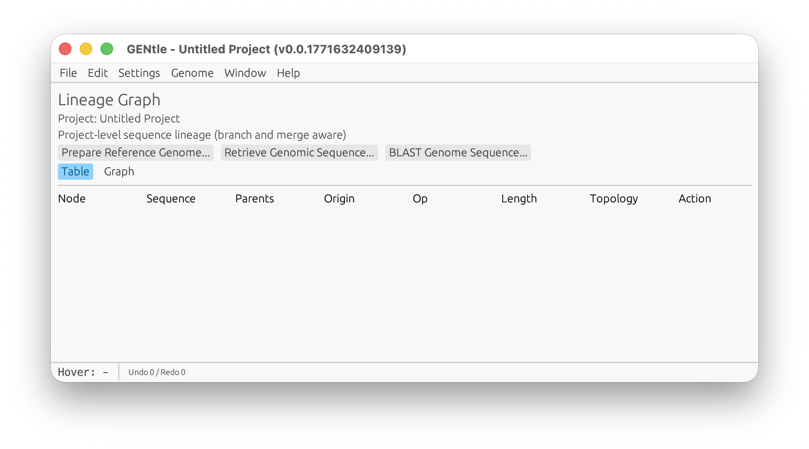
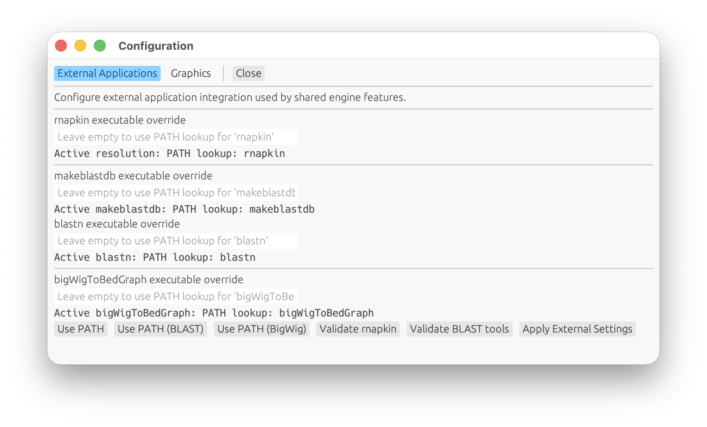
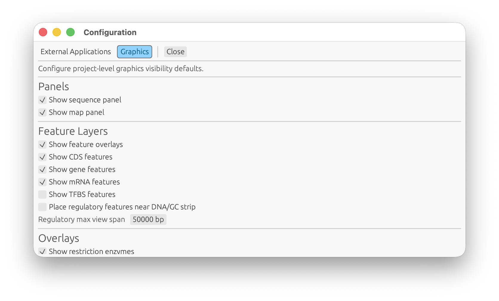
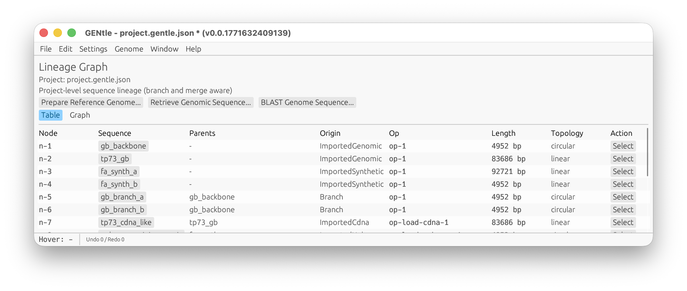
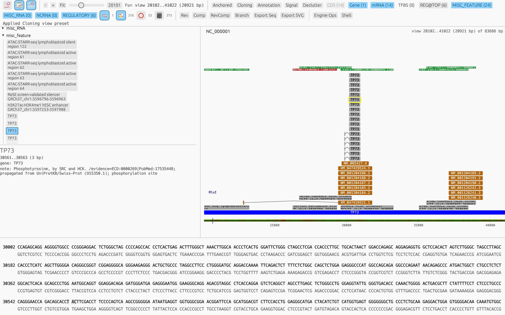
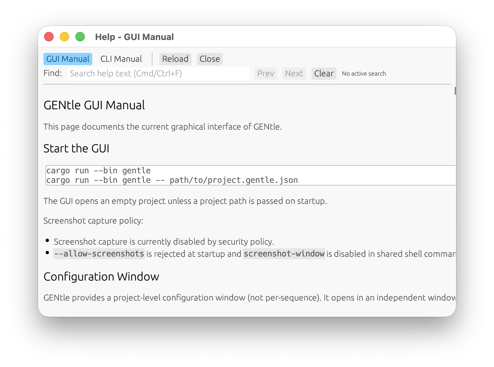
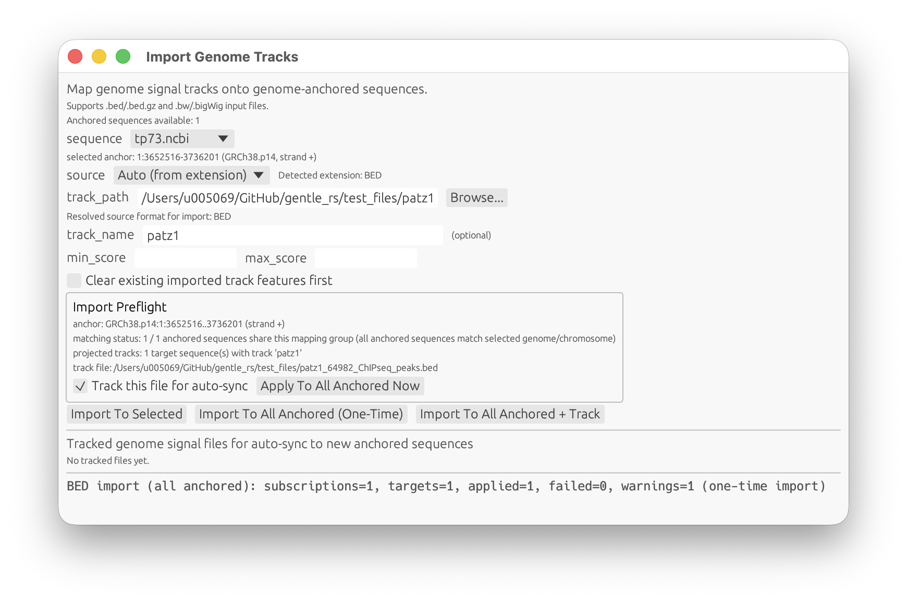

# GENtle GUI Manual

This page documents the current graphical interface of GENtle.

## Start the GUI

```bash
cargo run --bin gentle
cargo run --bin gentle -- path/to/project.gentle.json
```

The GUI opens an empty project unless a project path is passed on startup.

Example startup window:

<br>
*Figure: Main window after startup with an empty project.*

Screenshot capture policy:

- Screenshot capture is currently disabled by security policy.
- `--allow-screenshots` is rejected at startup and `screenshot-window` is
  disabled in shared shell command execution.

## Configuration Window

GENtle provides a project-level configuration window (not per-sequence).
It opens in an independent window/viewport, separate from the main project window.

Access:

- Main window menu: `File -> Configuration...` or `Settings -> Configuration...`
- macOS app menu: `GENtle -> GENtle Settings...`
- Shortcut: `Cmd+,`
- Sequence window top navigation: `Configuration` (opens Graphics tab)
- Re-selecting `Configuration...` while already open focuses the existing window
  (single-instance behavior).

Tabs:

- `External Applications`
  - Configure external executable overrides for:
    - `rnapkin` (`GENTLE_RNAPKIN_BIN`)
    - `makeblastdb` (`GENTLE_MAKEBLASTDB_BIN`)
    - `blastn` (`GENTLE_BLASTN_BIN`)
    - `bigWigToBedGraph` (`GENTLE_BIGWIG_TO_BEDGRAPH_BIN`)
  - Validate executable availability/version from within the UI.
- `Graphics`
  - Configure project-level display visibility defaults (panels, feature layers, overlays).
  - Configure sequence text-panel max length (`Sequence panel max text length`, default `200000 bp`, `0=unlimited`).
    - If a sequence exceeds this limit, the text panel is suppressed and a hint is shown.
  - Configure feature-details font size (`Feature detail font size`, default `9 px`, live-applied).
  - Configure GC-content bin size (`GC bin size`, default `100 bp`) used by
    map overlays and SVG export.
  - Configure optional `Window Styling (experimental)`:
    - enable subtle themed backdrops
    - per-window tint color picker (`main`, `sequence`, `splicing`, `pool`, `configuration`, `help`)
    - optional per-window image watermark paths (`main`, `sequence`, `splicing`, `pool`, `configuration`, `help`)
    - styling editor is a table (`Window`, `Tint`, `Path`, `Actions`)
    - row actions include `Browse...`, `Clear`, and `Reset Color`
    - tint/image opacity controls
    - backdrop compositing keeps a warm/yellow visual tone by default even
      under newer `egui` color-management behavior
    - backdrop images are enabled for sequence/pool windows by default
    - content controls in dialog-style windows (main/help/configuration) render
      with a small inset margin (`8 px`) while the backdrop image still spans
      the full window/panel area
  - Applies to sequence windows through the shared engine display state.
  - `Apply + Refresh Open Windows` forces immediate refresh of all currently open sequence windows.
  - The bottom `Cancel` and `Apply` actions are kept in a persistent footer and remain visible while scrolling.

Persistence:

- Configuration is persisted in an app settings file at `~/.gentle_gui_settings.json`.
- Saved settings are restored on app startup.
- Window-styling color/image selections persist in the same settings file after
  `Apply Window Styling`.

Configuration screenshots:

<br>
*Figure: Configuration window, External Applications tab.*
<br>
*Figure: Configuration window, Graphics tab.*

## Main window layout

A DNA window is split into two visual areas:

- DNA map panel: graphical map (circular or linear)
- Sequence panel: text-oriented sequence rows

Both panels can be shown/hidden from the toolbar.

The project main window (lineage page) supports two views:

- `Table`: tabular lineage view with per-sequence actions
- `Graph`: node/edge lineage visualization
- analysis artifacts (dotplots/flexibility tracks) appear in lineage as
  dedicated analysis nodes linked to their source sequences
- SVG export operations (sequence, dotplot, feature-expert/splicing, gel) are
  also materialized as lineage analysis nodes, linked by operation edges for
  provenance/script parity
- `Containers`: container list with kind/member-count, open actions, and per-container gel export
- `Arrangements`: serial lane setups across containers, with arrangement-level gel export
- The lineage (`Table`/`Graph`) area is split from `Containers` with a
  draggable horizontal divider in the main window.
- In `Table` view, the lineage grid supports both horizontal and vertical
  scrolling; `Node`/`Op` cells use compact IDs with full values on hover.

Project overview screenshot:

<br>
*Figure: Main lineage view with a loaded project.*

Sequence window screenshot:

<br>
*Figure: Sequence window with map and sequence panels.*

Primary map modes (linear topology):

- `Standard map`
  - regular linear feature-map rendering
- `Splicing map`
  - transcript/exon lane rendering for selected `mRNA`/`exon` features
- `Dotplot map`
  - compact launcher/compute panel in sequence windows
  - selecting `Dotplot map` opens a dedicated standalone `Dotplot` workspace
    window for full controls and rendering
  - compact panel keeps quick operations in-window:
    - `Compute dotplot`
    - `Compute flexibility`
    - `Export Dotplot SVG...`
      - exports the currently loaded dotplot/flexibility rendering through engine
        operation `RenderDotplotSvg` (shared GUI/CLI/scripting parity path)
      - each export is recorded in operation history and appears in lineage
        table/graph as an export analysis node
      - default filename includes dotplot parameters (`mode`, query/reference
        spans, `word`, `step`, `mismatches`, optional `tile`) and display
        controls (`threshold`, `gain`; plus flexibility model/bin/smoothing when
        shown)
    - `dotplot_id` / `flex_track_id` selection
  - full parameter editing and plot inspection now live in the standalone window:
    - self modes: `self_forward`, `self_reverse_complement`
    - pair modes: `pair_forward`, `pair_reverse_complement`
      - pair modes require `reference_seq_id`
      - optional `ref_start` / `ref_end` set y-axis reference span
      - default behavior when `ref_start/ref_end` are empty:
        - run an initial full-reference pass
        - auto-fit to detected hit envelope (+padding)
        - recompute once on that fitted reference span
      - `Fit ref span to hits` remains available for manual re-fit when explicit
        reference spans are used
    - default parameters:
      - `half_window_bp`: defaults to the larger query/reference sequence length
        so the initial view spans the full comparison context
      - `word`: defaults to `7` (higher values are faster but less sensitive)
      - `step`: defaults to `1` (highest sampling density)
      - `mismatches`: defaults to `0` (exact-seed matching)
    - display controls:
      - `display threshold` (cell-density sensitivity)
      - `intensity gain` (contrast amplification for visible cells)
      - `Auto contrast` (estimates threshold/gain from payload density)
      - if no cells pass visibility, the canvas shows an explicit message instead
        of a silent white panel
    - optional paired flexibility-track panel (`AT richness` / `AT skew`)
    - boxplot summary panel:
      - rendered below the density map
      - each query bin shows reference-hit distribution
        (`min/q1/median/q3/max` + hit count)
      - useful for quickly spotting exon-band structure in cDNA-vs-genomic maps
    - linked crosshair:
      - hover for live `x/y` coordinates in the plotted span
      - click to lock crosshair
        - self modes: sync selection to x/y interval
        - pair modes: sync selection from x/query axis (y/reference stays informational)
      - right-click to clear the locked crosshair
    - status panel:
      - deterministic request diagnostics (mode, spans, seed parameters, estimated
        window counts / pair evaluations)
      - for `mismatches=0`, large pairwise requests use indexed exact-seed
        matching (not brute-force pair loops), so low-step runs can remain practical
      - loaded payload diagnostics (point count, estimated hit fraction, latest
        operation status/messages)
      - sparse pairwise payload guidance:
        - suggests `pair_reverse_complement` when `pair_forward` is sparse
          (common for cDNA vs genomic comparisons)
        - warns when strict settings (`word`/`step`/`mismatches`) are likely too
          aggressive for wide reference spans
        - warns when computed hits sit near reference-span edges and recommends
          ref-span fitting
      - interpretation notes:
        - `self_forward`: dominant diagonal is expected identity signal
        - reverse-complement self-pair zero-hits can be valid under strict/sparse
          sampling (not necessarily an error)
  - main lineage table/analysis details:
    - dotplot analysis rows include `Dotplot SVG` action (analogous to gel export)
      for direct export from the main project window

Linear map zoom detail:

- In linear mode, GENtle uses adaptive letter routing based on viewport width
  and estimated glyph width:
  - low density: standard one-row base letters
  - medium density: helical-compressed letters (when compressed mode is enabled)
  - high density: condensed 10-row letters (when compressed mode is enabled)
  - over-capacity density: letters are hidden (`OFF`) to preserve readability
- In `HELICAL` mode, base letters now use a true oscillating phase path
  (sin/cos projection) with endpoint pinning, so the first/last visible bases
  remain anchored to viewport edges while interior overlap is distributed.
- Helical X routing uses sub-column interpolation to keep adjacent base
  positions evenly distributed and avoid local crowding plateaus that can
  distort symmetry near curve extrema.
- Helical mode also applies cycle-level arc-length compensation so consecutive
  base positions stay visually more uniform along the curve.
- When `Hide DNA backbone line when letters are shown` is enabled and bases are
  visible, the backbone line and bp tick marks are both suppressed.
- `Reverse-strand letter opacity` controls reverse-strand emphasis in both the
  linear map and the sequence-panel reverse-complement row.
- In debug builds, the top-right DNA diagnostics additionally show the active
  tier thresholds (`standard/helical/condensed`) used by adaptive routing.

Feature tree grouping:

- The left-side feature tree includes a `Grouping` selector:
  - `Off`
  - `Auto (duplicates)`
  - `Always`
- Repeated labels (for example many RNA variants) can be grouped under each
  feature-kind section depending on that mode.
- `Auto (duplicates)` flattens singleton subgroups and only keeps grouped
  branches where duplicate labels exist.
- `gene` entries remain ungrouped (flat rows), even in grouped modes, because
  identifiers are expected to be unique.
- `mRNA` rows are grouped by their associated gene (when gene qualifiers are
  available), while transcript identifiers are shown on individual mRNA entries.
- Regulatory entries (`enhancer`/`silencer`) are grouped in nested branches:
  - primary branch: regulatory class buckets (`enhancer`, `silencer`, `other`)
  - secondary branch:
    - `active region` when labels start with that prefix
    - enhancer marker token groups (for example histone-like markers such as
      `H3K4me1`/`H3K27ac-H3K4me1` and other protein-like tokens such as `CTCF`)
    - unclassified/non-enhancer+silencer regulatory rows remain in `other`
  - per-entry labels remove grouped prefixes to reduce redundancy.
- Group headings show counts as `visible/total` in linear mode (current stretch
  shown in the map), and as total count in circular mode.
- `Cmd` (macOS) / `Ctrl` (Windows/Linux) click on feature rows toggles
  multi-selection.
- In linear mode, multi-selected features are forced to use external labels
  (including short features), improving disambiguation.
- The feature-tree pane is horizontally resizable; when narrowed, the tree uses
  horizontal scrolling for long labels.
- For large/feature-dense sequences, initial feature-tree/detail rendering can
  be deferred to improve window-open responsiveness and is then auto-loaded on
  the next frame (no manual button click required).
- Feature detail text remains below the feature tree in the left pane and uses
  the configurable feature-detail font size.
- The feature tree/details pane is top-aligned with the map and stretched to
  fill map-panel height, so no unused bottom gap is left above the sequence
  text panel.
- When multi-selection is active, the feature-tree header shows a
  `Multi-select active (N)` chip and a one-click `Clear multi-select` action.
- Right-clicking a feature row opens per-feature actions:
  - `Focus feature (current zoom)`
  - `Fit feature in view` (linear map mode)
  - `Use as promoter anchor (Engine Ops)` for `mRNA`/`transcript` rows
    (seeds anchored extraction defaults with strand-aware boundary/direction)
- `Filter` narrows all feature rows in the tree.
  - free text searches kind/label/range and selected qualifiers
  - scoped terms are supported:
    - `kind:mrna`
    - `label:TP73`
    - `range:6128..16430`
    - `source:BED` / `source:VCF`
    - `track:chip`
    - `path:peaks.bed` or `file:peaks.bed`
    - `note:enhancer`
  - preset terms below the filter box are on/off toggle buttons
- Selecting an `mRNA`/`exon` feature opens the splicing expert view in a
  dedicated, resizable window instead of the inline description pane.
- The splicing expert window is a free-standing top-level window and can be
  moved outside the DNA sequence window bounds.
- The splicing expert window content is vertically scrollable, so very large
  transcript sets no longer hide the `Transcript x exon matrix` section.
- Very large `Transcript x exon` or `Exon -> exon` matrices may open collapsed
  by default to reduce idle CPU usage; expand the section header to render the
  full table.
- The splicing expert window uses its own window-styling slot (`splicing`) so
  tint/image backdrop can be configured separately from DNA and pool windows.
- Splicing support frequencies are shown explicitly:
  - hovering exon glyphs in the lane canvas shows transcript/exon coordinates,
    support, `len%3`, and CDS flank phase details (when available)
  - exon columns include support as `n/N (%)` (plus `const` for constitutive
    exons)
  - exon lane glyphs can show CDS flank phase coloring on the left/right exon
    edges (`0/1/2`) when transcript `cds_ranges_1based` are available
  - exon columns also expose `len%3` color cues (`0/1/2`) based on genomic
    exon length modulo 3 (heuristic frame cue)
  - transcript-vs-exon matrix cells are color-coded by exon support frequency
    (higher support => stronger color intensity)
  - an `Exon -> exon transition matrix` shows predicted transition support
    counts with frequency-coded cells; row/column exon headers reuse `len%3`
    colors
  - a `Junction transition support` table lists donor/acceptor transitions with
    support counts and percentages
  - arc-width encoding remains active and arcs also show support-count labels
    in the lane canvas
- The splicing expert window includes a quick action:
  - `Send Group ROI -> Primer/qPCR`
  - seeds ROI start/end fields in Engine Ops primer and qPCR design forms from
    the current splicing-group genomic bounds.
- The splicing expert window also includes transcript-level quick actions:
  - `Transcript` selector (choose one lane by `n-<feature_id> <transcript_id>`)
  - `Derive group transcripts`
    - derives cDNA transcript sequences for all transcript lanes admitted by
      the current splicing scope.
  - `Derive all mRNA`
    - derives cDNA transcript sequences for every `mRNA`/`transcript` feature
      on the active sequence.
  - `Derive + Dotplot`
    - derives the selected transcript sequence, switches to transcript context,
      and opens pairwise transcript-vs-genomic dotplot.
    - strand-aware default mode:
      - transcript `+` strand -> `pair_forward`
      - transcript `-` strand -> `pair_reverse_complement`
    - step size is auto-increased when needed so pair evaluations stay within
      engine limits.
- The splicing expert window also includes `Nanopore cDNA interpretation`:
  - phase-1 FASTA input run panel for `InterpretRnaReads`
    (`.fa/.fasta`, optional gzip `.fa.gz/.fasta.gz`)
  - progress updates are throttled to reduce UI overhead:
    - debug builds: read-count updates approximately every `1000` reads
    - release builds: read-count updates approximately every `10000` reads
    - both build types additionally emit time-based updates approximately every
      `2s` while processing continues
  - input FASTA path can be selected via file picker (`Browse...`) in addition
    to manual path entry
  - if `Report ID` is left empty, a default ID is derived from the input file
    name (`cdna_<filename_stem>`)
  - `Input is cDNA (normalize T-rich 5' head)` checkbox controls read
    normalization mode:
    - enabled (default): reads with a T-rich 5' head are reverse-complemented
      before seed scoring (cDNA-oriented mode); minor interruptions in the
      head are tolerated
    - disabled: direct-RNA mode (reads are scored as provided)
  - advanced settings include `poly-T head min T-bp` (`poly_t_prefix_min_bp`):
    minimum T support required in the 5' detection window for the cDNA
    auto-flip gate
  - advanced runtime options include:
    - `Report mode` (`full` or `seed_passed_only`)
    - `Checkpoint path` (optional JSON checkpoint file)
    - `every reads` (`checkpoint_every_reads`, integer `> 0`)
    - `Resume` (`resume_from_checkpoint`; requires non-empty checkpoint path)
  - these runtime options are passed directly to the shared
    `InterpretRnaReads` engine operation (GUI/CLI/JS/Lua parity)
  - `Apply TP73 specificity preset` sets a stricter seed gate and scope
    (`target-group / target-strand`) for focused pilot filtering runs
  - default splicing scope is broad (`all overlapping / both strands`) with
    optional narrowing presets
  - advanced `Origin mode` controls are available:
    - `single_gene` (baseline; current execution path)
    - `multi_gene_sparse` (expands transcript templates with local-annotation
      matches from `Target genes` for the current run)
  - advanced `Target genes` field (comma/space/semicolon separated IDs) is
    used by `multi_gene_sparse` and persisted in report metadata
  - advanced `ROI seed capture` toggle is persisted in report metadata as a
    planned annotation-independent capture-layer request (warning emitted until
    this layer is implemented)
  - tutorial reference for TP53-basis multi-gene mapping:
    - `docs/tutorial/generated/chapters/12_tp53_multi_gene_sparse_mapping_online.md`
  - scope presets are explicit:
    - `all-overlap / both-strands`: all overlapping transcripts, `+` and `-`
    - `target-group / any-strand`: target group only, but both strands allowed
    - `all-overlap / target-strand`: all overlapping transcripts on target strand
    - `target-group / target-strand`: target group on target strand only
  - strand-scoring semantics:
    - both-strand modes score against the union of admitted strand-specific
      templates (shared k-mers can contribute in this combined mode)
    - target-strand modes exclude opposite-strand templates from the score
  - seed-index semantics:
    - indexed seeds include annotated exon-body k-mers and exon-exon junction
      transition k-mers for admitted transcripts
  - phase-1 seed filtering hashes the full read span for every sequence
  - advanced seed constants expose a composite seed gate:
    - `k-mer length` (default `10`)
    - `min hit` (raw hit fraction, default `0.30`)
    - `min weighted` (occurrence-weighted unique-k-mer fraction, default `0.05`)
    - `min unique` (minimum number of unique matched seed hashes, default `12`)
    - `min chain` (minimum coherent-chain support fraction for matched hashes,
      default `0.40`)
    - `max median gap` (maximum median distance between matched hash starts in
      the inferred transcript chain, default `4.0`)
    - `min transitions` (minimum confirmed exon-exon transitions in inferred
      isoform path, default `1`)
    - `min transition frac` (minimum confirmed/expected transition fraction in
      inferred isoform path, default `0.05`)
    - pass rule:
      `raw >= min hit AND weighted >= min weighted AND unique >= min(min unique, tested kmers) AND chain >= min chain AND median transcript gap <= max median gap AND confirmed transitions >= min transitions AND confirmed transition fraction >= min transition frac`
  - legacy short/long window fields are kept for compatibility and currently
    ignored (full-read hashing is always used in phase-1)
  - alignment fields are active for phase-2 retained-read mapping:
    - `align band`
    - `min identity`
    - `max secondary`
    - `align selection` (`seed_passed|all|aligned`)
  - `Run alignment phase (retained report)` executes
    `AlignRnaReadReport` asynchronously for the current `Report ID`
  - phase-2 alignment updates persisted report counters and support tables:
    - `aligned`
    - `msa-eligible(retained)`
    - seed-confirmed exon-exon transition support table
    - isoform support ranking table
    - exon/transition abundance exports derived from refreshed support
      frequencies
  - phase-2 alignment strategy is reference-guided pairwise mapping
    (`semiglobal` preferred with deterministic `local` fallback), and the
    chosen mode is exported in read/report mapping summaries
    - backend uses `bio::alignment::pairwise::banded`; `align band` controls
      the band width around the seed backbone
  - run executes asynchronously (non-blocking UI) with live read-progress
    indicators
  - workflow access routes for the same payload are available in the panel:
    - `Prepare Workflow Op` stages the generated `InterpretRnaReads` operation
      into `Engine Ops -> Workflow` (`run_id` + `ops` JSON)
    - `Copy Workflow JSON` copies a complete workflow object
      (`{"run_id":"...","ops":[...]}`) for `gentle_cli workflow ...` or shell
      reuse
  - live status now shows seed-pass as count and percentage of reads processed
  - streaming progress includes `ETA:` (uppercase) estimate derived from
    compressed/plain input bytes consumed vs elapsed runtime; ETA refresh is
    synchronized with read-count progress updates
  - running seed-confirmation histogram is updated every 1000 reads and shown as
    genomic-position bars (`+` strand upward, `-` strand downward)
  - bar heights use a square-root scale so low-frequency bins remain visible
    while high-frequency bins are still comparable
  - red seed-anchor dots are overlaid on the histogram baseline (`+` above,
    `-` below) with hover details (hash bits, sequence, genomic position,
    transcript)
  - exon spans are overlaid in the same histogram (green top guide segments)
    for direct seed-location vs exon-context inspection
  - coordinate mode toggle supports genomic coordinates or exonic-only compact
    coordinates (merged exons adjacent without intronic gaps)
  - Seed-hit score-density chart includes a `Linear`/`Log` scale toggle
    (default `Log`); log mode uses `log(1+count)` so sparse high-score bins
    remain visible during strongly skewed runs
  - `Seed-confirmed exon-exon transitions` table reports per-transition support
    counts and percentages across seed-passed reads, plus junction-crossing
    indexed-seed diagnostics
  - `Isoform support ranking` table shows one row per known transcript in scope
    with assigned-read counts, seed-pass counts, transition coverage, gap
    statistics, best score, and strand-audit counters (`chain=same`,
    `opposite-strand competition`, `ambiguous ties`); the best-supported
    isoform is auto-picked during the same joint run
  - `Best-performing reads so far` is shown live during execution; selecting a
    row recomputes that read's seed hashes in-window and highlights supported
    positions in green with a displayed recompute time
  - `Evaluate Top Hits (phase-2)` in the same panel runs
    `AlignRnaReadReport` immediately with the current `align selection`
    setting, so retained top rows gain mapping metrics without leaving the
    panel
  - `Evaluate Selected (phase-2)` aligns only checkbox-selected top rows
    (`record_index`-exact subset), useful for rapid manual triage before
    running a broader phase-2 pass
  - top-read rows include strand assignment diagnostics for the joint
    two-strand run (`strand`, `opp`, `ambig`)
  - top-read rows now also expose origin diagnostics from engine
    classification (`class`, `oconf`, `sconf`) and running class totals are
    shown while processing
  - once phase-2 alignment runs, top-read rows and FASTA headers also include
    compact mapping summaries (`align` mode, transcript, strand, target span,
    identity, query coverage, score, secondary count)
  - top-read rows support FASTA copy paths:
    - checkbox-select one/many rows, then `Copy selected FASTA`
    - `Copy highlighted FASTA` for the active highlighted row
    - `Ctrl/Cmd+C` copies selected rows (or highlighted row fallback)
    - row context menu (`right-click`) includes `Copy FASTA` actions
  - export actions include:
    - `Export Retained Top Reads (FASTA)...`
    - `Export Exon Paths (TSV)...` (per-read path/mapping summary rows)
    - `Export Exon Abundance (TSV)...` (exon/transition abundance rows)
    - `Export Score Density (SVG)...` (uses current `Linear`/`Log` scale toggle)
    - `Export RNA sample sheet ...` (multi-report cohort summary)
  - top-read ranking now includes weighted seed score (inverse seed-occurrence
    weighting) to reduce dominance from repetitive low-complexity seeds
  - throughput diagnostics are shown during run:
    reads/s, bp/s, cumulative bases processed, and mean/median/p95 read length
  - compute breakdown is shown during run
    (`seed`, `align`, `io`, `parse`, `norm`, `infer`, `emit`, `other`) for
    bottleneck inspection (`align` stays near zero in phase-1 seed-only mode)
  - alignment debug/status line is shown during and after runs:
    backend (`pairwise::banded` + dense fallback), mode priority
    (`semiglobal>local`), requested/effective `k`, and active/idle state
  - best-read rows now show full sequences in a horizontally scrollable pane
    (no forced line wrapping)
  - a `Seed hash preview` panel lists representative seed rows in-window and
    full detail remains exportable via `Export Seed Hash Catalog (TSV)...`
  - `Export RNA sample sheet ...` writes a TSV summary for current-sequence
    reports, including exon/junction support-frequency JSON columns
  - executes read-only interpretation/report generation (no direct feature
    mutation).

Circular map label behavior:

- Feature labels are placed near the feature midpoint but may slide along the
  feature span to avoid overlaps.
- Placement avoids overlaps with already placed labels (including restriction
  site labels).
- If no collision-free placement exists within the feature span, the feature
  label is omitted for that view.

Global productivity controls:

- Status bar (bottom of main window) shows:
  - hovered control stable name (when available)
  - undo/redo availability counters
  - latest app/job status message
    (including slow-open timing diagnostics for help/configuration windows:
    native Help-menu dispatch, configuration runtime sync, help payload load,
    focus-acquisition latency, first-frame render, total open latency, and
    native window-menu sync when those exceed threshold)
- `Edit -> Undo` / `Redo` and `Window -> Show Operation History` expose
  operation-level history controls.
- `Window -> Show Background Jobs` opens a centralized progress panel for
  long-running tasks (prepare/import/BLAST).
- `Cmd/Ctrl+K` opens the Command Palette.

Patterns menu:

- `Patterns -> Import Pattern File...`
  - import one workflow-macro pattern JSON file.
- `Patterns -> Import Pattern Folder...`
  - import all pattern JSON files recursively from a folder tree.
- `Patterns -> Import Built-in Legacy Pack`
  - import `assets/cloning_patterns.json`.
- `Patterns -> Import Full Catalog`
  - import the full hierarchical catalog from
    `assets/cloning_patterns_catalog`.
- `Patterns` submenu hierarchy mirrors the directory hierarchy under
  `assets/cloning_patterns_catalog` (one JSON template file per leaf entry).
- `Patterns -> Routine Assistant...`
  - opens a dedicated staged workflow window for routine application:
    1. goal + candidate search
    2. routine alternative comparison + disambiguation answers
    3. typed binding form from routine input ports
    4. shared-engine preflight preview (`--validate-only`)
    5. transactional run + process run-bundle export
  - compare stage includes explicit disambiguation question prompts from
    routine explain/compare payloads and records user-entered answers in
    routine decision traces.
  - explainability and comparison data are loaded via shared shell commands:
    - `routines explain ROUTINE_ID`
    - `routines compare ROUTINE_A ROUTINE_B`
  - execution is routed through shared macro paths:
    - `macros template-import PATH` (auto-import linked template)
    - `macros template-run TEMPLATE_NAME --bind ... --validate-only`
    - `macros template-run TEMPLATE_NAME --bind ... --transactional`
  - Gibson topology guard:
    - sequence bindings show live topology (`sequence | linear|circular | N bp`)
    - if a Gibson input is circular, preflight and execution are blocked
    - `Linearize Vector...` creates a branched copy, sets topology to linear,
      and auto-rebinds that routine input
  - export stage uses shared process artifact route:
    - `export-run-bundle OUTPUT.run_bundle.json`
- `Patterns -> Gibson...`
  - opens a dedicated destination-first Gibson specialist window for one
    insert into one destination.
  - sections:
    1. `Destination`
       - choose destination sequence
       - choose `existing termini` or `defined cut/opening`
       - active DNA window pre-fills the destination by default when possible
       - optionally fill left/right cut edges from the active DNA selection
       - suggests biologically meaningful openings from MCS annotations and
         unique restriction sites when the destination already exposes them
       - default view starts with unique cutters named by the MCS annotation
         and marks them as `(MCS)`
       - `Show other unique cutters` reveals single-cutters elsewhere on the
         destination when you want to search beyond the MCS
       - when no MCS is present or no suggestions are found, `Search unique
         cleavage sites` explicitly re-scans all known restriction enzymes and
         reports when none are unique on the current destination
       - `Feature` column shows the overlapping gene when available, otherwise
         another overlapping feature label; MCS-linked rows also show the MCS
         location there
       - shows end geometry (`blunt`, `5' overhang`, `3' overhang`) so sites
         such as `SmaI` can be chosen directly from the specialist
       - specific cutter suggestions show a compact `Cut` summary derived from
         REBASE and fill the actual cleavage window:
         - equal left/right cut edges mean a blunt cutpoint
         - different left/right cut edges mean the two primer-relevant termini
           of a sticky cut
       - `Opening sketch` renders the destination sequence at the exact cut or
         opening and then shows the destination after it has been opened into
         separate left/right arms
       - once preview is available, the same sketch also shows the two resolved
         destination 5' ends with their current Gibson overlap sizes and
         sequences
       - tooltips and quick help explain the difference between MCS-linked
         cutters and other unique cutters outside the annotated MCS
    2. `Insert`
       - choose one insert sequence and orientation
    3. `Design Targets`
       - Gibson-specific overlap bp range
       - when overlap length is derived rather than fixed, GENtle prefers the
         shortest acceptable overlap inside that range
       - minimum overlap Tm
       - priming-segment Tm window
       - priming-segment length window
       - dedicated `Tm Model` box repeats the shared assumptions in a visually
         separate section
       - displayed Tm values use the shared nearest-neighbor model used across
         GENtle:
         fixed 50 mM monovalent salt, fixed 250 nM total oligo concentration,
         exact-complement duplex assumption, no mismatch/dangling-end/Mg
         correction, fallback to the simple 2/4 estimate for ambiguous or very
         short sequences
    4. `Review`
       - resolves terminal overlaps
       - derives insert primer suggestions as `5' overlap + 3' priming`
       - `Opening sketch` extends into an insert-primer construction view so
         the actual overlap segment and insert-priming segment are both shown
       - shows blocking errors, warnings, and the factual Gibson cartoon
       - priming-segment failures now explain the best available insert-end
         candidate explicitly, including when the insert terminus is simply too
         short / too low-`Tm` for the requested Gibson primer window
       - visible findings use styled `Tₘ` rendering; the copyable findings box
         keeps plain `Tm` text for reliable copying
       - findings, resolved junctions, primer suggestions, and status text are
         copyable directly from the window
       - preview notes repeat the shared Tm-model assumptions so GUI and CLI
         users see the same explanation
    5. `Outputs`
       - shows the exact primer/product nodes the current apply step will
         create
       - `Apply Gibson Cloning` only enables after preview reports no blocking
         errors, then runs one shared engine operation and creates new sequence
         nodes for the two insert primers and the assembled product
       - `Cancel` closes the specialist without applying anything and keeps the
         current draft available when the window is reopened
       - the assembled product carries transferred destination/insert features
       - partially consumed destination annotations are trimmed or projected
         when a truthful product-side rewrite is available
       - surviving MCS annotations are revalidated against actual restriction
         sites on the assembled product, including new sites introduced by the
         insert
       - export plan JSON
       - export preview JSON
       - export primer summary
       - export cartoon SVG
       - hand off to Routine Assistant when current execution paths can accept it
  - uses the same shared preview command as CLI/shell:
    - `gibson preview PLAN_JSON_OR_@FILE [--output OUTPUT.json]`
  - shared mutating command parity:
    - `gibson apply PLAN_JSON_OR_@FILE`
  - GUI-first testing tutorial:
    - `docs/tutorial/gibson_specialist_testing_gui.md`
  - deliberately does not embed the generic PCR/qPCR specialist UI
- `Patterns -> Planning...`
  - opens a dedicated standalone `Planning` window for the planning meta-layer.
  - supports editing and applying:
    - `global` planning profile
    - `confirmed_agent_overlay` profile
    - `project_override` profile
    - planning objective
  - shows merged effective profile (`global -> confirmed_agent_overlay -> project_override`).
  - supports registering pending planning sync suggestions (`pull`/`push`) from
    JSON payload and explicit `Accept`/`Reject` resolution in-window.
  - exposes sync status (`pending count`, latest pull/push timestamps, last
    source/snapshot, last error).
- `Patterns -> Routine catalog`
  - routine discovery is grouped by `family` and `status`.
  - selecting a routine imports its linked template file when the routine
    manifest provides `template_path`.
  - Gibson baseline is available as:
    - `gibson.two_fragment_overlap_preview`
    - template: `gibson_two_fragment_overlap_preview`
  - current execution path for imported routines is the shared shell panel:
    - `macros template-run TEMPLATE_NAME --bind ... --validate-only`
    - then run again without `--validate-only` for a mutating execution.
  - manifest source: `assets/cloning_routines.json`
    (`gentle.cloning_routines.v1`).

Node click behavior in lineage `Graph` view:

- Single-click: selects a node (highlight only).
- Double-click on a single-sequence node: opens that sequence window.
- Double-click on a pool node: opens a pool-context window (Engine Ops visible,
  pool member distribution available).
- Double-click on an analysis node (`Dotplot` / `FlexibilityTrack`): opens the
  source sequence window.
- Single-click on a Gibson operation square in the graph, or on the `Op` cell
  for Gibson-created outputs in the table: reopens the Gibson specialist with
  the saved plan loaded again for review.
- Right-click context menu (graph and table node-id cells):
  - `Rename (leaf only)`: updates the node display name (sequence name).
  - `Remove (leaf only)`: opens a confirmation dialog, then removes that
    sequence/node from project state on confirm.
  - both are disabled for non-leaf nodes in this first pass.
- Retrieval-pattern badges are shown for retrieval-derived sequence nodes:
  - `GENE` for `ExtractGenomeGene`
  - `REGION` for `ExtractGenomeRegion`
  - `GB` for `FetchGenBankAccession`
  - clicking the badge reopens the matching retrieval dialog with saved inputs
    prefilled
  - if a genome anchor exists, it is shown in the same tooltip; GenBank source
    provenance and genome-anchor provenance are complementary
- Macro-instance nodes are rendered as dedicated box nodes.
  - Double-click behavior remains no-op (informational node type).
  - Click or use table `Inspect` to open a persistent macro detail panel below
    the lineage graph/table:
    - status/template/routine summary
    - typed input/output bindings
    - emitted operation IDs with operation-label summaries
    - quick-open buttons for sequence outputs
- Analysis nodes are rendered as dedicated rounded boxes.
  - Table/tooltip details expose:
    - artifact id
    - source sequence (+ reference sequence for pairwise dotplots)
    - mode/model
    - point/bin count

Node groups in lineage view:

- A `Node Groups` section is available above the lineage table/graph views.
- Groups are disjoint (a node can belong to only one group).
- Each group has one representative node and one or more member nodes.
- Table view:
  - representative rows are shown at top level
  - member rows are indented beneath the representative
  - collapse/expand toggles are available on representative rows
- Graph view:
  - grouped nodes are enclosed with a labeled outline
  - when a group is collapsed, only the representative node is shown
  - edges from/to hidden members are projected to the representative node
- Context menu actions (table and graph):
  - right-click a node to `Mark for node-group` / `Unmark for node-group`
  - right-click a node to `Use as draft representative` (uses currently marked nodes)
  - right-click a node to `Create group now (representative)` for one-step creation

## Toolbar buttons

The top toolbar in each DNA window provides these controls (left to right).
The exact set depends on `Mode`:

- `Genome`
  - read-focused; hides ROI extraction, sequence-derivation, and Engine Ops/Shell buttons
- `Chromosomal`
  - keeps ROI extraction (`Extract Sel`, `PCR ROI`), hides sequence-derivation and Engine Ops/Shell
- `Region`
  - full controls (default)
- `Gene`
  - full controls
- `cDNA`
  - full controls
  - defaults to intrinsic cDNA-focused display behavior:
    contextual transcript-projection features (`mRNA`/`exon`/`CDS`) are hidden
    unless explicitly enabled

Controls:

1. Circular/Linear toggle
   - Switches DNA map topology visualization between circular and linear.
2. Show/Hide sequence panel
   - Shows or hides the sequence text panel.
3. Show/Hide map panel
   - Shows or hides the graphical DNA map.
4. Mode
   - Chooses biological presentation context (`Genome`, `Chromosomal`, `Region`, `Gene`, `cDNA`).
   - Toolbar groups are shown/hidden according to the selected context.
5. Splicing map (linear mode)
   - Toggles primary map rendering between standard feature-map mode and a
     read-only transcript/exon splicing-lane mode for the selected
     `mRNA`/`exon` feature.
   - Uses the same splicing payload/geometry contract as the dedicated
     Splicing Expert window.
   - Clicking a transcript lane focuses the corresponding transcript feature in
     the sequence view.
6. CDS
   - Shows or hides CDS feature rendering.
7. Gene
   - Shows or hides gene feature rendering.
8. mRNA
   - Shows or hides mRNA feature rendering.
9. Ctx mRNA (shown in `cDNA` mode)
   - Explicit opt-in for contextual transcript-projection features derived from
     genome annotation/mapping context.
   - Default is off in `cDNA` mode (intrinsic cDNA evidence only).
10. Show/Hide TFBS
   - Toggles computed TFBS annotations.
   - Default is off.
11. Show/Hide restriction enzymes
   - Toggles restriction enzyme cut-site markers and labels.
12. Show/Hide GC content
   - Toggles GC-content visualization overlay.
   - Aggregation uses the configurable GC bin size (default `100 bp`).
13. Show/Hide ORFs
   - Toggles open reading frame overlays.
14. Show/Hide methylation sites
   - Toggles methylation-site markers.
15. Extract Sel
   - Extracts current map/text selection into a new sequence via
     `ExtractRegion`.
16. PCR ROI
   - `PCR ROI` menu supports both single-ROI seeding and batch-queue capture:
     - seed Primer/qPCR ROI from current map/text selection
     - add current map/text selection to PCR region queue
     - seed Primer/qPCR ROI from selected feature bounds
     - add selected feature(s) to PCR region queue (one queued row per feature)
   - opens Engine Ops so the user can run `Design Primer Pairs`,
     queue batch execution, or `Design qPCR Assays`.
17. Export Seq
   - Exports the active sequence via engine `SaveFile`.
   - Output format is inferred from filename extension (`.gb/.gbk` => GenBank, `.fa/.fasta` => FASTA).
18. Export SVG
   - Exports the active sequence map via engine `RenderSequenceSvg`.
19. Export View SVG
   - Exports the currently shown sequence-window view composition as SVG
     using the default `screen` profile (map panel + sequence panel extract).
   - When linear `Splicing map` mode is active, export uses the same splicing
     payload renderer as the on-screen splicing map (including transcript/exon
     lane context when an `mRNA`/`exon` is selected).
   - `View SVG ▾` exposes additional export profiles:
     - `wide-context`: larger canvas + expanded base-span context around the
       current linear viewport.
     - `print-a3`: print-oriented A3 landscape SVG with expanded context and
       physical-size metadata (`420mm x 297mm`) for direct print workflows.
   - Debug builds include adaptive routing-tier diagnostics in the SVG header.
20. Export RNA SVG (ssRNA only)
   - Exports RNA secondary-structure SVG via shared engine operation `RenderRnaStructureSvg`.
   - Shown only when active sequence is single-stranded RNA (`molecule_type` `RNA`/`ssRNA`).
21. Engine Ops
   - Shows/hides strict operation controls for explicit engine workflows.
   - Digest quick-fill actions:
     - `Use MCS enzymes`: fills digest enzyme list from MCS feature context
       (normalized to REBASE canonical names).
     - `Single-cutters (REBASE)`: fills digest list with enzymes cutting exactly
       once in the active sequence.
     - `Single-cutters in CDS`: same single-cutter filter constrained to
       cleavage positions inside CDS features.
22. Shell
   - Shows/hides the in-window GENtle Shell panel.
   - Uses the same shared command parser/executor as `gentle_cli shell`.

Hovering any button shows a tooltip in the UI.

## RNA Structure (ssRNA)

When the active sequence is single-stranded RNA (`molecule_type` `RNA`/`ssRNA`),
the DNA window shows an `RNA Structure (rnapkin)` panel in the top area.

Features:

- `Refresh RNA Structure`
  - Runs `rnapkin` through shared engine APIs to fetch text output and refresh SVG preview.
- `Export RNA SVG`
  - Saves a chosen SVG path through engine operation `RenderRnaStructureSvg`.
- Textual report
  - Shows command metadata and `stdout`/`stderr` from `rnapkin`.
- SVG preview
  - Displays rendered structure image in-panel.

Runtime dependency:

- `rnapkin` must be installed and reachable in `PATH`, or
- set `GENTLE_RNAPKIN_BIN` to the `rnapkin` executable path.

## GENtle Shell (GUI)

The DNA-window toolbar includes a `Shell` button that opens a command panel.

Behavior:

- Uses shared command parsing/execution (`src/engine_shell.rs`).
- Same command set as CLI `gentle_cli shell`.
- Shows a command preview before execution.
- Maintains command output history in the panel.

Supported commands:

- Open `Help -> Shell Commands`.
- This reference is generated from `docs/glossary.json` and shows both:
  - usage syntax
  - task summary/description
- Use the `Interface` selector in that view to filter commands by language/access path:
  - `All`
  - `GUI shell`
  - `CLI shell`
  - `CLI direct`
  - `JS`
  - `Lua`

Common examples:

- `help` — show help catalog or command-specific help.
- `state-summary` — summarize loaded sequences/containers/metadata.
- `render-svg SEQ_ID linear|circular OUTPUT.svg` — export map SVG.
- `genomes prepare GENOME_ID ...` — prepare reference genome cache/index.
- `tracks import-bed SEQ_ID PATH ...` — project BED track onto anchored sequence.
- `candidates generate SET_NAME SEQ_ID --length N ...` — create candidate set.
- `guides oligos-export GUIDE_SET_ID OUTPUT_PATH ...` — export guide oligo set.
- `planning profile show --scope effective` — inspect merged planning profile
  (`global -> confirmed_agent_overlay -> project_override`).
- `planning sync pull @suggestion.json --source lab_manager` — register a
  pending advisory planning suggestion (apply via
  `planning suggestions accept SUGGESTION_ID`).

Status output note:

- `genomes status` / `helpers status` include optional
  `nucleotide_length_bp`, `molecular_mass_da`, and `molecular_mass_source`
  alongside source-type/source-path fields.
- `routines list` / `routines compare` include planning estimates when planning
  data is configured:
  `estimated_time_hours`, `estimated_cost`, `local_fit_score`,
  `composite_meta_score`.

Screenshot command status:

- `screenshot-window OUTPUT.png` is currently disabled by security policy.
- Manual documentation updates remain the active path for image artifacts.

## Agent Assistant

GENtle provides a standalone `Agent Assistant` window for structured support from
configured external/internal agent systems.

Conceptual/tutorial companion:

- `docs/agent_interfaces_tutorial.md` (who runs what where, and how Agent
  Assistant differs from CLI, MCP, and external coding agents).
- external MCP clients discover available GENtle tools/capabilities with
  `tools/list` and `capabilities` before calling operations.

Access:

- main menu: `File -> Agent Assistant...`
- command palette action: `Agent Assistant`
- shortcut: `Cmd+Shift+A`

Behavior:

- loads systems from catalog JSON (default `assets/agent_systems.json`)
- system selection is a dropdown from catalog entries
- unavailable systems remain selectable and show the reason
- `OpenAI API key` field in this window is a session-only override
  - enter your key as `sk-...`
  - click `Clear Key` to remove it from current session
  - the key is not persisted to disk by GENtle settings
- if set, GUI key overrides `OPENAI_API_KEY` for requests started from this window
- `Base URL override` field is a session-only endpoint override for
  `native_openai` and `native_openai_compat`
  - use this for local endpoints such as `http://localhost:11964` or
    `http://localhost:11964/v1`
  - click `Clear URL` to remove it from current session
- `Model override` field is a session-only model-name override for
  `native_openai` and `native_openai_compat`
  - use this to force a concrete model id
  - `unspecified` means no override
  - click `Clear Model` to remove it from current session
- `timeout_sec` is a session-only request timeout override
  - applies to stdio and native agent transports
  - maps to `GENTLE_AGENT_TIMEOUT_SECS`
  - empty/`0` means default timeout
- `connect_timeout_sec` / `read_timeout_sec` are session-only transport controls
  - map to `GENTLE_AGENT_CONNECT_TIMEOUT_SECS` and `GENTLE_AGENT_READ_TIMEOUT_SECS`
  - empty/`0` keeps defaults
- `max_retries` / `max_response_bytes` are session-only guardrails
  - map to `GENTLE_AGENT_MAX_RETRIES` and `GENTLE_AGENT_MAX_RESPONSE_BYTES`
  - `max_retries=0` disables retries for the request
  - empty keeps defaults
- if model remains `unspecified`, GENtle blocks requests until you pick a
  discovered model or set a concrete override
- `Discover Models` queries the current endpoint and populates a model dropdown
  for explicit selection
- prompt templates are available via one-click `Insert` / `Append` buttons
  before the prompt editor
- optional `Include state summary` injects current project summary context
- optional `Allow auto execute` only applies to suggestions marked with `auto`
- `Ask Agent` runs in background and reports status in `Background Jobs`
- response panel can include:
  - assistant message text
  - follow-up questions
  - suggested shared-shell commands with per-row `Run` action
- execution is always per suggestion (row-run, explicit all, or explicit auto);
  there is no global always-execute mode
- each executed suggestion is logged with status/output in the same window

OpenAI setup (explicit):

1. Open `File -> Agent Assistant...`.
2. Choose system `OpenAI GPT-5 (native HTTP)` from the dropdown.
3. Paste your API key into `OpenAI API key` (format `sk-...`).
4. Enter prompt text and click `Ask Agent`.
5. If you prefer environment setup instead of GUI key field, launch GENtle with:

```bash
export OPENAI_API_KEY=sk-...
cargo run --bin gentle
```

Local LLM setup (Jan/Msty/OpenAI-compatible endpoint):

1. Open `File -> Agent Assistant...`.
2. Select one of:
   - `Local Llama (OpenAI-compatible)`
   - `Jan Local (template)`
   - `Msty Local (template)`
3. Set `Base URL override` to your local endpoint, e.g. `http://localhost:11964`.
4. Optionally set `timeout_sec` for slow local models (for example `600`).
5. Click `Discover Models` and select one discovered model from the dropdown
   (or set `Model override` directly, for example `deepseek-r1:8b`).
6. Optionally set persistent defaults in `assets/agent_systems.json`.
7. If your local service expects no key, keep `OpenAI API key` empty.
8. Ask agent as usual.
9. For local root URLs (such as `http://localhost:11964`), GENtle will try both:
   - `/chat/completions`
   - `/v1/chat/completions`

Common failure interpretation:

- `AGENT_ADAPTER_UNAVAILABLE ... status=429 ... code=insufficient_quota`
  - connection/auth path works, but OpenAI API project quota is exhausted
  - fix billing/quota at:
    - `https://platform.openai.com/usage`
    - `https://platform.openai.com/settings/organization/billing/overview`
  - this is separate from ChatGPT plan credits

What to send the agent (recommended):

- Domain bootstrap docs for local models:
  - `docs/ai_cloning_primer.md`
  - `docs/ai_task_playbooks.md`
  - `docs/ai_prompt_contract.md`
  - `docs/examples/ai_cloning_examples.md`
- Optional compact glossary extension:
  - `docs/ai_glossary_extensions.json`

Copy/paste prompt template for users:

```text
Objective:
<what you want, in one sentence>

Context:
<project sequence/genome/helper IDs and why this region matters>

Inputs:
- seq_id / genome_id / helper_id: ...
- anchors or coordinates: ...
- feature labels/kinds: ...

Constraints:
- length: ...
- GC range: ...
- motifs/restriction sites to require/avoid: ...
- strand assumptions: ...

Output wanted:
- plan
- exact gentle_cli shell commands
- verification checks

Execution policy:
chat-only | ask-before-run | allow-auto-exec
```

Prompt examples:

- \"Generate 20 bp candidates between TP53 start/end on `grch38_tp53`, keep GC 40-80%, maximize distance from CDS boundaries, return top 25 with exact commands, ask-before-run.\"
- \"Check BLAST specificity for sequence `ACGT...` against `homo_sapiens_grch38_ensembl_116`, task `blastn-short`, max hits 20, chat-only.\"
- \"Import `/path/peaks.bed.gz` onto anchored `tp53_region`, then keep candidates within 200 bp of imported track features, provide commands and stop before execution.\"

## Candidate-Set Workflow (Engine Ops + GUI Shell)

Candidate-set generation/scoring/filtering is backed by shared engine
operations and available in two GUI paths:

- `Engine Ops -> Candidate sets (scoring/filtering)` dedicated form panel
- GUI shell (`candidates ...` command family, including `candidates macro`)

Recommended flow in one sequence window:

1. Generate a seed set:
   - Engine Ops panel: fill `set`, `seq`, `length`, `step`, optional feature filters, then `Generate`
   - Shell equivalent: `candidates generate sgrnas my_seq --length 20 --step 1 --limit 10000`
2. Optionally generate a set between local anchors:
   - Engine Ops panel: `Generate set between anchors` section (Anchor A/B by
     position or feature boundary with `start|end|middle`)
   - Shell equivalent: `candidates generate-between-anchors ...`
3. Add derived metrics:
   - Engine Ops panel: `Score expr` and `Score distance`
   - Shell equivalents:
     - `candidates score sgrnas gc_bias "100 * (gc_fraction - at_fraction)"`
     - `candidates score-distance sgrnas dist_gene --feature-kind gene`
4. Run optimizer primitives (optional):
   - Shell equivalents:
     - `candidates score-weighted ...`
     - `candidates top-k ...`
     - `candidates pareto ...`
5. Filter into explicit subsets:
   - Engine Ops panel: `Filter` with value and/or quantile bounds
   - Shell equivalents:
     - `candidates filter sgrnas sgrnas_gc_ok --metric gc_bias --min -20 --max 20`
     - `candidates filter sgrnas_gc_ok sgrnas_top --metric dist_gene --max-quantile 0.25`
6. Combine subsets:
   - Engine Ops panel: `Apply set-op` (`union`/`intersect`/`subtract`)
   - Shell equivalent: `candidates set-op intersect sgrnas_top other_set final_set`
7. Inspect/paginate/export:
   - Engine Ops panel: page controls (`limit`/`offset`, `Prev`/`Next`), local sort key, and `Export selected set as JSON`
   - Shell equivalent: `candidates show final_set --limit 50 --offset 0`
8. Optional macro execution:
   - Engine Ops panel: `Run candidates macro` with multiline script
   - Shell equivalent: `candidates macro SCRIPT_OR_@FILE`
9. Optional persistent macro templates:
   - Shell equivalents:
     - `candidates template-put ...`
     - `candidates template-run ...`
10. Optional full-operation workflow macros:
   - Shell equivalents:
     - `macros template-put ...`
      - `macros template-import assets/cloning_patterns.json`
      - `macros template-import assets/cloning_patterns_catalog`
      - `macros template-run ...`
      - `macros run --file cloning_flow.gsh --transactional`
      - `macros instance-list`
      - `macros instance-show MACRO_INSTANCE_ID`
   - These scripts can orchestrate non-candidate operations through `op ...` and
     `workflow ...` statements.

Persistence:

- In-memory candidate sets are tracked at
  `metadata["candidate_sets"]` (`gentle.candidate_sets.v1`).
- On save, candidate sets are externalized into a sidecar index + JSONL store;
  project metadata stores a reference schema (`gentle.candidate_sets.ref.v1`).
- On project load, sidecar-backed candidate sets are rehydrated automatically.

## Documentation automation status

- Auto-updated documentation with embedded graphics is explicitly postponed.
- Current policy is manual documentation updates with optional manual screenshot
  artifacts.

## About GENtle

Two About entries exist on macOS:

- `Help -> About GENtle`: custom GENtle About window (icon + version/build text)
- app menu `GENtle -> About GENtle`: standard macOS About panel

The custom window and CLI `--version` share the same text payload.
- On Windows/Linux, the custom About window shows:
  - semantic package version from `Cargo.toml` (for example `0.1.0-internal.2`)
  - build stamp on the next line (`Build <epoch-ms>`)

## Open windows and focus

GENtle tracks open native windows and can raise a selected one to front.

- Main project window menu: `Windows -> <window name>` jumps directly to that window
- macOS native mirrors:
  - `Window -> GENtle Open Windows… -> <window name>`
  - `GENtle -> GENtle Windows… -> <window name>`
- Native macOS window-menu synchronization is deferred while a new Help or
  Configuration open probe is active to reduce first-frame contention.
- `Windows` includes project, sequence/pool, and auxiliary windows
  (Help, Configuration, Prepare Genome, Retrieve, BLAST, Track Import,
  Planning, Agent Assistant, UniProt Mapping, Operation History)
- Shortcut: `Cmd+Backtick` focuses the main project window
- Specialist windows (including DNA sequence windows) include a top-left nav
  strip with:
  - `Help`: opens the GUI manual
  - `Main`: raises the main project window
- `Cmd+W` closes the focused native window (sequence and auxiliary viewports,
  including Configuration/Help/BLAST/Track Import/Planning/Agent Assistant/History).
- Help shortcuts:
  - `F1` (Windows/Linux)
  - `Ctrl+F1` (fallback in function-key reserved environments)
  - `Cmd+Shift+/` (macOS)

## Help manuals

The `Help` menu now includes:

- `GUI Manual`: opens `docs/gui.md` in an in-app markdown viewer
- `CLI Manual`: opens `docs/cli.md` in an in-app markdown viewer
- `Agent Interface`: opens `docs/agent_interface.md` in an in-app markdown viewer
- `Reviewer Quickstart`: opens `docs/reviewer_preview.md` (internal preview checklist and known limitations)
- `Shell Commands`: generated command reference from `docs/glossary.json`
  (usage + task summary per command)
- `Tutorials`: opens tutorial markdown docs in the same help window
  (`Topic` selector starts the second help-header row, ahead of search)
  - curated order now comes from `docs/tutorial/catalog.json` when available
  - falls back to recursive markdown discovery under `docs/tutorial/**` if the
    catalog is unavailable
- on macOS, app menu `GENtle -> GENtle Help...` opens the same help window
- help now opens in its own native window (separate viewport), not as an overlay in the project window
- Shell command reference includes an `Interface` selector:
  - `All`
  - `GUI shell`
  - `CLI shell`
  - `CLI direct`
  - `JS`
  - `Lua`

Help content loading behavior:

- opening Help reuses already-loaded markdown/glossary payloads for faster
  window activation
- re-invoking the already selected Help tab while Help is open now performs a
  focus-only fast path (no markdown reload/search-refresh pass)
- opening Help can emit status-bar slow-path timing hints for:
  - help payload load
  - first-frame help render
  - total help-window open time
- if `docs/gui.md` / `docs/cli.md` / `docs/agent_interface.md` / `docs/reviewer_preview.md` exists at
  runtime, GUI loads those files
- otherwise GUI falls back to embedded copies compiled into the app binary
- shell-command help content is generated from the structured glossary source
  `docs/glossary.json`

Markdown image support:

- help content is rendered via CommonMark (headings/lists/tables/code blocks + images)
- use standard markdown image syntax (``)
- relative image paths in `docs/*.md` are resolved relative to the markdown file location
- relative local image paths are rewritten to `file://...` URIs for cross-platform loading
- images are dynamically constrained to 75% of help-pane width for readability
- screenshots in this manual include explicit caption lines (`*Figure: ...*`)
- `Reload` in the help window reloads markdown + images from disk
- help viewer supports in-window text search (`Cmd/Ctrl+F` focuses search box)
- search UI includes match count and `Prev`/`Next` navigation
- help header controls and markdown body reflow when the help window is resized
  narrower; tutorial topic selection is width-clamped so long titles do not
  force the body into a stale wider layout

Help window screenshot:

<br>
*Figure: Help window with searchable in-app markdown manuals.*

## Map interactions

The DNA map supports mouse interactions:

- Hover: highlights/inspects map elements
- Click: selects a feature
- Double-click: creates a sequence selection from the clicked feature or restriction site

### Unified scroll/zoom policy

Across GUI panes, GENtle uses one interaction policy:

- Default wheel/trackpad scroll pans or scrolls content.
- `Shift + wheel/trackpad` zooms on zoomable canvases.
- `Option` (`Alt`) + drag enables hand-pan mode (`Grab`/`Grabbing` cursor).
- Arrow keys pan the active hovered region.
- `Shift + ArrowUp/ArrowRight` zoom in, `Shift + ArrowDown/ArrowLeft` zoom out
  on zoomable canvases.
- Non-zoom scroll panes (help/table/list areas) support keyboard scrolling with
  `Arrow`, `PageUp/PageDown`, and `Home/End` when hovered and no text field has
  keyboard focus.

### Linear DNA map: zoom and pan (mouse/touchpad)

When the sequence is in linear mode and your pointer is over the map:

- wheel/trackpad scroll pans the map:
  - horizontal motion pans the bp viewport left/right
  - vertical motion pans the rendered map lanes up/down
- `Shift + wheel` zooms around the current cursor position
- `Option + drag` pans the map by hand

Toolbar alternatives (linear mode):

- `-`: zoom out
- `+`: zoom in
- `Fit Seq`: reset to full sequence span and recenter vertically
- `Fit Features`: keep the current subsequence span and recenter the feature lanes vertically
- `Pan` slider: move the current viewport left/right
- Right-side vertical slider (`V pan`) in the map panel: move feature lanes up/down
  directly; `0` applies vertical feature fit for the current subsequence

### Lineage graph: zoom and pan (mouse/touchpad)

In `Main window -> Graph` view:

- Zoom:
  - `Shift + wheel` over the graph (primary)
  - `Cmd/Ctrl + wheel` also zooms (legacy alias kept for compatibility)
  - `-`, `+`, `Reset`, `Fit`, and `Zoom` slider remain available
  - `Reset Layout` restores default node placement after manual moves
- Pan:
  - scrollbars, wheel, or touchpad scrolling
  - `Option + drag` pans by hand
  - `Space + drag` on empty background remains available as a legacy alias
- Node layout:
  - drag a node with the mouse to reposition it
  - double-click a node to open it (`pool` nodes open pool view)
  - single-click selects a node for visual focus
  - hover shows node details at pointer; pool nodes include pool range and
    auto-selected ladder hints
  - moved positions are persisted in project metadata and restored when the
    project is reopened
  - automatic graph layout uses DAG layering (parents left, children right)
    with crossing-minimizing ordering between layers
- Dense graph readability:
  - `Compact labels` reduces label density when the graph is crowded
  - operation labels are shortened and node detail labels are reduced
  - operation transitions are rendered as square glyph nodes between tube nodes
    (Petri-net style), with compact operation symbols inside the square
  - operation squares now use a consistent symbol/color set by operation family
    (for example digest, ligation, PCR, extract, filter)
  - when collapsed groups project multiple hidden operations onto one visible
    transition, the square shows a count symbol (for example `2`) and grouped
    edge text summarizes the merged operation set
  - collapsed group representative nodes display a compact hidden-internals
    badge: total hidden operation count plus top hidden operation-family chips
    (same symbol/color set as transition squares)
  - edge text labels remain secondary annotations for detailed operation names
- Workspace persistence:
  - graph node positions, zoom, compact-label toggle, graph scroll/pan offset,
    and preferred lineage/container split are stored in project metadata
  - the lineage page itself is vertically scrollable; oversized graph areas no
    longer hide the containers/arrangements section
  - in both `Table` and `Graph` view, drag the lower edge of the lineage pane
    to resize it against the containers pane

## Command Palette and History/Jobs Panels

- Command Palette:
  - open via `Cmd/Ctrl+K` or `Edit -> Command Palette...`
  - searchable action list for project, genome, planning, help, and window actions
  - includes `Planning` action (`Patterns -> Planning...` equivalent)
  - supports keyboard navigation (`Up`/`Down`, `Enter`, `Esc`)
- Operation History panel:
  - open via `Edit -> Operation History...` or `Window -> Show Operation History`
  - includes undo/redo buttons and recent operation summaries
- Background Jobs panel:
  - open via `Window -> Show Background Jobs`
  - central place for progress, cancel/retry actions, and recent completion/error events
  - retry actions capture structured argument snapshots (shown in-panel) and
    persist them with project metadata for restart-safe debugging
  - retry snapshot list supports kind/text filtering and filtered JSON export
    for triage handoff or offline analysis
  - retry snapshot retention controls support "retain newest N", explicit prune,
    and clear-all cleanup for long-running sessions
  - filtered maintenance actions now include direct filtered delete plus
    archive-and-delete export workflow for per-kind/per-origin cleanup
  - destructive filtered cleanup actions are staged and require explicit
    confirm with a match-summary preview before execution
  - staged destructive actions now include a dry-run diff panel showing
    "would remove" and "would remain" snapshot previews before confirm
  - destructive cleanup confirm now requires typing an action-specific
    phrase (for example `delete 3`) before the confirm button is enabled
  - successful destructive cleanup actions append persisted audit entries
    (action/filter/counts/archive path) visible in-panel for traceability
  - cleanup audit section provides filtered JSON report export using current
    action/text filters; report export is read-only and does not append
    additional audit entries
  - cleanup audit history supports action/text filtering plus independent
    retention tuning (`retain newest N`, `prune oldest`, `clear all`) for
    bounded, searchable long-running session traces
  - cleanup audit `clear all` now uses staged type-to-confirm before final
    removal

## Linear map conventions

Current linear map conventions are:

- Forward-strand features are shown above the DNA backbone
- Reverse-strand features are shown below the DNA backbone
- Regulatory features (for example TFBS / `regulatory_region`) are grouped into
  dedicated upper lanes above forward-strand coding features to keep dense loci
  readable
- `REG@TOP` / `REG@DNA` toggle in the map toolbar switches regulatory-feature
  placement between dedicated top lanes and a single near-baseline/GC-strip
  lane
- lane packing uses tighter spacing and stronger non-overlap padding in dense
  views
- strict `REG@DNA` mode keeps regulatory tracks in one near-baseline lane with
  enforced clearance from coding/gene lanes (no regulatory intrusion into gene
  lanes)
- Directional features use arrow-shaped ends
- Feature labels are lane-packed to reduce overlap
- Coordinate fallback labels are suppressed for unlabeled regulatory features
  to avoid clutter in dense tracks
- Restriction enzyme labels are lane-packed to reduce overlap
- Adaptive DNA-letter mode routing (linear map):
  - default mode is `Auto adaptive`
  - explicit override modes are available:
    - `Force standard`
    - `Force helical`
    - `Force condensed 10-row`
  - in `Auto adaptive`, density tiers are deterministic:
    - `density <= 1.5`: standard letters
    - `density <= 2.0`: helical letters (if compressed letters enabled)
    - `density <= 10.0`: condensed 10-row letters (if compressed letters enabled)
    - `density > 10.0`: letters hidden (`OFF`)
  - `Enable compressed DNA letters` applies only to `Auto adaptive` mode:
    disabling it forces `Auto adaptive` to use standard-only behavior.
  - row mapping uses `row = (bp + offset_bp) mod 10` where `offset_bp` is
    `Helical phase offset` (`0..9`)
  - increasing phase offset shifts the top-to-bottom seam position without
    changing base order
  - in `Condensed 10-row` mode, DNA letters replace/suppress the black
    backbone line when visible
  - condensed rows stack outward from the baseline with a deterministic minimum
    row step, so the full 10-row band remains readable in dense views
  - feature lanes are pushed outward in condensed mode to preserve readability
    around the DNA text band
  - reverse-strand letter visibility is configurable (`Show reverse-strand DNA letters`)
  - helical strand geometry is configurable:
    - `parallel` (same slant direction for forward/reverse)
    - `mirrored` (cross-over slant)
  - optional 180° reverse-letter rotation is available independently
  - the top-right map diagnostics show active mode, route policy, density,
    estimated columns fit, glyph width, and a deterministic reason string
  - Sequence-window edits are runtime-local; restart persistence still follows
    `Configuration -> Graphics -> Apply`

## Circular map conventions

Current circular map conventions include:

- Features arranged around the circular backbone
- Restriction enzyme labels around the perimeter
- Optional overlays for GC content, ORFs, and methylation sites

## Pool Distribution (Engine Ops)

When a strict engine operation creates multiple products (for example digest or
ligation), the Engine Ops panel shows a molecular-weight proxy distribution
based on sequence length in base pairs (`bp`).

Bin breaks are computed as follows:

- Compute `span = max_bp - min_bp` across created products.
- Choose `bucket_size` adaptively:
  - `50 bp` if `span <= 500`
  - `100 bp` if `span <= 2000`
  - `250 bp` otherwise
- Anchor buckets at `min_bp` (not around a center value).
- For each product length `bp`, compute:
  - `idx = (bp - min_bp) / bucket_size`
- Display bucket range:
  - `lo = min_bp + idx * bucket_size`
- `hi = lo + bucket_size - 1`

## Serial Gel (Ladder View)

When pool members are available, Engine Ops shows a virtual agarose-gel preview:

- one or two DNA ladders are auto-selected to span the pool bp range
- ladders are drawn in lanes next to a pool lane (bands from pool members)
- pool-band labels show bp, with multiplicity when multiple members have the
  same length

Serial gel export is available in two places:

- Engine Ops (`Export Pool Gel SVG`) for current sequence-id inputs.
- Main lineage page:
  - `Containers` table: `Gel SVG` exports one lane for that container.
  - `Arrangements` table: `Export Gel` exports all lanes defined in that arrangement.

Ladder source:

- built-in ladder catalog: `assets/dna_ladders.json` (derived from historical
  GENtle ladder data; upstream legacy files used "marker" naming)
- built-in RNA ladder catalog: `assets/rna_ladders.json`
- historical references:
  - `https://github.com/GENtle-persons/gentle-m/blob/main/src/marker.txt`
  - `http://en.wikibooks.org/wiki/GENtle/DNA_markers`

Controls:

- `ladder preset`: quick selection for common ladder pairs (or Auto)
- `gel ladders`: optional comma-separated ladder names
  - if empty, ladder selection is automatic
- `Export Pool Gel SVG`: writes the current ladder + pool band view to SVG via
  shared engine operation `RenderPoolGelSvg`

## Engine Settings (Engine Ops)

Within `Region extraction and engine settings`, GUI provides:

- `Feature details font` slider (`8.0..24.0 px`)
  - controls the font size used in the feature tree/detail text
  - persists in project display settings (`feature_details_font_size`)
  - `Reset Font` restores default (`9.0 px`)

## Design Constraints Filter (Engine Ops)

The core operations panel includes `Filter Design` for practical design-constraint
screening.

Inputs:

- `Design inputs`: comma-separated sequence IDs
- `GC min` / `GC max`
- `max homopoly`
- `Reject ambiguous`
- `Avoid U6 TTTT`
- `Forbidden motifs` (comma-separated IUPAC motifs)
- `Unique`
- `prefix`

Defaults in the GUI form:

- `GC min=0.30`, `GC max=0.70`
- `max homopoly=4`
- `Reject ambiguous=true`
- `Avoid U6 TTTT=true`

Execution calls engine operation `FilterByDesignConstraints` and creates filtered
in-silico selection outputs.

## Primer and qPCR Design (Engine Ops)

The Engine Ops panel includes `Primer and qPCR design reports` for explicit
`DesignPrimerPairs` and `DesignQpcrAssays` execution on the active sequence.

Layout:

- when `Engine Ops` or `Shell` is open, the lower border of the top control area
  acts as a draggable vertical divider
- dragging that divider changes how much height is reserved for Engine Ops/Shell
  versus the feature/map area below
- the expanded controls area remains scrollable and the chosen height is
  persisted per sequence window state
- `Primer and qPCR design reports` is opened by default so the primer/qPCR forms
  get the first share of that expanded space

Primer backend/preflight controls:

- dedicated `Primer backend and Primer3 preflight` block above the design forms
- configurable fields:
  - `backend` (`auto` / `internal` / `primer3`)
  - `primer3 executable` (path, default `primer3_core`)
- actions:
  - `Apply Primer Backend` (persists `primer_design_backend` and
    `primer3_executable` engine parameters)
  - `Probe Primer3` (runs availability/version probe and reports status)
  - `Reload from Engine` (refreshes controls from current engine parameters)
- preflight status line reports reachability, resolved executable, backend, and
  probe timing.

Primer pairs form:

- ROI and amplicon controls:
  - `ROI start`, `ROI end`
  - `min amplicon`, `max amplicon`
  - `max Tm delta`, `max pairs`
  - `report_id`
- side constraints (`Forward side`, `Reverse side`):
  - core fields: length bounds, optional location/start/end, Tm bounds, GC bounds,
    `max anneal hits`
  - default length bounds in GUI forms: `20..30`
  - sequence constraints:
    - `5' tail (non-annealing)` (e.g. restriction site/adaptor prefix)
    - `fixed 5'`, `fixed 3'`
    - `required motifs`, `forbidden motifs` (comma-separated IUPAC motifs)
    - `locked positions` as `offset:base,offset:base`
- pair constraints:
  - `require ROI flanking`
  - `fixed amplicon start`
  - `fixed amplicon end (exclusive)`
  - required/forbidden amplicon motifs
- PCR region queue block:
  - row source + template + `start/end/len` columns
  - `Use ROI` per row to copy queued coordinates back into active ROI fields
  - `Remove` per row and `Clear queue`
  - batch toggle: `Also create extracted region copies`
  - batch run: `Design Primer Pairs for queued regions`
    - runs one `DesignPrimerPairs` operation per queued row
    - report IDs derive from current primer `report_id` base with `_rNN` suffix
    - optional copy mode emits one `ExtractRegion` artifact per queued row
- PCR batch results block:
  - one row per queued-region run with status, region coordinates, report ID, and optional copy ID
  - quick actions per row:
    - `Show` (report summary)
    - `Export` (report JSON)
    - `Open` (opens extracted copy when present, otherwise template)
  - `Clear results` removes recorded batch rows without deleting persisted reports

qPCR form:

- same ROI/amplicon + pair constraints as primer-pair design
- adds:
  - `Probe side` with the same side-constraint fields
  - `max probe Tm delta`
  - `max assays`

Buttons:

- `Design Primer Pairs`
- `Design Primer Pairs for queued regions`
- `Design qPCR Assays`
- primer-report helpers (uses current primer `report_id` field):
  - `List Primer Reports`
  - `Show report_id`
  - `Export report_id...`
- qPCR-report helpers (uses current qPCR `report_id` field):
  - `List qPCR Reports`
  - `Show report_id`
  - `Export report_id...`

Both operations persist reports into project metadata (same report store used by
CLI/shared-shell `primers ...` commands).

Heuristic guidance surfaced in reports/warnings:

- primer ranking prefers `20..30 bp` side lengths and similar primer Tm
- 3' GC clamp (`G/C`) is preferred but not hard-required
- penalties are applied for homopolymer/self-complementary runs and primer-dimer risk
- anneal `Tm/GC/hits` ignore non-annealing 5' tails; dimer/structure diagnostics still use full oligo sequence
- `Show report_id` includes top-candidate clamp/dimer diagnostics in the status line

## Anchored Region Extraction (Engine Ops)

The Engine Ops panel includes an `Extract Anchored` form for promoter-like
design constraints:

- fixed anchor:
  - absolute position (0-based), or
  - feature boundary (`kind`, optional `label`, `Start/End/Middle`, `occurrence`)
- direction:
  - `Upstream` or `Downstream`
- flexible target length:
  - `target len` with `tolerance`
- hard constraints:
  - required restriction enzyme sites
  - required TF motifs (ID/name or IUPAC)
  - optional forward/reverse primer constraints
- candidate controls:
  - `Unique`
  - `max candidates`
  - output prefix

Execution calls engine operation `ExtractAnchoredRegion` and creates one or
more candidate sequences as operation results.

Note:

- This anchored extraction uses local in-sequence anchor resolution. It is
  separate from genome-provenance anchoring used by genome extract/extend
  workflows.

## TFBS Annotation (Engine Ops)

The Engine Ops panel includes `TFBS annotation (log-likelihood ratio)`:

- motif selection:
  - `All known JASPAR motifs` mode (explicit all)
  - or selected motifs as comma-separated IDs/names/IUPAC
  - selection helper:
    - filter JASPAR entries
    - add entries to selected motif list with `+`
- global thresholds:
  - `min llr_bits` (absolute log-likelihood ratio score, base 2)
  - `min llr_quantile` (empirical quantile in the scanned sequence region; both strands)
- per-TF overrides:
  - `per-TF min llr_bits` as `TF=VALUE,...`
  - `per-TF min llr_quantile` as `TF=VALUE,...`
- `Clear previous TFBS`:
  - removes prior generated TFBS annotations before writing fresh results

Execution calls engine operation `AnnotateTfbs` and writes scored TFBS features
onto the active sequence. Generated TFBS qualifiers now include four scores:
`llr_bits`, `llr_quantile`, `true_log_odds_bits`, and
`true_log_odds_quantile`.

Safety behavior:

- GUI uses engine default TFBS cap (`500` accepted hits per operation) to keep
  the UI responsive on dense scans.
- CLI/JSON workflows can override this via `AnnotateTfbs.max_hits` (`0` means
  unlimited).

While TFBS annotation is running, GUI shows live progress indicators and keeps
repainting until completion:

- per-motif percentage (based on actual scan steps)
- total percentage across all selected motifs (fraction of TFs addressed)

TFBS display reduction (no recomputation needed):

- `TFBS display filter` offers four checkbox-enabled criteria:
  - `llr_bits`
  - `llr_quantile`
  - `true_log_odds_bits`
  - `true_log_odds_quantile`
- each enabled criterion applies its threshold live to visible TFBS features
- disabling all criteria shows all TFBS features
- sequence SVG export now uses the same TFBS filter settings as the GUI display

## Isoform Architecture Panels (Engine Ops)

The Engine Ops panel includes `Isoform architecture panels` for curated
transcript/protein layouts (for example TP53 panel rendering):

- `panel path`
  - path to a curated panel JSON resource
  - default: `assets/panels/tp53_isoforms_v1.json`
- `panel id`
  - optional explicit panel selector when one file contains multiple panel IDs
- `Strict`
  - when enabled, import fails on unresolved transcript mappings
  - when disabled, unresolved mappings are reported as warnings

Buttons:

- `Import Panel`
  - executes `ImportIsoformPanel` for the active sequence.
- `Open Isoform Expert`
  - opens a dedicated expert window rendered from shared engine payload
    (`FeatureExpertTarget::IsoformArchitecture`).
- `Export Isoform SVG`
  - executes `RenderIsoformArchitectureSvg` and writes a deterministic SVG.

Expected output structure:

- top section: transcript/exon lanes on genomic coordinates
- bottom section: protein/domain lanes on amino-acid coordinates
- shared isoform row ordering across both sections
- warning/instruction footer from the same engine payload used by shell/CLI
  inspection commands.

VCF display filtering (no recomputation needed):

- `VCF display filter` in Engine Ops offers live filtering criteria for imported
  variant features:
  - class toggles: `SNP`, `INS`, `DEL`, `SV`, `OTHER`
  - `PASS only`
  - `QUAL >= min` and `QUAL <= max` with enable checkboxes
  - required INFO keys (comma-separated)
- changes are written to shared display state and applied immediately.
- sequence SVG export uses the same VCF display filter state as the GUI display.

## Reference Genomes (Main Menu)

Reference-genome workflow is split into separate dialogs (masks) launched from
the main project window menu. `Prepare Reference Genome...` opens as its own
standalone window/viewport (not embedded in the project canvas):

- `Genome -> Prepare Reference Genome...`
- `Genome -> Prepared References...`
- `Genome -> Retrieve Genomic Sequence...`
- `Genome -> BLAST Genome Sequence...`
- `Genome -> Prepare Helper Genome...`
- `Genome -> Retrieve Helper Sequence...`
- `Genome -> BLAST Helper Sequence...`
- `Genome -> Import Genome Track...`
- `File -> Agent Assistant...`

Scope behavior:

- Reference and Helper dialogs now keep independent `catalog`/`cache_dir`
  setups.
- Switching between `Reference` and `Helper` menu entries restores that
  scope's last-used setup.
- BLAST runs against the indices in the active scope's `cache_dir`
  (reference and helper index trees stay separated unless you explicitly point
  both scopes to the same cache path).

Recommended flow:

1. Prepare/cache a genome once:
   - open `Prepare Reference Genome...`
   - set `catalog` + `cache_dir`
   - select `genome` from dropdown values loaded from catalog JSON
   - source summary line shows source types and, when available, nucleotide
     length and molecular mass metadata
   - only genomes that are not yet prepared in the selected cache are shown
   - click `Prepare Genome`
   - this runs in background, shows live progress, and builds local FASTA, gene, and BLAST indexes
   - startup status now includes `makeblastdb` preflight diagnostics
     (found/missing/version/path) before heavy prepare work continues
   - a running prepare task can be cancelled via `Cancel Prepare`
   - optional `timeout_sec` can be set in GUI (or `--timeout-secs` in CLI/shell)
   - if a previous attempt already downloaded `sequence.fa` but annotation
     resolution fails (for example wrong GTF path), the next retry reuses the
     local FASTA instead of downloading it again
2. Extract a region when needed:
   - open `Retrieve Genomic Sequence...`
   - select the same `genome` from dropdown
   - retrieval dropdown lists only genomes already prepared in the selected
     `catalog` + `cache_dir`
   - use `Gene filter` as case-insensitive regular expression
     (for example: `^TP53$`, `^HLA-.*`)
   - use `Biotype filter` checkboxes (auto-populated from parsed annotation data)
   - tune `Top matches` to cap candidate scanning on very large genomes
   - browse candidates page-by-page (`Prev`/`Next`) to avoid rendering huge lists
   - click a filtered gene to auto-fill `chr`, `start_1based`, `end_1based`
   - selecting a gene also auto-fills a deterministic default `output_id`
     (`<genome>_<gene>_<start>_<end>`); you can still override it manually
   - annotation transfer controls for genome extraction:
     - `include genomic annotation` (default on)
     - `annotation scope` (`none` / `core` / `full`)
     - optional `max annotation features` cap (empty = unlimited, `0` = explicit unlimited)
   - extraction status reports structured annotation projection outcome
     (`requested/effective scope`, attached/dropped feature counts,
     attached gene/transcript/exon/CDS counts, optional fallback reason)
   - click `Extract Selected Gene` (engine op `ExtractGenomeGene`) or
     `Extract Region` (explicit coordinate extraction)
   - `Extract Selected Gene` now follows the same annotation transfer controls
     as `Extract Region`:
     - default (`annotation scope=core`) attaches gene + transcript context
     - `annotation scope=full` additionally attaches exon + CDS subfeatures
     - `annotation scope=none` (or unchecked include flag) disables transfer
   - when transcript exon annotation is available, extraction also auto-creates
     an exon-concatenated synthetic companion sequence (`<seq_id>__exons`) with
     deterministic `N` spacers between merged exon blocks; this is useful as a
     lower-noise reference for cDNA dotplot workflows
   - coordinates are 1-based and inclusive
3. Run BLAST searches against prepared references:
   - open `BLAST Genome Sequence...`
   - dialog layout is organized into sections:
     - `1. Target`
     - `2. Input`
     - `3. Options`
     - `4. Execution`
     - `5. Results`
   - select a prepared `genome` from the selected `catalog` + `cache_dir`
   - choose query source:
     - `Manual sequence` (paste sequence text)
     - `Project sequence` (blast one loaded sequence by id)
     - `Project pool` (blast all members of a selected pool/container)
   - set quick options:
     - `max_hits`
     - `task` (`blastn-short` or `blastn`)
   - optional advanced options:
     - choose a `preset` (`None`, `Strict identity+coverage`, `Unique best hit`, `High stringency`)
     - optionally use structured threshold controls for:
       - `max_evalue`
       - `min_identity_percent`
       - `min_query_coverage_percent`
       - `min_alignment_length_bp`
       - `min_bit_score`
       - `unique_best_hit`
     - provide additional JSON object in `advanced options JSON` (or load via `Load JSON...`)
     - GUI shows `Effective options preview` after layering:
       - built-in defaults
       - optional defaults file / project override parameters
       - quick controls
       - preset + structured thresholds + advanced JSON override
   - click `Run BLAST`
   - startup status now includes `blastn` + `makeblastdb` preflight diagnostics
     (found/missing/version/path) before query execution progresses
   - while running, click `Cancel BLAST` in the dialog (or `Cancel` in `Window -> Show Background Jobs`).
   - BLAST runs in background and keeps the UI responsive; pool mode returns one result set per member
   - BLAST itself does not expose a native `% complete` CLI flag; GENtle therefore shows:
     - query-level progress (`done / total`)
     - live heartbeat status (`running`, elapsed seconds)
     - invocation template while running
     - resolved invocation line after each query completes
   - result details show executable, database prefix, full invocation, request override JSON, and resolved effective options.
   - when `Import Hits To Sequence` is used, GENtle stores BLAST invocation provenance
     in the corresponding `ImportBlastHitsTrack` operation (history/lineage context).
4. Inspect prepared installations when needed:
   - open `Prepared References...`
   - review per-genome install size, readiness flags, source types, and short
     SHA-1 fingerprints
   - use built-in `Chromosome inspector` to list all contigs/chromosomes for a
     prepared genome as proportional line lengths
   - when extraction fails with chromosome/contig mismatch, status messages now
     include tried aliases, available-contig preview, and suggested matching
     contigs (for example accession-style names such as `NC_000017.11`)
   - status output exposes `Apply suggested contig '...'` for one-click transfer
     of the best prepared contig name into the `chr` field
   - use `Retrieve` directly from an inspected row
5. Overlay signal tracks (BED, BigWig, or VCF) onto an extracted sequence:
   - open `Genome -> Import Genome Track...`
   - this opens in its own floating window
   - optionally select a genome-anchored sequence (for one-sequence import)
   - review the `Import Preflight` panel:
     - detected selected anchor and strand
     - anchor matching status across all anchored sequences
     - projected target count + track name
     - track-file existence check
   - choose a track file (`.bed`, `.bed.gz`, `.bw`, `.bigWig`, `.vcf`, or `.vcf.gz`)
   - optionally set track name and score filters
   - optional preflight toggle:
     - `Track this file for auto-sync`
   - one-click preflight action:
     - `Apply To All Anchored Now`
  - selection-coupled import:
    - `Import To Selected` sits next to the `sequence` selector
    - keep the dialog open, switch `sequence`, and click `Import To Selected` again to reuse the same file/settings for another anchored sequence
  - batch import options:
    - `Import To All Anchored (One-Time)`: import onto all currently anchored sequences without saving a subscription
    - `Import To All Anchored + Track`: import onto all currently anchored sequences and save a tracked subscription for auto-sync to future anchored extracts
   - import runs in a background task with live progress and can be cancelled
     from the same dialog (`Cancel Import`).
   - tracked files are listed in the same window and can be managed:
     - `Apply now`: re-apply one tracked file to all currently anchored sequences
     - `Remove`: delete one tracked subscription (already imported features remain)
     - `Clear Tracked Files`: delete all tracked subscriptions (already imported features remain)

Track import screenshot:

<br>
*Figure: Import Genome Tracks dialog for BED/BigWig/VCF sources.*

How to enlarge the genomic span after extraction:

- Zoom/pan controls only change visual magnification of the current sequence map.
- To actually include additional genomic bases, run an anchor-extension command
  (creates a new sequence with a wider genomic interval).
- Primary GUI path for this operation:
  - open the extracted (anchored) sequence window
  - next to `Genome anchor: ...`, set extension length in bp
  - optionally set `output_id`
  - click `Extend 5'` or `Extend 3'`
  - if multiple compatible prepared assemblies are available, GENtle opens a
    chooser popup (`Select Prepared Genome`) and only proceeds after explicit selection
- Anchor verification in GUI:
  - each anchored sequence shows `anchor check: verified|unverified|n/a` next
    to the genome-anchor status line
  - `Re-verify anchor` re-runs verification against the currently resolved
    prepared genome and records a new provenance entry
- Shell fallback path (same engine operation):
  - click `Shell` in the sequence toolbar
  - run one of these commands:
    - `genomes extend-anchor SEQ_ID 5p|3p LENGTH_BP [--output-id ID] [--catalog PATH] [--cache-dir PATH] [--prepared-genome GENOME_ID]`
    - `helpers extend-anchor SEQ_ID 5p|3p LENGTH_BP [--output-id ID] [--catalog PATH] [--cache-dir PATH] [--prepared-genome GENOME_ID]`
    - `genomes verify-anchor SEQ_ID [--catalog PATH] [--cache-dir PATH] [--prepared-genome GENOME_ID]`
    - `helpers verify-anchor SEQ_ID [--catalog PATH] [--cache-dir PATH] [--prepared-genome GENOME_ID]`
- Example:
  - `genomes extend-anchor grch38_tp53 5p 2000 --output-id grch38_tp53_plus2kb_5p`
- Result behavior:
  - original sequence remains unchanged
  - a new derived sequence is created and opened
  - lineage/provenance records include the extended genomic interval
  - 5'/3' direction is contextual to anchor strand (`strand -` flips physical genomic direction)

Equivalent workflow JSON (still supported via workflow runner):

```json
[
  {"PrepareGenome":{"genome_id":"Human GRCh38 Ensembl 116","catalog_path":"assets/genomes.json","cache_dir":"data/genomes"}},
  {"ExtractGenomeGene":{"genome_id":"Human GRCh38 Ensembl 116","gene_query":"TP53","occurrence":1,"output_id":"grch38_tp53","catalog_path":"assets/genomes.json","cache_dir":"data/genomes"}},
  {"ExtractGenomeRegion":{"genome_id":"Human GRCh38 Ensembl 116","chromosome":"1","start_1based":1000000,"end_1based":1001500,"output_id":"grch38_chr1_1000000_1001500","annotation_scope":"core","catalog_path":"assets/genomes.json","cache_dir":"data/genomes"}},
  {"ImportGenomeBedTrack":{"seq_id":"grch38_tp53","path":"data/chipseq/peaks.bed.gz","track_name":"H3K27ac","min_score":10.0,"max_score":null,"clear_existing":false}}
]
```

Notes:

- `Catalog...` opens a file picker for genome catalog JSON.
- `cache_dir` can be selected via folder picker; persistent project-local
  storage is recommended over `/tmp`.
- If `catalog` is empty, engine uses default `assets/genomes.json`.
- Bundled `assets/genomes.json` currently includes Human GRCh38 (Ensembl 113 and 116),
  Mouse GRCm39 Ensembl 116, Rat GRCr8 Ensembl 116, Saccharomyces cerevisiae
  S288c (Ensembl 113 and 116), and `LocalProject` (backed by
  `test_files/fixtures/genomes/AB011549.2.fa` +
  `test_files/fixtures/genomes/AB011549.2.gb`).
- A curated starter helper catalog is available at
  `assets/helper_genomes.json` (host references plus common online vector backbones).
  For lab-specific unpublished/local vectors, copy this file and add
  `sequence_local` / `annotations_local` entries for your installation.
- Catalog entries may specify `ncbi_assembly_accession` + `ncbi_assembly_name`
  instead of explicit remote URLs. In that case GENtle derives NCBI GenBank/RefSeq
  FTP URLs for sequence (`*_genomic.fna.gz`) and annotation (`*_genomic.gff.gz`)
  during `Prepare Genome`.
- Catalog entries may also specify `genbank_accession` (for helper vectors and
  non-assembly records). If explicit URLs are absent, GENtle derives NCBI EFetch
  sources for FASTA sequence plus GenBank annotation (`gbwithparts`) and then
  indexes extracted feature records for search/retrieval.
- For helper IDs containing `pUC18` or `pUC19`, extracted helper sequences get
  a deterministic fallback MCS (`misc_feature`) annotation when source
  annotation does not already include one and exactly one canonical MCS motif is
  detected (non-unique matches are warned and skipped).
- MCS feature details expose `mcs_expected_sites` (REBASE-normalized enzyme
  names) so users can preferentially pick enzymes declared for that MCS.
- Malformed GTF/GFF lines are now reported as warnings with file/line context
  while valid gene records continue to be indexed.
- Genome track import accepts BED (`.bed` / `.bed.gz`) and BigWig (`.bw` / `.bigWig`) inputs.
- Genome track import also accepts VCF (`.vcf` / `.vcf.gz`) inputs.
- BigWig import uses `bigWigToBedGraph` and can be overridden via `GENTLE_BIGWIG_TO_BEDGRAPH_BIN`.
- VCF score filtering uses VCF `QUAL` for `min_score` / `max_score`.
- Genome track import requires a genome-anchored sequence (`ExtractGenomeRegion` or
  `ExtractGenomeGene`) to map genomic coordinates into local sequence coordinates.
- Imported GenBank files that include an NCBI `ACCESSION ... REGION: start..end`
  header are auto-anchored on load (for example `NC_000001 REGION: 3652516..3736201`),
  so BED tracks can be aligned immediately.
- `ACCESSION ... REGION: complement(start..end)` is interpreted as a reverse
  genomic anchor (`strand -`), and BED intervals are remapped into local
  sequence coordinates accordingly.
- `Import To All Anchored + Track` stores a tracked subscription in project
  metadata and auto-applies it to newly added anchored sequences.
- Imported BED/BigWig/VCF signals are materialized as generated `track` features.
  They render as dense signal tracks (lane-packed in linear view) and appear in
  the feature tree under a dedicated `Tracks` category, grouped by experiment
  (`gentle_track_name`).
- If the target sequence is already open, its sequence window refreshes
  automatically after import so the new track features are visible immediately.
- The tracked-subscription table in `Genome -> Import Genome Tracks...` includes
  a textual `Filter` box:
  - free text searches source/path/track name
  - scoped terms are supported (`source:`, `path:`/`file:`, `track:`)
  - one-click preset chips are available below the filter box
  - UI shows `Showing N of M tracked files` so it is clear when filters hide rows
- Prepare/Retrieve dialogs show resolved source types for the selected entry
  (`local`, `ncbi_assembly`, `genbank_accession`, `remote_http`).
- Retrieval fields are enabled only after the selected genome is prepared.
- During preparation, a persistent `genes.json` index is built in the genome
  cache to keep retrieval responsive.
- During preparation, GENtle also prepares a BLAST nucleotide index (if
  `makeblastdb` is available).
- BLAST command-line searches use `blastn` and can be configured in
  `Configuration -> External Applications`.
- HTTP downloads support resume/retry behavior and continue from partial files
  when possible.
- Manifest integrity fields (`sequence_sha1`, `annotation_sha1`) are captured
  after successful preparation and shown in `Prepared References...`.
- `start_1based` and `end_1based` fields are constrained to numeric input and
  up to 10 digits.
- Extracted regions are added to project state and opened in sequence windows.

Anchor-extension direction semantics (`5p` / `3p`):

- Direction is contextual to the anchored sequence strand, not purely to
  chromosome left/right.
- For anchor strand `+`:
  - `5p` extends toward smaller genomic coordinates (decreases start)
  - `3p` extends toward larger genomic coordinates (increases end)
- For anchor strand `-`:
  - `5p` extends toward larger genomic coordinates (increases end)
  - `3p` extends toward smaller genomic coordinates (decreases start)
- This means your observation is correct: on a negative-strand anchor, `5p`
  moves the physical base-pair position upward.
- If extension would cross chromosome start, GENtle clips at position `1` and
  reports a warning.

How to identify `SEQ_ID` and verify anchor context:

- `SEQ_ID` is the sequence ID shown in the sequence window title / lineage table.
- Genome-anchor status is shown in Engine Ops as:
  - `Genome anchor: <chromosome>:<start>..<end> (<genome_id>, strand +/-, verified|unverified|verification n/a)`
- You can also inspect anchors in `Genome -> Import Genome Tracks...` preflight
  (`selected anchor:` and `anchor: ... strand ...` lines).

## Engine Ops State Persistence

Engine Ops panel input state is persisted in project metadata per active
sequence id. This includes panel visibility and operation-form inputs.

The same persistence payload now also stores:

- shell panel visibility
- last shell command text

Metadata key format:

- `gui.engine_ops.<seq_id>`

## Loading sequence files

Use the top application menu:

- `File -> Open Sequence...`
  - the file picker supports selecting multiple sequence files at once
  - selected files are imported sequentially through the normal per-file import path
  - each successfully imported file opens its own sequence window
- `File -> UniProt Mapping...`
- `File -> Open Project...`
- `File -> Open Recent Project...`
- `File -> Open Tutorial Project...`
- `File -> Close Project`
- `File -> Import REBASE Data...`
- `File -> Import JASPAR Data...`
- `File -> Save Project...`
- `File -> Export DALG SVG...`
- `File -> Quit`

Window/application close shortcuts:

- `Cmd+W` closes the active auxiliary/native GENtle window on macOS
- `Ctrl+W` is also accepted as a close-window shortcut
- `Cmd+Q` quits GENtle on macOS
- `Ctrl+Q` is also accepted as a quit shortcut

Genome operations are available from the dedicated `Genome` menu:

- `Genome -> Prepare Reference Genome...`
- `Genome -> Prepared References...`
- `Genome -> Retrieve Genomic Sequence...`
- `Genome -> BLAST Genome Sequence...`
- `Genome -> Import Genome Track...`
- `Genome -> Prepare Helper Genome...`
- `Genome -> Retrieve Helper Sequence...`
- `Genome -> BLAST Helper Sequence...`

`Close Project` availability:

- disabled when the app is on an untouched untitled project
  (no loaded project path and no user content yet)
- enabled once a project is loaded or any sequence/container content exists

Tutorial projects:

- `Open Tutorial Project...` builds a project from canonical tutorial workflow
  examples (`docs/examples/workflows`) and opens it immediately for inspection.
- When a tutorial chapter declares a matching guide, the Help window opens that
  tutorial page automatically so the next GUI steps are visible right away.
- tutorial project discovery now consults `docs/tutorial/catalog.json` first and
  resolves the executable manifest/runtime chapter list from the catalog's
  `generated_runtime.manifest_path`
- Chapters are grouped by tier (`Core`, `Advanced`, `Online`) and keep the
  chapter order from `docs/tutorial/manifest.json` (generated from
  `docs/tutorial/sources/`).
- Generated tutorial project files are written under the system temp directory
  (`.../gentle_tutorial_projects`) and opened without adding those temp files
  to the `Open Recent Project...` list.
- Additional GUI-first manual tutorial:
  - `docs/tutorial/tp73_promoter_luciferase_gui.md`
  - includes a stepwise GUI workflow for TP73 promoter -> luciferase planning
    using Promega AY738222 input, plus per-step GUI/CLI parity mapping.
  - canonical workflow skeleton:
    `docs/examples/workflows/tp73_promoter_luciferase_assay_planning.json`
    (`test_mode: skip`, online GenBank retrieval involved by design).
  - `docs/tutorial/gibson_specialist_testing_gui.md`
    - focused end-to-end test script for `Patterns -> Gibson...`
    - uses local committed inputs plus `gibson preview` parity checking
  - generated tutorial-project baseline:
    - `docs/tutorial/generated/chapters/15_gibson_specialist_testing_baseline.md`
    - preloads stable `gibson_destination_pgex` and `gibson_insert_demo`
      sequence IDs for the manual Gibson specialist walkthrough
    - `Gibson Specialist Starter Project (offline)` also opens the matching
      Help/Tutorial guide automatically
  - `docs/tutorial/two_sequence_dotplot_gui.md`
    - retrieve two GenBank sequences and compare them in `Dotplot map` using
      pair modes (`pair_forward` / `pair_reverse_complement`).

Shortcut:

- `Cmd+Shift+G` opens `Retrieve Genomic Sequence...`.
- `Cmd+Shift+P` opens `Prepare Reference Genome...`.
- `Cmd+Shift+L` opens `BLAST Genome Sequence...`.

UniProt mapping behavior:

- `UniProt Mapping...` opens a specialist window for:
  - online fetch by accession/ID (`FetchUniprotSwissProt`)
  - offline SWISS-PROT text import (`ImportUniprotSwissProt`)
  - projection to selected sequence/transcript (`ProjectUniprotToGenome`)
- The dialog shows a compact table of recent imported UniProt entries
  (entry/accession/source/import timestamp) and `Select` buttons to fill the
  active `entry_id`/query in the form.
- Protein sequence windows are intentionally not enabled yet. UniProt entries
  currently act as metadata/projection inputs, not as primary sequence windows.
- Use one stable `entry_id` in that window when you plan to project repeatedly.

GenBank accession fetch behavior:

- `Fetch GenBank Accession...` opens a specialist window for:
  - online fetch by accession (`FetchGenBankAccession`)
  - optional project sequence ID override (`as_id`)
  - automatic sequence-window open for newly imported sequence IDs
- Sequences fetched from GenBank can still participate in genome-anchored
  workflows (for example BED/BigWig/VCF projection once anchored). This is a
  complement to GenBank provenance, not a source conflict.
- Shell parity route:
  - `genbank fetch ACCESSION [--as-id ID]`

Resource import behavior:

- `Import REBASE Data...`
  - Parses a REBASE/Bairoch input file and updates
    `data/resources/rebase.enzymes.json`.
  - Loaded project sequences are refreshed so restriction-site tracks use the
    newly imported enzyme set immediately.
- `Import JASPAR Data...`
  - Parses a JASPAR PFM input file and updates
    `data/resources/jaspar.motifs.json`.
  - TF motif lookups for anchored extraction use the refreshed motif registry.

Supported in the current flow:

- GenBank files (`.gb`, `.gbk` and similar)
- EMBL files (`.embl`, `.emb`)
- FASTA files (`.fa`, `.fasta`)
  - default interpretation: synthetic blunt `dsDNA`
  - optional FASTA-header metadata tokens for synthetic oligos:
    - `molecule=ssdna` for single-stranded DNA
    - `molecule=rna` for RNA (input `T` is normalized to `U`)
    - `molecule=dsdna` plus optional overhangs:
      - `forward_5=...` (alias `f5=...`)
      - `forward_3=...` (alias `f3=...`)
      - `reverse_5=...` (alias `r5=...`)
      - `reverse_3=...` (alias `r3=...`)
- NCBI GenBank XML files (`.xml`, `GBSet/GBSeq`)
  - unsupported XML dialects are rejected with explicit diagnostics

Example FASTA headers:

- `>oligo_ss molecule=ssdna`
- `>oligo_rna molecule=rna`
- `>oligo_ds molecule=dsdna f5=GATC r5=CTAG`

## Notes and limitations

- The GUI is under active development.
- Some advanced feature-location edge cases may still require refinement.
- Visual behavior may continue to evolve as map parity between circular and linear modes improves.
