# GENtle Showcase

[Back to the GENtle overview](../README.md)

This gallery collects the detailed scientific and technical examples that would
otherwise overwhelm the repository landing page. The figures are generated
from GENtle engine outputs and/or versioned deterministic repository tooling;
they are not manually redrawn. Exact commands, source fixtures, and asset-level
provenance live in the [figure catalog](figures/README.md).

The examples answer four different questions:

- What biological or experimental mechanism is GENtle modeling?
- Which concrete project records and outputs were produced?
- How does external genome or assay context inform a cloning decision?
- Can the result be replayed through GUI, CLI, workflow, or agent interfaces?

## Cloning and Verification

### Simplest blunt-end clone

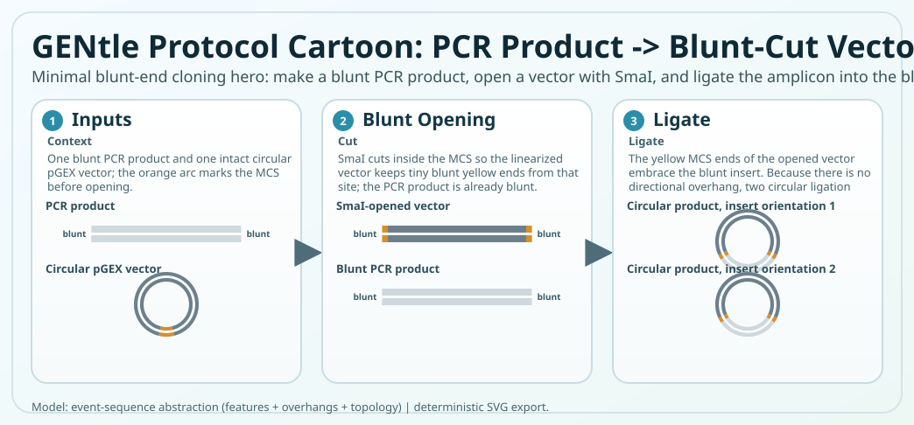

This fully offline baseline amplifies one blunt 250 bp PCR product, opens a
circular pGEX vector at its `SmaI` site, and shows both orientations expected
from non-directional blunt ligation. The insert and vector ends retain
strand/origin cues across the panels so the resulting circular molecules remain
auditable rather than becoming anonymous cartoons.

The replayable workflow is
[`figures/pgex_blunt_pcr_ligation.workflow.json`](figures/pgex_blunt_pcr_ligation.workflow.json).
It uses [`../test_files/pGEX_3X.fa`](../test_files/pGEX_3X.fa) as PCR template
and [`../test_files/pGEX-3X.gb`](../test_files/pGEX-3X.gb) as vector. A matching
lineage export is available as
[`figures/pgex_blunt_pcr_ligation_lineage.svg`](figures/pgex_blunt_pcr_ligation_lineage.svg).

### Known-insert PCR checks

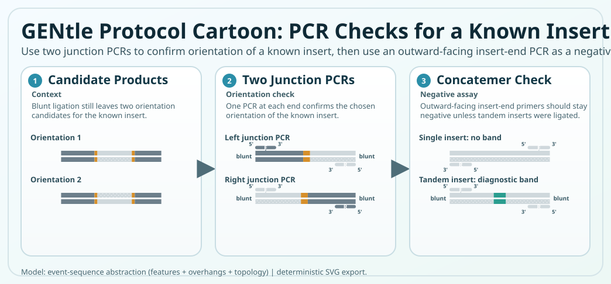

For a known insert, two junction PCRs confirm orientation at the vector-insert
boundaries. An outward-facing insert-end PCR should remain negative unless
multiple inserts were taken up in tandem. This separates build logic from
verification logic while retaining the same source construct and junction
geometry.

### Unknown insert with degenerate primers

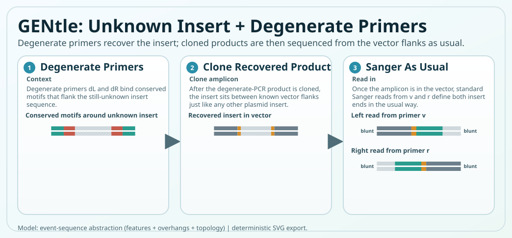

When the insert sequence is initially unknown, degenerate primers can recover a
conserved region. Once that PCR product is cloned, known vector primers on both
sides read into the insert and support ordinary Sanger confirmation.

### Gibson mechanism and provenance

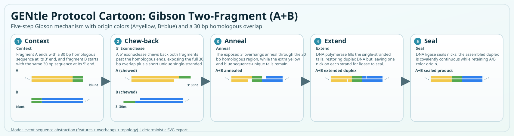

The conceptual strip introduces 5' chew-back, overlap annealing, polymerase
fill-in, and ligase sealing.

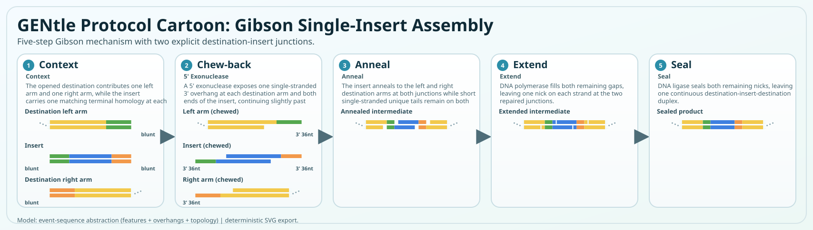

The factual single-insert view is generated from the same shared engine family:
one opened destination, one insert, two explicit junctions, suggested primers,
correct chew-back orientation, annealing, fill-in, and sealing.

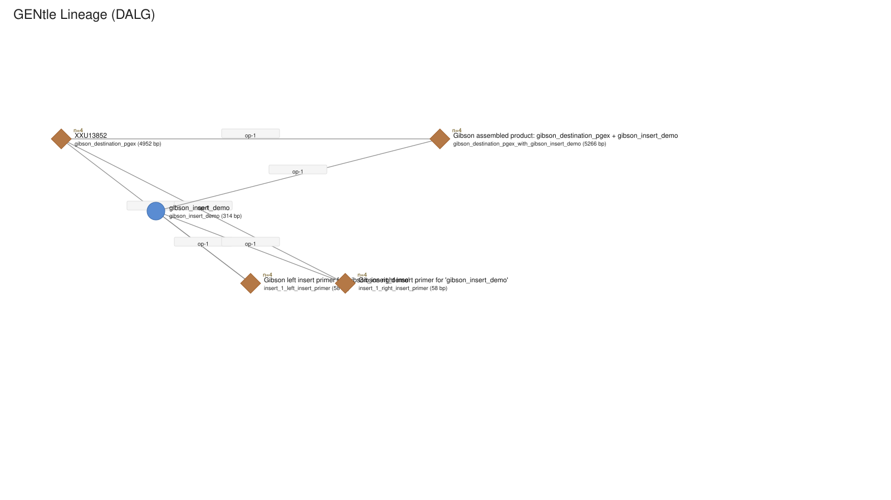

The matching lineage graph shows the operation, two input sequences, two primer
outputs, and assembled product. It is the same graph available after Gibson
apply, not a separate explanatory drawing.

Current limitation: multi-insert execution requires a defined destination
opening. The `existing_termini` path remains the single-fragment handoff.

### Physical placement, gel readout, and fabrication

  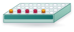

The cloning state can be projected into a linked physical carrier. Storage and
pipetting rack profiles share arrangement semantics but retain their different
physical dimensions and intended use.

  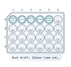

The top-down view exposes coordinates, occupied slots, and experiment labels.
The same arrangement can produce carrier labels, fabrication SVG, and
OpenSCAD sources:

- [`figures/gibson_single_insert_storage_rack.scad`](figures/gibson_single_insert_storage_rack.scad)
- [`figures/gibson_single_insert_pipetting_rack.scad`](figures/gibson_single_insert_pipetting_rack.scad)

  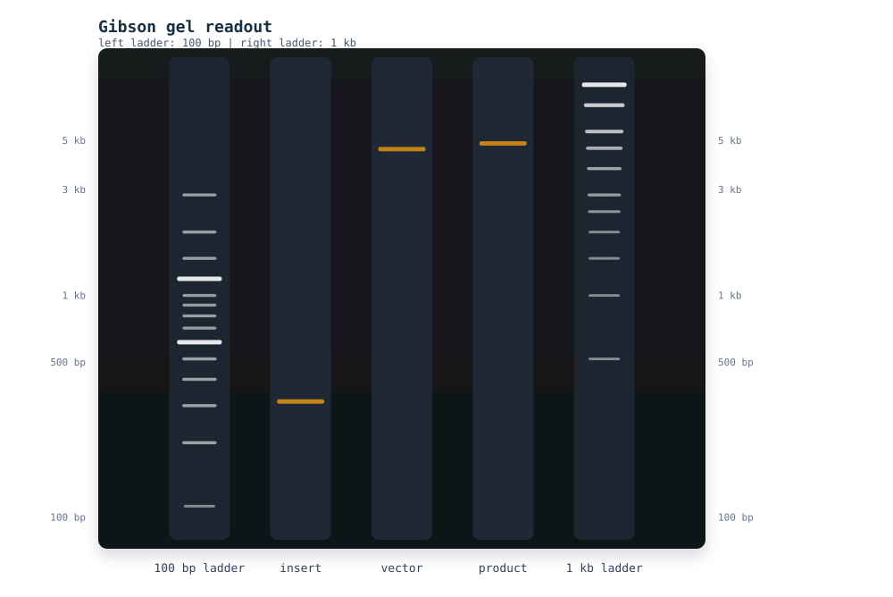

The gel uses a deliberate analytical lane order: insert, vector, and product.
That order need not equal physical rack order, because the arrangement records
the semantic relationship explicitly.

GENtle also supports plate-shaped physical templates. The six-well example
uses culture-well geometry and a clipped orientation corner rather than
pretending the carrier is a PCR rack.

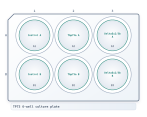

The matching technical source is
[`figures/cell_culture_plate.scad`](figures/cell_culture_plate.scad).

### Overlap-extension substitution PCR

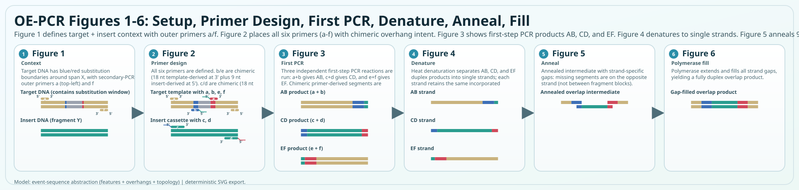

This strip shows template and insert setup, chimeric primer assignment, three
first-step PCR products, denaturation, overlap annealing, and polymerase fill
to one continuous duplex product. It is rendered by the same protocol-cartoon
family as the Gibson views.

## Genome and Regulatory Context

### The same TP73 project through outer and inner agents

<table>
  <tr>
    <th width="50%">Outer agent / headless workflow</th>
    <th width="50%">Inner agent / active GUI project</th>
  </tr>
  <tr>
    <td><a href="figures/tp73_outer_agent_evidence_viewer.svg">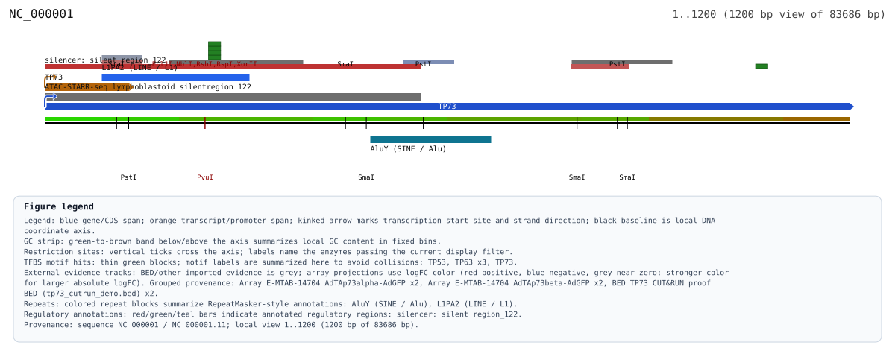</a></td>
    <td><a href="screenshots/tp73_inner_agent_evidence_viewer.png">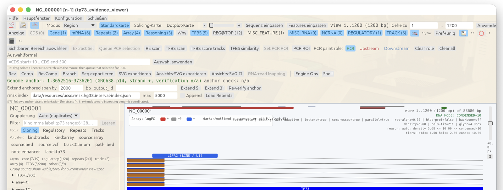</a></td>
  </tr>
</table>

These are two projections of the same deterministic project state over local
bases `1..1200`. An outer agent can invoke the workflow through CLI or MCP and
consume the SVG and structured reports. The inner Agent Assistant operates in
the running application, where the user can inspect the GRCh38.p14 anchor,
feature groups, sequence, and provenance before approving further work. The
current map also preserves transcript-line continuations at viewport edges,
including when the connected exon is outside the visible interval.

### TP73 cDNA and genomic dotplots

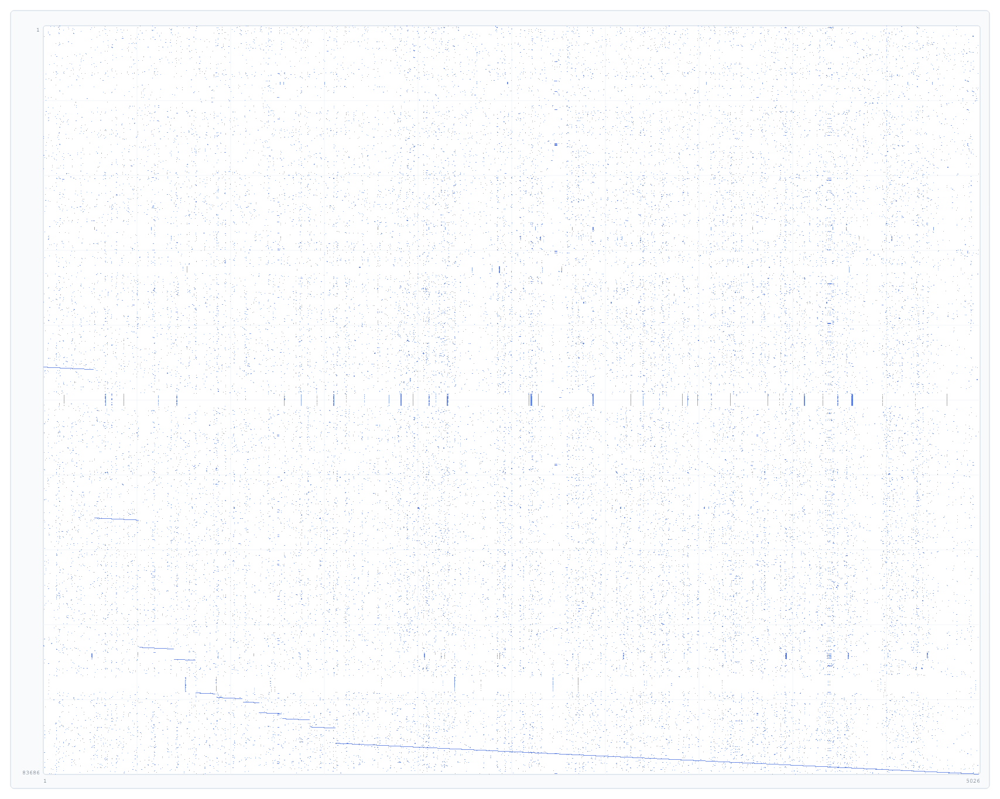

The pairwise baseline aligns a locally derived TP73 cDNA back to the bundled
genomic locus.

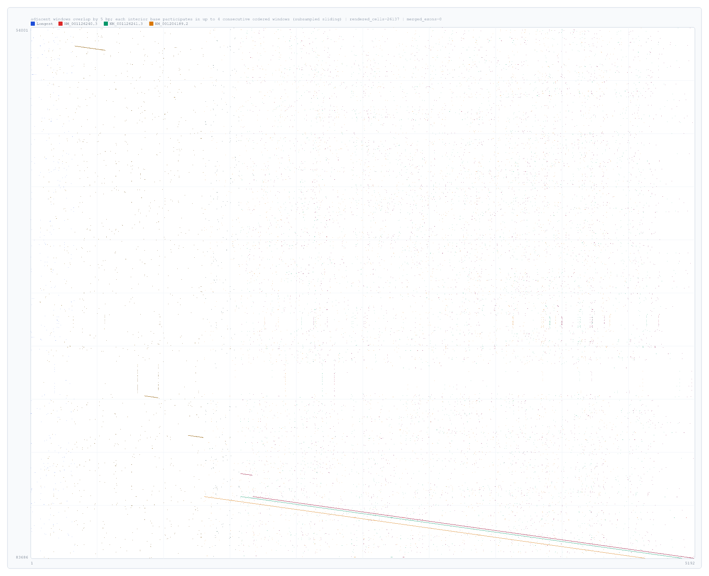

The multi-isoform view overlays curated TP73 transcript variants against one
genomic reference and anchors the shared exon `55034..55276` to one x-position.
Downstream splice losses and retained exon chains can therefore be compared
without losing genomic scale.

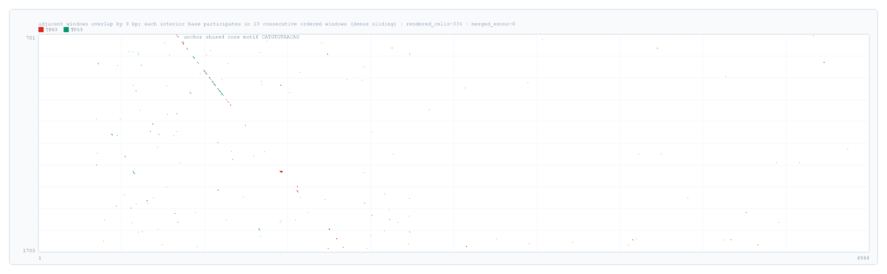

The same engine supports cross-gene comparison. Here TP73 stays on the shared
y-axis while TP63 and TP53 are aligned on x by the conserved motif
`CATGTGTAACAG`.

These views are available through the DNA window's Dotplot mode, the standalone
Dotplot workspace, workflow operations, and headless SVG export.

### TP73 upstream TFBS score tracks

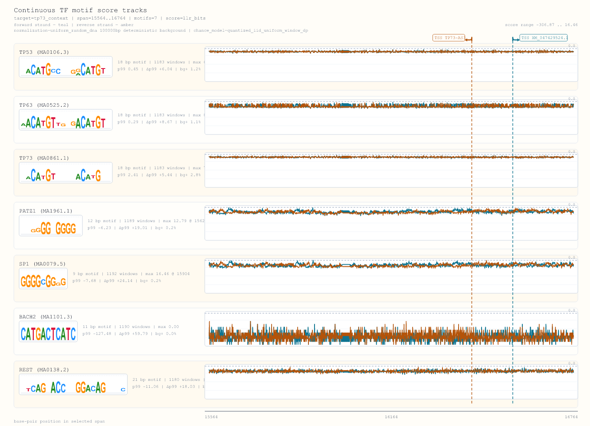

This example uses the bundled TP73 locus and one internal transcript-start
neighborhood, covering 1000 bp upstream and 200 bp downstream. Continuous
scores are shown for TP53, TP63, TP73, PATZ1, SP1, BACH2, and REST. The hooked
arrow marks the transcription start and strand direction.

### TERT promoter score and synchrony views

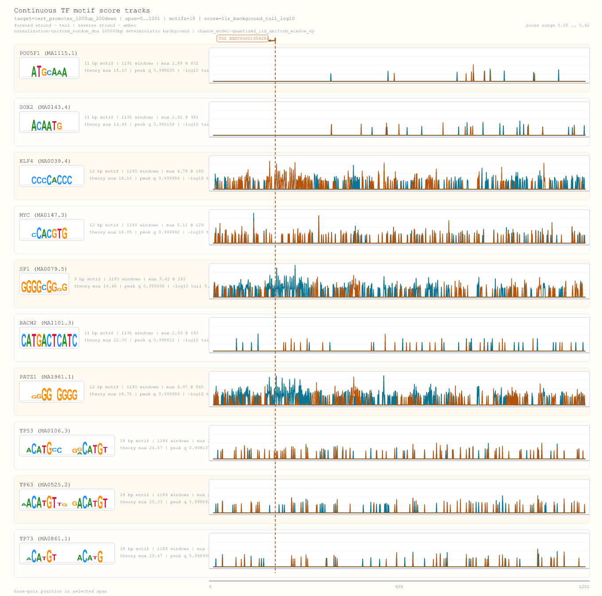

The TERT example is extracted through GENtle's promoter-slice path rather than
pasted into a plotter. It compares requested Yamanaka/stemness and regulatory
factors over one transcription-aligned interval. Tail-calibrated support keeps
strong events prominent without flattening weaker but real events into random
texture.

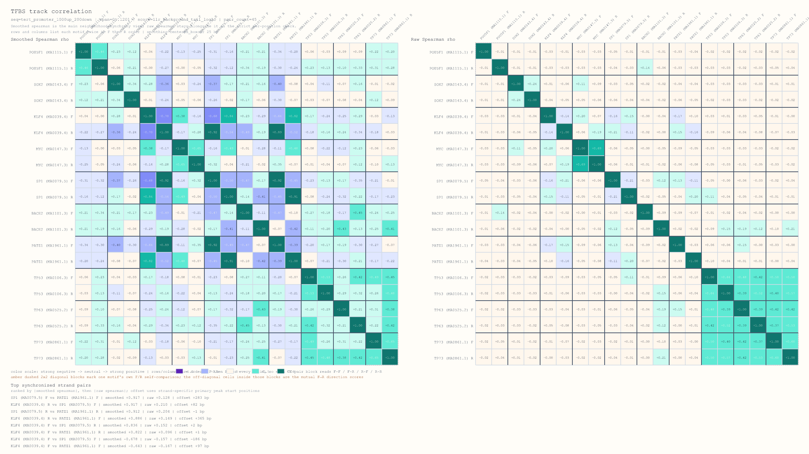

The synchrony view compares exact or smoothed score curves with Pearson or
Spearman statistics. Spearman is the more conservative default here because
the score distributions are non-normal and contain ties introduced by
thresholding. Strand-specific
[forward](figures/tert_upstream_early_coding_llr_background_tail_log10_correlation_spearman_forward_only.png)
and
[reverse](figures/tert_upstream_early_coding_llr_background_tail_log10_correlation_spearman_reverse_only.png)
companions remain available.

### Dynamic promoter workflows

The TP73 and TERT figures are examples, not hard-coded genes. Any prepared
Ensembl-backed gene can provide a promoter slice, and motifs may be requested
by matrix id, common alias, family query, or built-in functional group.

The shared command family supports:

- `resources resolve-tf-query` for aliases and groups
- `genomes extract-promoter` for transcript-aware promoter geometry
- `features tfbs-scan` for discrete sites
- `features tfbs-score-tracks-svg` for continuous score landscapes
- `features tfbs-track-similarity` for ranked curve similarity
- `genomes promoter-tfbs-summary` and `promoter-tfbs-svg` for comparable
  multi-gene panels

See the [CLI manual](cli.md) for exact syntax and the
[figure catalog](figures/README.md) for the committed examples.

### Stateless sequence inspection

Direct DNA questions do not require a persisted project. An inline sequence
can be inspected for restriction sites, TFBS hits, or continuous TFBS score
tracks while still returning portable reports.

- [Offline workflow](examples/workflows/inline_sequence_inspection_stateless_offline.json)
- [GUI/CLI tutorial](tutorial/02-02_stateless_sequence_inspection_gui_cli.md)
- [ClawBio request example](../integrations/clawbio/skills/gentle-cloning/examples/request_workflow_inline_sequence_inspection_stateless.json)

## PCR, Primer, and qPCR Design

### Current PCR family

| Workflow | Current support | Shared engine route |
| --- | --- | --- |
| Standard endpoint PCR | Shipped | `Pcr` |
| Advanced and degenerate PCR | Shipped | `PcrAdvanced` |
| PCR mutagenesis | Shipped | `PcrMutagenesis` |
| Primer-pair design for one ROI | Shipped | `DesignPrimerPairs` |
| Insertion-first anchored pair design | Engine contract shipped; GUI form pending | `DesignInsertionPrimerPairs` |
| Selection-first batch design | Shipped | repeated `DesignPrimerPairs` |
| Probe-bearing qPCR design | Shipped | `DesignQpcrAssays` |
| PCR protocol cartoons | Shipped baseline | `RenderProtocolCartoonSvg` |
| Nested, inverse, long-range, multiplex, and translocation PCR | Planned | future PCR-family extensions |

The objective is one coherent PCR contract family rather than unrelated
specialists with different rules.

### qPCR assay explanation

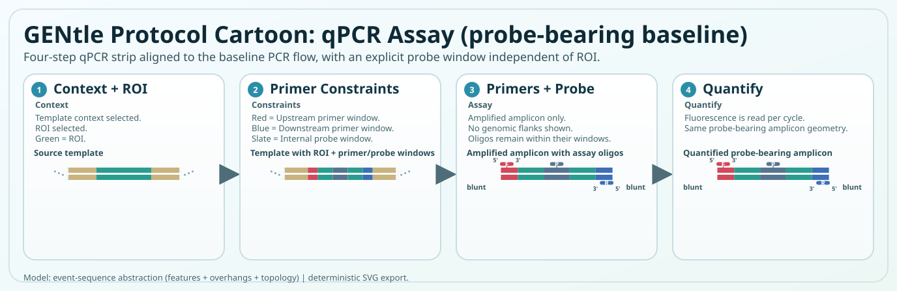

The qPCR strip shows sequence context, separate forward/reverse/probe
constraint windows, accepted oligo placement, amplicon geometry, and the
probe-bearing readout. It is an assay-planning cartoon rather than a detailed
model of fluorescence physics.

The bundled TP73-AS3 example demonstrates two intents:

- a 100 bp cDNA product shared by all three local TP73-AS3 transcripts
- a 147 bp product specific to `NR_187362.1`

Both are evaluated through the shared `primers test-cdna-qpcr` route, including
genomic-equivalent carryover checks. Exact oligo sequences, melting
temperatures, and regeneration commands are recorded in the
[figure catalog](figures/README.md).

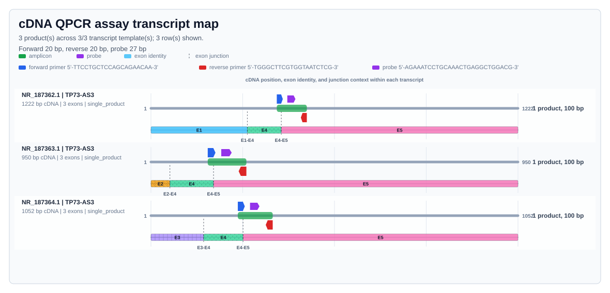

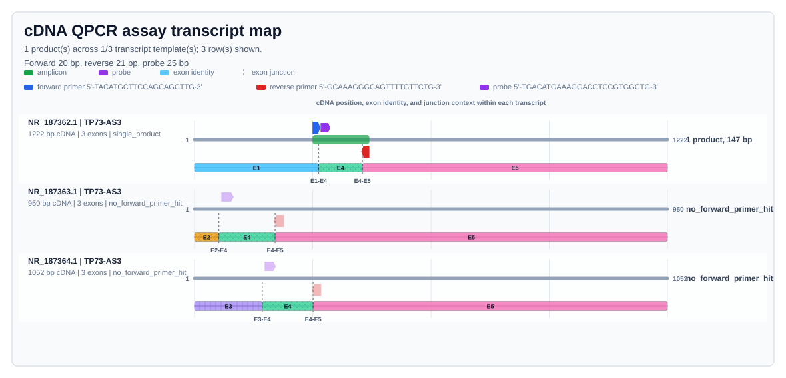

Each transcript row shows exon structure, exon-junction ticks, amplicon,
primer/probe hits, and binding-strand direction.

### TP73 cDNA isoform-selector matrix

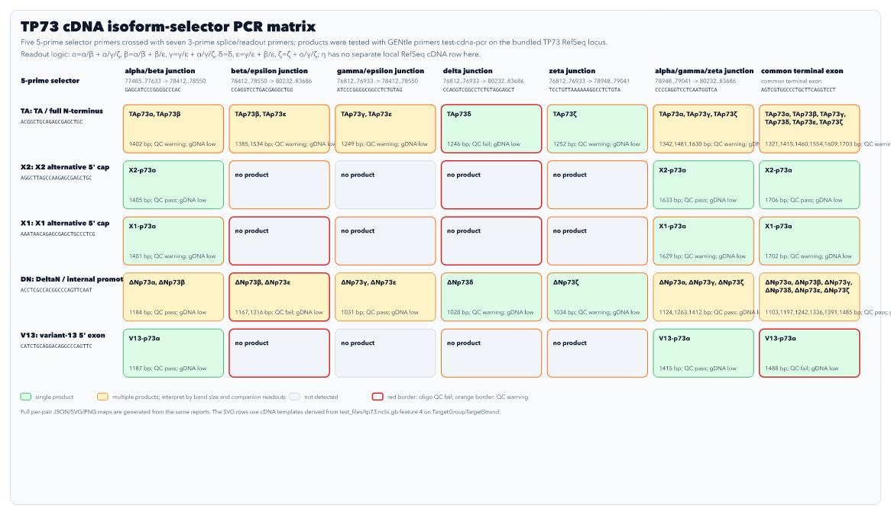

The matrix crosses five 5' selector primers with a local RefSeq 3' splice
readout panel. It is intentionally a panel rather than one supposed magic
primer per isoform. Some terminal forms require paired readouts. Eta remains a
nomenclature note because the bundled local TP73 region does not contain a
separate eta cDNA row.

### TP73 virtual local-knowledge selector gel

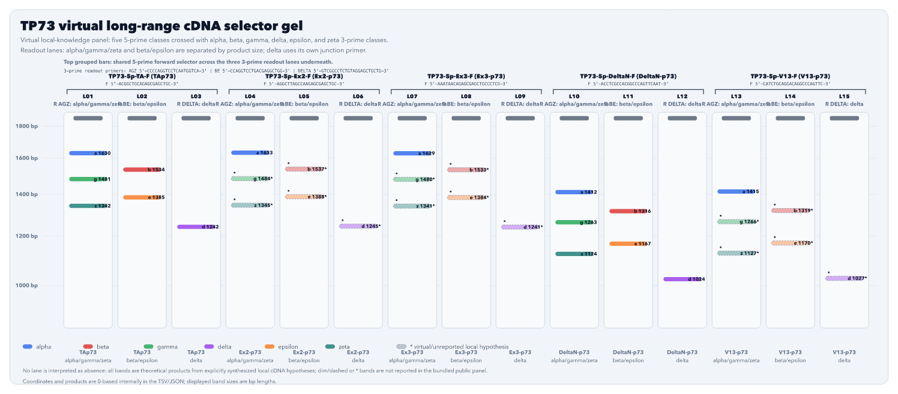

The local virtual panel materializes five 5' classes crossed with alpha, beta,
gamma, delta, epsilon, and zeta 3' classes. Dimmed dashed bands are explicit
local hypotheses not represented in the bundled public transcript panel. The
source sequences and provenance live under
[`../assets/panels/`](../assets/panels/).

## Agent and ClawBio Handoffs

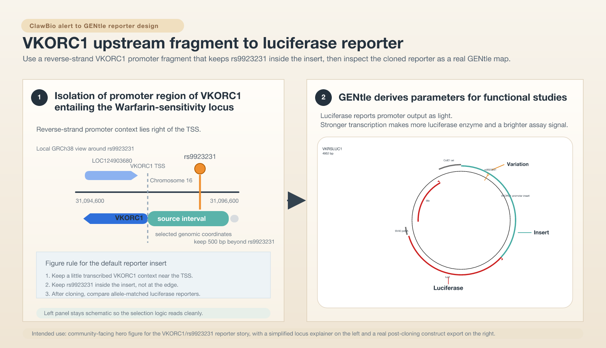

GENtle exposes a general MCP route and a narrower ClawBio/OpenClaw bridge.
MCP clients discover typed tools and capability metadata, while ClawBio uses
`gentle.clawbio_skill_request.v1` and `gentle.clawbio_skill_result.v1` around a
curated skill surface.

The VKORC1/rs9923231 example begins with a pharmacogenomic alert and produces a
reviewable promoter-fragment and luciferase-reporter planning story. The left
panel explains reverse-strand interval selection; the right panel is a real
GENtle circular-map export. Reproducibility files remain available alongside
the promoted PNG rather than being hidden behind the chat presentation.

Useful entry points:

- [ClawBio integration overview](../integrations/clawbio/README.md)
- [Planning request example](../integrations/clawbio/skills/gentle-cloning/examples/request_workflow_vkorc1_planning.json)
- [Generated workflow note](examples/generated/vkorc1_rs9923231_promoter_luciferase_assay_planning.md)
- [Reproducibility bundle](tutorial/reproducibility/vkorc1_rs9923231_promoter_reporter/)
- [Agent interfaces tutorial](tutorial/01-01_agent_interfaces.md)

Agent suggestions do not silently become experiments or purchases. Mutating
operations, external handoffs, and commercial actions retain explicit
confirmation boundaries.

## Guided GUI Tutorials

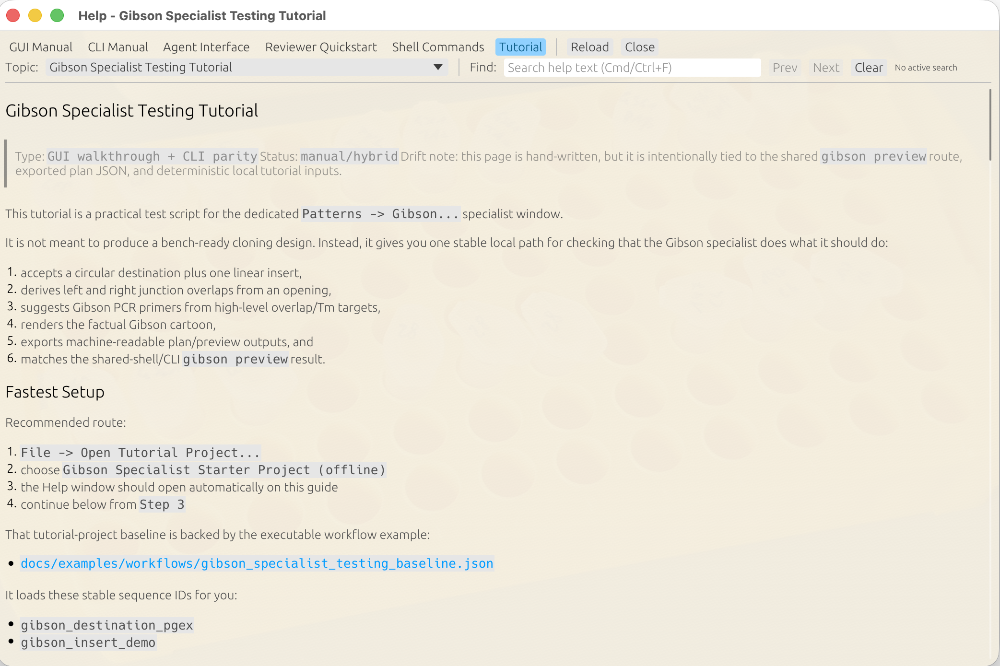

Guided tutorials are available inside the Help window and as versioned
Markdown. The Gibson specialist walkthrough is documented in
[`tutorial/03-05_gibson_specialist_testing_gui.md`](tutorial/03-05_gibson_specialist_testing_gui.md).
Executable tutorial sources remain the higher-confidence reference when exact
reproducibility matters.

## Reproducing the Figures

The [figure catalog](figures/README.md) records:

- whether a figure is a direct engine render, deterministic presentation
  derivative, or maintained explanatory schematic
- source workflows, fixtures, and output paths
- exact CLI commands used to regenerate committed artifacts
- relevant biological and visual limitations

This distinction matters: the figures are derived from shared GENtle state and
versioned tooling, but not every presentation derivative is emitted by one
engine operation alone.

## Related Documentation

- [GUI manual](gui.md)
- [CLI manual](cli.md)
- [Protocol contracts](protocol.md)
- [Architecture](architecture.md)
- [Tutorial hub](tutorial/README.md)
- [Current roadmap](roadmap.md)
