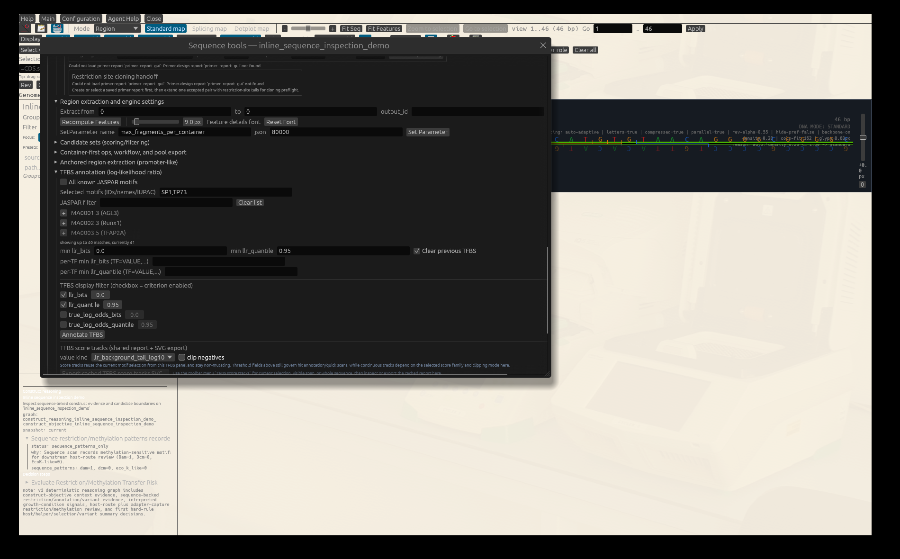

# Stateless Sequence Inspection Tutorial

This is a compact parity tutorial for the new direct sequence-inspection slice:

- restriction-site scanning from pasted or loaded DNA
- TFBS/JASPAR hit scanning from the same sequence
- TFBS score-track rendering from that same non-mutating target

The point is not just that each route works. The point is that the GUI, CLI,
and ClawBio paths all reuse the same shared engine reports instead of keeping
separate quick-scan logic.

## What You Will Test

By the end of this tutorial, you should have verified all of these:

- the DNA-window toolbar `RE scan` populates the cached restriction-site
  inspector
- the DNA-window toolbar `TFBS scan` populates the cached TFBS hit inspector
- the DNA-window toolbar `TFBS score tracks` populates the cached score-track
  inspector and shared SVG export path
- the same biology can be replayed from one state-optional workflow example
- the same workflow can be wrapped for ClawBio without first creating a GENtle
  state file

## Synthetic Input

Local GUI input:

- [`docs/tutorial/inputs/inline_sequence_inspection_demo.fa`](./inputs/inline_sequence_inspection_demo.fa)

Exact sequence:

```text
GAATTCCCGGGATCCGGGCGGGGCGCATGTGTAACAGGGGCGGGGC
```

This fixture is **46 nt** long. GENtle therefore reports the complete
zero-based half-open span as `0..46`.

Why this sequence was chosen:

- `GAATTC` gives one clear `EcoRI` site
- `CCCGGG` gives one clear blunt `SmaI` site
- `GGATCC` gives one clear `BamHI` site
- the GC-rich block plus `CATGTGTAACAG` gives one small TFBS/JASPAR teaching
  window for `SP1` and `TP73`

## GUI Walkthrough

1. Open the tutorial FASTA:
   [`docs/tutorial/inputs/inline_sequence_inspection_demo.fa`](./inputs/inline_sequence_inspection_demo.fa)
2. In the DNA window, press `Sequence tools...`, scroll to `TFBS annotation
   (log-likelihood ratio)`, and expand that panel.
3. Use these settings:
   - `Selected motifs = SP1,TP73`
   - `min llr_quantile = 0.95`
   - leave `min llr_bits` empty
   - in the score-track subsection choose `value kind = llr_background_tail_log10`
   - leave `clip negatives` off



The screenshot is a native Linux/X11 capture from the publication-safe
fixture. It shows the selected motifs, `0.95` LLR quantile, the
`llr_background_tail_log10` score kind, and disabled negative clipping. It is
manual/hybrid teaching evidence, not an automated GUI-acceptance verdict.
4. Use the toolbar menu `RE scan -> whole sequence`.
5. In the same `Sequence tools` window, open `Direct scan inspectors`.
   - Expected result: the `Restriction-site scan` card is no longer empty.
   - You should see at least `EcoRI`, `SmaI`, and `BamHI`.
   - Click one enzyme row.
     - Expected result: GENtle selects that recognition span in the main DNA
       window and recenters the linear viewport onto it.
6. Press `Export cached restriction-site scan JSON...` if you want one portable
   report file to inspect outside the GUI.
7. Use the toolbar menu `TFBS scan -> whole sequence`.
8. Return to `Direct scan inspectors`.
   - Expected result: the `TFBS hit scan` card is no longer empty.
   - You should see at least one `SP1` or `TP73` row in the cached hit table.
   - Click one motif row.
     - Expected result: GENtle selects that TFBS match in the main DNA window
       and recenters the linear viewport onto it.


This result capture shows the three expected restriction sites and three SP1
hits. Both selected motifs were scanned; this short fixture has no retained
TP73 row at the configured threshold, so the tutorial requires an SP1 **or**
TP73 hit rather than inventing one for each motif.
9. Press `Export cached TFBS hit scan JSON...` if you want the raw shared hit
   report.
10. Use the toolbar menu `TFBS score tracks -> whole sequence`.
11. Return to the `TFBS annotation` panel.
   - Intended result: the cached score-track summary shows `2 motif(s)` across
     `0..46`.
12. Press `Export cached TFBS score tracks SVG...` to confirm the shared
    rendering route.

> **Known GUI blocker (2026-10-01):** on exact revision
> `002de21230d5bb7dfbb8d78542e3961774a90628`, the whole-sequence score-track
> toolbar action aborted two fresh Linux/Xvfb GUI processes with a native stack
> overflow after the settings above were applied. The canonical offline
> workflow still completed and produced its JSON/SVG artifacts, so this is a
> GUI-path blocker, not evidence that the shared engine result is wrong. Treat
> steps 10-12 as pending until that GUI defect is fixed and recaptured.

What this should prove:

- `RE scan`, `TFBS scan`, and `TFBS score tracks` are now three siblings in the
  GUI rather than one rich view plus two status-only quick actions
- the hit/score inspectors are driven by shared engine reports, not ad hoc
  window-local logic

## Inner and Outer Agents

The **inner Agent Assistant** can reason about the currently open GENtle
project, but a suggestion is not execution permission. A bounded review prompt
for the working GUI portion is:

> In the current GENtle project, inspect the active 46 bp sequence and propose
> the exact shared commands for a whole-sequence restriction-site scan and an
> SP1/TP73 TFBS hit scan at `min_llr_quantile=0.95`. State the expected report
> fields and do not execute anything until I approve. Do not claim to have seen
> the GUI unless I explicitly approve and provide a screenshot.

An **outer agent** does not inherit this unsaved GUI window. Give it the
canonical workflow or the structured ClawBio request below; require the four
artifacts and the reproducibility receipt. A successful outer replay verifies
the shared operations, not the currently blocked GUI score-track gesture.

## CLI / Workflow Replay

Canonical offline workflow example:

- [`docs/examples/workflows/inline_sequence_inspection_stateless_offline.json`](../examples/workflows/inline_sequence_inspection_stateless_offline.json)

From the repository root:

```sh
cargo run --quiet --bin gentle_cli -- \
  workflow @docs/examples/workflows/inline_sequence_inspection_stateless_offline.json
```

Expected workflow artifacts:

- `artifacts/inline_sequence_inspection.restriction_scan.json`
- `artifacts/inline_sequence_inspection.tfbs_hits.json`
- `artifacts/inline_sequence_inspection.tfbs_score_tracks.json`
- `artifacts/inline_sequence_inspection.tfbs_score_tracks.svg`

This route is intentionally state-optional: it never needs a pre-existing
stored sequence record because every operation uses the shared
`inline_sequence` operand.

## ClawBio Replay

Matching ClawBio request:

- [`integrations/clawbio/skills/gentle-cloning/examples/request_workflow_inline_sequence_inspection_stateless.json`](../../integrations/clawbio/skills/gentle-cloning/examples/request_workflow_inline_sequence_inspection_stateless.json)

Example wrapper invocation from a ClawBio checkout:

```sh
python clawbio.py run gentle-cloning \
  --input skills/gentle-cloning/examples/request_workflow_inline_sequence_inspection_stateless.json \
  --output /tmp/gentle_clawbio_inline_sequence_inspection
```

Expected result:

- the wrapper copies the same four workflow artifacts into the output bundle
- no pre-created GENtle state file is required

## What To Mark As Successful

Mark this tutorial successful if all of these are true:

- the GUI `Direct scan inspectors` section shows a populated restriction-site
  table after `RE scan`
- the same section shows a populated TFBS hit table after `TFBS scan`
- clicking rows in those two tables jumps back to the corresponding sequence
  span in the active DNA window
- the workflow example writes all four expected artifacts
- the ClawBio request can replay that same workflow without requiring a
  separate state-preparation step

Record the GUI portion as **partial / blocked** until the score-track action no
longer aborts and its inspector plus SVG export can be recaptured. Do not turn a
headless workflow pass into a GUI-pass claim.

## Screenshot Evidence

The capture environment, exact binary/input hashes, manual result, and
score-track blocker reproduction are recorded in
[`docs/screenshots/stateless_sequence_inspection_gui/evidence.json`](../screenshots/stateless_sequence_inspection_gui/evidence.json).

## Feedback

If this tutorial is confusing, execution-stale, biologically suspect, or missing a useful figure, please open the matching tutorial issue template and include the context copied from GENtle Help -> Tutorial -> Copy Feedback Context.

- Tutorial title:
- Tutorial/chapter id:
- Step reached:
- Expected vs. actual:
- Interface used: GUI / CLI / Agent Assistant / ClawBio

Paste the Tutorial feedback context here:

```text

```
