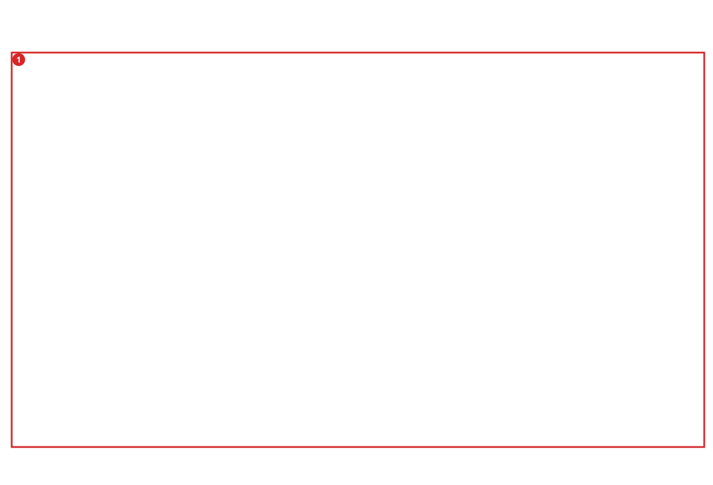
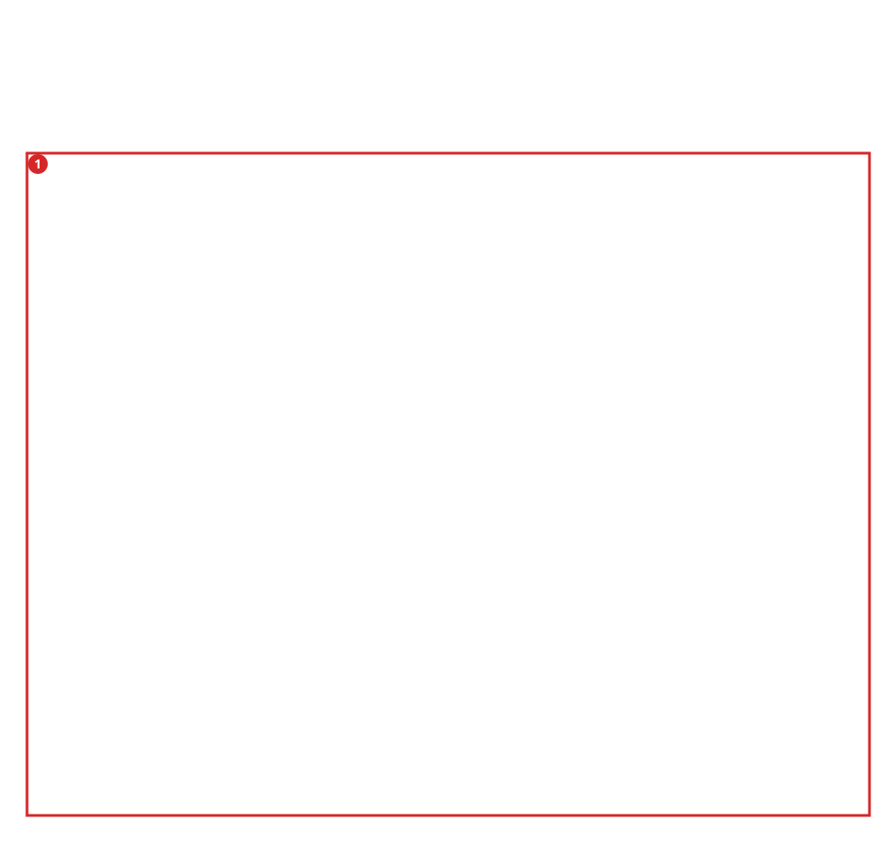

# Design Primer Pairs to Distinguish Real Human PATZ1 Transcripts

**Question:** Which PATZ1 transcript structures can primer pairs distinguish,
and what agrees or differs between Ensembl and NCBI RefSeq?

**Status:** authentic public reference data; live GUI screenshots and human
scientific sign-off pending. This replaces the old synthetic PATZ1-like teaching
example. That tiny fixture remains a regression test, not PATZ1 biology.

The pinned Ensembl 116 snapshot has **13 transcript records**, including
noncoding and retained-intron models. RefSeq supplies **four versioned mRNAs**.
These are different annotation universes, not necessarily 17 distinct expressed
isoforms. Read the [source provenance](../../test_files/fixtures/transcript_assay_panel/patz1_reference/README.md).

## Prepare Once, Offline

Use GUI and CLI binaries from the same revision. From the repository root:

```bash
python3 scripts/prepare_real_patz1_tutorial.py \
  --gentle-cli /absolute/path/to/gentle_cli \
  --output-dir /absolute/path/to/new-patz1-study
```

Choose a new directory whose parent exists. The helper checks pinned input
hashes, calls GENtle to prepare the locus/comparison and plans a study. It does
not download, run an agent, design primers, run BLAST or order anything.
It creates `patz1.gentle.json`, `locus.report.json`, a source-comparison SVG,
an annotation source list, a primer-design operation and an unexecuted study.
**No synthetic array or expression evidence is attached.**

The authentic locus is GRCh38 `NC_000022.11:31325804..31346605`, minus-strand.
GENtle imports it gene-oriented: local coordinates increase while genomic
coordinates decrease. Do not reverse this sequence a second time.

## 1. Inspect Ensembl, RefSeq and Shared Structures

Open `patz1.gentle.json` with **File > Open Project**. Open the PATZ1 DNA,
select its gene feature, and choose **Open Splicing Window**. In **Locus figure**,
use **Load report JSON...** for `locus.report.json`.

The interactive inspector offers **All sources**, **Ensembl chains**,
**RefSeq chains**, **Shared exon chains** and **Source-only chains**. Blue means
Ensembl, orange RefSeq, green an exact full exon chain supplied by both.
Hover for every exact versioned transcript accession. A shared exon or TSS
alone does not make two transcripts the same. CDS/phase alternatives retain
separate rows: thin boxes are exons, thick boxes annotated CDS.

Expand **Annotation versions and hashes**. GenBank format is not an independent
third annotation vote. A missing provider is **unassessed**, not evidence of
source-specific absence. For another gene, use **Composition inputs > Ensembl /
RefSeq source list**, supplying the same [hash-bound contract](../transcript_source_presentation.md).
Assembly/reference agreement is required; no coordinate liftover is guessed.

Now return to the ordinary DNA map and expand **Source annotation comparison
(read-only)**. The **Structure** tab has the same section. Both reuse the loaded
report, so there is no second annotation import. Change to **Shared exon chains**
in either panel and confirm the other uses that filter too. Click a row to
highlight it; double-click to fit its span. Pan/zoom the DNA map and observe the
comparison lanes following its local coordinates. **Fit comparison locus**
restores the full span. Select a loaded transcript to highlight exact full-chain
matches; one common exon alone must not match. Hover for source versions and
hashes. None of these actions adds the RefSeq records to the design targets.

**Checkpoint G1:** retain 13 Ensembl and four RefSeq records. Inspect the exact
shared chain of `ENST00000266269.10` / `NM_014323.3`, then inspect the differing
starts and chains in Locus figure, the DNA map and Structure. Display filtering
must not silently change design scope: the project still has 13 actionable
Ensembl transcripts, not 17 merged design targets.


*G1 — Public Ensembl 116/RefSeq source comparison on the minus-strand PATZ1
locus. This display context does not add RefSeq records to the 13-transcript
design universe.*

## 2. Define the Primer-Design Question

In **Structure**, choose **Design all-transcript panel**, or select **Transcript
panels** in PCR Designer. Here the design universe is **all 13 loaded Ensembl
transcripts**. RefSeq comparison records are not silently included or claimed
as assessed targets. Whole-reference screening comes later.

Choose **Minimal discrimination panel**, rather than merely **One per class**:
detecting every class does not necessarily separate every pair of classes.
The supplied exploratory request uses explicit **best-effort** coverage, so
unresolved distinctions remain visible. Choose strict `require_all` when an
incomplete result must stop the workflow.

Review `primer-discrimination.operation.json`: SYBR, 80-250 bp products,
20-26 nt primers, 58-64 C Tm bounds, 30-70% GC and at most 3 C Tm difference.
These are visible starting constraints, not experimentally validated conditions.
The request explicitly leaves cDNA synthesis **unspecified** for review; choose
the method used in your experiment before adopting a design. Do not silently omit difficult or noncoding
transcripts to obtain a green result.

**Checkpoint G2:** scope, objective and partial-result policy are explicit.
Identical mature cDNAs cannot be separated by sequence-based primers. Annotation
records and exact-cDNA classes have different denominators.



*G2 — The saved request keeps the 13 Ensembl records/classes, constraints and
best-effort policy visible. RefSeq remains comparison evidence, not an inferred
design target.*

## 3. Design and Inspect Both Primers

After reviewing the saved operation, the equivalent terminal route is:

```bash
gentle_cli --state /absolute/path/to/new-patz1-study/patz1.gentle.json primers preflight --backend primer3
gentle_cli --state /absolute/path/to/new-patz1-study/patz1.gentle.json \
  primers design-transcript-assay-panel \
  @/absolute/path/to/new-patz1-study/primer-discrimination.operation.json \
  --backend primer3
```

This explicit backend requires Primer3. Separate CLI processes do not inherit
unsaved GUI state: save/close the GUI project before a CLI write and reopen it
afterwards. Do not concurrently overwrite the same project. A failed/partial
design is evidence to inspect, not permission to silently relax constraints.

Review `patz1_real_discrimination` in **Transcript panels**, or from **Gene assay
study > Persisted panels on this source sequence**. For every selected pair,
read both sequences 5' to 3' and the transcript-by-assay product matrix.
Footprints use **zero-based half-open** mature-cDNA coordinates, not genomic
minus-strand coordinates. Tm is not the recommended reaction annealing temperature.

**Checkpoint G3:** inspect coverage and every unresolved class-pair distinction.
Shared products, explicit no-product predictions and **Not assessed** cells are
different. Retained-intron products can resemble genomic DNA; annotations do
not establish absence of contamination or expression in your sample.


*G3 — The exact replay selected seven assays for 13 mature-cDNA classes. Both
5'-to-3' primer sequences and the product matrix are retained; the warning
keeps nine unresolved class-pair distinctions from looking complete.*

The development replay with Primer3 2.6.1 and the pinned inputs returned **seven
primer pairs**, covering all **13 exact mature-cDNA classes**, but leaving
**nine class pairs unresolved**. The report correctly says `partial`: detecting
every class is not the same as distinguishing every class. Retain your own
revision, backend version and report, rather than treating these counts as a
future pass threshold. No reference-wide BLAST confirmation was run for that
replay, and the four RefSeq records were comparison context, not design targets.

## 4. Review the Gene-Informed Study Separately

From Splicing Expert choose **Gene assay study...**, then **Open study plan...**
and `study.plan.json`. Missing expression and specificity remain explicit.
The separately executed discrimination request above is comparison context,
not falsely attributed to this unexecuted study workflow.

To change a requirement, open `study.request.json`, give it a new plan ID,
normalize/review it and plan into a new directory. Inspect the exact ordered
operations before separately approving execution. This is **not a promised
successful study** for arbitrary requirements.

**Checkpoint G4:** planning and execution have independent approvals. Changed
requests invalidate review. Never invent expression effects or thresholds.


*G4 — This is a separately loaded, read-only study plan. It records absent
expression/assayability evidence and does not attribute the exploratory panel
to an unexecuted study.*

## 5. Confirm Specificity Before Using Candidates

Choose **Build experimental handoff**. Missing genomic and whole-transcriptome
checks must block readiness. Use authentic prepared GRCh38 and transcriptome
resources; displaying four RefSeq records is not a reference-wide off-target
search. Follow the [specificity continuation](04-07_transcript_assay_followup_gui_cli.md#5-optional-external-specificity-plan-is-not-pass).

**Checkpoint G5:** inspect intended/unintended products, genomic contamination
risks and the exact assessed universe. Candidates are **not order approval**.
Efficiency, melt curves and biological interpretation still require laboratory review.



*G5 — Local mature-cDNA predictions are not genomic or whole-transcriptome
specificity. The GUI says “Specificity not assessed”; no readiness or ordering
claim follows from the displayed candidate.*

## 6. Export an Honest Dossier

In **Gene assay study > Canonical dossier export**, load
`publication.request.json` and choose a new output directory. It binds the
original **Pending** study; it does not claim that the exploratory panel executed
that study. Completed publications need their real digest-bound handoffs.

**Checkpoint G6:** distinguish authentic reference data, annotation agreement,
candidate design and pending validation. No automatic ordering is offered.


*G6 — The canonical dossier route remains pending and requires an explicit
publication request and new output directory. Opening the GUI does not turn the
exploratory panel into a completed study.*

## Help and Review

GUI Shell: `ui open tutorial-guide gene_assay_study_gui`.

### Complete the prepared-project workflow with the inner agent

The one-time checkout preparation above remains explicit: the inner agent has no
operating-system shell and must not invent an output directory or claim that
opening this guide created the project. After opening the prepared
`patz1.gentle.json`, open **File > Agent Assistant...** and ask:

> Open the real PATZ1 tutorial, compare Ensembl/RefSeq, and help me complete
> G1-G6 for the prepared project. Design against the declared 13 Ensembl
> transcripts, retain unresolved cases and specificity gaps, and do not execute
> a next step without review.

The agent should proceed iteratively rather than propose guessed identifiers:

1. Open this guide and inspect `state-summary`; query the prepared sequence with
   `features query ... --include-qualifiers`.
2. Run the reviewed query, inspect its local result, and choose **Use reviewed
   result in next prompt**. Review the draft before sending it. The agent can
   then use the actual zero-based PATZ1 feature ID.
3. Let it propose `inspect-feature-expert` and `ui open splicing-expert` using
   that ID. Loading `locus.report.json` into **Locus figure** is currently the
   one explicitly described file-picker action; the agent must ask what is
   visible afterward and must not claim it observed G1. The DNA-map and
   Structure comparison sections reuse that report.
4. Before design, run the proposed read-only
   `primers inspect-transcript-assay-feasibility
   @.../primer-discrimination.operation.json`, then disclose that reviewed
   result the same way. Approve the exact saved operation only after confirming
   the 13-transcript universe, minimal-discrimination objective, best-effort
   policy, unspecified cDNA synthesis and constraints.
5. After Primer3 design, run
   `primers show-transcript-assay-panel patz1_real_discrimination` and use the
   reviewed-result handoff. Require the agent to account for every covered class
   and unresolved class pair from the supplied JSON, not the historical counts
   in this tutorial. Continue through the plan, specificity handoff and dossier
   as separate review/approval stages; missing authentic reference resources or
   validations remain blockers, not inferred passes.

A receipt hash alone does not reveal feature rows, primer pairs or coverage.
The reviewed-result action is an explicit disclosure to the selected provider;
it sends nothing until **Ask Agent** is clicked, rejects oversized JSON rather
than truncating it, and does not approve the next command. This workflow is not
a tested provider conversation or delegated scientific approval.

No comparison: load the enriched report, not just DNA. Hash/assembly mismatch:
check original inputs, do not edit hashes to force acceptance. No shared rows:
inspect complete chains and source availability; shared exons may still exist.
No panel: preparation intentionally does not execute primer design.

[Glen's screenshot request](../gene_assay_study_glen_acceptance.md) covers G1-G6
on these public references. Retain raw captures and exact-revision receipts;
human biological sign-off remains separate.
