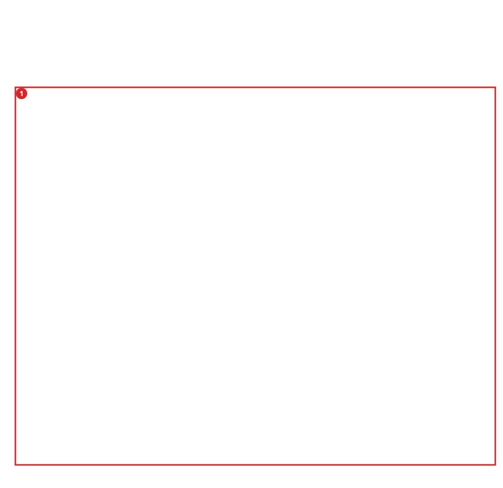

# Find Primer-Pair Markers for PATZ1 Isoforms

> Type: `gui_cli_walkthrough`
> Status: `manual/hybrid`

**Question:** Which PATZ1 transcript structures could a small panel of primer
pairs distinguish, and which would still give the same predicted pattern?

The aim is to find useful candidate **markers**, not to promise a unique assay
for every transcript. You will compare annotations, design a SYBR-qPCR panel,
and read its transcript-by-assay matrix. In the retained example, seven pairs
cover 13 cDNA classes but leave nine class pairs unresolved. Learning to explain
that partial result is the main outcome of this tutorial.

**Shortest learning path:** prepare the project, compare the sources in G1,
review the design scope in G2, then design and interpret the panel in G3.
G4-G6 are optional continuations for study planning, readiness review and report
export. They are not additional primer-design steps. Stopping after G3 is fine
for learning; using the candidates experimentally still requires follow-up.

### Before You Start

- Use an existing GENtle GUI and `gentle_cli` from the same revision, a checkout
  containing the public fixtures, and Python 3. The preparation runs offline.
- Install/configure `primer3_core` for the design step. Without it you can
  inspect the prepared annotations and retained screenshots, but have not
  reproduced the primer design. BLAST is not needed for this walkthrough.
- Know how to open/save a project and read a forward/reverse primer pair.
  [Simple PCR](04-01_simple_pcr_selection_gui.md) is a useful first exercise.

The pinned Ensembl 116 snapshot has **13 transcript records**, including
noncoding and retained-intron models. RefSeq supplies **four versioned mRNAs**
for comparison, not four extra design targets. Here a *cDNA class* groups
annotation records with byte-identical mature cDNA sequences; one *assay* is
one forward/reverse primer pair. Several records can belong to one class, and
one pair can amplify more than one class.

This exercise is annotation-led. It does **not** impose a five-pair budget,
prioritize UniProt-linked coding transcripts, or use differential-expression,
Clariom probe or junction evidence. Those would be separate, explicitly bound
study requirements, not conclusions to infer from these public annotations.

**Evidence status:** G1-G6 are retained Linux GUI captures from `3c1c32bc`
(2026-09-20), not a replay of your current binary. Human scientific approval,
reference-wide specificity and laboratory validation remain pending.
See the [source provenance](../../test_files/fixtures/transcript_assay_panel/patz1_reference/README.md)
and [recorded GUI acceptance](../gene_assay_study_glen_acceptance_20260920.md).

## Prepare Once, Offline

Use GUI and CLI binaries from the same revision. From the repository root:

```bash
python3 scripts/prepare_real_patz1_tutorial.py \
  --gentle-cli "/absolute/path/to/gentle_cli" \
  --output-dir "/absolute/path/to/new-patz1-study"
```

Choose a new directory whose parent exists. The helper checks pinned input
hashes, calls GENtle to prepare the locus/comparison and plans a study. It does
not download, run an agent, design primers, run BLAST or order anything.
The terminal examples use Bash syntax; substitute your actual paths and use
`gentle_cli.exe` on Windows. The remaining terminal examples assume
`gentle_cli` is on `PATH` and run from the newly prepared project directory:

```bash
cd "/absolute/path/to/new-patz1-study"
```

| Prepared file | Use it for |
| --- | --- |
| `patz1.gentle.json` | Open the project with the 13 Ensembl design transcripts. |
| `locus.report.json` | Load the Ensembl/RefSeq comparison in Splicing Expert. |
| `patz1-source-comparison.svg` | Inspect the same prepared comparison without a GUI. |
| `primer-discrimination.operation.json` | Review the exact exploratory primer request before design. |
| `study.plan.json` and `study.request.json` | Inspect the separate, unexecuted study in G4. |
| `publication.request.json` | Export that study as **Pending**, not as a completed assay study. |

`primer-panel.json` does not exist yet: it is an output of the saved design
operation, not of preparation. Keep `preparation-receipt.json` with the project.
**No synthetic array or expression evidence is attached.**

The authentic locus is GRCh38 `NC_000022.11:31325804..31346605`, minus-strand.
GENtle imports it gene-oriented: local coordinates increase while genomic
coordinates decrease. Do not reverse this sequence a second time.

The inner agent cannot run this Python helper. Prepare/open the project first.
Inside GENtle's GUI Shell, omit `gentle_cli --state patz1.gentle.json` from the
commands below: the shell operates on the open project. Use absolute paths for
request/output files there; its working directory need not be this directory.

## 1. Inspect Ensembl, RefSeq and Shared Structures

Open `patz1.gentle.json` with **File > Open Project**. Open the PATZ1 DNA,
select its gene feature, and choose **Open Splicing Window**. In **Locus figure**,
use **Load report JSON...** for `locus.report.json`.

The interactive inspector offers **All sources**, **Ensembl chains**,
**RefSeq chains**, **Shared exon chains** and **Source-only chains**. Blue means
Ensembl, orange RefSeq, green an exact full exon chain supplied by both.
Hover for every exact versioned transcript accession. A shared exon or TSS
alone does not make two transcripts the same. CDS/phase alternatives retain
separate rows: thin boxes are exons, thick boxes annotated CDS.

Expand **Annotation versions and hashes**. GenBank format is not an independent
third annotation vote. A missing provider is **unassessed**, not evidence of
source-specific absence. For another gene, use **Composition inputs > Ensembl /
RefSeq source list**, supplying the same [hash-bound contract](../transcript_source_presentation.md).
Assembly/reference agreement is required; no coordinate liftover is guessed.

Now return to the ordinary DNA map and expand **Source annotation comparison
(read-only)**. The **Structure** tab has the same section. Both reuse the loaded
report, so there is no second annotation import. Change to **Shared exon chains**
in either panel and confirm the other uses that filter too. Click a row to
highlight it; double-click to fit its span. Pan/zoom the DNA map and observe the
comparison lanes following its local coordinates. **Fit comparison locus**
restores the full span. Select a loaded transcript to highlight exact full-chain
matches; one common exon alone must not match. Hover for source versions and
hashes. None of these actions adds the RefSeq records to the design targets.

**Checkpoint G1:** retain 13 Ensembl and four RefSeq records. Inspect the exact
shared chain of `ENST00000266269.10` / `NM_014323.3`, then inspect the differing
starts and chains in Locus figure, the DNA map and Structure. Display filtering
must not silently change design scope: the project still has 13 actionable
Ensembl transcripts, not 17 merged design targets.

**Ask the inner agent:** "Help me compare the loaded Ensembl and RefSeq PATZ1
annotations. Keep the 13 design transcripts separate from the four comparison
records. Ask me to load `locus.report.json` if needed; do not claim to see the
comparison without evidence I have shared."

**Without the GUI:** open `patz1-source-comparison.svg` from preparation and
inspect `locus.report.json`. This is an exported comparison, not proof that a
native window was opened or that a transcript is expressed in your sample.


*G1 — Public Ensembl 116/RefSeq source comparison on the minus-strand PATZ1
locus. This display context does not add RefSeq records to the 13-transcript
design universe.*

## 2. Define the Primer-Design Question

In **Structure**, choose **Design all-transcript panel**, or select **Transcript
panels** in PCR Designer. Here the design universe is **all 13 loaded Ensembl
transcripts**. RefSeq comparison records are not silently included or claimed
as assessed targets. Whole-reference screening comes later.

Choose **Minimal discrimination panel**, rather than merely **One per cDNA class**:
detecting every class does not necessarily separate every pair of classes.
The supplied exploratory request uses explicit **best-effort** coverage, so
unresolved distinctions remain visible. Choose strict `require_all` when an
incomplete result must stop the workflow.

Review `primer-discrimination.operation.json`. For the GUI route, opening
**Design all-transcript panel** supplies the source feature; it does **not**
load this JSON's settings. Match the controls deliberately:

| Control | This exercise |
| --- | --- |
| Assay mode / Objective | **SYBR qPCR** / **Minimal discrimination panel** |
| Experimental tier / Coverage | **Isoform discrimination** / **Best effort** |
| cDNA synthesis | **Unspecified**, a declared gap rather than an assumed method |
| Amplicon min / max | 80 / 250 bp |
| Assays / class | 4; this is not a four-pair whole-panel budget |
| Max mismatches / 3' exact bases | 0 / 8 |
| Max Tm delta | 3 C |
| Primer constraints, forward and reverse | 20-26 nt; Tm 58-64 C; GC 0.30-0.70 |
| report id / annotation release | `patz1_real_discrimination` / `Ensembl 116` |

Leave junction evidence empty and **Pre-approve informative partial fallback**
off. This is already an explicitly best-effort request, not an automatically
approved second experiment. These constraints are teaching inputs, not validated
laboratory conditions. Choose your actual cDNA synthesis method before adopting
a design; do not silently omit difficult or noncoding transcripts to turn a
partial result into a green one.

**Checkpoint G2:** scope, objective and partial-result policy are explicit.
Identical mature cDNAs cannot be separated by sequence-based primers. Annotation
records and exact-cDNA classes have different denominators.

**Ask the inner agent:** "Review the saved request I supply. Explain the target
classes, constraints and best-effort policy, including missing evidence. Draft
the design command for approval; do not run it yet."


*G2 — The saved request keeps the 13 Ensembl records/classes, constraints and
best-effort policy visible. RefSeq remains comparison evidence, not an inferred
design target.*

## 3. Design and Inspect Both Primers

**GUI route:** under **Primer backend and Primer3 preflight**, select `primer3`,
set the executable if needed, choose **Apply Primer Backend**, then **Probe
Primer3**. After reviewing the G2 controls, choose **Design transcript panel**.
Wait for completion, enter `patz1_real_discrimination` as the report ID, and
choose **Show report_id** if the report is not already visible. Save the project;
**Export report_id...** can retain a separate JSON copy.

**Terminal route:** to execute the exact helper-produced JSON rather than
re-enter its controls, run:

```bash
gentle_cli --state patz1.gentle.json primers preflight --backend primer3
gentle_cli --state patz1.gentle.json \
  primers design-transcript-assay-panel \
  "@primer-discrimination.operation.json" \
  --backend primer3
gentle_cli --state patz1.gentle.json \
  primers show-transcript-assay-panel patz1_real_discrimination
```

Choose one design route, not both on the same report. A successful Primer3
preflight proves executable availability, not assay feasibility or specificity.
`inspect-transcript-assay-feasibility` currently accepts only endpoint RT-PCR
with the `isoform_end_matrix` objective; it is **not a preflight for this SYBR
request**. Do not switch the biological objective merely to make that command run.

Separate CLI processes do not inherit unsaved GUI state: save/close the GUI
project before a CLI write and reopen it afterwards. Do not concurrently
overwrite the same project. A failed/partial design is evidence to inspect,
not permission to silently relax constraints.

Review `patz1_real_discrimination` in **Transcript panels**, or from **Gene assay
study > Persisted panels on this source sequence**. For every selected pair,
read both sequences 5' to 3' and the transcript-by-assay product matrix.
Footprints use **zero-based half-open** mature-cDNA coordinates, not genomic
minus-strand coordinates. Tm is not the recommended reaction annealing temperature.

### Read the Matrix, Not Just the Primer Score

Read one row across to see how a transcript responds to the selected assays.
Read one column down to see which transcripts share that assay's product.

| Cell | Interpretation |
| --- | --- |
| `155 bp` (for example) | One predicted product of that length in this cDNA. |
| `multi ...` | Multiple predicted products; not one clean single-product result. |
| `-` | No product predicted under the recorded matching rules. |
| `Not assessed` | No assessment is present; do not read it as no product. |

In retained image G3, `ENST00000351933` and `ENST00000405309` have the same
displayed product pattern across A1-A7. Both are covered, but this panel does not
tell them apart. Find an unresolved pair in **your** report and make the same
comparison. Nine unresolved *pairs of classes* does not mean nine missing
transcripts, nor nine failed primers.

Each row describes an individual annotation-derived cDNA, not a measured mixture
from a sample. A useful structural marker need not identify one transcript
uniquely, and a predicted pattern does not establish quantitative resolution of
co-expressed isoforms.

**Checkpoint G3:** inspect coverage and every unresolved class-pair distinction.
Shared products, explicit no-product predictions and **Not assessed** cells are
different. Retained-intron products can resemble genomic DNA; annotations do
not establish absence of contamination or expression in your sample.

**Ask the inner agent:** "Inspect the saved `patz1_real_discrimination` report
I share. Identify one unresolved class pair, explain its shared pattern, and
distinguish coverage, discrimination and specificity. Do not infer expression
or claim that these oligos are ready to order."


*G3 — The exact replay selected seven assays for 13 mature-cDNA classes. Both
5'-to-3' primer sequences and the product matrix are retained; the warning
keeps nine unresolved class-pair distinctions from looking complete.*

The recorded replay with Primer3 2.6.1 selected **seven primer pairs from 37
candidates**, covering all **13 exact mature-cDNA classes**, but leaving
**nine class pairs unresolved**. The report correctly says `partial`: detecting
every class is not the same as distinguishing every class. Retain your own
revision, backend version and report, rather than treating these counts as a
future pass threshold. No reference-wide BLAST confirmation was run for that
replay, and the four RefSeq records were comparison context, not design targets.

**Core exercise complete:** you should now be able to name the assessed target
set, show both oligos for a pair, and explain why this panel is partial. Keep
the saved project/report even if you stop here. The following steps demonstrate
how to preserve those limitations in planning and communication.

## 4. Optional: Separate an Exploratory Panel from a Study Plan

From Splicing Expert choose **Gene assay study...**, then **Open study plan...**
and `study.plan.json`. Missing expression and specificity remain explicit.
The separately executed discrimination request above is comparison context,
not falsely attributed to this unexecuted study workflow.

The two routes answer different questions: `primer-discrimination.operation.json`
asks for one exploratory panel; `study.plan.json` describes a proposed series
of operations and the evidence available to plan them. A panel existing in the
same project does not prove those planned operations ran.

To change a requirement, open `study.request.json`, give it a new plan ID,
normalize/review it and plan into a new directory. Inspect the exact ordered
operations before separately approving execution. This is **not a promised
successful study** for arbitrary requirements.

**Checkpoint G4:** planning and execution have independent approvals. Changed
requests invalidate review. Never invent expression effects or thresholds.

**CLI/file equivalent:** inspect the already prepared `study.plan.json` and
`study.workflow.json`; do not execute the workflow just to inspect it.

**Ask the inner agent:** "Explain the supplied plan and its missing evidence.
Do not attribute my exploratory panel to this unexecuted study or treat loading
the plan as approval to execute it."


*G4 — This is a separately loaded, read-only study plan. It records absent
expression/assayability evidence and does not attribute the exploratory panel
to an unexecuted study.*

## 5. Optional: See Why the Candidates Are Not Order-Ready

Return to **Transcript panels**, show the saved report, and choose **Build
experimental handoff**. Read the per-pair gate outcomes and blockers. This
builds readiness cards; it does not launch a reference-wide BLAST search.
The terminal equivalent is:

```bash
gentle_cli --state patz1.gentle.json \
  primers experimental-handoff patz1_real_discrimination --path experimental_handoff.json
```

Missing genomic and whole-transcriptome checks must block readiness. A cDNA
product assessment against the selected annotations is not the same check.
For subsequent specificity work, use authentic prepared GRCh38 and transcriptome
resources; displaying four RefSeq records is not a reference-wide off-target
search. The [specificity continuation](04-07_transcript_assay_followup_gui_cli.md#5-optional-external-specificity-plan-is-not-pass)
explains the contract using synthetic examples, not a specificity pass for PATZ1.

**Checkpoint G5:** inspect intended/unintended products, genomic contamination
risks and the exact assessed universe. Candidates are **not order approval**.
Efficiency, melt curves and biological interpretation still require laboratory review.

**Ask the inner agent:** "Summarize the handoff's actual failed or unassessed
gates. Separate local cDNA predictions from whole-reference checks. Propose the
missing follow-up for review, without changing the policy to obtain a pass."



*G5 — Local mature-cDNA predictions are not genomic or whole-transcriptome
specificity. The GUI says “Specificity not assessed”; no readiness or ordering
claim follows from the displayed candidate.*

## 6. Optional: Export a Dossier That Keeps the Study Pending

In **Gene assay study > Canonical dossier export**, enter the absolute path to
`publication.request.json` and a new absolute output directory whose parent
exists. Choose **Export declared dossier**. Start with HTML; **Also PDF** needs
an installed Chromium-compatible browser. The terminal equivalent, from the
prepared directory, is:

```bash
gentle_cli --state patz1.gentle.json \
  primers publish-gene-isoform-study publication.request.json pending-dossier
```

Use a new destination for each export. Add `--pdf` for a printable companion
once browser availability is established. The request binds the original
**Pending** study; it does not include the exploratory panel or G5 handoff
merely because those files exist beside it. Completed publications need their
real digest-bound handoffs. Open the exported index and confirm that the study
is pending and incomplete, rather than mistaking a successful export for a
successful experiment.

**Checkpoint G6:** distinguish authentic reference data, annotation agreement,
candidate design and pending validation. No automatic ordering is offered.

**Ask the inner agent:** "Draft an export of the supplied pending publication
request to a new directory I choose. Explain what it includes and omits; do not
relabel it resolved or invent a handoff. Wait for my approval before writing files."


*G6 — The retained capture shows the export controls before a request and output
directory were supplied. It is not a screenshot of a completed export. Opening
the GUI does not turn the exploratory panel into a completed study.*

## Help and Review

GUI Shell: `ui open tutorial-guide gene_assay_study_gui`.

### Complete the prepared-project workflow with the inner agent

The one-time checkout preparation above remains explicit: the inner agent has no
operating-system shell and must not invent an output directory or claim that
opening this guide created the project. After opening the prepared
`patz1.gentle.json`, open **File > Agent Assistant...** and ask:

> Open the real PATZ1 tutorial, compare Ensembl/RefSeq, and help me complete
> G1-G6 for the prepared project. Design against the declared 13 Ensembl
> transcripts, retain unresolved cases and specificity gaps, and do not execute
> a next step without review.

The agent should proceed iteratively rather than propose guessed identifiers:

1. Open this guide and inspect `state-summary`; query the prepared sequence with
   `features query ... --include-qualifiers`.
2. Run the reviewed query, inspect its local result, and choose **Use reviewed
   result in next prompt**. Review the draft before sending it. The agent can
   then use the actual zero-based PATZ1 feature ID.
3. Let it propose `inspect-feature-expert` and `ui open splicing-expert` using
   that ID. Loading `locus.report.json` into **Locus figure** is currently the
   one explicitly described file-picker action; the agent must ask what is
   visible afterward and must not claim it observed G1. The DNA-map and
   Structure comparison sections reuse that report.
4. Share the saved design JSON for review and run
   `primers preflight --backend primer3` to check the executable. Approve the
   exact saved operation only after confirming the 13-transcript universe,
   minimal-discrimination objective, best-effort policy, unspecified cDNA
   synthesis and constraints. The endpoint-only feasibility command described
   in G3 is not applicable here.
5. After Primer3 design, run
   `primers show-transcript-assay-panel patz1_real_discrimination` and use the
   reviewed-result handoff. Require the agent to account for every covered class
   and unresolved class pair from the supplied JSON, not the historical counts
   in this tutorial. Continue through the plan, specificity handoff and dossier
   as separate review/approval stages; missing authentic reference resources or
   validations remain blockers, not inferred passes.

A receipt hash alone does not reveal feature rows, primer pairs or coverage.
The reviewed-result action is an explicit disclosure to the selected provider;
it sends nothing until **Ask Agent** is clicked, rejects oversized JSON rather
than truncating it, and does not approve the next command. This workflow is not
a tested provider conversation or delegated scientific approval.

### If You Get Stuck

| Symptom | Check next |
| --- | --- |
| No source comparison | Load `locus.report.json`, not just the DNA project. |
| Hash/assembly mismatch | Restore/check the pinned inputs; never edit hashes to force acceptance. |
| No shared rows | Inspect complete chains and source availability; shared exons may still exist. |
| No panel after preparation | Preparation only writes a request. Run the reviewed G3 design. |
| Panel missing after a CLI run | Reopen the saved project and use **List reports** / **Show report_id**. |
| Primer3 unavailable | Check its executable path and probe result; do not silently substitute a backend and claim the same replay. |
| Partial result | Read uncovered classes and unresolved pairs; do not hide difficult targets. |
| Export cannot make a completed study | That is expected for the supplied pending request. A report file is not an executed study. |

The [G1-G6 evidence ledger](../screenshots/gene_assay_study_gui/evidence.json)
binds the original captures and results by hash. No new GUI replay or live
inner-agent conversation is claimed by this text revision. Codex source review
(2026-09-30) covers instructions, current controls and result interpretation;
human biological sign-off and current-candidate native acceptance remain separate.
