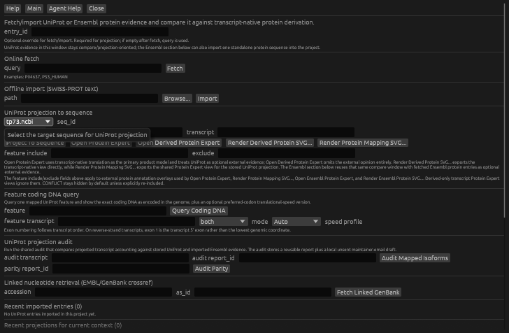
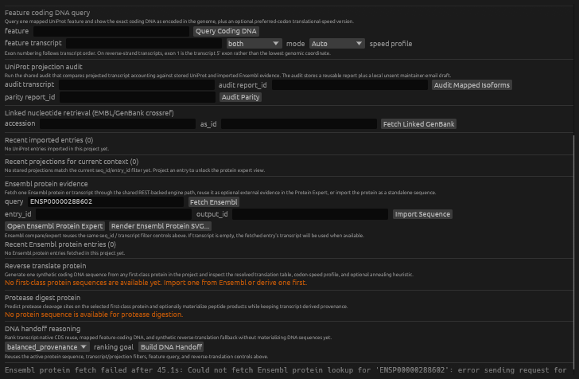

# Reverse Translate an Imported Protein and Audit the Result

> Type: `GUI walkthrough`
> Status: `manual/hybrid`
> Drift note: this page is hand-written, but it is intentionally tied to the
> current `Protein Evidence...` specialist, the persisted reverse-translation
> report, and the lineage reopen flow.

> **Review status (2026-10-01): blocked at online provider fetch.** Early
> coordinate automation accidentally clicked the upper generic UniProt `Fetch`
> button with the ENSP id and exposed a separate default-worker stack overflow.
> This review gives that ingress worker the established 16 MiB GENtle worker
> stack. The corrected `Fetch Ensembl` action then remained alive but failed
> after 45.1 seconds while sending its lookup request. Direct Ensembl REST
> requests returned the lookup and 806-aa protein; GENtle CLI fetches returned
> transient HTTP 500 errors and later exceeded a 30-second smoke limit. The
> focused reverse-translation engine test also passes with a 16 MiB stack.
> No successful end-to-end provider/import/reverse-translation acceptance is
> claimed.

This tutorial is meant as the second **manual check** for the newer
protein-design path.

It verifies that GENtle can:

- import one first-class protein sequence
- reverse translate it into coding DNA
- show resolved translation-table and speed-profile provenance
- record the result in lineage so the created coding sequence remains easy to
  reopen and audit

## What You Will Check

By the end of this walkthrough, you should be able to confirm that:

- Ensembl protein fetch/import still works in `Protein Evidence...`
- reverse translation creates one coding DNA sequence
- the result panel states the resolved translation-table and speed-profile
  provenance clearly
- the created coding sequence is linked back into lineage as a reverse-
  translation analysis artifact

## Inputs

Start from the same local project fixture as the first tutorial:

- [`test_files/tp73.project.gentle.json`](../../test_files/tp73.project.gentle.json)

This walkthrough also requires online access for the Ensembl fetch step.

Known live smoke-check identifier already used in this codebase:

- `ENSP00000288602`

This identifier resolves in Ensembl 116 to the 806-aa translation of
`ENST00000288602` (`BRAF-201`, gene `ENSG00000157764`). The TP73 fixture is only
a disposable project container here; the fetched protein is not TP73 evidence.

## Fastest Path

1. open [`test_files/tp73.project.gentle.json`](../../test_files/tp73.project.gentle.json)
2. open `File -> Protein Evidence...`
3. in **Online fetch**, enter `ENSP00000288602` and click `Fetch Ensembl`
4. import it as a first-class protein sequence
5. in `Reverse translate protein`, select that protein
6. choose a speed profile / speed mark and run reverse translation
7. inspect the provenance panel
8. confirm the created coding DNA opens and is represented in lineage

## Step-by-Step

### Step 1: Open the Tutorial Project

GUI:

1. `File -> Open Project...`
2. choose [`test_files/tp73.project.gentle.json`](../../test_files/tp73.project.gentle.json)

This gives us a stable project container for the imported protein and the
reverse-translated coding DNA.

### Step 2: Fetch One Ensembl Protein Entry

GUI:

1. `File -> Protein Evidence...`
2. in **Online fetch**, enter `ENSP00000288602`
3. click `Fetch Ensembl`



The screenshot is a real 728×476 Linux/X11 capture of the current dialog before
the network mutation. Scroll down to the dedicated Ensembl subsection; do not
use the upper generic UniProt `Fetch` button for an ENSP identifier.



The second capture shows the correctly targeted action and its 45.1-second
provider error. Both images are orientation/failure evidence, not proof that
fetch/import or reverse translation completed. See the adjacent screenshot
README for hashes and the exact blocker.

Expected result:

- the recent Ensembl table gains one entry
- the selected-entry panel shows transcript/gene/species context

Current review result: **not reached** because the correctly targeted Ensembl
request failed after 45.1 seconds. Stop here if you reproduce that failure; do
not infer a stored entry from the public REST response alone.

### Step 3: Import the Protein Sequence

GUI:

1. keep `entry_id = ENSP00000288602`
2. optionally set `output_id = ensp00000288602_protein`
3. click `Import Sequence`

Expected result:

- one first-class protein sequence is created in the project
- that sequence becomes available in the `Reverse translate protein` dropdown

### Step 4: Reverse Translate the Protein

In the same `Protein Evidence...` window:

1. in `Reverse translate protein`, choose the imported protein sequence
2. optional settings for a meaningful manual check:
   - `output_id = ensp00000288602_coding`
   - `speed profile = Human`
   - `speed mark = Slow`
   - leave `translation table` empty unless you want to test an explicit override
   - `target anneal Tm = 58.0`
   - `window bp = 9`
3. click `Reverse Translate`

Expected result:

- one coding DNA sequence is created and opened
- the result panel below the controls refreshes immediately

### Step 5: Inspect the Provenance Panel

Stay in `Protein Evidence...` and inspect the reverse-translation result block.

Manual checks:

- `output` shows the created coding-sequence id
- `length` shows the protein-to-coding length relationship
- `translation table` shows:
  - resolved table
  - label
  - source
  - organism/organelle context when available
- `speed profile` shows:
  - requested profile
  - resolved profile
  - source
  - reference species
- `speed mark` and `anneal heuristic` reflect the options you chose
- inline `Coding DNA` text is present

### Step 6: Inspect the Created Coding Sequence

Expected result after reverse translation:

- a new sequence window opens on the created coding DNA
- this is an ordinary sequence window, not only transient dialog state

Manual checks:

- the product is DNA, not protein
- the created sequence id matches the reverse-translation result panel
- the sequence remains available after closing and reopening the specialist

### Step 7: Verify Lineage Recording

GUI:

1. return to the main project window
2. open the lineage `Table` view if needed
3. find the new reverse-translation analysis row
4. use `Open Coding Sequence`

Expected result:

- the reverse-translation analysis appears in lineage as its own artifact row
- `Open Coding Sequence` reopens the same created coding DNA product

This is the key audit check: the reverse translation should not live only as
one ephemeral dialog result.

## What This Tutorial Is Actually Checking

This walkthrough is the practical sanity pass for:

- imported first-class proteins
- reverse translation into coding DNA
- visible provenance for translation-table and translation-speed resolution
- lineage persistence of the reverse-translation artifact

## Shared-Engine Commands (After the Blocker Is Fixed)

Use a new disposable state, not the tutorial fixture itself:

```bash
GENTLE_TUTORIAL_STATE=/tmp/gentle-protein-reverse-translation.state.json
gentle_cli --state "$GENTLE_TUTORIAL_STATE" shell 'ensembl-protein fetch ENSP00000288602 --entry-id ensp00000288602_evidence'
gentle_cli --state "$GENTLE_TUTORIAL_STATE" shell 'ensembl-protein show ensp00000288602_evidence'
gentle_cli --state "$GENTLE_TUTORIAL_STATE" shell 'ensembl-protein import-sequence ensp00000288602_evidence --output-id ensp00000288602_protein'
gentle_cli --state "$GENTLE_TUTORIAL_STATE" shell 'reverse-translate run ensp00000288602_protein --output-id ensp00000288602_coding --speed-profile human --speed-mark slow --target-anneal-tm-c 58 --anneal-window-bp 9'
gentle_cli --state "$GENTLE_TUTORIAL_STATE" shell 'reverse-translate list-reports ensp00000288602_protein'
```

These direct shell invocations are explicit mutations. A public Ensembl reply
does not approve project mutation, and a successful reverse translation is a
synthetic synonymous design—not evidence that the coding DNA will express well.

## Ask the Inner Agent

Paste this into GENtle's Agent Assistant:

> Review tutorial 06.01 for `ENSP00000288602`. First propose only the read-only
> Ensembl identity check and report that it is BRAF-201, not TP73. Then propose
> separate `ensembl-protein fetch`, `import-sequence`, and `reverse-translate
> run` commands using the exact ids in this tutorial. Explain every state or
> network mutation, wait for approval before each mutating phase, and stop if
> the provider response or stored entry disagrees. After execution, show the
> persisted reverse-translation report and lineage link; do not claim expression
> optimization from codon-speed heuristics.

## Ask an Outer Agent (ClawBio/OpenClaw)

An outer agent does not inherit the open GUI project. Give it a new disposable
state and the five commands above:

> In a new disposable GENtle state, assess tutorial 06.01 without touching my
> open GUI project. Preflight `ENSP00000288602` as BRAF-201/806 aa, then propose
> the exact fetch, import and reverse-translation mutations separately. Preserve
> structured results and the persisted report. Do not approve on my behalf; if
> fetch fails, times out or differs from the bound identity, return the blocker
> and leave later phases unexecuted.

The outer agent can validate the shared engine/CLI mapping without GENtle's
inner model. It cannot replace native GUI acceptance: the provider path must
still succeed and the import/reverse-translation/lineage sequence must be
retested in the actual `Protein Evidence` window.

## Checkpoints

- Ensembl fetch succeeds for `ENSP00000288602` and binds BRAF-201/806 aa.
- Importing that entry creates one first-class protein sequence.
- Reverse translation creates one coding DNA sequence and opens it.
- The provenance panel states the resolved translation-table and
  speed-profile/source/reference-species story clearly.
- Lineage shows a reverse-translation analysis row that can reopen the created
  coding sequence.

## If Something Looks Wrong

Report these separately because they indicate different failure classes:

1. `Ensembl fetch/import fails`
   - likely online/provider or import-path problem
2. `Reverse translation creates DNA but provenance panel is incomplete`
   - likely GUI/report presentation drift
3. `Reverse translation looks fine in the dialog but not in lineage`
   - likely persisted-report or lineage-materialization regression
4. `Open Coding Sequence from lineage points to the wrong product`
   - likely analysis-artifact linkage regression
5. `Fetch Ensembl reports a provider/send failure and creates no recent entry`
   - current Linux/X11 blocker; no downstream GUI result is valid
6. `The upper generic Fetch button stack-overflows on a network error`
   - separate worker-stack defect found by the review and fixed with an explicit
     16 MiB ingress-worker stack; it is not the Ensembl button

## Related Tutorial

If you want to validate the transcript-native expert path without depending on
online protein fetch/import, use:

- [`docs/tutorial/06-02_protein_transcript_native_expert_gui.md`](./06-02_protein_transcript_native_expert_gui.md)

## Feedback

If this tutorial is confusing, execution-stale, biologically suspect, or missing a useful figure, please open the matching tutorial issue template and include the context copied from GENtle Help -> Tutorial -> Copy Feedback Context.

- Tutorial title:
- Tutorial/chapter id:
- Step reached:
- Expected vs. actual:
- Interface used: GUI / CLI / Agent Assistant / ClawBio

Paste the Tutorial feedback context here:

```text

```
