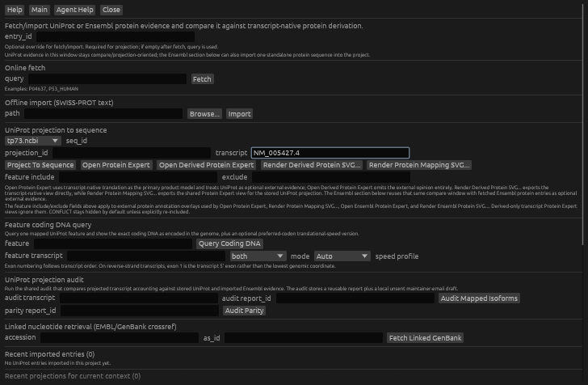
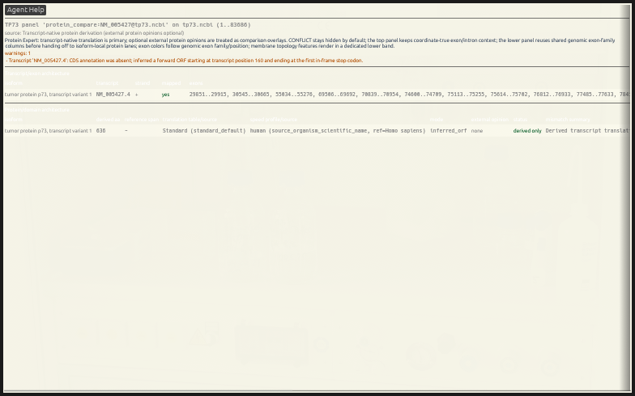

# Transcript-Native Protein Expert Sanity Check

> Type: `GUI walkthrough`
> Status: `manual/hybrid`
> Drift note: this page is hand-written, but it is intentionally tied to the
> current `Protein Evidence...` specialist and the shared transcript-first
> Protein Expert route.

> **Review status (2026-10-01): expert path accepted; native save dialog not
> accepted headlessly.** The bundled project produces 15 transcript-native
> rows without external evidence. Filtering to `NM_005427.4` produces one
> 636-aa `derived only` row with translation table `Standard
> (standard_default)`, a human speed-profile hint derived from the organism,
> and an explicit warning that no CDS annotation was present and a forward ORF
> was inferred. The shared-shell SVG export succeeds. In the isolated Xvfb
> check, `Render Derived Protein SVG...` did not open a visible save dialog, so
> native dialog/export acceptance is not claimed.

This tutorial is meant as a **manual check** after the recent transcript-native
protein work.

It verifies the path that does **not** depend on UniProt or Ensembl as the
source of truth:

- open one local project sequence
- derive transcript/product geometry on demand
- inspect the shared Protein Expert
- export the same view as SVG through the shared engine route

## What You Will Check

By the end of this walkthrough, you should be able to confirm that:

- `Protein Evidence...` can open the derived Protein Expert without any stored
  external protein evidence
- transcript-native product rows appear and stay readable
- the details grid exposes translation table, translation-speed provenance, and
  derivation mode
- a single-transcript filter resolves deterministically
- the shared-engine derived-only SVG export succeeds from the same expert
  payload

## Local Input

Use the bundled local project fixture:

- [`test_files/tp73.project.gentle.json`](../../test_files/tp73.project.gentle.json)

Why this file:

- it is already a project, not only a bare sequence file
- it contains one stable sequence id, `tp73.ncbi`
- it avoids online dependencies for the transcript-native check

Fixture note:

- provenance for this historical TP73 fixture is tracked in
  [`test_files/README.md`](../../test_files/README.md)

## Fastest Path

1. open [`test_files/tp73.project.gentle.json`](../../test_files/tp73.project.gentle.json)
2. open `File -> Protein Evidence...`
3. in `Project entry to sequence`, choose `seq_id = tp73.ncbi`
4. leave `transcript` empty for the first pass
5. click `Open Derived Protein Expert`
6. confirm the expert opens with 15 transcript-native product rows and 15 ORF
   inference warnings
7. return to `Protein Evidence...`
8. enter `NM_005427.4` as `transcript` and reopen the derived expert
9. confirm exactly one 636-aa row remains
10. optionally click `Render Derived Protein SVG...`; if no native save dialog
    appears, record that host/dialog blocker and use the shared-shell export
    below

## Step-by-Step

### Step 1: Open the Tutorial Project

GUI:

1. `File -> Open Project...`
2. choose [`test_files/tp73.project.gentle.json`](../../test_files/tp73.project.gentle.json)

Expected result:

- the project opens with sequence `tp73.ncbi`
- the project/lineage window is available for later inspection if needed

### Step 2: Open Protein Evidence

GUI:

1. `File -> Protein Evidence...`
2. in `Project entry to sequence`, choose `tp73.ncbi`
3. leave `transcript` empty for the first pass



The screenshot is a real 728×476 Linux/X11 capture. It shows the local
`tp73.ncbi` target and the exact filter used for the second pass; the first pass
uses the same controls with the transcript field empty.

Why this matters:

- this path checks transcript-native derivation directly from the current
  sequence state
- it does not require a stored UniProt projection or Ensembl entry

### Step 3: Open the Derived Protein Expert

GUI:

1. click `Open Derived Protein Expert`

Expected result:

- one Protein Expert window opens
- 15 transcript/product rows are populated from transcript-native derivation
- no external-protein fetch/import step is required

Manual checks:

- the view should not be empty
- transcript/product rows should appear without needing a UniProt projection id
- the details grid should expose fields such as:
  - derived protein length
  - translation table / source
  - translation-speed profile / source / reference species
  - derivation mode

All 15 current rows warn that CDS annotation is absent and that a forward ORF
was inferred. Treat these as computed candidates, not curated protein truth.

### Step 4: Narrow to One Transcript (Optional but Useful)

Back in `Protein Evidence...`:

1. fill the `transcript` field with `NM_005427.4`
2. click `Open Derived Protein Expert` again

Expected result:

- the same expert route opens again, narrowed to exactly one 636-aa transcript
- its panel id is `protein_compare:NM_005427@tp73.ncbi`
- translation is `Standard (standard_default)` and the speed-profile hint is
  `human (source_organism_scientific_name, ref=Homo sapiens)`
- status is `derived only`, mode is `inferred_orf`, and external opinion is
  `none`
- this helps verify that transcript filtering still affects the transcript-first
  expert deterministically



This real 784×490 capture is the filtered native result. The title now follows
the displayed transcript family (`TP73`) rather than an unrelated gene-like
annotation elsewhere in the same locus.

### Step 5: Export the Derived Protein SVG

Back in `Protein Evidence...`:

1. click `Render Derived Protein SVG...`
2. save the SVG somewhere convenient, for example `/tmp/tp73_derived_protein.svg`

Expected result:

- export completes without needing UniProt or Ensembl evidence
- the SVG reflects the same transcript-native expert view rather than a
  separate rendering model

Current native-GUI review result: **not accepted in Xvfb** because clicking the
button did not expose a visible save dialog or create an artifact. The
shared-shell export below produced a 1200×880 SVG and reported no changed or
created sequence ids. Keep these two acceptance claims separate.

## What This Tutorial Is Actually Checking

This tutorial checks the **derived-only** protein path that should remain valid
when external evidence is absent or intentionally ignored.

It is the right manual check today for:

- transcript-native CDS/protein derivation in the GUI
- transcript filtering into the Protein Expert
- derived-only Protein Expert SVG export

It does **not** yet check first-class protein-sequence materialization from a
GUI button, because that direct GUI action is not the main user-facing path at
this moment.

## Shared-Engine Commands

The same expert/export surface is shared with CLI/shell:

```bash
GENTLE_TUTORIAL_PROJECT=test_files/tp73.project.gentle.json
GENTLE_TUTORIAL_SVG=/tmp/tp73_derived_protein_nm_005427_4.svg
gentle_cli --project "$GENTLE_TUTORIAL_PROJECT" shell 'inspect-feature-expert tp73.ncbi protein-comparison'
gentle_cli --project "$GENTLE_TUTORIAL_PROJECT" shell 'inspect-feature-expert tp73.ncbi protein-comparison --transcript NM_005427.4'
gentle_cli --project "$GENTLE_TUTORIAL_PROJECT" shell "render-feature-expert-svg tp73.ncbi protein-comparison --transcript NM_005427.4 $GENTLE_TUTORIAL_SVG"
```

The two inspect commands are read-only. The render command writes the declared
SVG path but does not change or create project sequences. Review an existing
output path before approving an overwrite.

## Ask the Inner Agent

Paste this into GENtle's Agent Assistant while the tutorial project is open:

> Inspect the transcript-native Protein Expert for `tp73.ncbi` without external
> UniProt or Ensembl evidence. First report the unfiltered row and warning
> counts. Then inspect only `NM_005427.4` and report protein length, translation
> table and source, speed-profile hint and source, derivation mode, external
> opinion and warnings. Do not describe an inferred ORF as curated CDS. Propose
> the SVG export separately and wait for approval before writing a file.

The inner agent can refer to the live open project and help interpret the native
view. It must not turn `derived only` into biological validation.

## Ask an Outer Agent (ClawBio/OpenClaw)

An outer agent cannot inherit the open GUI state. Give it the exact project path
or, if the project is being edited, first save a disposable copy:

> Against `test_files/tp73.project.gentle.json`, run the two read-only
> `inspect-feature-expert` commands from tutorial 06.02 and compare their
> structured payloads. Expect 15 unfiltered rows and exactly one filtered
> `NM_005427.4` row of 636 aa with an ORF-inference warning. Then propose—but do
> not execute without approval—the exact SVG write to
> `/tmp/tp73_derived_protein_nm_005427_4.svg`. Return structured results, output
> hash and the operation receipt; do not claim native GUI acceptance.

This outer route is sufficient to test the shared derivation/filter/render
engine used by the tutorial. Only the native GUI run proves window layout,
labels and host save-dialog behavior.

## Checkpoints

- `Protein Evidence...` opens and accepts `tp73.ncbi` as the target sequence.
- `Open Derived Protein Expert` opens a non-empty transcript-native protein view.
- The unfiltered fixture yields 15 rows; `NM_005427.4` yields one 636-aa row.
- The expert details expose translation/provenance fields instead of hiding
  them inside adapter-only status text.
- ORF inference remains visibly distinct from annotated CDS translation.
- Shared-shell SVG export succeeds from the same expert route without changing
  project sequences.

## If Something Looks Wrong

Report these separately because they point at different layers:

1. `Derived Protein Expert opens but is empty`
   - likely transcript/admission or expert-payload regression
2. `Details grid misses translation/speed fields`
   - likely GUI presentation drift
3. `SVG export fails but the expert opens`
   - likely export-route mismatch rather than derivation failure
4. `Protein Expert title names an unrelated feature`
   - likely transcript-lane gene-label selection drift; the reviewed result is
     `Protein Expert - TP73 (tp73.ncbi)`
5. `Render Derived Protein SVG... opens no save dialog`
   - host/file-dialog failure; retry the shared-shell render separately before
     diagnosing derivation

## Related Next Step

To check first-class protein import plus reverse translation and lineage audit,
continue with:

- [`docs/tutorial/06-01_protein_reverse_translation_gui.md`](./06-01_protein_reverse_translation_gui.md)

## Feedback

If this tutorial is confusing, execution-stale, biologically suspect, or missing a useful figure, please open the matching tutorial issue template and include the context copied from GENtle Help -> Tutorial -> Copy Feedback Context.

- Tutorial title:
- Tutorial/chapter id:
- Step reached:
- Expected vs. actual:
- Interface used: GUI / CLI / Agent Assistant / ClawBio

Paste the Tutorial feedback context here:

```text

```
