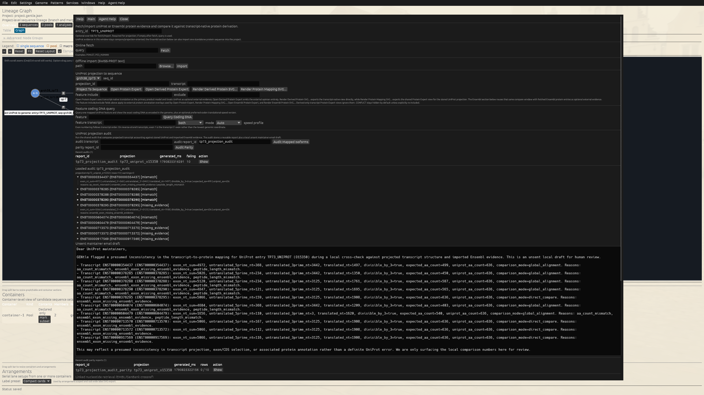
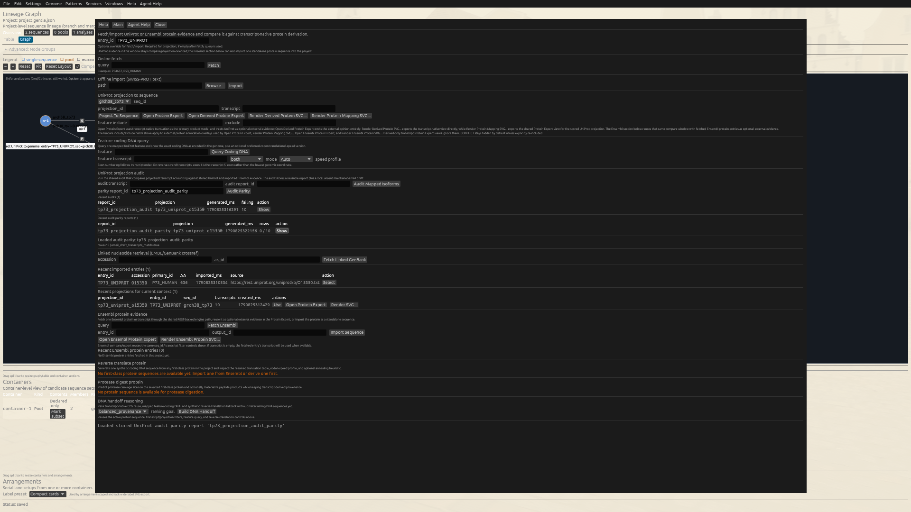

# TP73 UniProt Projection Audit

See also: executable reference chapter
[`19 Audit a TP73 UniProt Projection Against Ensembl and Derived Coding Sequence`](./generated/chapters/06-05_tp73_uniprot_projection_audit_cli.md).

This walkthrough audits a real TP73 locus against reviewed UniProt p73 and then
rebuilds the result from the public primitives available to an outer agent.
The integrated audit stores a report plus an **unsent** maintainer-email draft;
GENtle never sends it.

## Identity and evidence boundary

- TP73 is UniProt `O15350` (`P73_HUMAN`, 636 aa). `Q9H3D4` is TP63 and must not
  be used for this tutorial.
- Extract the locus with `--annotation-scope full`. The default `core` scope
  omits exon/CDS features and cannot support transcript accounting.
- UniProt carries Ensembl transcript/protein cross-references. A separately
  fetched Ensembl protein record is optional comparison evidence, not a
  prerequisite for projection or direct-vs-composed parity.
- When Ensembl REST is unavailable, rows can be `missing_evidence`. That is not
  evidence of a UniProt error, and the local draft must not be sent.

## Reproduce the reviewed run

Use an explicit state so terminal commands do not pretend to inherit an open
GUI project:

```bash
STATE=/tmp/gentle-tp73-audit.gentle.json

gentle_cli --state "$STATE" genomes extract-gene \
  "Human GRCh38 Ensembl 116" TP73 \
  --occurrence 1 --output-id grch38_tp73 \
  --annotation-scope full \
  --catalog assets/genomes.json --cache-dir data/genomes

gentle_cli --state "$STATE" shell \
  'uniprot fetch O15350 --entry-id TP73_UNIPROT'
gentle_cli --state "$STATE" shell \
  'uniprot map TP73_UNIPROT grch38_tp73 --projection-id tp73_uniprot_o15350'
```

The reviewed Ensembl-116 run attached 430 locus features (20 transcripts, 222
exons and 187 CDS features) and projected ten UniProt-linked transcripts.

## Integrated audit

```bash
gentle_cli --state "$STATE" shell \
  'uniprot audit-projection tp73_uniprot_o15350 --report-id tp73_projection_audit'
gentle_cli --state "$STATE" shell \
  'uniprot audit-show tp73_projection_audit'
```

The reviewed run produced ten rows. All ten CDS lengths were divisible by
three. Four 636-aa derived proteins matched O15350 by direct comparison; six
shorter isoforms used global alignment and were classified as length
mismatches. Because Ensembl REST returned HTTP 500 during review, all ten exon
comparisons remained `missing_ensembl_evidence`: four otherwise matching rows
therefore became `missing_evidence`, while six remained `mismatch` because of
their real protein-length differences.



*Figure: Native audit inspection of the reviewed O15350/Ensembl-116 run. The
draft is review material only, not a send action. Screenshot captured
2026-10-01.*

## Reusable primitive composition

The same evidence path is public to shell, CLI and outer agents:

```bash
gentle_cli --state "$STATE" shell \
  'uniprot resolve-ensembl-links tp73_uniprot_o15350'
gentle_cli --state "$STATE" shell \
  'uniprot transcript-accounting tp73_uniprot_o15350'
gentle_cli --state "$STATE" shell \
  'uniprot compare-ensembl-exons tp73_uniprot_o15350'
gentle_cli --state "$STATE" shell \
  'uniprot compare-ensembl-peptide tp73_uniprot_o15350'
```

The accounting report is the first sanity gate: `translated_nt / 3` must equal
the derived amino-acid count for every row before mismatch interpretation.

## Direct-vs-composed parity

```bash
gentle_cli --state "$STATE" shell \
  'uniprot audit-parity tp73_uniprot_o15350 --report-id tp73_projection_audit_parity'
gentle_cli --state "$STATE" shell \
  'uniprot audit-parity-show tp73_projection_audit_parity'
```

The reviewed report has `0 / 10` divergent rows. Status, accounting, mismatch
reasons, comparison mode and the transcript set in the unsent draft all match
between the integrated Rust audit and primitive composition.



*Figure: Native direct-vs-composed parity summary. Screenshot captured
2026-10-01.*

## Inner-agent boundary

Ask GENtle's inner agent to propose, not silently perform, the online fetches
and state mutations:

> Verify that the selected locus is TP73 from Human GRCh38 Ensembl 116, that
> full exon/CDS annotation is present, and that the reviewed UniProt accession
> is O15350/P73_HUMAN. Propose the fetch, projection and audit as separate
> reviewable commands. Report transcript counts, CDS divisibility, direct vs
> alignment modes, and missing external evidence separately. Never present the
> unsent draft as a validated complaint or send it.

The inner agent can explain and propose the GUI-equivalent actions, but the
stored report and parity payload remain the evidence—not the prose response.

## Outer-agent boundary

An outer agent does not inherit an unsaved GUI project. Give it the canonical
workflow and a disposable state path:

> Use GENtle's `gentle-cloning` skill to replay
> `docs/examples/workflows/tp73_uniprot_projection_audit_online.json` against a
> new disposable state. First report the exact workflow, network/cache writes,
> state path and approval boundary. Return the structured audit, parity report,
> SVG and reproducibility receipt. Treat `missing_evidence` as an incomplete
> comparison, preserve the unsent-draft boundary, and do not send email.

Equivalent direct wrapper request:

```json
{
  "schema": "gentle.clawbio_skill_request.v1",
  "mode": "workflow",
  "state_path": "/tmp/gentle-tp73-uniprot-audit.state.json",
  "workflow_path": "docs/examples/workflows/tp73_uniprot_projection_audit_online.json",
  "timeout_secs": 7200
}
```

A direct structured request is an explicit wrapper invocation. Natural-language
delegation must retain the selected skill's proposal/approval boundary for
network access, cache/state mutation and artifact writes.

## Optional Ensembl protein comparison

If Ensembl REST is healthy, fetch a protein ID linked from the current O15350
record—for canonical alpha, currently `ENSP00000367545`—and repeat the compare
and audit commands with `--ensembl-entry TP73_ENS`. Do not hard-code an
unverified identifier from an old tutorial. During the 2026-10-01 review,
Ensembl lookup and sequence endpoints returned HTTP 500, so that extra evidence
was deliberately not fabricated.

```bash
gentle_cli --state "$STATE" shell \
  'ensembl-protein fetch ENSP00000367545 --entry-id TP73_ENS'
gentle_cli --state "$STATE" shell \
  'uniprot audit-projection tp73_uniprot_o15350 --ensembl-entry TP73_ENS --report-id tp73_projection_audit_with_ensembl'
```

## Export

```bash
gentle_cli --state "$STATE" shell \
  'uniprot audit-export tp73_projection_audit tp73_projection_audit.json'
gentle_cli --state "$STATE" shell \
  'uniprot audit-parity-export tp73_projection_audit_parity tp73_projection_audit_parity.json'
gentle_cli --state "$STATE" render-feature-expert-svg \
  grch38_tp73 uniprot-projection tp73_uniprot_o15350 \
  tp73_uniprot_projection.svg
```

## Feedback

If this tutorial is confusing, execution-stale, biologically suspect, or
missing a useful figure, open the matching tutorial issue template and include
the context copied from GENtle Help -> Tutorial -> Copy Feedback Context.

- Tutorial title:
- Tutorial/chapter id:
- Step reached:
- Expected vs. actual:
- Interface used: GUI / CLI / Agent Assistant / ClawBio

Paste the Tutorial feedback context here:

```text

```
