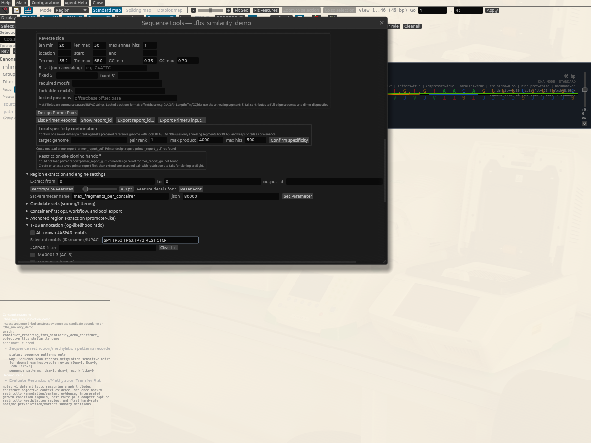
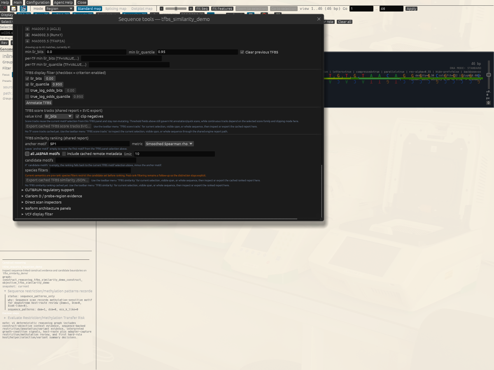
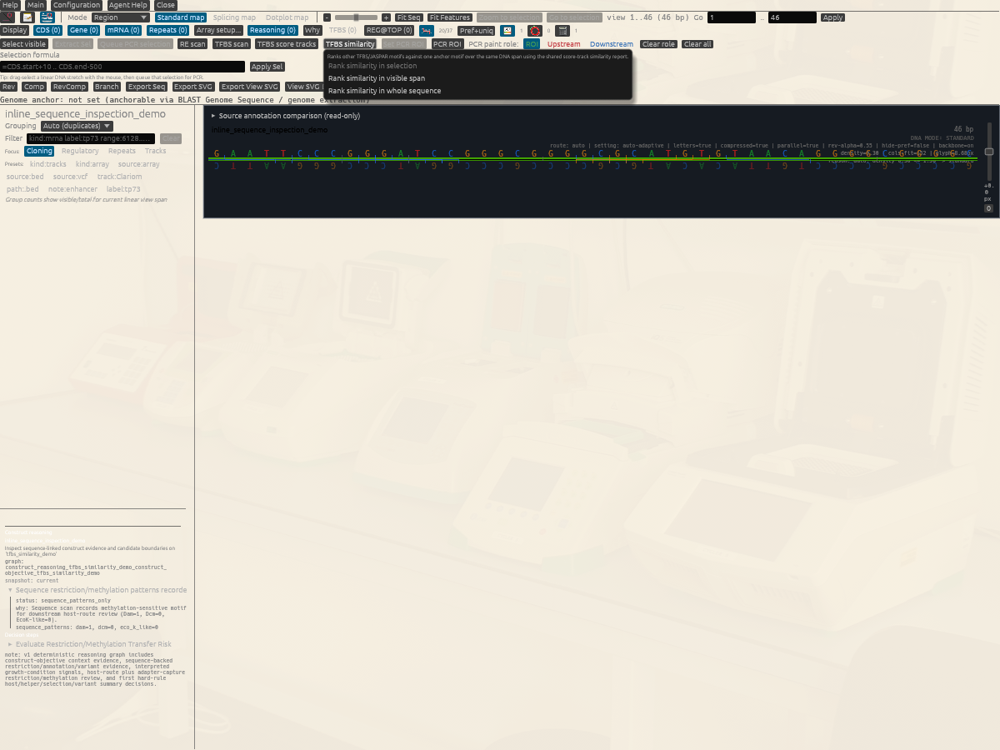

# TFBS Similarity Ranking Tutorial

This is a short sign-off tutorial for the new DNA-window `TFBS similarity`
path.

The goal is practical, not theoretical:

- verify that the GUI can rank candidate TF motifs against one anchor motif
  over the same DNA span
- verify that the cached ranked table is inspectable in-window
- verify that the same shared report can be exported as JSON
- verify that the same biology can be replayed through one small offline
  workflow and one ClawBio wrapper request

This tutorial intentionally reuses the same tiny synthetic FASTA from the
stateless direct-inspection walkthrough so the sign-off path stays local and
fast.

## What You Will Test

By the end of this tutorial, you should have verified all of these:

- the DNA-window toolbar `TFBS similarity` action runs without needing a
  promoter-design specialist window
- the `TFBS similarity ranking` subpanel in `TFBS annotation` shows the cached
  ranked report
- the ranked table includes the expected anchor, metric, and candidate count
- `Export cached TFBS similarity JSON...` replays the same shared engine route
- the same ranking can be reproduced by one offline workflow example
- the same workflow can be wrapped for ClawBio without first building a GENtle
  state by hand

## Synthetic Input

Local GUI input:

- [`docs/tutorial/inputs/inline_sequence_inspection_demo.fa`](./inputs/inline_sequence_inspection_demo.fa)

Exact sequence:

```text
GAATTCCCGGGATCCGGGCGGGGCGCATGTGTAACAGGGGCGGGGC
```

Why this sequence is useful for software acceptance:

- it is tiny, so repeated GUI reruns stay fast
- it contains one GC-rich `SP1`-like block plus one p53-family-like teaching
  block
- the ranking route still has a continuous signal to compare even when the
  sequence is much shorter than a real promoter

It is **not** a biological similarity model. The reviewed route applies a
25-base centred-boxcar smoothing window to only 46 bases. The resulting
correlations and peak offsets are therefore strongly constrained by this toy
window. They do not establish motif equivalence, binding, co-occupancy, or
transcription-factor cooperation.

## Reviewed Evidence And Current GUI Blocker

The 2026-10-01 review used exact source revision
`3c6226337db450313f3b669007dc90e133a96122`.







The settings are reachable and persist in the native DNA window. However,
choosing **Rank similarity in whole sequence** terminated the reviewed GUI with
`thread '<unknown>' has overflowed its stack`. No populated native result-table
screenshot exists for this revision. Treat the GUI portion as blocked until a
later exact build completes the action; a passing CLI or wrapper replay does
not substitute for that acceptance.

## GUI Walkthrough

1. Open the FASTA:
   [`docs/tutorial/inputs/inline_sequence_inspection_demo.fa`](./inputs/inline_sequence_inspection_demo.fa)
2. In the DNA window, open the `TFBS annotation (log-likelihood ratio)` panel.
3. Configure the motif set.
   - Easiest robust route:
     - use the picker list under `JASPAR filter`
     - add these motifs with the `+` button:
       - `SP1`
       - `TP53`
       - `TP63`
       - `TP73`
       - `REST`
       - `CTCF`
   - If those exact names are already accepted directly by your local motif
     snapshot, the quick text route is:
     - `Selected motifs = SP1,TP53,TP63,TP73,REST,CTCF`
4. In the score-track subsection, use:
   - `value kind = llr_background_tail_log10`
   - `clip negatives = off`
5. In the new `TFBS similarity ranking (shared report)` subsection, use:
   - `anchor motif = SP1`
   - `all JASPAR motifs = off`
   - `candidate motifs = TP53,TP63,TP73,REST,CTCF`
   - `metric = Smoothed Spearman rho`
   - `limit = 10`
   - leave `species filters` empty for the first run
   - leave `include cached remote metadata` off for the first run
6. Use the toolbar menu `TFBS similarity -> Rank similarity in whole sequence`.
   - On the reviewed revision this is the current blocker: GENtle exits with a
     stack overflow before caching the table.
   - If a later build reaches the result, record its exact source revision and
     retain a native screenshot rather than silently replacing this finding.
7. Return to the `TFBS annotation` panel.
   - Expected result:
     - the `TFBS similarity ranking` block is no longer empty
     - the cached table shows `anchor SP1`
     - the table reports `5` requested candidates or fewer returned rows if
       your local motif snapshot resolves some names differently
     - `SP1` itself must not appear as a candidate row
8. Press `Export cached TFBS similarity JSON...`.
   - Expected result:
     - a JSON file is written through the shared
       `SummarizeTfbsTrackSimilarity` route
9. Optional metadata/sign-off branch:
   - if you already have a cached JASPAR remote-metadata snapshot locally,
     rerun once with:
     - `include cached remote metadata = on`
     - `species filters = Homo sapiens`
   - Expected result:
     - the table still loads
     - metadata cells become richer when cached rows exist
     - any filter caveat is shown explicitly as a warning or status note

What this should prove:

- the first GUI slice for TFBS similarity ranking is real and inspectable
- the GUI is still thin: it delegates ranking to the shared engine operation
- pre-rank species filtering is visible to the user instead of being hidden

On the reviewed revision only the configuration part is proven in the GUI;
the remaining claims are the intended post-fix acceptance criteria.

## Offline Workflow Replay

Canonical offline workflow example:

- [`docs/examples/workflows/tfbs_track_similarity_stateless_offline.json`](../examples/workflows/tfbs_track_similarity_stateless_offline.json)

From the repository root:

```sh
cargo run --quiet --bin gentle_cli -- \
  --state /tmp/tfbs_track_similarity_demo.state.json \
  workflow @docs/examples/workflows/tfbs_track_similarity_stateless_offline.json
```

Expected workflow artifacts:

- `artifacts/tfbs_track_similarity_demo.score_tracks.json`
- `artifacts/tfbs_track_similarity_demo.score_tracks.svg`
- `artifacts/tfbs_track_similarity_demo.similarity.json`

This path stays fully offline and state-optional at the biology layer: the
workflow uses the same inline sequence letters directly rather than requiring
you to create or save a project first.

The reviewed replay resolved anchor `SP1` to `MA0079.5` and returned five rows:

| Rank | Candidate | Smoothed Spearman rho | Signed primary-peak offset |
| ---: | --- | ---: | ---: |
| 1 | TP73 | 0.000000000000 | -36 bp |
| 2 | REST | -0.443722102850 | -30 bp |
| 3 | TP53 | -0.671305234441 | -25 bp |
| 4 | TP63 | -0.671305234441 | -25 bp |
| 5 | CTCF | -0.673649781031 | -25 bp |

These values are deterministic regression evidence for this fixture. In
particular, equal TP53 and TP63 values here do not mean that their proteins or
motif models are biologically equivalent.

## Inner Agent: Review The Live DNA Window

Use the inner Agent Assistant only as a review-first helper for the current
DNA window. A useful request is:

> On the current 46 bp sequence, propose TFBS similarity settings with SP1 as
> anchor and TP53, TP63, TP73, REST and CTCF as candidates. Keep
> `llr_background_tail_log10`, negative values unclipped, Smoothed Spearman,
> the 25 bp smoothing window, the full `0..46` linear span, limit 10, no remote
> metadata and no species filter. Explain why this toy result is software
> acceptance rather than biological binding evidence. Do not run or export
> anything until I approve.

Before approval, verify the live sequence identity, span, topology, resolved
matrix IDs and every ranking setting. Export is a separate file write and
needs its own reviewed path.

## ClawBio Replay

Matching ClawBio request:

- [`integrations/clawbio/skills/gentle-cloning/examples/request_workflow_tfbs_track_similarity_stateless.json`](../../integrations/clawbio/skills/gentle-cloning/examples/request_workflow_tfbs_track_similarity_stateless.json)

Example wrapper invocation from a ClawBio checkout:

```sh
python clawbio.py run gentle-cloning \
  --input skills/gentle-cloning/examples/request_workflow_tfbs_track_similarity_stateless.json \
  --output /tmp/gentle_clawbio_tfbs_similarity
```

Expected result:

- the wrapper writes the same three workflow artifacts into the output bundle
- no hand-prepared GENtle state is required before the request

The reviewed real wrapper invocation exited successfully, collected those
three JSON/SVG workflow artifacts plus a derived PNG, and bound the request,
workflow, runner and checksums in its receipt. After removing runtime-only
fields, its similarity JSON matched the direct CLI replay exactly
(`11a15364c035d7ed649900fbfe210812345563f26e06b306f4aac679ec7db7ef`).

An outer agent has no access to an unsaved DNA window. It must receive the
canonical workflow (or an equally explicit inline sequence), output directory,
runner identity and approval policy. This workflow is state-optional and does
not mutate a live project, but it still writes an output bundle; the agent must
report those paths and the receipt rather than claiming that it operated the
GUI.

## What To Mark As Successful

For the reviewed revision, mark the **headless parity slice** successful only
if the direct CLI and wrapper artifacts agree. Mark the full tutorial
successful only after all of these are true on one recorded GUI build:

- the GUI `TFBS similarity` menu runs for the whole sequence without errors
- the `TFBS similarity ranking` subpanel shows a populated cached ranked table
- the cached table names `SP1` as the anchor and does not include `SP1` as a
  candidate row
- JSON export works from the cached report
- the offline workflow writes the three expected artifacts
- the optional species-filter rerun either:
  - works with cached remote metadata, or
  - fails gracefully with explicit metadata/filter warnings rather than hidden
    behavior

## Feedback

If this tutorial is confusing, execution-stale, biologically suspect, or missing a useful figure, please open the matching tutorial issue template and include the context copied from GENtle Help -> Tutorial -> Copy Feedback Context.

- Tutorial title:
- Tutorial/chapter id:
- Step reached:
- Expected vs. actual:
- Interface used: GUI / CLI / Agent Assistant / ClawBio

Paste the Tutorial feedback context here:

```text

```
