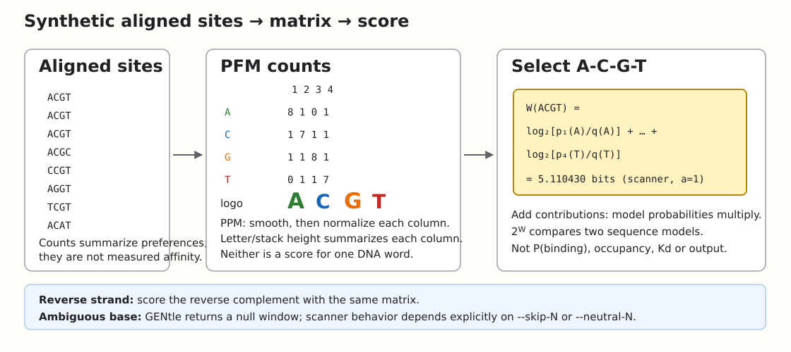
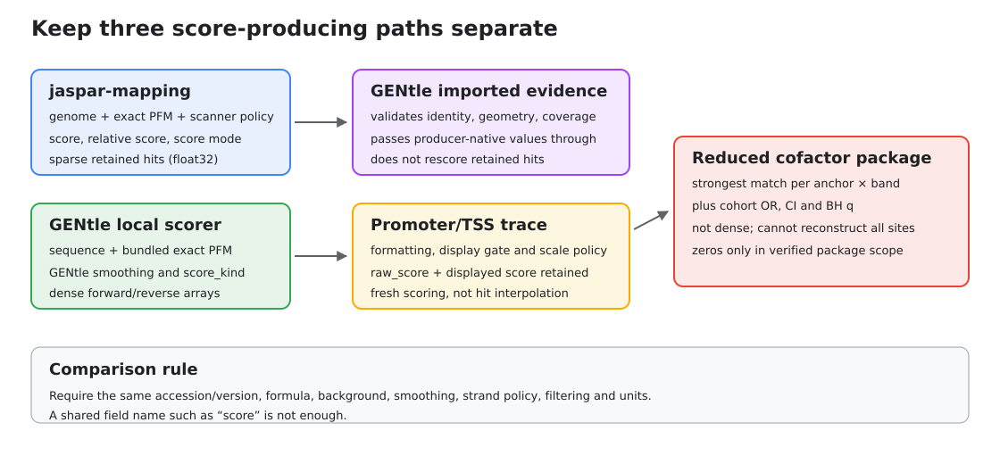
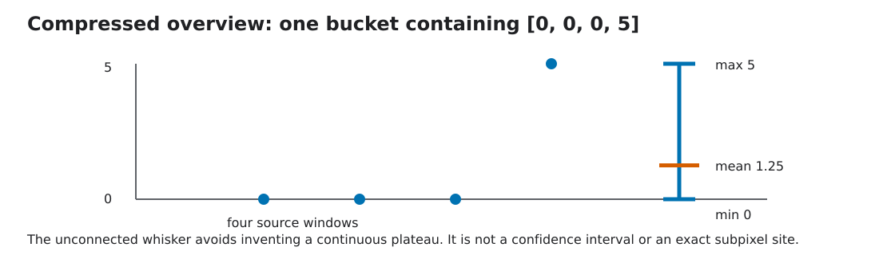

# From a motif logo to a promoter trace: what does the score mean?

This tutorial is for readers who know promoters and transcription factors but
have not had to audit motif statistics. It starts with four synthetic columns,
then follows three real software paths: the independent `jaspar-mapping`
scanner, GENtle's local dense scorer, and GENtle's reduced promoter-cofactor
browser.

The short version is simple: **a motif score says how compatible one DNA word
is with one specified sequence model and scoring policy**. It is not a binding
probability, occupancy measurement, dissociation constant, expression value or
predicted luciferase activity.



## 1. Counts, probabilities, weights and a logo

Suppose ten synthetic aligned sites produce this position-frequency matrix
(PFM). Rows are bases and columns are motif positions.

| base | 1 | 2 | 3 | 4 |
|---|---:|---:|---:|---:|
| A | 8 | 1 | 0 | 1 |
| C | 1 | 7 | 1 | 1 |
| G | 1 | 1 | 8 | 1 |
| T | 0 | 1 | 1 | 7 |

A **PFM** contains counts. A position-probability matrix contains probabilities
after smoothing and column normalization. A **PWM/PSSM** contains weights used
to score a sequence. Those names vary between tools, so inspect the values and
formula instead of trusting the acronym.

A motif logo summarizes a column. Letter heights reflect base frequency and
the stack height usually reflects information content in bits. A logo does not
show the score of one candidate word. To score `ACGT`, select one entry from
each column and add its contribution:

```text
W(x) = Σᵢ log₂(pᵢ(xᵢ) / q(xᵢ))
```

Here `pᵢ` is the motif probability at position `i`; `q` is the declared
background probability (uniform A/C/G/T means 0.25). Contributions add because
the position-independent model multiplies probabilities. Negative contributions
are legitimate: that base is less likely under the motif model than under the
background. `2^W` is the likelihood ratio between those two specified sequence
models. It is not `P(binding | sequence)`.

With additive-one smoothing in the independent scanner, the synthetic `ACGT`
word scores 5.110430 bits, `ACGC` scores 3.110430 bits, and `TCGA` scores
-0.059495 bits. GENtle's different smoothing policy gives different values;
neither policy universally inflates scores. The complete checked values are in
[`worked_scores.tsv`](reproducibility/motif_logo_to_promoter_trace/worked_scores.tsv).

The reverse strand is evaluated by scoring the reverse complement. In GENtle,
an ambiguous-base window is null. In `jaspar-mapping`, `--skip-N` omits such a
window whereas `--neutral-N` assigns N a zero contribution. These are not
interchangeable meanings of zero.

## 2. Three paths that must not be mixed



| representation | producer → GENtle field | formula / units | transformation before display |
|---|---|---|---|
| sparse genomic hit | `jaspar-mapping` → `GenomicMotifEvidenceHit.score`, `.pwm_relative_score`, `.score_mode` | producer-declared bits plus unitless min/max-relative score | float32 is promoted, filtered by explicit query bounds, then formatted; not rescored |
| dense TSS trace | GENtle → `TssProfileTrack.forward_scores` / `.reverse_scores` | panel `score_kind`, usually bits, quantile or `-log10` tail | recomputed locally; null windows retained; optional negative clipping/display gate and renderer scaling |
| strongest per band | package producer → `CofactorDetail.best_score`, `.plus_score`, `.minus_score` | package-declared scanner score | selected maximum per anchor × band, passed through and formatted; not a dense array |
| cohort association | package producer → `CofactorRankingRow.*adjusted_odds_ratio`, confidence bounds and q-values | odds ratio / interval / BH q | ranked and optionally filtered; never converted to a PWM score or locally refitted |

### Independent genome scan → imported GENtle evidence

At scanner revision `0883ec719abee70bafbb2e8abfcae45e5bc9bcd9`,
`jaspar-mapping` converts the PFM and scans genomic windows. Sparse Parquet
stores `score` and `pwm_relative_score` as float32 plus `score_mode` and run
metadata. Promoting float32 to a GENtle f64 field does not restore discarded
precision.

GENtle's `genomic_motif_evidence` path validates the package, coordinates,
coverage and producer policy, then presents the package-native `score`,
`pwm_relative_score` and `score_mode`. It does **not** silently recompute a
retained hit using GENtle's local smoothing.

The repository's synthetic import regression builds a two-row package with a
source row such as `MA0525.2`, interval `12..20`, strand `+`, `score=3.25`,
`pwm_relative_score=0.91`, and `score_mode=log2_relative_risk`. GENtle returns
those values in `GenomicMotifEvidenceHit` unchanged. Exercise that public,
non-private path with:

```sh
GENTLE_TEST_DUCKDB=/usr/bin/duckdb \
  cargo test --locked --lib genomic_motif_evidence -- --test-threads=1 --nocapture
```

A minimal scanner-side replay uses the committed synthetic FASTA, matching
`.fai`, four-column PFM and an explicit policy. From the `jaspar-mapping`
checkout, set `GENTLE_CHECKOUT` to this GENtle checkout and run:

```sh
make pssm_scan
./pssm_scan \
  --genome "$GENTLE_CHECKOUT/docs/tutorial/reproducibility/motif_logo_to_promoter_trace/tiny.fa" \
  --fasta-index "$GENTLE_CHECKOUT/docs/tutorial/reproducibility/motif_logo_to_promoter_trace/tiny.fa.fai" \
  --pssm "$GENTLE_CHECKOUT/docs/tutorial/reproducibility/motif_logo_to_promoter_trace/synthetic_4bp.pfm" \
  --motif SYNTH4.1 --chr synthetic_chr --from 0 --to 16 \
  --coordinate-mode bed --strand both --show-sequence \
  --score-mode log2_relative_risk --pseudocount 1 --skip-N \
  --threshold -100 --min-pwm-relative-score 0 --outdir scanner-output
```

The first positive row is BED `synthetic_chr 0 4`, match `ACGT`, printed score
`5.110`, relative score `1.000000`. The full-precision educational value is in
`worked_scores.tsv`; formatted BED text cannot recover its discarded decimals.
The permissive thresholds retain the tiny example and are not recommended
biological cutoffs.

### Sequence/PFM → GENtle dense trace

GENtle revision `8b7b6b472c0d2df3177b31901ceab69932ab90b1` resolves
an exact accession from its bundled registry, scores every complete window in
both orientations, and retains forward/reverse arrays. This is fresh local
scoring, not interpolation between imported sparse hits.

The existing synthetic TSS fixture contains plus- and minus-strand windows.
Start with an empty output directory (no GENtle project state is required) and
run it from the repository root with the newly built CLI:

```sh
gentle_cli features tss-tfbs-profiles \
  --manifest test_files/fixtures/tss_profiles/manifest.json \
  --panel docs/tutorial/reproducibility/motif_logo_to_promoter_trace/shared_across_tss_panel.json \
  --selection selection.json \
  --expected-genome-id synthetic-genome-v1 \
  --expected-assembly synthetic-assembly-v1 \
  --expected-annotation-release synthetic-annotation-v1 \
  --output-dir /tmp/gentle-motif-score-tutorial \
  --formats svg
```

This route is available through the shared GUI Shell and command palette; there
is currently no dedicated TSS-profile wizard. Do not infer one from the output.
For a typed workflow example of inline dense TFBS scoring, see
[`tfbs_track_similarity_stateless_offline.json`](../examples/workflows/tfbs_track_similarity_stateless_offline.json);
the multi-page TSS document command above remains a shared-Shell/CLI operation.
The diagrams on this page are generated teaching illustrations, not screenshots
of controls. A live GUI Shell capture was not made for this patch; therefore no
image is presented as GUI acceptance.

The exact shared-engine replay committed with this tutorial produced these two
receipt-bound SVG pages:

- [synthetic plus-strand TSS profile](reproducibility/motif_logo_to_promoter_trace/generated/gene-SYNPLUS--synthetic-gene-plus--18af8ec77d49c8c5271bf8fea22484d1b55ab5e226c2f69721fbad0723c52a79.page-0001.svg)
- [synthetic minus-strand TSS profile](reproducibility/motif_logo_to_promoter_trace/generated/gene-SYNMINUS--synthetic-gene-minus--2b7eb1a592867fb6878856e1003bb6f73bada88093370217feb1d377f10aa907.page-0001.svg)

Their [receipt](reproducibility/motif_logo_to_promoter_trace/generated/receipt.json)
binds the report, panel and exact matrix hash. The plus window contains an N,
so null positions remain visibly distinct from score zero.

Re-exporting a retained report may change presentation but cannot repair stored
scores:

```sh
gentle_cli features tss-tfbs-profiles-export \
  --report /tmp/gentle-motif-score-tutorial/report.json \
  --output-dir /tmp/gentle-motif-score-tutorial-shared \
  --formats svg --scale-mode shared_across_tss
```

### Reduced promoter-cofactor package

The Promoter Cofactors browser joins published cohort statistics, strongest
motif matches and promoter ownership. It stores a strongest match per physical
anchor and distance band, not every scan window. Odds ratios, confidence
intervals and original BH q-values describe cohort associations; they are not
PWM scores. A reduced package cannot reconstruct all sites, arbitrary-threshold
counts or pair architecture. A zero is defensible only inside its verified
anchor × motif × band coverage; otherwise the state is unavailable.
Selecting a prepared package therefore does not scan DNA; it queries only its
inventoried Parquet products.

## 3. Score dictionary

| GENtle score kind | Number shown | Reference population / ties |
|---|---|---|
| `llr_bits` | `Σ log₂(p/q)` | none; raw matrix-specific likelihood ratio |
| `true_log_odds_bits` | `Σ log₂[(p/(1-p))/(q/(1-q))]` | none; per-base odds-ratio sum |
| `llr_quantile` | rank of LLR among scanned windows | empirical scan windows; `<=` ties included |
| `true_log_odds_quantile` | rank of true-log-odds among scanned windows | empirical scan windows; `<=` ties included |
| `llr_background_quantile` | mid-quantile under modeled uniform random DNA | modeled distribution; midpoint of tied mass |
| `true_log_odds_background_quantile` | analogous modeled quantile | modeled distribution; midpoint of tied mass |
| `llr_background_tail_log10` | `-log₁₀ P(S ≥ observed)` | inclusive uniform-i.i.d. background tail |
| `true_log_odds_background_tail_log10` | analogous tail for the other matrix | inclusive uniform-i.i.d. background tail |

The background-tail value is a per-window null-model measure. It is not a
posterior binding probability, experimental p-value, empirical FDR or
genome-wide multiple-testing correction. Searching overlapping windows and
many motifs multiplies opportunities for a high score.

GENtle shows modeled-background quantiles/tails only at modeled quantile ≥0.95.
A displayed zero below that gate means “suppressed for presentation”, not
“binding impossible” and not necessarily tail probability one. In TSS exports,
`raw_score` means the chosen score family before negative clipping; it is not
necessarily raw LLR bits. A tail-only array cannot reconstruct bit scores.

## 4. The corrected TP73 maximum

For bundled JASPAR 2026 `MA0861.2` and `ACATGTCTGGACATGT`, current GENtle gives:

| quantity | value |
|---|---:|
| motif length | 16 |
| raw LLR | 19.543680326691 bits |
| inclusive tail at the unique maximizer | `4^-16 = 2.328306436539e-10` |
| `-log10(Ptail)` | 9.632959861247 |

The former displayed value 300 was a numerical defect, not spectacular
binding. Per-column score rounding could place the maximum modeled bin below
an achievable unrounded maximum, making the tail look empty. The September 11
fix preserves raw PWM scores and corrects tail inclusion.

The method is named
`uniform_iid_quantized_conservative_survival_v2`. It rounds contributions to
0.001-bit bins, tracks the cumulative per-column rounding error plus a
floating-point guard, includes bins at or above `observed - E`, and sums the
survival probability directly in log space instead of subtracting a CDF from
one. It is generally a conservative upper bound on the raw inclusive tail, not
universal exact enumeration. If maxima tie, all tied words belong in the
inclusive tail. Under uniform A/C/G/T, any achievable length-`L` word obeys
`-log10(Ptail) <= L log10(4)`. Tiny linear probabilities may underflow while
their log scores remain finite.

## 5. Why two implementations differ

### `jaspar-mapping`

For additive pseudocount `a`, the scanner uses

```text
pᵢ(b) = (cᵢ(b) + a) / (Nᵢ + 4a)
```

`log2_relative_risk` then sums `log₂(p/q)`; its CLI default is `a=0`.
`log_odds` sums `log₂[(p/(1-p))/(0.25/0.75)]`; its default is `a=1`.
Production runs may override either default. With `a=0`, impossible entries use
scanner sentinels and must not be treated as ordinary finite evidence.

The scanner's relative score is

```text
(W - Wmin) / (Wmax - Wmin)
```

over finite, non-sentinel reachable contributions. Degenerate bounds and
zero-count policies must come from the producer metadata, not a guessed
division.

### GENtle

GENtle has a different current policy. Let
`B=max(1, maxᵢ Nᵢ)`. A short column receives `(B-Nᵢ)/4` per base; then every
base receives `epsilon=B×10^-9`, the column is normalized, and probabilities
are clamped to finite numerical bounds. This is not additive-one smoothing.

The synthetic worked table deliberately compares the same counts and DNA under
native policies and under the scanner's explicit `a=1`. Different numbers are
expected. Agreement requires accession, counts, formula, background, smoothing,
strand, filtering and precision to agree.

## 6. JASPAR matrix versus JASPAR track score

JASPAR is the matrix source, not one universal scanner. Its FAQ describes the
sequence-model likelihood-ratio weight and relative normalization
`(W-min)/(max-min)`. The JASPAR 2026 genome-track method identifies PWMScan,
retains relative scores ≥0.8 with p-values <0.05, and applies a separate browser
display transformation. On that browser scale, 300 corresponds to p=0.001,
400 to p=0.0001 and 1000 to p≤1e-10. GENtle's `-log10(p)` scale would show 3,
4 and ≥10 for those same p-values **only if the underlying null and p-value
were identical**. A legitimate JASPAR browser score of 300 is unrelated to the
old GENtle tail bug.

Do not transfer defaults from JASPAR's website sequence scanner to genome
tracks, `jaspar-mapping`, or GENtle without versioned evidence.

## 7. Reading promoter traces

- **Independent scales:** each matrix × TSS panel may use its own range. Equal
  visual heights across panels do not imply equal numerical scores.
- **`shared_across_tss`:** one scale per exact matrix across all supplied TSS
  windows and both strands. It supports same-matrix comparison between TSSs;
  it does not calibrate different matrices.
- **Older `shared`:** a different within-TSS cross-matrix policy that requires
  appropriate calibration. Do not use the names interchangeably.
- **Coordinates:** a point is the motif-window start. Its span is the motif
  length. Strand and transcript-oriented TSS coordinates must be read together;
  a minus-strand genomic label runs oppositely to local plot indices.
- **Missing windows:** ambiguous or incomplete end windows are null, not
  measured zero. Sparse source floors, density caps, query filters, row limits
  and display suppression create other distinct forms of absence.



For a compressed bucket containing `[0,0,0,5]`, GENtle draws an unconnected
min/max whisker from 0 to 5 and a mean mark at 1.25. This preserves a sparse
peak without inventing a continuous plateau. The whisker is not a confidence
interval, occupancy estimate or exact subpixel hit location; retain source
arrays for exact positions.

## 8. What a motif score can support

A motif score can prioritize a sequence for a defined, versioned motif model.
It can support a hypothesis that a substitution weakens that model score. To
compare scores, align accession/version, matrix hash, formula, background,
smoothing, strand, filtering, score units and aggregation.

It cannot alone establish occupancy, TF identity, TA-versus-DN TP73 isoform
preference, activation/repression, affinity, or reporter function. Occupancy
needs appropriate binding evidence; isoform preference needs isoform-resolved
evidence; function needs an otherwise matched perturbation such as a reporter
construct with a defined sequence change. Chromatin, TF concentration,
cofactors, spacing and position dependence remain outside a simple PWM.

## Technical provenance and references

The machine-readable [run provenance](reproducibility/motif_logo_to_promoter_trace/provenance.json)
records source revisions, executable, matrix and fixture hashes, and effective
parameters for both score-producing implementations.

- GENtle source audited: `8b7b6b472c0d2df3177b31901ceab69932ab90b1`.
  Relevant implementations are `motif_statistics.rs`, `promoter_design.rs`,
  `tss_profiles.rs`, `tfbs_track_panel.rs`, TSS export/rendering, and the typed
  genomic-motif evidence protocol/UI path.
- Independent scanner audited: `IEGT/jaspar-mapping`
  `0883ec719abee70bafbb2e8abfcae45e5bc9bcd9`, especially `pssm.h`,
  `pssm.cpp`, `pssm_scan.cpp`, `pssm_scan_core.cpp` and its README.
- [JASPAR documentation](https://jaspar.elixir.no/docs/) and
  [FAQ](https://jaspar.elixir.no/faq/), accessed 2026-09-11.
- [JASPAR 2026 genome-track methods](https://mencius.uio.no/JASPAR/JASPAR_genome_browser_tracks/2026/JASPAR2026_TFBS_help.html),
  accessed 2026-09-11; producer repository:
  [JASPAR-UCSC-tracks](https://github.com/ievarau/JASPAR-UCSC-tracks/tree/master).
- JASPAR 2026: Baydar Ovek *et al.* (2026),
  [doi:10.1093/nar/gkaf1209](https://doi.org/10.1093/nar/gkaf1209).
- Stormo GD (2013), “Modeling the specificity of protein-DNA interactions,”
  [PMID 25045190](https://pubmed.ncbi.nlm.nih.gov/25045190/). Sequence
  preferences can motivate relative-affinity hypotheses only with additional
  assumptions/calibration; they do not provide measured Kd.

### Verification boundary

`scripts/test_motif_score_tutorial.py` checks the educational calculations,
the corrected TP73 values, source/catalog links, matrix pin and synthetic
plus/minus fixture. GENtle's existing engine tests exercise the actual scoring
and export route. The older stored background-normalized artifacts in
`promoter_design_artifact_slice_offline`,
`promoter_gene_set_ortholog_cohort_offline`, and
`gene_set_ortholog_promoter_cohorts_offline` have **not** been silently
regenerated. They require rescoring from original sequence/PFM inputs;
presentation-only re-export cannot fix old scores. Imported scanner-native
scores require their own producer-policy audit.

Passing software tests and checksums establishes implementation consistency,
not independent scientific validation of a motif's biological interpretation.
