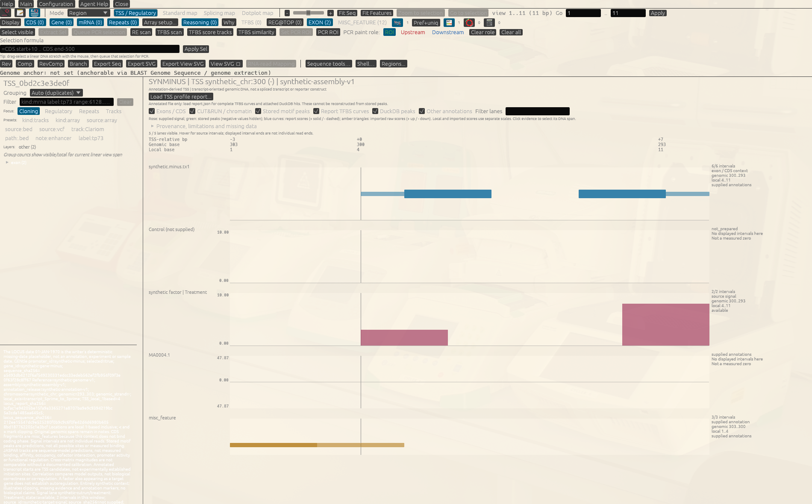
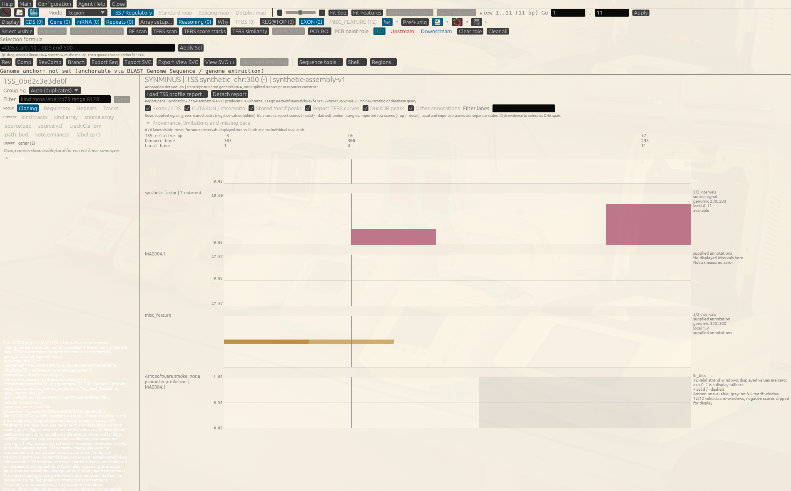

# Inspect TFBS scores and regulatory evidence at one annotated TSS

This tutorial answers a narrower question than the integrated locus report:

> For one selected, annotated transcription-start window, which structures,
> signal intervals, stored motif predictions and model-score traces are present,
> and which evidence is still unavailable?

It uses an entirely synthetic public minus-strand fixture. No network request,
private sample, database query or new motif scoring occurs while you inspect it.

## What you will accomplish

In about 10 minutes you will:

1. open one annotated TSS GenBank record;
2. switch its DNA window to **TSS / Regulatory**;
3. attach the matching, hash-bound TFBS profile report;
4. distinguish annotation, CUT&RUN-style signal, stored motif peaks and score
   curves without calling any of them proof of binding.

The GUI and Agent Assistant/inner-agent routes below converge on the same
native viewer and report loader. Headless and sequence-local shells emit the
same typed UI-intent receipt, but only the project GUI host can apply it to an
active viewer. The report is validated against the exact reference, TSS
geometry and sequence hash before its curves appear.

## Before you start

- Start GENtle from a repository checkout or package that includes this guide.
- Keep the repository root as your working directory when entering commands in
  **Agent Assistant**.
- Before a `ui ...` command, focus the intended DNA window and open Agent
  Assistant from there. GENtle binds that explicit launch subject while the
  assistant has focus; it does not fall back to another project sequence.
- Use these retained public inputs:
  - [`synthetic-minus.annotated-tss.gb`](reproducibility/tss_regulatory_view_gui/synthetic-minus.annotated-tss.gb)
  - [`synthetic-minus.profile-report.json`](reproducibility/tss_regulatory_view_gui/synthetic-minus.profile-report.json)
- Treat every TSS as annotation-derived and every motif score as a sequence-model
  output. This fixture is not biological evidence for SYNMINUS, Arnt or any
  real promoter.

## 1. Open the annotated TSS window

**GUI**

Choose **File → Open Sequence…** and open
`docs/tutorial/reproducibility/tss_regulatory_view_gui/synthetic-minus.annotated-tss.gb`.

**Agent Assistant / shared operation**

```text
/open file docs/tutorial/reproducibility/tss_regulatory_view_gui/synthetic-minus.annotated-tss.gb --id synthetic_minus_tss
ui open sequence-window synthetic_minus_tss
```

**Ask the inner agent**

> Open the retained synthetic-minus annotated TSS GenBank record as
> `synthetic_minus_tss`, then open that sequence window. Show me the exact
> GENtle commands before execution. Do not infer a different TSS or download
> any reference.

**Look for**

The sequence is 11 bases of transcript-oriented genomic DNA. Its TSS is local
base 4 and genomic coordinate 300 on the minus strand. The record also carries
exon/CDS fragments, a synthetic treatment signal, an explicitly unavailable
control, TATA-related annotations and stored `MA0004.1` motif peaks.

## 2. Enter the native regulatory view

**GUI**

In the DNA window choose **TSS / Regulatory** beside **Standard map**.

**Agent Assistant / shared operation**

```text
ui open tss-view
```

**Ask the inner agent**

> For the active `synthetic_minus_tss` DNA window, open GENtle's native
> TSS / Regulatory view. Use the shared UI intent and do not run TFBS scoring.



At this point the native view is annotation-only. It can show what the GenBank
record already contains, but it must not invent the complete score trace from
the stored peak features.

## 3. Attach the matching TFBS profile

**GUI**

Choose **Load TSS profile report…** and select
`docs/tutorial/reproducibility/tss_regulatory_view_gui/synthetic-minus.profile-report.json`.

**Agent Assistant / shared operation**

```text
ui open tss-view --report docs/tutorial/reproducibility/tss_regulatory_view_gui/synthetic-minus.profile-report.json
```

From a headless `gentle_cli shell` or the sequence-local **Shell…** dialog, this
command records an unapplied GUI intent. Run it from **Agent Assistant** when
you want the project GUI host to attach the report to its active viewer.

**Ask the inner agent**

> Attach the retained synthetic-minus TSS profile report to the active
> annotated TSS view. Use `ui open tss-view --report ...`, show the exact path
> and command before execution, and report the binding validation result. Do
> not rescore motifs or query DuckDB.



The retained screenshot is scrolled to the report-provided `MA0004.1` lane.
This deliberately tiny fixture yields a flat zero display trace because its
negative model scores are clipped for display; the viewer states that result
explicitly rather than mistaking the flat trace for a missing report.

## 4. Read the lanes without merging their meanings

Use the lane toggles to isolate one evidence class at a time:

- **Structures** — exon/CDS fragments and translation markers copied from the
  bound locus context. They describe annotation, not promoter activity.
- **Signals** — interval-valued treatment/control lanes. Gaps remain gaps; the
  absent control in this fixture remains visibly unavailable rather than zero.
- **Motifs** — stored sequence-model peaks carried by the annotated record.
- **Score traces** — the complete forward/reverse arrays from the attached
  report. Solid blue is local `+`; dashed rose is local `-`. The numeric axis
  belongs to the exact score kind shown by the report.
- **Imported motif evidence** — separately imported genomic hits, when a report
  contains them. Their triangles retain strand, span, raw score and coverage;
  this fixture intentionally has none.
- **Other** — source annotations that do not belong to the categories above.

Hover or select a feature to inspect its exact interval and provenance. Keep
the local, genomic and TSS-relative rulers distinct, especially for a
minus-strand window.

## 5. State the result conservatively

A defensible description of this screen is:

> GENtle displays the exact annotation and retained regulatory-evidence layers
> for one TSS window and overlays a separately validated motif-score report.
> The lanes distinguish predicted sequence preference from interval-valued
> signal and unavailable evidence. They do not establish binding, occupancy,
> promoter activity or a preferred biological TSS.

Do not say that a high PSSM score is binding affinity, that missing control data
is zero, or that a CUT&RUN-style interval proves the displayed motif is occupied.

## How this fits the neighbouring tutorials

- [08.13](08-13_motif_logo_to_promoter_trace.md) explains how PWM/PSSM numbers
  are constructed and why they are not binding probabilities.
- [08.15](08-15_tss_collection_gui.md) creates, validates and reopens a
  collection of annotated TSS windows.
- **This tutorial** inspects one member and attaches its bound profile.
- [Integrated locus context and selected-TSS profiles](../integrated_locus_tss_profiles.md)
  remains the publication/export path for a whole-locus page followed by
  selected TSS detail pages. The native GUI is an interactive per-TSS peer, not
  a hidden whole-gene compositor.

## Provenance of the retained teaching input

The profile and annotated record were exported by GENtle
`0.1.0-internal.11+git.e4c94bf36ac9d2b8e9f4791579bc6c1865210e50` from
the committed public `test_files/fixtures/tss_profiles` inputs after reducing
the bundle to its selected `synthetic-minus` member. The retained
[`profile-receipt.json`](reproducibility/tss_regulatory_view_gui/profile-receipt.json)
binds the report, sequence, panel, matrix, context and producer binary. The GUI
screenshots have their own capture evidence because display code and input
producer revisions are different provenance roles.
