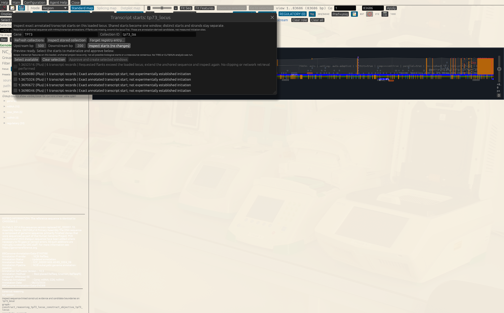
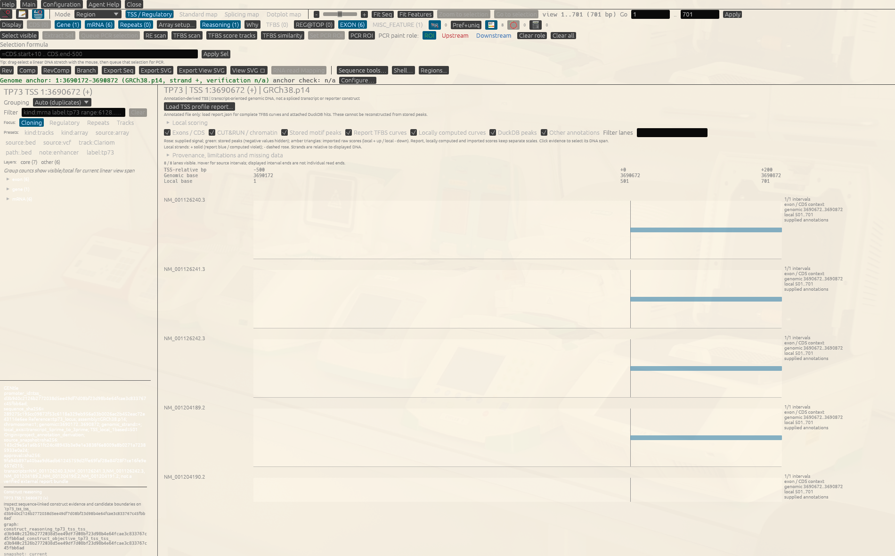
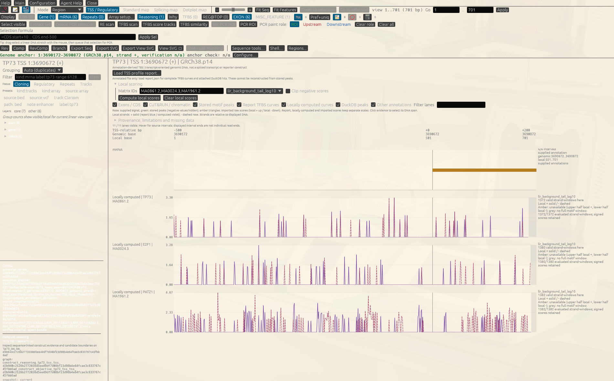

# Compare E2F1, PATZ1 and TP73 motif curves at the human ΔNp73 TSS

This tutorial answers one concrete regulatory question on a real human locus:

> At the internal ΔNp73 transcription start of human *TP73*, where in the
> −500..+200 bp window do the E2F1, PATZ1 and TP73 sequence models score, and
> which windows could not be scored at all?

The core walkthrough runs offline from the retained public RefSeq record
already in this repository. No network request, prepared genome, private sample
or motif database query is involved. The optional P1 comparison at the end
requires an already prepared compatible genome; it is not an offline fixture
or an implicit download.

Sequence models locate *candidate* sites. Nothing below shows measured
occupancy, and a high model score is not evidence that a factor binds, that it
acts at this start, or that a mutation would change reporter activity.

## Why this promoter and these three factors

*TP73* carries two promoters. The upstream P1 promoter produces full-length
TAp73; an internal promoter in intron 3 produces the N-terminally truncated
ΔNp73, which antagonises TAp73 and p53. The two are usually discussed together
because TAp73 induces ΔNp73, so the internal promoter is a documented point of
negative feedback, and E2F1 is a documented activator of the *TP73* locus.

That makes three motifs worth showing side by side in one window:

| Factor | Exact accession | Matrix length | Why it is in this view |
| --- | --- | --- | --- |
| TP73 | `MA0861.2` | 16 bp | p73 family motif; the autoregulatory candidate |
| E2F1 | `MA0024.3` | 12 bp | documented activator at this locus |
| PATZ1 | `MA1961.2` | 11 bp | additional candidate factor under test |

The accessions are exact and must stay exact: GENtle refuses factor-name
aliases, `ALL` and consensus fallbacks on this route, because a curve is only
interpretable next to the matrix that produced it.

Choosing three motifs is a display decision. It is not a claim that these are
the only, or the strongest, candidates in this window.

## What you will accomplish

In about 15 minutes you will:

1. open the retained public *TP73* locus and let GENtle recover its genome anchor;
2. preview every annotated *TP73* start and see which ones are unusable;
3. approve exactly one start, the ΔNp73 window, as a TSS window;
4. inspect it in the native **TSS / Regulatory** view;
5. compute the three local motif curves and read them without over-claiming;
6. export the same view as a deterministic SVG.

The GUI and agents drive the same engine contract. Following
[01.01's agent vocabulary](01-01_agent_interfaces.md#inner-agent-outer-agent-or-coding-agent),
the **inner agent** is Agent Assistant on the live project; the **outer agent**
(MCP or ClawBio/OpenClaw) works against explicit saved state, not the unsaved GUI.

| Steps | Inner agent | Outer agent |
| --- | --- | --- |
| 1–3: load, inventory, approved materialization | Live project, reviewed commands | Same shared operations against an explicit state; retain results and approval request |
| 4 and GUI form of 5: open views, compute in a viewer | GUI-hosted `ui ...` intents | Headless `applied=false`; do not claim a window opened |
| Headless 5–6: compute and export SVG | Explicit reviewed export | Same shared export, retaining SVG hashes and typed receipt |

The current ClawBio TSS descriptor routes collection lifecycle, not this new
SVG/scoring surface yet. An outer agent can use MCP/shared operations as in
[the offline MCP exercise](01-03_mcp_offline_roundtrip.md), or the CLI against
an explicit state. Do not invent a ClawBio intent that has not been registered.

## Before you start

- Start GENtle from a repository checkout so the retained record is present.
- Keep the repository root as your working directory.
- Before any `ui ...` command, focus the intended DNA window and open Agent
  Assistant from there. GENtle binds that explicit launch subject and never
  falls back to some other project sequence.
- Retained public input: [`test_files/tp73.ncbi.gb`](../../test_files/tp73.ncbi.gb)
  — NCBI RefSeq `NC_000001.11 REGION: 3652516..3736201`, GRCh38.p14, 83,686 bp.
  Its origin and recreation steps are recorded in
  [`test_files/README.md`](../../test_files/README.md).

The CLI examples use `target/debug/gentle_cli`; a release or packaged binary
behaves identically.

For outer-agent work, retain one explicit `STATE.json` through the shared
operations, for example `gentle_cli --state STATE.json shell 'COMMAND'`.
Opening/importing and materialization require normal project-change approval;
SVG export requires artifact-write consent. A receipt establishes what GENtle
processed and wrote, not biological correctness or visual observation.

## 1. Open the TP73 locus

**GUI**

**File → Open Sequence…**, then `test_files/tp73.ncbi.gb`.

**Agent Assistant / shared operation**

```text
/open file test_files/tp73.ncbi.gb --id tp73_locus
ui open sequence-window tp73_locus
```

**Ask the inner agent**

> Open the retained public TP73 RefSeq record `test_files/tp73.ncbi.gb` as
> `tp73_locus` and open its sequence window. Report the genome anchor GENtle
> detected and any anchor verification warning verbatim.

GENtle reads the anchor out of the record's own `ACCESSION ... REGION:` header:

```text
Detected GenBank genome anchor for 'tp73_locus': 1:3652516-3736201 (GRCh38.p14, strand +, verification n/a)
```

You will also see a warning that the anchor could not be verified against a
local catalog, because GRCh38.p14 is not prepared here. That is expected and
honest: the coordinates come from the file, and nothing has re-derived them from
a reference. The warning is not a defect and does not block this tutorial.

**Outer agent:** run the `/open file ...` operation against your explicit state
and retain the anchor and warnings. The adjacent `ui open sequence-window`
is GUI-hosted; a headless reply has `applied=false`, not an opened viewer.

## 2. Preview every annotated start before choosing one

Save this request as `tp73-inventory.json`:

```json
{
  "seq_id": "tp73_locus",
  "gene_query": "TP73",
  "collection_id": "tp73_tss",
  "upstream_bp": 500,
  "downstream_bp": 200
}
```

**GUI**

**TFBS scan → Transcript starts / TSS windows…**, enter the same gene query,
collection ID and flank sizes, then **Inspect starts (no changes)**.

**Agent Assistant / shared operation**

```text
promoters tss-inventory @tp73-inventory.json
```

**Ask the inner agent**

> Preview the annotated TP73 transcript starts in `tp73_locus` with 500 bp
> upstream and 200 bp downstream into collection `tp73_tss`. List each start's
> genomic position, transcript count and availability, and tell me which ones I
> cannot use. Do not approve anything yet.

Five annotated starts are reported:

| Genomic start (1-based) | Transcripts | Availability |
| --- | --- | --- |
| 1:3,652,516 | 6 | `missing_flanks` |
| 1:3,669,080 | 1 | `available` |
| 1:3,675,326 | 1 | `available` |
| **1:3,690,672** | **6** | **`available`** |
| 1:3,698,046 | 1 | `available` |

Read the first row carefully. `1:3,652,516` is the P1 / TAp73 start, and it is
the very first base of this record — there is no upstream sequence here, so a
−500 bp window cannot be built. GENtle reports `missing_flanks` instead of
silently returning a shorter or padded window.

That is a presentation limit of *this excerpt*, not a statement about the
promoter. P1 is real and well studied; it is simply not inspectable in this
file. The [optional P1 comparison](#optional-compare-p1-and-p2-from-a-prepared-reference)
below documents that extension without weakening the refusal or hiding retrieval.

`1:3,690,672` is the internal ΔNp73 start, it carries six transcript models,
and it has the full flank. That is the window used below.



The disabled P1 row is useful evidence: it remains visible with
`missing_flanks` instead of disappearing from the inventory or being padded.

The preview also prints an `approval_sha256`. It binds this exact inventory,
and the next step refuses to run without it.

**Outer agent:** the same `promoters tss-inventory` command is headless. Retain
its typed inventory, unavailable rows and approval digest before proposing a
materialization request; do not derive coordinates or IDs in an agent script.

## 3. Approve exactly one start

Take the `approval_sha256` and the `tss_id` of the `1:3,690,672` row from your
own preview output — do not copy an ID from this page, and never invent one.

```json
{
  "inventory": {
    "seq_id": "tp73_locus",
    "gene_query": "TP73",
    "collection_id": "tp73_tss",
    "upstream_bp": 500,
    "downstream_bp": 200
  },
  "expected_approval_sha256": "sha256:PASTE_FROM_YOUR_PREVIEW",
  "selected_tss_ids": ["tss_PASTE_FROM_YOUR_PREVIEW"]
}
```

**GUI**

Select only the `1:3,690,672` row, then
**Approve and create selected windows**.

**Agent Assistant / shared operation**

```text
promoters tss-materialize @tp73-materialize.json
```

**Ask the inner agent**

> Using the preview you just showed me, approve only the 1:3,690,672 start into
> collection `tp73_tss`. Use that preview's own approval hash and TSS ID. Show
> me the request before you run it.

One window sequence is created. Its ID is `tp73_tss_` followed by the TSS ID;
the commands below call it `TP73_WINDOW`. Re-running the same approval reuses
the existing window rather than creating a duplicate.

`TP73_WINDOW` is a placeholder in the snippets: replace it with the exact
output sequence ID reported by your materialization result.

The window is annotation-derived. Its `Origin=project_annotation_derivation`
comment states that it is not a verified external report bundle.

**Outer agent:** obtain explicit approval of this exact request, run
`promoters tss-materialize` against the same state, and retain the created IDs
and collection report. No GUI window is required for derivation.

## 4. Inspect the window natively

**GUI**

Focus the new window, then choose **TSS / Regulatory** beside Standard map.

**Agent Assistant / shared operation**

```text
ui open sequence-window TP73_WINDOW
ui open tss-view --collection tp73_tss
```

**Ask the inner agent**

> Open the approved `tp73_tss` window in the native TSS / Regulatory view and
> describe the lanes that exist before any scoring.

The ruler shows three aligned coordinate systems for the same base: local
1..701, genomic 3,690,172..3,690,872, and signed TSS-relative −500..+200. Local
base 501 is the annotated start itself.

The title reads `TP73 | TSS 1:3690672 (+) | GRCh38.p14`.

At this point the view contains only what the record supplied: the gene lane,
the TSS marker, and one exon/CDS context lane per transcript model that starts
here — `NM_001126240.3`, `NM_001126241.3`, `NM_001126242.3`, `NM_001204189.2`,
`NM_001204190.2` and `NM_001204191.2`. There are no score curves yet, and their
absence is not a statement about the sequence.



This pre-score view is the control for the next image: the transcript context
is already present, while local factor curves have not yet been computed.

**Outer agent:** this step is GUI-hosted. Report headless `applied=false` honestly;
use `promoters tss-collection tp73_tss` to validate the member records and the
headless export below for a figure. Neither is a claim to have seen the live GUI.

## 5. Compute the three factor curves

**GUI**

Open **Local scoring**, enter `MA0861.2, MA0024.3, MA1961.2`, choose score kind
`llr_background_tail_log10`, then **Compute local scores**.

**Agent Assistant / shared operation**

```text
ui open tss-view --local-score MA0861.2,MA0024.3,MA1961.2 --score-kind llr_background_tail_log10
```

**Ask the inner agent**

> In the active TP73 TSS view, compute local curves for exactly MA0861.2,
> MA0024.3 and MA1961.2 using `llr_background_tail_log10`. Then tell me, per
> factor, how many strand-windows were evaluable and where the strongest window
> starts lie relative to the TSS.

**Headless, without a GUI host** — the same scoring, straight to a file:

```text
promoters tss-view-svg TP73_WINDOW tp73-dnp73-factors.svg --motif MA0861.2,MA0024.3,MA1961.2 --score-kind llr_background_tail_log10
```

This is the **outer agent's** scoring route, not the `ui ... --local-score`
intent above. Keep the explicit state, request, typed `tss_view_svg_export`
receipt and resulting SVG; repeat the chosen score kind rather than borrowing
settings from a GUI session.

Three **Locally computed** lanes appear, each with its own scale, its own
printed score kind and its own matrix SHA-256. For this window all three are
fully evaluable:

| Lane | Evaluated strand-windows |
| --- | --- |
| `Locally computed \| TP73 \| MA0861.2` | 1372 / 1372 |
| `Locally computed \| E2F1 \| MA0024.3` | 1380 / 1380 |
| `Locally computed \| PATZ1 \| MA1961.2` | 1382 / 1382 |

The counts differ only because the matrices differ in length: a 16 bp matrix
has fewer complete window starts in 701 bp than an 11 bp matrix, and each start
is scored on both strands. Every lane ends in a grey band marking the trailing
positions where no complete motif window fits.



The screenshot deliberately keeps the per-lane axes and score-kind labels in
view. Curve height is interpretable only within its own matrix lane.

### Reading these lanes honestly

- Each x position is a motif-window **start** in the displayed orientation, for
  forward (solid) and reverse (dashed) matches. It is not a base-wise
  occupancy profile.
- The three lanes keep **separate scales** and are not cross-calibrated. A
  taller curve in one lane does not mean that factor is more likely to bind.
  Comparing across matrices is exactly what these axes do not support.
- Amber marks windows that could not be scored — in the upper half for local
  `+`, the lower half for local `−`. Amber is not a low score, and the trailing
  grey band is not a score of zero either. This window happens to contain no
  ambiguous bases, so you should see no amber here; on windows with `N` runs you
  will.
- With `llr_background_tail_log10` and clipping on, zero is a real displayed
  value. Do not read a flat stretch at zero as missing data — that is what the
  amber and grey bands are for.
- The curves are computed from this window's bases by the shared engine scorer.
  They are independent of any attached report and of imported DuckDB evidence,
  and they never overwrite either.
- Each curve lane lists up to **three highest raw-score window starts in the
  displayed span**, with signed TSS offsets and local strands. Ties use start
  coordinate, then `+` before `-`. Clipping negative display values does not
  change this ranking; unavailable starts are excluded, real zero is included.
  These are highest-scoring positions **for that matrix**, not the most likely
  binding sites. No factor is ranked against another lane.

Locally computed curves are model output on genomic DNA. They do not show
occupancy, they do not establish that TAp73 autoregulates through a site in this
window, and they do not predict reporter behaviour.

## 6. Export the view

**GUI**

**Export View SVG**. This exports the enabled and filter-matched lanes over the
current horizontal span, including lanes scrolled out of sight — not a
screenshot.

**Agent Assistant / shared operation, and headless**

```text
promoters tss-view-svg TP73_WINDOW tp73-dnp73-factors.svg --motif MA0861.2,MA0024.3,MA1961.2 --score-kind llr_background_tail_log10
```

Narrow the export to the proximal promoter with a local 1-based span:

```text
promoters tss-view-svg TP73_WINDOW tp73-dnp73-proximal.svg --motif MA0861.2,MA0024.3,MA1961.2 --score-kind llr_background_tail_log10 --span 401..701 --width 1600
```

This second command **scores only the 301 bp span**, not the full 701 bp window.
It evaluates complete footprints contained in local 401..701 on both strands.
A motif starting before local 401 is excluded even if it overlaps the plot;
a start whose footprint extends beyond local 701 is also excluded. Those last
positions stay grey, not zero. The annotated TSS is still local 501, at genomic
1:3,690,672; the span does not renumber the DNA or reverse either strand.

For this same unambiguous sequence, the expected proximal counts are:

| Matrix | Evaluated / possible strand-windows in local 401..701 |
| --- | --- |
| TP73 `MA0861.2` (16 bp) | 572 / 572 |
| E2F1 `MA0024.3` (12 bp) | 580 / 580 |
| PATZ1 `MA1961.2` (11 bp) | 582 / 582 |

Both full and partial counts mean `2 × max(0, scanned_length − matrix_length + 1)`
possible strand-windows; ambiguous windows, if present, reduce only the
evaluated numerator. Full-sequence validation and background calibration still
run, so fewer scanned windows do not promise a proportional speedup. The
50,000 bp / 1,000,000 matrix-base admission limits still apply to the **entire
annotated window**. A narrow export does not bypass them.

The GUI's **Export View SVG** is different: it crops the existing full-window
curves without rescoring, and retains their original counts and scales. The
headless span command computes its own local lane ranges. With the
background-tail score used here, overlapping complete windows keep the same
scores, but their displayed heights can change with the range. If you choose
empirical `llr_quantile` or `true_log_odds_quantile` instead, those ranks are
calculated within the scanned span and can change too. Attached `--report`
curves are always merely clipped, never rescored.

Repeat `--score-kind` on every export. Omitting it does not inherit the score
kind you used in the view — it falls back to the route default `llr_bits`, and
two exports that differ only in that flag are not comparable.

**Ask the inner agent**

> Export the native TP73 TSS view with those three motif curves to
> `tp73-dnp73-factors.svg`, then export local 401..701 separately. Report the
> lane count, each lane's scored span and evaluated/possible strand-window
> counts, and each file's SVG SHA-256. Keep this separate from cropping the
> already-scored GUI view.

The operation reports the lane count, the exported local span and the SVG's
SHA-256, with a typed `tss_view_svg_export` receipt binding the operation, view,
sequence, geometry and output bytes. Compare hashes before claiming two files
are identical. The export writes atomically and refuses non-finite scores.

The SVG retains every curve point and unavailable band, but emits at most
**128 scored-position hover titles per lane and local strand**. It keeps the
strongest starts plus evenly spaced evaluated starts; each lane prints its
emitted/total counts and omitted-title count. Missing hover details are not
missing scores: unsampled positions remain in the curve but lose their own
coordinate/raw-score/footprint tooltip. The top-three raw-score summary remains
visible next to each matrix lane. This is a presentation policy, not a peak call.

The headless route accepts `--report REPORT_JSON` as well, so an agent can
attach a validated TSS profile report and locally computed curves in one
export. Report-backed curves, imported DuckDB hits and locally computed curves
then stay in separate lane classes with separate scales.

### Export all approved collection members

```text
promoters tss-view-svg --collection tp73_tss tp73-tss-figures --motif MA0861.2,MA0024.3,MA1961.2 --score-kind llr_background_tail_log10
```

Use a **new output directory** with an existing ordinary parent. GENtle validates
the stored collection and every member through `GetTssCollection`; stale or
edited members are refused, not silently regenerated. At most 32 windows and
32 MiB for the complete bundle are allowed. Here the approved collection has
only one member; this command does not select or approve additional starts.

The bundle contains ordered `001.svg`, `002.svg`, … pages, `index.html` links
that preserve native SVG hover text, and `receipt.json`. The receipt binds the
validated collection, exact operation, ordered page hashes, view/sequence hashes
and index hash. All pages stage before publication; a failure/cancellation
publishes no partial bundle. Existing destinations are never overwritten.

Scale policy is **per window and per lane**, preserving any supplied report's
declared scaling rather than recalibrating across windows. Equal-looking heights
in locally computed lanes are not cross-window calibrated comparisons. For
report-backed lanes, comparability still depends on that report's explicit
scale and score-kind contract. `--span` applies the same local coordinates to
every member and is refused if outside any window.
The ClawBio delegate must approve this collection target and output directory
once it gains the export route; this tutorial does not add that descriptor.

## 7. State the result conservatively

A defensible summary of this session:

> In the −500..+200 bp window around the annotated internal ΔNp73 start of human
> *TP73* (GRCh38.p14, 1:3,690,672, plus strand), the E2F1 `MA0024.3`, PATZ1
> `MA1961.2` and TP73 `MA0861.2` matrices were scored on both strands with
> `llr_background_tail_log10` over all complete window starts. All windows were
> evaluable. Per-matrix score positions are reported on separate,
> non-cross-calibrated scales. The upstream P1 / TAp73 start was not assessed,
> because the retained record provides no upstream flank for it.

What this does **not** support: that any of the three factors occupies this
promoter; that ΔNp73 is autoregulated through a site shown here; that one factor
outranks another; or that the unassessed P1 promoter lacks such sites.

Occupancy needs CUT&RUN or ChIP at this locus; functional relevance needs
perturbation and a reporter or endogenous readout.

## Optional: compare P1 and P2 from a prepared reference

This extension is separate from the offline core. It requires an already
prepared, compatible reference with the upstream bases and transcript
annotations. Do not prepare/download a genome silently and do not pad the
unavailable P1 row. A concrete built-in catalog entry is
`Human GRCh38 NCBI RefSeq GCF_000001405.40` (GRCh38.p14):

```text
genomes status "Human GRCh38 NCBI RefSeq GCF_000001405.40" --catalog assets/genomes.json
genomes extend-anchor tp73_locus 5p 500 --output-id tp73_p1_p2_locus --prepared-genome "Human GRCh38 NCBI RefSeq GCF_000001405.40" --catalog assets/genomes.json
```

Inspect status first. If this exact compatible reference is not prepared,
stop and arrange preparation as a separately authorized task. With another
local catalog/cache, supply its actual paths and compatible genome ID explicitly;
never substitute another assembly. Review and approve the extension operation.
It creates `tp73_p1_p2_locus`, retains the original excerpt, and records actual
reference, bounds, verification and clipping diagnostics. A chromosome-boundary
clip is not permission to call an incomplete flank complete.

Now preview a **new collection**, using the returned extended sequence ID:

```text
promoters tss-inventory '{"seq_id":"tp73_p1_p2_locus","gene_query":"TP73","collection_id":"tp73_p1_p2","upstream_bp":500,"downstream_bp":200}'
```

Find the P1 and internal P2 rows by the returned annotation and genomic starts;
require `available` for each. Annotation is projected from the prepared
reference, so accession membership/counts may differ from this older excerpt.
Keep source/release and anchor diagnostics rather than asserting the old five-row
inventory still applies. Missing or unresolved rows remain unavailable.

Copy the new preview's actual approval digest and the two selected TSS IDs into
a reviewed `promoters tss-materialize` request. Do not reuse `tp73_tss`'s old
digest or infer the new local coordinates in an agent. Then export:

```text
promoters tss-view-svg --collection tp73_p1_p2 tp73-p1-p2-figures --motif MA0861.2,MA0024.3,MA1961.2 --score-kind llr_background_tail_log10
```

This compares model-score positions in two source-annotated promoters. It does
not measure TAp73-to-ΔNp73 feedback, binding or reporter activity. Inner and
outer agents can perform the same shared extension/derivation/export against
their explicit project/state, with approval and the reference diagnostics retained.

## How this fits the neighbouring tutorials

- [08-15](08-15_tss_collection_gui.md) covers the TSS collection workflow
  itself — inventory, approval, stored collections and their registry.
- [08-16](08-16_tss_regulatory_view_gui.md) teaches the same native viewer on a
  synthetic **minus-strand** fixture and, unlike this page, walks through
  attaching a hash-bound profile report. Its teaching fixture intentionally
  contains no imported DuckDB hits; use it for the minus-strand coordinate
  convention, unavailable-signal handling and the report-attachment path.
- [08-06](08-06_promoter_motif_control_comparison.md) takes these same factors
  across several promoters against a matched control set, which is the right
  tool for asking whether a motif is enriched.
- [08-13](08-13_motif_logo_to_promoter_trace.md) connects a single matrix logo
  to its promoter trace.

The core stays at one window and one locus; the optional prepared-reference
extension is the explicit route to a P1/P2 comparison.

## Provenance of the retained teaching input

`test_files/tp73.ncbi.gb` is a public NCBI RefSeq excerpt
(`NC_000001.11 REGION: 3652516..3736201`, GRCh38.p14, retrieved 26-AUG-2024),
already used by other GENtle tests and runbooks; see
[`test_files/README.md`](../../test_files/README.md). No new fixture is added by
this tutorial, and no private or experimental data is used anywhere in it.

Genome coordinates, transcript models and the two-promoter architecture come
from that record's own annotation. The motif matrices come from GENtle's
bundled JASPAR registry, identified by exact accession and by matrix SHA-256 in
every lane and export.
