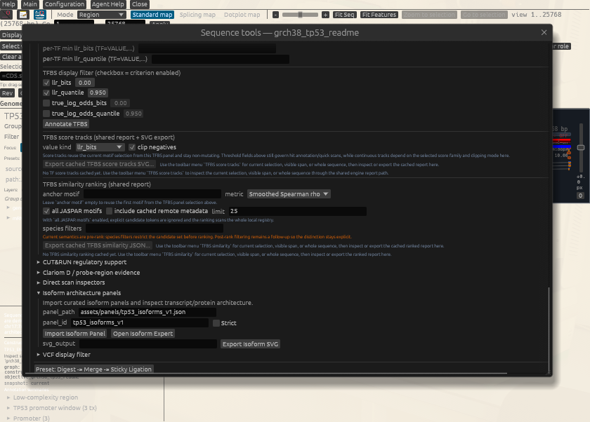
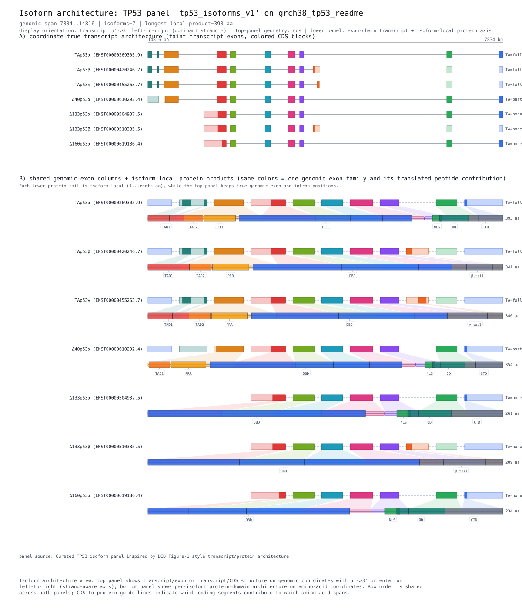
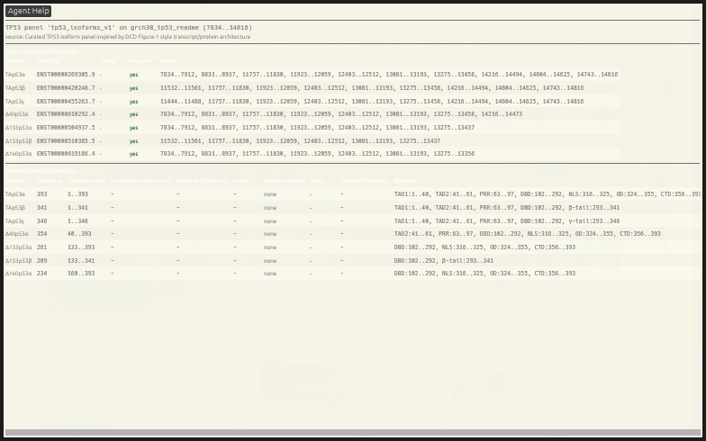

# TP53 isoform architecture expert panel (online)

Build a TP53 locus project and export Figure-1-style transcript/protein isoform architecture from one deterministic engine route.

This chapter demonstrates a publication-oriented use case: derive TP53 from a prepared GRCh38 reference, import a curated isoform panel, and render transcript/protein architecture from the same expert-view payload used by GUI and shell interfaces. The focus is parity and provenance, not manual figure drawing.

## What You Will Accomplish

- Execute an end-to-end isoform-panel workflow using shared engine operations.
- Understand how curated panel JSON joins genome-derived transcripts without GUI-only logic.
- Export deterministic architecture SVG suitable for downstream figure styling.

## Before You Start

**Prerequisites:** Read [Chapter 9: Prepare a reference genome cache (online)](./05-02_prepare_reference_genome_online.md) first.

> **How to Run This Locally**
> Set `GENTLE_TEST_ONLINE=1` and run from the repository root. The workflow prepares/extracts `Human GRCh38 Ensembl 116` from Ensembl FTP, then imports the local curated panel `assets/panels/tp53_isoforms_v1.json` and writes `exports/tp53_isoform_architecture.svg`. For a network-free renderer check only, load `docs/figures/tp53_ensembl116_panel_source.gb` as `grch38_tp53_readme`, import the panel with `strict=true`, and compare against `docs/figures/tp53_isoform_architecture.svg`; this does not validate online preparation or extraction.

**Useful when:**

- You want transcript and protein isoform architecture from one sequence context with explicit panel provenance.
- You need a deterministic SVG baseline for Figure-1-style TP53 isoform presentation.
- You want to preserve the exact panel import and rendering operations in sequence history.

## Walkthrough: GUI, CLI and Inner Agent

Each step pairs GUI instructions with related terminal commands or guidance and a review-only inner-agent prompt. Some steps require GUI interaction; a listing command only inspects results, it does not perform the design. CLI snippets assume an installed `gentle_cli` and use GENtle's default `.gentle_state.json` unless stated otherwise. From a source checkout, replace `gentle_cli` with `cargo run --bin gentle_cli --`. Add `--state PATH` or `--project PATH` for an explicit sandbox; a separate CLI process does not inherit the open GUI project's unsaved state.

In the **GUI Shell**, enter only the shared command inside `gentle_cli shell '...'`, without the executable prefix or outer quotes. Run UI-opening commands there to open windows: a headless CLI returns the UI intent but does not open a GUI. Other terminal commands are not automatically GUI Shell commands. Inner-agent examples request a proposal for review; they are not executed during tutorial generation.

### Step 1: Prepare Human GRCh38 Ensembl 116 and extract gene TP53 into grch38_tp53

**GUI**

Prepare `Human GRCh38 Ensembl 116` and extract gene `TP53` into `grch38_tp53`.

**CLI (terminal)**

```bash
GENTLE_TEST_ONLINE=1 gentle_cli genomes prepare "Human GRCh38 Ensembl 116" --catalog assets/genomes.json --cache-dir data/genomes --timeout-secs 3600
gentle_cli genomes extract-gene "Human GRCh38 Ensembl 116" TP53 --occurrence 1 --output-id grch38_tp53 --catalog assets/genomes.json --cache-dir data/genomes
```

**Ask the inner agent**

> Read `assets/genomes.json`, run a read-only status/preflight for exactly `Human GRCh38 Ensembl 116`, and report that catalog-relative `data/genomes` resolves beneath `assets`. Then propose the network/disk preparation and the separate TP53 occurrence-1 extraction as `grch38_tp53`; expose source URLs, cache writes and output id, and do not execute either mutation until I approve its exact scope.

**Expected**

> The reference is prepared if needed and TP53 is extracted into the stable anchored sequence id `grch38_tp53`.

### Step 2: Open DNA window Engine Ops -> Isoform architecture panels, import assets/panels/tp53_isoforms_v1.json

**GUI**

Open DNA window `Engine Ops -> Isoform architecture panels`, import `assets/panels/tp53_isoforms_v1.json`.

**CLI (terminal)**

```bash
gentle_cli shell 'panels import-isoform grch38_tp53 assets/panels/tp53_isoforms_v1.json --panel-id tp53_isoforms_v1'
gentle_cli shell 'panels inspect-isoform grch38_tp53 tp53_isoforms_v1'
```

**Ask the inner agent**

> Verify that `grch38_tp53` exists and inspect `assets/panels/tp53_isoforms_v1.json` as the seven-isoform TP53 panel before proposing `ImportIsoformPanel` with panel id `tp53_isoforms_v1`. Report strictness and any unresolved transcript mapping explicitly; do not turn panel curation into expression or functional evidence.

**Expected**

> The panel import stores `tp53_isoforms_v1`; the inspect route returns the same isoform-architecture payload that the GUI expert view renders.



*Figure: The current native Sequence tools panel reopened on the retained Ensembl-116 TP53 source. Panel path and id are populated; the unchecked Strict control is the current GUI input state, not evidence about the earlier strict CLI import. Screenshot captured 2026-10-01.*

### Step 3: Open Isoform Expert and export SVG from the same panel context

**GUI**

Open `Isoform Expert` and export SVG from the same panel context.

**CLI (terminal)**

```bash
gentle_cli shell 'panels render-isoform-svg grch38_tp53 tp53_isoforms_v1 exports/tp53_isoform_architecture.svg'
```

**Ask the inner agent**

> Inspect `tp53_isoforms_v1` first and require seven transcript lanes plus seven protein lanes before proposing the SVG write to `exports/tp53_isoform_architecture.svg`. Bind output path and current project state to the proposal, wait for approval before writing, and return the output hash and operation receipt separately from the native GUI screenshot.

**Expected**

> The renderer writes `exports/tp53_isoform_architecture.svg` with deterministic isoform lane ordering.



*Figure: Current deterministic 1200 by 1400 isoform architecture export from the retained Ensembl-116 source and strict seven-isoform panel. Exon-family colours connect coordinate-true transcript geometry with isoform-local protein products. Regenerate with `cargo run --bin gentle_cli -- --state /tmp/tp53-isoform-figure.state.json workflow docs/figures/tp53_isoform_architecture.workflow.json`.*

> SVG text labels: `Isoform architecture: TP53 panel 'tp53_isoforms_v1' on grch38_tp53_readme | genomic span 7834..14816 | isoforms=7 | longest local product=393 aa | display orientation: transcrip...`. If the embedded preview omits text in the GUI, open the linked SVG or use these labels as the figure legend.



*Figure: The native Isoform Expert after strict local import: seven mapped TP53 transcript lanes and seven protein-domain rows from the shared expert payload. Screenshot captured 2026-10-01.*


## Ask an Outer Agent (MCP or ClawBio/OpenClaw)

An outer agent does not inherit the unsaved GUI project. Give it this chapter's canonical workflow and an explicit disposable state path; ask it to retain the structured result, artifacts and reproducibility receipt instead of replacing them with prose.

> Use GENtle's `gentle-cloning` skill to replay `docs/examples/workflows/tp53_isoform_architecture_online.json` against a new disposable state. First report the exact workflow, inputs, state path, outputs and whether the selected route needs confirmation. Do not infer state from an open GUI. Return the structured result, produced artifacts and reproducibility receipt, and state any unmet prerequisite.

Equivalent direct structured request for the generic wrapper:

```json
{
  "schema": "gentle.clawbio_skill_request.v1",
  "mode": "workflow",
  "state_path": "/tmp/gentle-tp53-isoform-architecture-online.state.json",
  "workflow_path": "docs/examples/workflows/tp53_isoform_architecture_online.json",
  "timeout_secs": 7200
}
```

Submitting a direct structured request is an explicit wrapper invocation. If natural language selects a narrower delegated skill and that route mutates state, selects biological material or writes artifacts, the caller must preserve that skill's proposal/approval boundary and approve only the exact bound digest. This tutorial generation step does not invoke an agent or grant approval.

## Interpretation and Reference

## Parameters That Matter

- `ImportIsoformPanel.panel_path / panel_id / strict` (where used: operation 3)
  - Why it matters: Defines which curated panel is loaded and whether transcript mapping mismatches should fail hard.
  - How to derive it: Use `assets/panels/tp53_isoforms_v1.json` and keep `strict=false` for exploratory online mapping so unresolved rows remain visible. The retained Ensembl-116 source maps all seven rows with `strict=true`; switch to strict mode only when source and panel are deliberately locked.
- `RenderIsoformArchitectureSvg.path` (where used: operation 4)
  - Why it matters: Controls deterministic export location used for tutorial artifact retention and figure review.
  - How to derive it: Use a stable project-relative path such as `exports/tp53_isoform_architecture.svg`.

## Applied Concepts

- **Shared Engine Contract** (`shared_engine_contract`): GUI, CLI, shell, and scripting interfaces execute the same operation semantics.
- **Genome Catalog Targeting** (`genome_catalog_targeting`): Prepared genome catalogs, annotation-based gene filters, and anchor extension connect imported entries to genomic context.
- **Isoform Architecture Panels** (`isoform_architecture_panels`): Curated transcript/protein architecture overlays can be imported and rendered as deterministic expert-view SVG outputs.
- **Online Opt-in Execution** (`online_opt_in`): Network-dependent chapters remain explicit opt-in and do not break offline default CI.
- **Artifact Exports** (`artifact_exports`): Representative outputs (CSV/protocol/SVG/text) are retained for auditability and sharing.

## Follow-up Commands

```bash
gentle_cli shell 'panels inspect-isoform grch38_tp53 tp53_isoforms_v1'
gentle_cli save-project tp53_isoform_architecture.project.gentle.json
```

## Checkpoints

- Panel import reports seven transcript lanes and seven protein lanes; any unresolved transcript warning remains explicit.
- Isoform architecture SVG export succeeds with deterministic lane ordering and exon-family colours linking coordinate-true transcript geometry to isoform-local protein products.
- Saved project contains TP53 sequence plus imported panel metadata for replay.

## Tutorial Provenance

- Chapter id: `tp53_isoform_architecture_online`
- Tier: `online`
- Example id: `tp53_isoform_architecture_online`
- Tutorial source JSON: `docs/tutorial/sources/06-03_tp53_isoform_architecture_online.json`
- Workflow file: `docs/examples/workflows/tp53_isoform_architecture_online.json`
- Generated artifact dir: `docs/tutorial/generated/artifacts/tp53_isoform_architecture_online`
- Example test_mode: `online`
- Executed during generation: `no`
- Automated status: `skipped_online`
- Review status: `codex_reviewed`
- Codex reviewed at: `2026-10-01`
- Human reviewed at: `not recorded`
- Execution note: set `GENTLE_TEST_ONLINE=1` before `tutorial-generate` to execute this chapter.
- Inspect the source JSON when you need full option-level detail.

## Feedback

If this tutorial is confusing, execution-stale, biologically suspect, or missing a useful figure, please open the matching tutorial issue template and include the context below.

- Tutorial title: `TP53 isoform architecture expert panel (online)`
- Tutorial/chapter id: `tp53_isoform_architecture_online`
- Step reached:
- Expected vs. actual:
- Interface used: GUI / CLI / Agent Assistant / ClawBio

Paste the Tutorial feedback context here:

```text

```
