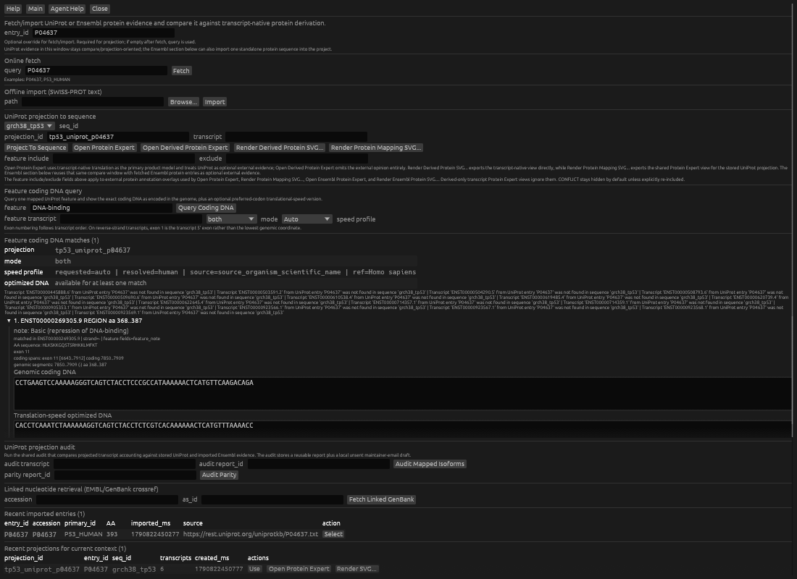

# TP53 UniProt domain mapping and feature-coding DNA query (online)

Build a TP53 locus project, fetch UniProt P04637, map its domains onto the locus, and query which genomic DNA plus exon or exon pair encode one mapped feature.

This chapter demonstrates the UniProt projection workflow as an inspectable bridge from protein annotation back to genomic DNA. Instead of importing a curated protein panel JSON, you fetch the reviewed UniProt TP53 entry, project its reference-protein intervals onto one extracted TP53 locus, inspect the mapped domains through the shared expert canvas, and then query one mapped feature such as `DNA-binding` to recover the exact spliced genomic coding DNA, exon attribution, and an optional translation-speed-oriented coding alternative.

## What You Will Accomplish

- Use one persisted UniProt projection as the canonical bridge from reviewed protein annotation to locus-level transcript/CDS geometry and back to coding DNA.
- Understand that both the protein expert and the feature-coding DNA query are thin views over stored engine state, not separate GUI-only mapping models.
- Recover exact genomic coding DNA plus exon attribution for one mapped protein feature, and compare it with an optional translation-speed-oriented codon choice.

## Before You Start

**Prerequisites:** Read [Chapter 9: Prepare a reference genome cache (online)](./05-02_prepare_reference_genome_online.md) first.

> **How to Run This Locally**
> Set `GENTLE_TEST_ONLINE=1` and run from the repository root. The canonical workflow prepares/extracts GRCh38 Ensembl 116 from Ensembl FTP, fetches reviewed UniProt accession `P04637`, then performs projection and coding-DNA queries locally. For bounded replay when the Ensembl sequence service is unavailable, use `docs/tutorial/reproducibility/tp53_uniprot_projection_online/tp53_grch38_ensembl116.gb`; its GRCh38 bases and Ensembl-116 geometry are hash-bound in the adjacent README. That replay still fetches P04637 online and does not validate reference preparation. Do not use the N-only architecture fixture for coding-DNA interpretation.

**Useful when:**

- You want to compare one gene locus against reviewed UniProt domains or regions without opening a first-class protein sequence window.
- You want to know which spliced genomic DNA and which exon or exon pair encode one mapped feature such as TP53 DNA-binding.
- You want a deterministic TP53 example that keeps one persisted projection record reusable for expert rendering, audit, and follow-up DNA queries.

## At a Glance

1. Prepare Human GRCh38 Ensembl 116 and extract gene TP53 into grch38_tp53.
2. Open File -> Protein Evidence..., fetch P04637, keep entry_id=P04637, choose sequence grch38_tp53, and run Project To Sequence.
3. Inspect the stored projection with Open Protein Expert or export it with Render Protein Mapping SVG... so you can verify how UniProt domains/regions landed on the TP53 transcripts.
4. When resuming a saved project, click Use on tp53_uniprot_p04637 and Select on imported entry P04637 so both contexts are active. In Feature coding DNA query, enter DNA-binding, leave feature transcript empty unless you want to pin one isoform, choose mode=both, and press Query Coding DNA.
5. Read the result panel to see the amino-acid span, genomic coding DNA, optional translation-speed optimized DNA, and the reported exon or exon pair for each matching transcript feature span.

## Walkthrough: GUI, CLI and Inner Agent

Each step pairs GUI instructions with related terminal commands or guidance and a review-only inner-agent prompt. Some steps require GUI interaction; a listing command only inspects results, it does not perform the design. CLI snippets assume an installed `gentle_cli` and use GENtle's default `.gentle_state.json` unless stated otherwise. From a source checkout, replace `gentle_cli` with `cargo run --bin gentle_cli --`. Add `--state PATH` or `--project PATH` for an explicit sandbox; a separate CLI process does not inherit the open GUI project's unsaved state.

In the **GUI Shell**, enter only the shared command inside `gentle_cli shell '...'`, without the executable prefix or outer quotes. Run UI-opening commands there to open windows: a headless CLI returns the UI intent but does not open a GUI. Other terminal commands are not automatically GUI Shell commands. Inner-agent examples request a proposal for review; they are not executed during tutorial generation.

### Step 1: Prepare Human GRCh38 Ensembl 116 and extract gene TP53 into grch38_tp53

**GUI**

Prepare `Human GRCh38 Ensembl 116` and extract gene `TP53` into `grch38_tp53`.

**CLI (terminal)**

```bash
GENTLE_TEST_ONLINE=1 gentle_cli genomes prepare "Human GRCh38 Ensembl 116" --catalog assets/genomes.json --cache-dir data/genomes --timeout-secs 3600
gentle_cli genomes extract-gene "Human GRCh38 Ensembl 116" TP53 --occurrence 1 --output-id grch38_tp53 --catalog assets/genomes.json --cache-dir data/genomes
```

**Ask the inner agent**

> Read `assets/genomes.json` and preflight exactly `Human GRCh38 Ensembl 116`. Propose reference preparation and the separate TP53 occurrence-1 extraction as `grch38_tp53`, exposing both Ensembl URLs, cache writes, timeout and output id. Treat network access, cache mutation and project mutation as separately reviewable; do not claim completion from the retained acceptance fixture.

**Expected**

> The reference is prepared if needed and TP53 is extracted into the anchored sequence id `grch38_tp53`.

### Step 2: Open File -> Protein Evidence..., fetch P04637, keep entry_id=P04637, choose sequence grch38_tp53, and run Project To Sequence

**GUI**

Open `File -> Protein Evidence...`, fetch `P04637`, keep `entry_id=P04637`, choose sequence `grch38_tp53`, and run `Project To Sequence`.

**CLI (terminal)**

```bash
gentle_cli shell 'uniprot fetch P04637 --entry-id P04637'
gentle_cli shell 'uniprot map P04637 grch38_tp53 --projection-id tp53_uniprot_p04637'
```

**Ask the inner agent**

> Verify that `grch38_tp53` contains real A/C/G/T reference bases and transcript/CDS annotations before proposing the live UniProt fetch of `P04637` and projection id `tp53_uniprot_p04637`. After approval, report the fetched source URL, mapped-transcript count and every unmapped transcript warning; partial mapping is not full isoform coverage.

**Expected**

> The reviewed UniProt entry is stored as `P04637`, then projected onto TP53 as `tp53_uniprot_p04637`.

### Step 3: Inspect the stored projection with Open Protein Expert or export it with Render Protein Mapping SVG... so you can verify how UniProt domains/regions landed on the TP53 transcripts

**GUI**

Inspect the stored projection with `Open Protein Expert` or export it with `Render Protein Mapping SVG...` so you can verify how UniProt domains/regions landed on the TP53 transcripts.

**CLI (terminal)**

```bash
gentle_cli inspect-feature-expert grch38_tp53 uniprot-projection tp53_uniprot_p04637
gentle_cli render-feature-expert-svg grch38_tp53 uniprot-projection tp53_uniprot_p04637 exports/tp53_uniprot_projection.svg
```

**Ask the inner agent**

> Inspect the stored projection before proposing the project-relative SVG write. Distinguish transcript-native rows from UniProt-consistent, low-confidence-external and derived-only rows, and return the artifact path/hash separately from any native screenshot.

**Expected**

> The shared expert inspection and SVG export expose the same projected domain geometry used by the GUI Protein Expert.


*Figure: The native Protein Expert on the provenance-bound GRCh38/Ensembl-116 acceptance locus. Six UniProt-linked transcript projections are stored; the expert also keeps the broader transcript-native architecture and 16 missing UniProt transcript references explicit instead of hiding partial coverage. Screenshot captured 2026-10-01.*

### Step 4: When resuming a saved project, click Use on tp53_uniprot_p04637 and Select on imported entry P04637 so both contexts are active. In Feature coding DNA query, enter DNA-binding, leave feature transcript empty unless you want to pin one isoform, choose mode=both, and press Query Coding DNA

**GUI**

When resuming a saved project, click `Use` on `tp53_uniprot_p04637` and `Select` on imported entry `P04637` so both contexts are active. In `Feature coding DNA query`, enter `DNA-binding`, leave `feature transcript` empty unless you want to pin one isoform, choose `mode=both`, and press `Query Coding DNA`.

**CLI (terminal)**

```bash
gentle_cli shell 'uniprot feature-coding-dna tp53_uniprot_p04637 DNA-binding --mode both --speed-profile human'
```

**Ask the inner agent**

> Resolve the exact stored projection and its imported P04637 entry (the native resume path uses `Use` on the projection row and `Select` on the entry row), query `DNA-binding` with `mode=both`, and report transcript, amino-acid span, exon attribution, strand and genomic DNA. Label the preferred-codon sequence as a designed alternative, never as observed genomic evidence; refuse sequence-specific interpretation when the locus contains only placeholder or ambiguous bases.

**Expected**

> The coding-DNA query reports genomic-as-encoded and optimized alternatives for mapped `DNA-binding` feature spans.



*Figure: The expanded native coding-DNA result for the P04637 DNA-binding match on ENST00000269305.9: amino acids 368-387, exon 11, 60 bases of exact genomic coding DNA and a separately labelled translation-speed-oriented alternative. Screenshot captured 2026-10-01.*

### Step 5: Read the result panel to see the amino-acid span, genomic coding DNA, optional translation-speed optimized DNA, and the reported exon or exon pair for each matching transcript feature span

**GUI**

Read the result panel to see the amino-acid span, genomic coding DNA, optional translation-speed optimized DNA, and the reported exon or exon pair for each matching transcript feature span.

**CLI (terminal)**

```bash
gentle_cli shell 'uniprot projection-show tp53_uniprot_p04637'
```

**Ask the inner agent**

> Read back the persisted projection and query result without mutation. Preserve the 16 missing-transcript warnings from the reviewed P04637/Ensembl-116 pairing and explain that the result is one feature match, not a claim that every TP53 isoform is covered.

**Expected**

> Projection inspection keeps the transcript, feature, and evidence metadata available for audit after the GUI panel is closed.


## Ask an Outer Agent (MCP or ClawBio/OpenClaw)

An outer agent does not inherit the unsaved GUI project. Give it this chapter's canonical workflow and an explicit disposable state path; ask it to retain the structured result, artifacts and reproducibility receipt instead of replacing them with prose.

> Use GENtle's `gentle-cloning` skill to replay `docs/examples/workflows/tp53_uniprot_projection_online.json` against a new disposable state. First report the exact workflow, inputs, state path, outputs and whether the selected route needs confirmation. Do not infer state from an open GUI. Return the structured result, produced artifacts and reproducibility receipt, and state any unmet prerequisite.

Equivalent direct structured request for the generic wrapper:

```json
{
  "schema": "gentle.clawbio_skill_request.v1",
  "mode": "workflow",
  "state_path": "/tmp/gentle-tp53-uniprot-projection-online.state.json",
  "workflow_path": "docs/examples/workflows/tp53_uniprot_projection_online.json",
  "timeout_secs": 7200
}
```

Submitting a direct structured request is an explicit wrapper invocation. If natural language selects a narrower delegated skill and that route mutates state, selects biological material or writes artifacts, the caller must preserve that skill's proposal/approval boundary and approve only the exact bound digest. This tutorial generation step does not invoke an agent or grant approval.

## Interpretation and Reference

## Parameters That Matter

- `FetchUniprotSwissProt.query / entry_id` (where used: operation 3)
  - Why it matters: Pins the reviewed UniProt entry that will contribute the protein coordinate system and interval annotations.
  - How to derive it: Use a stable accession or reviewed UniProt id. For the canonical TP53 example, `P04637` is the expected reviewed entry.
- `ProjectUniprotToGenome.projection_id / transcript_id` (where used: operation 4)
  - Why it matters: The projection id becomes the durable handle reused by the GUI recent-projection list and the shared expert-render route. Leaving `transcript_id=null` lets the UniProt Ensembl transcript xrefs drive the full TP53 projection set.
  - How to derive it: Use a stable project-specific id such as `tp53_uniprot_p04637`. Supply `transcript_id` later only when you intentionally want a single-transcript projection.
- `RenderFeatureExpertSvg.target / path` (where used: operation 5)
  - Why it matters: Confirms that the projection can be reopened through the shared feature-expert route and exported reproducibly.
  - How to derive it: Use `UniprotProjection` with the stored projection id and a stable project-relative output path such as `exports/tp53_uniprot_projection.svg`.
- `query_uniprot_feature_coding_dna.feature_query / transcript_id` (where used: GUI follow-up or shell follow-up after projection)
  - Why it matters: The feature query chooses which mapped UniProt interval you want to trace back to coding DNA, while `transcript_id` narrows the report to one isoform when the projection stored multiple TP53 transcripts.
  - How to derive it: Use a case-insensitive mapped feature substring such as `DNA-binding`, `activation`, or `DOMAIN`. Leave `transcript_id` empty until you need to pin one transcript.
- `query_uniprot_feature_coding_dna.mode / translation_speed_profile` (where used: GUI follow-up or shell follow-up after projection)
  - Why it matters: Controls whether you inspect only the exact genomic coding DNA or also a preferred-codon translation-speed-oriented alternative for the same amino-acid interval.
  - How to derive it: Use `mode=both` for this tutorial so you can compare the genomic sequence with the optimized alternative. Keep the speed profile on `Auto` in the GUI or choose `human` explicitly in shell/CLI for TP53.

## Applied Concepts

- **Shared Engine Contract** (`shared_engine_contract`): GUI, CLI, shell, and scripting interfaces execute the same operation semantics.
- **Genome Catalog Targeting** (`genome_catalog_targeting`): Prepared genome catalogs, annotation-based gene filters, and anchor extension connect imported entries to genomic context.
- **UniProt Projection Mapping** (`uniprot_projection_mapping`): Reviewed UniProt protein annotations can be projected onto transcript/CDS geometry and reopened as one persisted expert-view artifact.
- **Feature Coding-DNA Attribution** (`feature_coding_dna_attribution`): A persisted UniProt projection can be queried for the exact coding DNA, exon attribution, and splice-junction exon pairs that encode one mapped protein feature.
- **Expert View Parity** (`expert_view_parity`): The same expert-view payloads should be inspectable and renderable from GUI, CLI, and other adapters without frontend-only projection logic.
- **Online Opt-in Execution** (`online_opt_in`): Network-dependent chapters remain explicit opt-in and do not break offline default CI.
- **Artifact Exports** (`artifact_exports`): Representative outputs (CSV/protocol/SVG/text) are retained for auditability and sharing.

## Follow-up Commands

```bash
gentle_cli shell 'uniprot projection-show tp53_uniprot_p04637'
gentle_cli inspect-feature-expert grch38_tp53 uniprot-projection tp53_uniprot_p04637
gentle_cli render-feature-expert-svg grch38_tp53 uniprot-projection tp53_uniprot_p04637 exports/tp53_uniprot_projection.svg
gentle_cli shell 'uniprot feature-coding-dna tp53_uniprot_p04637 DNA-binding --mode both --speed-profile human'
```

## Checkpoints

- UniProt fetch/import reports reviewed TP53 entry P04637 and its exact source URL; projection stores `tp53_uniprot_p04637`, reports six mapped transcripts for the reviewed Ensembl-116 fixture and preserves all 16 missing-transcript warnings.
- Open Protein Expert shows the transcript-native TP53 rows and clearly distinguishes UniProt-consistent, low-confidence-external and derived-only protein rows rather than implying complete external coverage.
- Protein-mapping SVG export succeeds directly from the UniProt specialist without requiring a separate protein sequence window.
- The feature-coding DNA query reports one P04637 `DNA-binding` match on ENST00000269305.9 at amino acids 368-387: 60 coding-strand bases from exon 11 plus a separately labelled 60-base optimized alternative. Ambiguous placeholder bases remain `N`, never invisible spaces or interpretable genomic evidence.

## Tutorial Provenance

- Chapter id: `tp53_uniprot_projection_online`
- Tier: `online`
- Example id: `tp53_uniprot_projection_online`
- Tutorial source JSON: `docs/tutorial/sources/06-04_tp53_uniprot_projection_online.json`
- Workflow file: `docs/examples/workflows/tp53_uniprot_projection_online.json`
- Generated artifact dir: `docs/tutorial/generated/artifacts/tp53_uniprot_projection_online`
- Example test_mode: `online`
- Executed during generation: `no`
- Automated status: `skipped_online`
- Review status: `codex_reviewed`
- Codex reviewed at: `2026-10-01`
- Human reviewed at: `not recorded`
- Execution note: set `GENTLE_TEST_ONLINE=1` before `tutorial-generate` to execute this chapter.
- Inspect the source JSON when you need full option-level detail.

## Feedback

If this tutorial is confusing, execution-stale, biologically suspect, or missing a useful figure, please open the matching tutorial issue template and include the context below.

- Tutorial title: `TP53 UniProt domain mapping and feature-coding DNA query (online)`
- Tutorial/chapter id: `tp53_uniprot_projection_online`
- Step reached:
- Expected vs. actual:
- Interface used: GUI / CLI / Agent Assistant / ClawBio

Paste the Tutorial feedback context here:

```text

```
