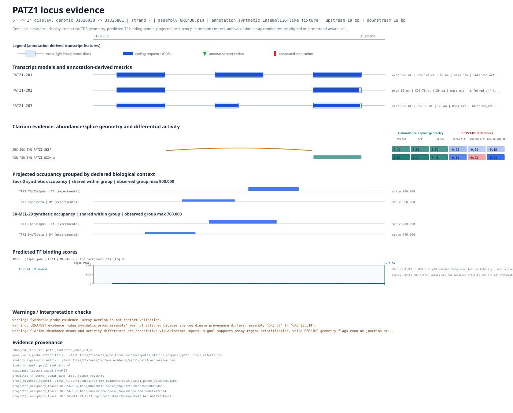

# PATZ1 Gene-Locus Evidence Composition (Offline Synthetic Demo)

Compose one reproducible, strand-aware locus figure from PATZ1-like transcript models, cDNA/EST and array constraints, two probe-effect contrasts, grouped occupancy tracks, and a TP73 motif score track without network access.

Gene-centered interpretation becomes difficult when transcript order, genomic coordinates, probe geometry, occupancy tracks, and assay evidence are inspected in separate tools. GENtle's Gene Locus Evidence composer keeps these sources distinct but aligns them on one axis. This chapter uses an artificial 240 bp region labelled as a negative-strand PATZ1 locus. Its transcript models, PSR/JUC rows, effect values, occupancy intervals, and expression values are synthetic and exist only to make every transformation inspectable offline.

Read the figure as a structured evidence ledger. A probe interval or junction marker identifies where an array design interrogates the locus; its colored cells show raw activity differences, not statistical significance. An occupancy interval reports a projected experimental track at the locus, not the affected isoform. A motif score is a sequence-model result, not proof of binding. The shared visual axis helps formulate validation experiments while preserving those boundaries.

**Prerequisites:** Read [Chapter 10: TP53 isoform architecture expert panel (online)](./06-03_tp53_isoform_architecture_online.md), [Chapter 13: Selection-first PCR batch primer design (offline)](./04-02_pcr_selection_batch_primer_pairs_offline.md) first.

## Parameters That Matter

- `upstream_bp=19 / downstream_bp=19` (where used: GeneLocusEvidenceDisplayRequest)
  - Why it matters: The synthetic gene spans local bases 21..220; 19 bp flanks retain the full requested context without clipping at the 240 bp sequence boundaries.
  - How to derive it: Use the fixture gene span and subtract one base from each 20 bp boundary margin.
- `probe_effect_coordinate_system=GRCh38.p14` (where used: Probe-effect overlay projection)
  - Why it matters: GENtle rejects effect geometry when its declared coordinate system does not match the sequence anchor.
  - How to derive it: Read the genome id from the loaded sequence anchor and the fixture README; do not infer it from the filename.
- `occupancy scale_mode=shared_group` (where used: Saos-2 and SK-MEL-29 occupancy groups)
  - Why it matters: TA and DN lanes are comparable within each declared synthetic context, while the two contexts are not silently forced onto one common scale.
  - How to derive it: Use the explicit occupancy layout rather than grouping tracks by filename heuristics.
- `motif=TP73 / score_kind=llr_background_tail_log10` (where used: Motif score track)
  - Why it matters: The score track shows where the local sequence model ranks TP73-like sites; it is not an occupancy or causality call.
  - How to derive it: Use the local JASPAR TP73 entry resolved by GENtle and retain its matrix id in report provenance.

## When This Routine Is Useful

- You want to inspect transcript architecture and multiple evidence layers in one gene-centered figure.
- You need a deterministic negative-strand example before loading a full Ensembl locus.
- You want to verify that PSR exon probes and JUC junction probes remain visually distinct.
- You want grouped occupancy lanes whose scaling policy is declared rather than inferred from filenames.
- You want a reproducible SVG and machine-readable report path before designing a junction assay.

## What You Learn

- Distinguish transcript 5'-to-3' display order from ascending genomic coordinates on a negative-strand gene.
- Read PSR intervals and JUC junction markers as different array geometries.
- Interpret raw probe effects, motif scores, occupancy tracks, and sequence support as separate evidence layers.
- Use resource readiness and provenance to relocate local evidence files without silently changing coordinate systems.
- Move from an evidence row to an existing qPCR report or transcript-aware junction-assay design without claiming validation.

## Applied Concepts

- **Shared Engine Contract** (`shared_engine_contract`): GUI, CLI, shell, and scripting interfaces execute the same operation semantics.
- **Deterministic Workflows** (`deterministic_workflows`): Operation chains should produce stable IDs and comparable outputs across repeated runs.
- **Genome Catalog Targeting** (`genome_catalog_targeting`): Prepared genome catalogs, annotation-based gene filters, and anchor extension connect imported entries to genomic context.
- **Artifact Exports** (`artifact_exports`): Representative outputs (CSV/protocol/SVG/text) are retained for auditability and sharing.
- **Tutorial Drift Checks** (`tutorial_drift_checks`): Tutorial content is generated from executable examples and verified in automated checks.

## At a Glance

1. Open test_files/fixtures/isoform_evidence/patz1/patz1_minus_strand.gb, import...
2. Select the Evidence tab and enter the committed probe-evidence JSON, cDNA/EST...
3. Import the four small BED files from test_files/fixtures/gene_locus_evidence/...
4. Select Locus figure, choose the committed probe-effect TSV, enter contrasts T...
5. Set upstream and downstream flanks to 19, motif to TP73, score kind to llr_ba...
6. Click Compose / refresh. Inspect the graphical preview, warnings, provenance,...

## GUI First

CLI snippets use GENtle's default `.gentle_state.json` state unless they say otherwise. Add `--state PATH` or `--project PATH` when you want an explicit sandboxed state file for copied commands.

### Step 1: Open test_files/fixtures/isoform_evidence/patz1/patz1_minus_strand.gb, import...

GUI: Open `test_files/fixtures/isoform_evidence/patz1/patz1_minus_strand.gb`, import `patz1_isoform_panel.json` as panel `patz1_synthetic_v1`, and open Splicing Expert for the PATZ1 gene group.

CLI:

```bash
cargo run --bin gentle_cli -- workflow @docs/examples/workflows/patz1_gene_locus_evidence_offline.json
```

> Expected: The loaded 240 bp sequence reports a GRCh38.p14 chromosome-22 anchor and the gene/transcript rows remain on the negative strand.

### Step 2: Select the Evidence tab and enter the committed probe-evidence JSON, cDNA/EST...

GUI: Select the `Evidence` tab and enter the committed probe-evidence JSON, cDNA/EST JSON, and expression TSV. Inspect the ledger before composing the figure; observed evidence, candidate association, design constraint, and unresolved evidence remain separate statuses.

> Expected: The evidence ledger keeps cDNA/EST observations separate from array design constraints and retains the synthetic missing/mismatched evidence warnings.

### Step 3: Import the four small BED files from test_files/fixtures/gene_locus_evidence/...

GUI: Import the four small BED files from `test_files/fixtures/gene_locus_evidence/patz1_offline_composer/` with the exact Saos-2 and SK-MEL-29 track names used by the workflow.

> Expected: Four projected occupancy tracks are present with explicit Saos-2 and SK-MEL-29 identities.

### Step 4: Select Locus figure, choose the committed probe-effect TSV, enter contrasts T...

GUI: Select `Locus figure`, choose the committed probe-effect TSV, enter contrasts `TAp73alpha-GFP, DNp73beta-GFP`, set coordinate system `GRCh38.p14`, and choose `docs/examples/gene_locus_evidence/patz1_cutrun_layout.json`.

> Expected: The request carries one PSR row, one JUC row, and two exact effect contrasts without inferring significance.

### Step 5: Set upstream and downstream flanks to 19, motif to TP73, score kind to llr_ba...

GUI: Set upstream and downstream flanks to `19`, motif to `TP73`, score kind to `llr_background_tail_log10`, clipping on, and top hits to `5`. Confirm the readiness table reports the anchor and local resources before composing.

> Expected: Resource readiness distinguishes readable files from engine-validated project objects, and the motif request resolves through the local JASPAR registry.

### Step 6: Click Compose / refresh. Inspect the graphical preview, warnings, provenance,...

GUI: Click `Compose / refresh`. Inspect the graphical preview, warnings, provenance, and assay continuations; then export SVG, PDF, or report JSON through the shared renderer/operation paths.

> Expected: The SVG contains transcript rows, separate PSR/JUC geometry, both effect columns, two occupancy groups, a TP73 motif track, warnings, and source provenance.



*Figure: A strand-aware synthetic PATZ1 locus composition with transcript models, distinct PSR/JUC effects, grouped occupancy lanes, and a TP73 motif score track. The aligned layers are evidence for inspection, not proof of isoform-specific regulation. Regenerate with `cargo run --bin gentle_examples_docs -- tutorial-generate`.*

> SVG text labels: `PATZ1 locus evidence | 5' -> 3' display, genomic 31326038 -> 31325801 | strand - | assembly GRCh38.p14 | annotation synthetic Ensembl116-like fixture | upstream 19 bp | downstre...`. If the embedded preview omits text in the GUI, open the linked SVG or use these labels as the figure legend.


## Command Equivalent (After GUI)

Run the same routine non-interactively once the GUI flow is clear:

```bash
cargo run --bin gentle_cli -- workflow @docs/examples/workflows/patz1_gene_locus_evidence_offline.json
cargo run --bin gentle_cli -- shell 'workflow @docs/examples/workflows/patz1_gene_locus_evidence_offline.json'
```

## Follow-up Commands

```bash
cargo run --bin gentle_examples_docs -- tutorial-generate
cargo run --bin gentle_examples_docs -- tutorial-check
cargo run --bin gentle_cli -- workflow @docs/examples/workflows/patz1_gene_locus_evidence_offline.json
```

## Checkpoints

- The canonical workflow runs offline and writes `patz1_gene_locus_evidence.svg`.
- The SVG reports `gentle.gene_locus_evidence_display.v1` and preserves the negative-strand axis.
- Stable SVG attributes identify PSR, JUC, both effect contrasts, both occupancy groups, and the TP73 motif matrix.
- The figure labels probe effects as raw activity differences rather than significance.
- Warnings and provenance remain visible instead of being replaced by a biological verdict.

## What This Chapter Produces

- [`artifacts/patz1_gene_locus_evidence_offline/patz1_gene_locus_evidence.svg`](../artifacts/patz1_gene_locus_evidence_offline/patz1_gene_locus_evidence.svg)

  - Embedded above near Step 6; kept here as an audit link.

> SVG text labels: `PATZ1 locus evidence | 5' -> 3' display, genomic 31326038 -> 31325801 | strand - | assembly GRCh38.p14 | annotation synthetic Ensembl116-like fixture | upstream 19 bp | downstre...`. If this embedded preview omits text in the GUI, open the linked SVG or use these labels as the figure legend.


## Tutorial Provenance

- Chapter id: `patz1_gene_locus_evidence_offline`
- Tier: `core`
- Example id: `patz1_gene_locus_evidence_offline`
- Tutorial source JSON: `docs/tutorial/sources/06-06_patz1_gene_locus_evidence_offline.json`
- Workflow file: `docs/examples/workflows/patz1_gene_locus_evidence_offline.json`
- Generated artifact dir: `docs/tutorial/generated/artifacts/patz1_gene_locus_evidence_offline`
- Example test_mode: `always`
- Executed during generation: `yes`
- Automated status: `passing`
- Review status: `codex_reviewed`
- Codex reviewed at: `2026-07-19`
- Human reviewed at: `not recorded`
- Inspect the source JSON when you need full option-level detail.

## Feedback

If this tutorial is confusing, execution-stale, biologically suspect, or missing a useful figure, please open the matching tutorial issue template and include the context below.

- Tutorial title: `PATZ1 Gene-Locus Evidence Composition (Offline Synthetic Demo)`
- Tutorial/chapter id: `patz1_gene_locus_evidence_offline`
- Step reached:
- Expected vs. actual:
- Interface used: GUI / CLI / Agent Assistant / ClawBio

Paste the Tutorial feedback context here:

```text

```
