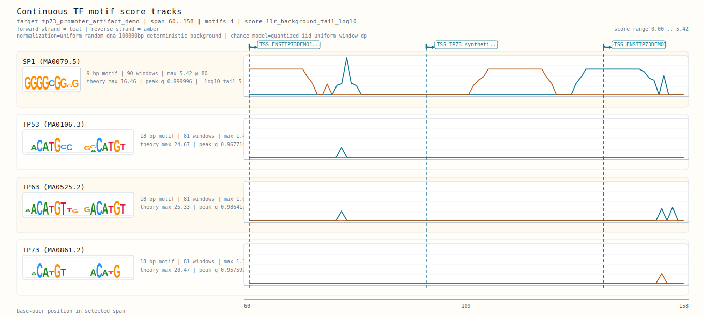

# Promoter Design Artifact Slice (Offline Synthetic TP73 Locus)

Learn how GENtle turns a TP73-like annotated locus into promoter windows, promoter evidence tables, expression-linked promoter groups, TFBS score tracks, similarity rankings, and a manifest of reusable artifacts.

Promoter design begins by asking where transcription is likely to start for each transcript and which DNA span should be treated as the upstream regulatory context. GENtle first derives promoter windows around transcript starts, then collapses transcript-level interpretations that point to the same DNA span. It then collects evidence into portable artifacts: an alternative-promoter summary, a promoter evidence matrix, an isoform promoter comparison, expression evidence linked by transcript id, TFBS score-track graphics, TFBS similarity rankings, and a manifest that lets GUI users, CLI users, or ClawBio-style consumers choose their own presentation.

This tutorial uses a synthetic 249 bp TP73-labeled locus with two transcripts sharing one 5' boundary, one alternative-start transcript, and local annotation evidence. It is not making a biological claim about TP73. The small artificial locus keeps the algorithm visible: every promoter window, evidence row, and plotted TFBS score can be traced back to a short local sequence without requiring an online genome fetch.

**Prerequisites:** Read [Chapter 1: Load FASTA, branch, and reverse-complement](./02-01_load_branch_reverse_complement_pgex_fasta.md), [Chapter 7: Guide oligo export (CSV + protocol)](./04-05_guides_export_csv_and_protocol.md), [Chapter 8: Contribute to GENtle development](./01-02_contribute_to_gentle_development.md) first.

## Parameters That Matter

- `promoter_upstream_bp=40 / promoter_downstream_bp=15` (where used: AnnotatePromoterWindows, SummarizeAlternativePromoterComparison, SummarizePromoterEvidenceMatrix, SummarizeIsoformPromoterComparison, SummarizePromoterExpressionEvidence)
  - Why it matters: The synthetic locus is deliberately tiny; these values create readable promoter windows around TSS positions 101 and 141.
  - How to derive it: Use the fixed tutorial values so the shared TSS pair collapses to local span `60..116` and the alternative start produces `100..156`.
- `expression rows for ENSTTP73DEMO1, ENSTTP73DEMO2, and ENSTTP73DEMO3` (where used: SummarizePromoterExpressionEvidence)
  - Why it matters: Expression evidence is deliberately externalized as rows/artifact references so GENtle can attach it to promoter groups without inventing a biological conclusion.
  - How to derive it: Use transcript IDs from the synthetic mRNA features; real workflows would supply RNA-seq, qPCR, or ClawBio-provided abundance rows.
- `target span 60..158` (where used: SummarizeTfbsScoreTracks, RenderTfbsScoreTracksSvg, SummarizeTfbsTrackSimilarity)
  - Why it matters: This span covers both promoter windows plus the synthetic SP1 and TP73-like TFBS sites.
  - How to derive it: Use the coordinate range printed by the workflow or the Promoter design score-track range seeded from the evidence rows.
- `motifs SP1,TP53,TP63,TP73 and similarity candidates TP53,TP63,TP73,CTCF` (where used: TF score tracks and TFBS similarity ranking)
  - Why it matters: The motif set keeps the demo close to TP73/p53-family promoter reasoning while still producing a compact ranking table.
  - How to derive it: Use the exact tokens in this chapter; they resolve through GENtle's shared local JASPAR query layer.

## When This Routine Is Useful

- You want a fast offline Promoter design example before prepared Ensembl data are available.
- You want to verify that transcript-derived promoter windows collapse by DNA span instead of stacking duplicate promoter symbols.
- You want a compact promoter evidence matrix with transcript, TFBS, variant, repeat, and CUT&RUN-style interval evidence.
- You want to compare common and differential promoter-region evidence between isoform starts of the same gene.
- You want to attach downstream transcript/gene expression evidence to promoter candidates without forcing GENtle to write the final story.
- You want to understand why single-promoter TFBS signals need matched foreground/control comparison before being treated as enrichment evidence.

## What You Learn

- Run the GUI-facing Promoter design controls through the same shared engine operations used by CLI and automation.
- Inspect the boundary between GENtle-owned component artifacts and downstream ClawBio/OpenClaw narrative assembly.
- Recognize the difference between transcript-level promoter interpretation and collapsed DNA-level promoter candidates.
- Compare common and unique promoter-region evidence between isoforms of the same gene.
- Attach expression-level evidence to promoter groups through a structured report instead of free-text reasoning.
- Explain why TFBS score tracks and similarity rankings are screening artifacts that need control-set follow-up before motif-enrichment claims.
- Use one synthetic input to exercise JSON and SVG exports deterministically.

## Applied Concepts

- **Shared Engine Contract** (`shared_engine_contract`): GUI, CLI, shell, and scripting interfaces execute the same operation semantics.
- **Deterministic Workflows** (`deterministic_workflows`): Operation chains should produce stable IDs and comparable outputs across repeated runs.
- **Promoter Motif Controls** (`promoter_motif_controls`): Foreground promoter motif signals should be compared with matched controls before being treated as candidate enrichment, depletion, or co-occurrence evidence.
- **Artifact Exports** (`artifact_exports`): Representative outputs (CSV/protocol/SVG/text) are retained for auditability and sharing.
- **Tutorial Drift Checks** (`tutorial_drift_checks`): Tutorial content is generated from executable examples and verified in automated checks.

## At a Glance

1. Open docs/examples/assets/tp73_promoter_artifact_demo.gb via File -> Open Seq...
2. Open Promoter design from the TP73 gene or one of the TP73-demo-* mRNA features.
3. Set Gene label to TP73, promoter upstream bp to 40, and promoter downstream b...
4. Click Annotate promoter windows, then Compare alternative promoters; confirm ...
5. Click Build evidence matrix; confirm the shared promoter row reports 2 tx and...
6. Run the isoform promoter comparison; confirm that the shared TSS transcripts ...
7. Load or paste expression rows for the TP73 demo transcripts; confirm that exp...
8. Set TF motifs to SP1,TP53,TP63,TP73, run Show TF score tracks, then export TF...
9. Set TFBS similarity anchor to SP1, compare against TP53,TP63,TP73,CTCF, run S...
10. Inspect the component manifest to see which JSON/SVG artifacts were produced;...

## GUI First

CLI snippets use GENtle's default `.gentle_state.json` state unless they say otherwise. Add `--state PATH` or `--project PATH` when you want an explicit sandboxed state file for copied commands.

### Step 1: Open docs/examples/assets/tp73_promoter_artifact_demo.gb via File -> Open Seq...

GUI: Open `docs/examples/assets/tp73_promoter_artifact_demo.gb` via `File -> Open Sequence...`.

CLI:

```bash
cargo run --bin gentle_cli -- workflow @docs/examples/workflows/promoter_design_artifact_slice_offline.json
```

> Expected: The canonical workflow loads the synthetic TP73-like locus under `tp73_promoter_artifact_demo` and writes the promoter artifact bundle.

### Step 2: Open Promoter design from the TP73 gene or one of the TP73-demo-* mRNA features

GUI: Open `Promoter design` from the `TP73` gene or one of the `TP73-demo-*` mRNA features.

CLI:

```bash
cargo run --bin gentle_cli -- shell 'variant annotate-promoters tp73_promoter_artifact_demo --gene-label TP73 --upstream-bp 40 --downstream-bp 15 --collapse transcript'
```

> Expected: Promoter-window controls resolve against the TP73 gene/mRNA features in the same shared engine state.

### Step 3: Set Gene label to TP73, promoter upstream bp to 40, and promoter downstream b...

GUI: Set `Gene label` to `TP73`, `promoter upstream bp` to `40`, and `promoter downstream bp` to `15`.

CLI:

```bash
cargo run --bin gentle_cli -- shell 'variant annotate-promoters tp73_promoter_artifact_demo --gene-label TP73 --upstream-bp 40 --downstream-bp 15 --collapse transcript'
```

> Expected: The window parameters are the tiny-locus tutorial values used by all downstream promoter reports.

### Step 4: Click Annotate promoter windows, then Compare alternative promoters; confirm ...

GUI: Click `Annotate promoter windows`, then `Compare alternative promoters`; confirm that three transcript-level interpretations collapse into two DNA-level promoter windows.

CLI:

```bash
cargo run --bin gentle_cli -- workflow @docs/examples/workflows/promoter_design_artifact_slice_offline.json
```

> Expected: `alternative_promoters.json` reports three transcript windows collapsed into two DNA-level promoter windows.

### Step 5: Click Build evidence matrix; confirm the shared promoter row reports 2 tx and...

GUI: Click `Build evidence matrix`; confirm the shared promoter row reports `2 tx` and that evidence kinds include promoter geometry, transcript support, promoter annotation, TFBS, variant, repeat, and CUT&RUN-style overlap evidence.

CLI:

```bash
cargo run --bin gentle_cli -- shell 'features promoter-evidence-matrix tp73_promoter_artifact_demo --gene-label TP73 --promoter-upstream-bp 40 --promoter-downstream-bp 15 --path artifacts/tp73_promoter_artifact_demo.evidence_matrix.json'
```

> Expected: `evidence_matrix.json` contains two promoter candidates and shows the shared promoter with `2 tx` support plus multiple evidence kinds.

### Step 6: Run the isoform promoter comparison; confirm that the shared TSS transcripts ...

GUI: Run the isoform promoter comparison; confirm that the shared TSS transcripts and alternative-start transcript are compared as separate promoter groups with differential evidence signatures.

CLI:

```bash
cargo run --bin gentle_cli -- shell 'features promoter-isoform-comparison tp73_promoter_artifact_demo --gene-label TP73 --promoter-upstream-bp 40 --promoter-downstream-bp 15 --path artifacts/tp73_promoter_artifact_demo.isoform_promoter_comparison.json'
```

> Expected: `isoform_promoter_comparison.json` separates the shared-TSS and alternative-start promoter groups.

### Step 7: Load or paste expression rows for the TP73 demo transcripts; confirm that exp...

GUI: Load or paste expression rows for the TP73 demo transcripts; confirm that expression evidence attaches to the matching promoter groups rather than becoming a GUI-only note.

CLI:

```bash
cargo run --bin gentle_cli -- shell 'features promoter-expression-evidence tp73_promoter_artifact_demo --gene-label TP73 --promoter-upstream-bp 40 --promoter-downstream-bp 15 --source-label synthetic_demo --expression-json {"transcript_id":"ENSTTP73DEMO1","value":18.0,"unit":"a.u."} --path artifacts/tp73_promoter_artifact_demo.promoter_expression_evidence.json'
```

> Expected: `promoter_expression_evidence.json` links the synthetic expression rows to promoter groups through transcript IDs.

### Step 8: Set TF motifs to SP1,TP53,TP63,TP73, run Show TF score tracks, then export TF...

GUI: Set TF motifs to `SP1,TP53,TP63,TP73`, run `Show TF score tracks`, then export `TF score tracks SVG...` for the visual artifact.

CLI:

```bash
cargo run --bin gentle_cli -- shell 'features tfbs-score-tracks-svg tp73_promoter_artifact_demo artifacts/tp73_promoter_artifact_demo.tfbs_score_tracks.svg --motif SP1 --motif TP53 --motif TP63 --motif TP73 --range 60..158 --score-kind llr_background_tail_log10'
```

> Expected: `tfbs_score_tracks.svg` is written and embedded below as the visual output of the chapter.



*Figure: TFBS score tracks across the synthetic TP73 promoter slice. Regenerate with `cargo run --bin gentle_examples_docs -- tutorial-generate`.*

> SVG text labels: `Continuous TF motif score tracks | target=tp73_promoter_artifact_demo | span=60..158 | motifs=4 | score=llr_background_tail_log10 | forward strand = teal | reverse strand = ambe...`. If the embedded preview omits text in the GUI, open the linked SVG or use these labels as the figure legend.

### Step 9: Set TFBS similarity anchor to SP1, compare against TP53,TP63,TP73,CTCF, run S...

GUI: Set TFBS similarity anchor to `SP1`, compare against `TP53,TP63,TP73,CTCF`, run `Show TFBS similarity ranking`, then export the JSON ranking.

CLI:

```bash
cargo run --bin gentle_cli -- shell 'features tfbs-track-similarity tp73_promoter_artifact_demo --anchor-motif SP1 --candidate-motif TP53 --candidate-motif TP63 --candidate-motif TP73 --candidate-motif CTCF --range 60..158 --ranking-metric smoothed_spearman --score-kind llr_background_tail_log10 --path artifacts/tp73_promoter_artifact_demo.tfbs_similarity.json'
```

> Expected: `tfbs_similarity.json` ranks TP53, TP63, TP73, and CTCF against SP1 using `smoothed_spearman`.

### Step 10: Inspect the component manifest to see which JSON/SVG artifacts were produced;...

GUI: Inspect the component manifest to see which JSON/SVG artifacts were produced; downstream tools can choose their own presentation order.

CLI:

```bash
cargo run --bin gentle_cli -- workflow @docs/examples/workflows/promoter_design_artifact_slice_offline.json
```

> Expected: `promoter_artifact_manifest.json` lists the generated JSON/SVG components so downstream tools can present them in their own order.


## Follow-up Commands

```bash
cargo run --bin gentle_cli -- workflow @docs/examples/workflows/promoter_design_artifact_slice_offline.json
cargo run --bin gentle_cli -- shell 'features promoter-evidence-matrix tp73_promoter_artifact_demo --gene-label TP73 --promoter-upstream-bp 40 --promoter-downstream-bp 15 --path artifacts/tp73_promoter_artifact_demo.evidence_matrix.json'
cargo run --bin gentle_cli -- shell 'features promoter-isoform-comparison tp73_promoter_artifact_demo --gene-label TP73 --promoter-upstream-bp 40 --promoter-downstream-bp 15 --path artifacts/tp73_promoter_artifact_demo.isoform_promoter_comparison.json'
cargo run --bin gentle_cli -- shell 'features promoter-expression-evidence tp73_promoter_artifact_demo --gene-label TP73 --promoter-upstream-bp 40 --promoter-downstream-bp 15 --source-label synthetic_demo --expression-json {"transcript_id":"ENSTTP73DEMO1","value":18.0,"unit":"a.u."} --path artifacts/tp73_promoter_artifact_demo.promoter_expression_evidence.json'
cargo run --bin gentle_cli -- shell 'features tfbs-track-similarity tp73_promoter_artifact_demo --anchor SP1 --candidate TP53 --candidate TP63 --candidate TP73 --candidate CTCF --range 60..158 --score-kind llr_background_tail_log10 --path artifacts/tp73_promoter_artifact_demo.tfbs_similarity.json'
```

## Checkpoints

- The workflow executes offline without warnings beyond the expected alternative-promoter collapse note.
- `alternative_promoters.json` reports `transcript_window_count=3` and `collapsed_window_count=2`.
- `evidence_matrix.json` reports two promoter candidates and includes `cutrun_peak_overlap`, `repeat_context`, `tfbs_annotation`, and `variant_overlap` among observed evidence kinds.
- `isoform_promoter_comparison.json` reports two promoter groups and surfaces differential evidence signatures for the shared versus alternative-start promoter.
- `promoter_expression_evidence.json` assigns three synthetic expression rows to the two promoter groups.
- `promoter_artifact_manifest.json` reports all required promoter component artifacts as present.
- `tfbs_score_tracks.svg` is written and opens as a compact promoter score-track figure.
- `tfbs_similarity.json` ranks four candidates against SP1 using `smoothed_spearman`.

## What This Chapter Produces

- [`artifacts/promoter_design_artifact_slice_offline/artifacts/tp73_promoter_artifact_demo.tfbs_score_tracks.svg`](../artifacts/promoter_design_artifact_slice_offline/artifacts/tp73_promoter_artifact_demo.tfbs_score_tracks.svg)

  - Embedded above near Step 8; kept here as an audit link.

> SVG text labels: `Continuous TF motif score tracks | target=tp73_promoter_artifact_demo | span=60..158 | motifs=4 | score=llr_background_tail_log10 | forward strand = teal | reverse strand = ambe...`. If this embedded preview omits text in the GUI, open the linked SVG or use these labels as the figure legend.

- [`artifacts/promoter_design_artifact_slice_offline/artifacts/tp73_promoter_artifact_demo.alternative_promoters.json`](../artifacts/promoter_design_artifact_slice_offline/artifacts/tp73_promoter_artifact_demo.alternative_promoters.json) - schema: `gentle.alternative_promoter_comparison.v1`
- [`artifacts/promoter_design_artifact_slice_offline/artifacts/tp73_promoter_artifact_demo.evidence_matrix.json`](../artifacts/promoter_design_artifact_slice_offline/artifacts/tp73_promoter_artifact_demo.evidence_matrix.json) - schema: `gentle.promoter_evidence_matrix.v1`
- [`artifacts/promoter_design_artifact_slice_offline/artifacts/tp73_promoter_artifact_demo.isoform_promoter_comparison.json`](../artifacts/promoter_design_artifact_slice_offline/artifacts/tp73_promoter_artifact_demo.isoform_promoter_comparison.json) - schema: `gentle.isoform_promoter_comparison.v1`
- [`artifacts/promoter_design_artifact_slice_offline/artifacts/tp73_promoter_artifact_demo.promoter_artifact_manifest.json`](../artifacts/promoter_design_artifact_slice_offline/artifacts/tp73_promoter_artifact_demo.promoter_artifact_manifest.json) - schema: `gentle.promoter_artifact_manifest.v1`
- [`artifacts/promoter_design_artifact_slice_offline/artifacts/tp73_promoter_artifact_demo.promoter_expression_evidence.json`](../artifacts/promoter_design_artifact_slice_offline/artifacts/tp73_promoter_artifact_demo.promoter_expression_evidence.json) - schema: `gentle.promoter_expression_evidence.v1`
- [`artifacts/promoter_design_artifact_slice_offline/artifacts/tp73_promoter_artifact_demo.tfbs_similarity.json`](../artifacts/promoter_design_artifact_slice_offline/artifacts/tp73_promoter_artifact_demo.tfbs_similarity.json) - schema: `gentle.tfbs_track_similarity.v1`

## Tutorial Provenance

- Chapter id: `promoter_design_artifact_slice_offline`
- Tier: `core`
- Example id: `promoter_design_artifact_slice_offline`
- Tutorial source JSON: `docs/tutorial/sources/08-03_promoter_design_artifact_slice_offline.json`
- Workflow file: `docs/examples/workflows/promoter_design_artifact_slice_offline.json`
- Generated artifact dir: `docs/tutorial/generated/artifacts/promoter_design_artifact_slice_offline`
- Example test_mode: `always`
- Executed during generation: `yes`
- Automated status: `passing`
- Review status: `human_reviewed`
- Codex reviewed at: `not recorded`
- Human reviewed at: `2026-05-18`
- Inspect the source JSON when you need full option-level detail.

## Feedback

If this tutorial is confusing, execution-stale, biologically suspect, or missing a useful figure, please open the matching tutorial issue template and include the context below.

- Tutorial title: `Promoter Design Artifact Slice (Offline Synthetic TP73 Locus)`
- Tutorial/chapter id: `promoter_design_artifact_slice_offline`
- Step reached:
- Expected vs. actual:
- Interface used: GUI / CLI / Agent Assistant / ClawBio

Paste the Tutorial feedback context here:

```text

```
