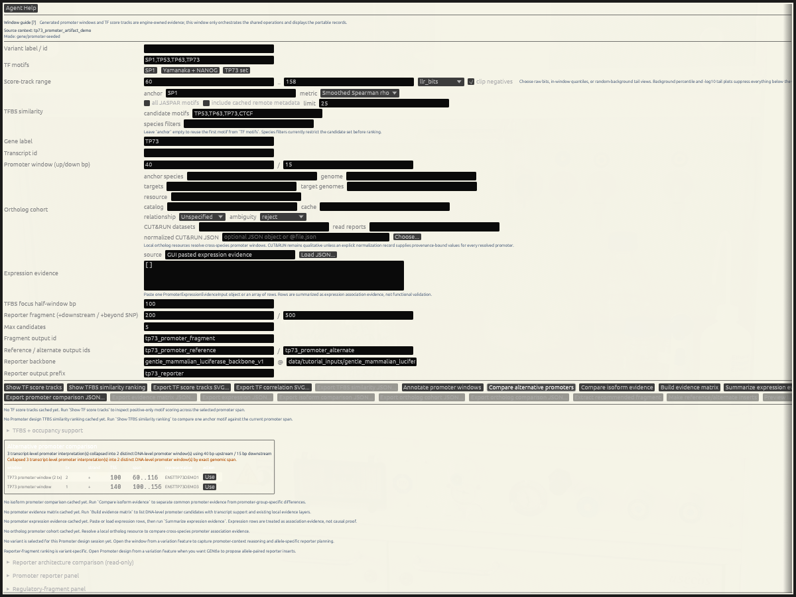
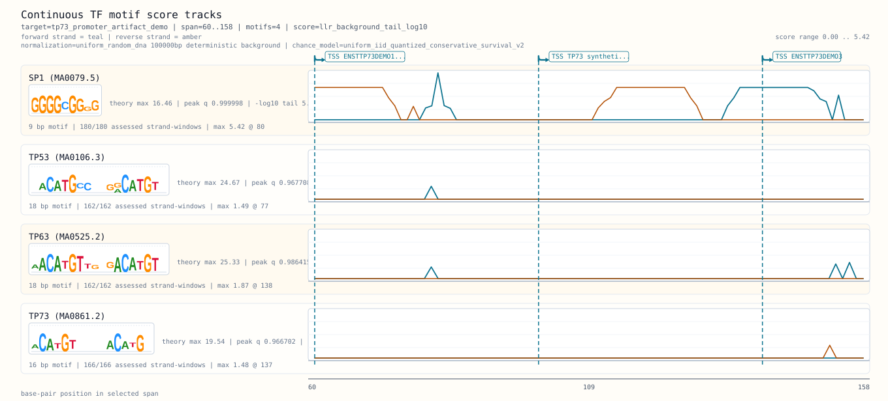

# Promoter Design Artifact Slice (Offline Synthetic TP73 Locus)

Learn how GENtle turns a TP73-like annotated locus into promoter windows, promoter evidence tables, expression-linked promoter groups, TFBS score tracks, similarity rankings, and a manifest of reusable artifacts.

Promoter design begins by asking where transcription is likely to start for each transcript and which DNA span should be treated as the upstream regulatory context. GENtle first derives promoter windows around transcript starts, then collapses transcript-level interpretations that point to the same DNA span. It then collects evidence into portable artifacts: an alternative-promoter summary, a promoter evidence matrix, an isoform promoter comparison, expression evidence linked by transcript id, TFBS score-track graphics, TFBS similarity rankings, and a manifest that lets GUI users, CLI users, or ClawBio-style consumers choose their own presentation.

This tutorial uses a synthetic 249 bp TP73-labeled locus with two transcripts sharing one 5' boundary, one alternative-start transcript, and local annotation evidence. It is not making a biological claim about TP73. The small artificial locus keeps the algorithm visible: every promoter window, evidence row, and plotted TFBS score can be traced back to a short local sequence without requiring an online genome fetch.

The 2026-10-01 review found two operational boundaries worth teaching. Opening Promoter design from an mRNA seeds `Transcript id`; clear that field before expecting the chapter-wide three-to-two promoter collapse. Native grouping and evidence-matrix views then pass. The native TF score-track and similarity actions still terminate the exact reviewed GUI build with a stack overflow, so the generated SVG/JSON prove the shared headless engine only, not GUI acceptance. The same review repaired direct-workflow manifest resolution so a fresh run reports all six just-written artifacts as present instead of accidentally checking `artifacts/artifacts/...`.

## What You Will Accomplish

- Run the GUI-facing Promoter design controls through the same shared engine operations used by CLI and automation.
- Inspect the boundary between GENtle-owned component artifacts and downstream ClawBio/OpenClaw narrative assembly.
- Recognize the difference between transcript-level promoter interpretation and collapsed DNA-level promoter candidates.
- Compare common and unique promoter-region evidence between isoforms of the same gene.
- Attach expression-level evidence to promoter groups through a structured report instead of free-text reasoning.
- Explain why TFBS score tracks and similarity rankings are screening artifacts that need control-set follow-up before motif-enrichment claims.
- Use one synthetic input to exercise JSON and SVG exports deterministically.

## Before You Start

**Prerequisites:** Read [Chapter 1: Load FASTA, branch, and reverse-complement](./02-01_load_branch_reverse_complement_pgex_fasta.md), [Chapter 7: Guide oligo export (CSV + protocol)](./04-05_guides_export_csv_and_protocol.md), [Chapter 8: Contribute to GENtle development](./01-02_contribute_to_gentle_development.md) first.

**Useful when:**

- You want a fast offline Promoter design example before prepared Ensembl data are available.
- You want to verify that transcript-derived promoter windows collapse by DNA span instead of stacking duplicate promoter symbols.
- You want a compact promoter evidence matrix with transcript, TFBS, variant, repeat, and CUT&RUN-style interval evidence.
- You want to compare common and differential promoter-region evidence between isoform starts of the same gene.
- You want to attach downstream transcript/gene expression evidence to promoter candidates without forcing GENtle to write the final story.
- You want to understand why single-promoter TFBS signals need matched foreground/control comparison before being treated as enrichment evidence.

## At a Glance

1. Open docs/examples/assets/tp73_promoter_artifact_demo.gb via File -> Open Sequence....
2. Open Promoter design from the TP73 gene or one of the TP73-demo-* mRNA features. If an mRNA seeded Transcript id, clear it before the chapter-wide comparison; leaving it set intentionally restricts the report to that one transcript.
3. Set Gene label to TP73, leave Transcript id empty, set promoter upstream bp to 40, and set promoter downstream bp to 15.
4. Click Annotate promoter windows, then Compare alternative promoters; confirm that three transcript-level interpretations collapse into two DNA-level promoter windows.
5. Click Build evidence matrix; confirm the shared promoter row reports 2 tx and that evidence kinds include promoter geometry, transcript support, promoter annotation, TFBS, variant, repeat, and CUT&RUN-style overlap evidence.
6. Run the isoform promoter comparison; confirm that the shared TSS transcripts and alternative-start transcript are compared as separate promoter groups with differential evidence signatures.
7. Load or paste expression rows for the TP73 demo transcripts; confirm that expression evidence attaches to the matching promoter groups rather than becoming a GUI-only note.
8. Set TF motifs to SP1,TP53,TP63,TP73 and score range 60..158. On the reviewed build, Show TF score tracks causes a stack overflow; use the generated SVG only as headless-engine evidence until a later exact GUI build passes.
9. Set TFBS similarity anchor to SP1 and candidates to TP53,TP63,TP73,CTCF. The reviewed native action shares the same stack-overflow blocker; the generated JSON is CLI evidence, not a populated-GUI acceptance claim.
10. Inspect the component manifest to see which JSON/SVG artifacts were produced; downstream tools can choose their own presentation order.

## Walkthrough: GUI, CLI and Inner Agent

Each step pairs GUI instructions with related terminal commands or guidance and a review-only inner-agent prompt. Some steps require GUI interaction; a listing command only inspects results, it does not perform the design. CLI snippets assume an installed `gentle_cli` and use GENtle's default `.gentle_state.json` unless stated otherwise. From a source checkout, replace `gentle_cli` with `cargo run --bin gentle_cli --`. Add `--state PATH` or `--project PATH` for an explicit sandbox; a separate CLI process does not inherit the open GUI project's unsaved state.

In the **GUI Shell**, enter only the shared command inside `gentle_cli shell '...'`, without the executable prefix or outer quotes. Run UI-opening commands there to open windows: a headless CLI returns the UI intent but does not open a GUI. Other terminal commands are not automatically GUI Shell commands. Inner-agent examples request a proposal for review; they are not executed during tutorial generation.

### Step 1: Open docs/examples/assets/tp73_promoter_artifact_demo.gb via File -> Open Sequence

**GUI**

Open `docs/examples/assets/tp73_promoter_artifact_demo.gb` via `File -> Open Sequence...`.

**CLI (terminal)**

```bash
gentle_cli workflow @docs/examples/workflows/promoter_design_artifact_slice_offline.json
```

**Ask the inner agent**

> Verify that the current live project contains the 249 bp synthetic sequence `tp73_promoter_artifact_demo`; propose opening Promoter design without claiming access to a separate CLI state. Do not mutate or export until approved.

**Expected**

> The canonical workflow loads the synthetic TP73-like locus under `tp73_promoter_artifact_demo` and writes the promoter artifact bundle.

### Step 2: Open Promoter design from the TP73 gene or one of the TP73-demo-* mRNA features. If an mRNA seeded Transcript id, clear it before the chapter-wide comparison; leaving it set intentionally restricts the report to that one transcript

**GUI**

Open `Promoter design` from the `TP73` gene or one of the `TP73-demo-*` mRNA features. If an mRNA seeded `Transcript id`, clear it before the chapter-wide comparison; leaving it set intentionally restricts the report to that one transcript.

**CLI (terminal)**

```bash
gentle_cli shell 'variant annotate-promoters tp73_promoter_artifact_demo --gene-label TP73 --upstream-bp 40 --downstream-bp 15 --collapse transcript'
```

**Ask the inner agent**

> Report whether Promoter design was opened from the gene or an mRNA. If `Transcript id` is seeded, explain that retaining it produces a one-transcript report and propose clearing it for the chapter-wide comparison; do not silently erase it.

**Expected**

> Promoter-window controls resolve against the TP73 gene/mRNA features in the same shared engine state; an mRNA launch visibly seeds its transcript filter.

### Step 3: Set Gene label to TP73, leave Transcript id empty, set promoter upstream bp to 40, and set promoter downstream bp to 15

**GUI**

Set `Gene label` to `TP73`, leave `Transcript id` empty, set `promoter upstream bp` to `40`, and set `promoter downstream bp` to `15`.

**CLI (terminal)**

```bash
gentle_cli shell 'variant annotate-promoters tp73_promoter_artifact_demo --gene-label TP73 --upstream-bp 40 --downstream-bp 15 --collapse transcript'
```

**Ask the inner agent**

> Propose the exact chapter-wide settings `gene_label=TP73`, empty transcript filter, upstream 40 and downstream 15. State that these are synthetic teaching coordinates, not TP73 biological defaults.

**Expected**

> The empty transcript filter and 40/15 window parameters are the chapter-wide tiny-locus values used by all downstream promoter reports.

### Step 4: Click Annotate promoter windows, then Compare alternative promoters; confirm that three transcript-level interpretations collapse into two DNA-level promoter windows

**GUI**

Click `Annotate promoter windows`, then `Compare alternative promoters`; confirm that three transcript-level interpretations collapse into two DNA-level promoter windows.

**CLI (terminal)**

```bash
gentle_cli workflow @docs/examples/workflows/promoter_design_artifact_slice_offline.json
```

**Ask the inner agent**

> After approval, annotate and compare promoter windows. Verify from the structured report that three transcript interpretations collapse to spans `60..116` and `100..156`; do not infer promoter activity from the grouping.

**Expected**

> `alternative_promoters.json` reports three transcript windows collapsed into two DNA-level promoter windows.



*Figure: The native Promoter design window shows all three transcript interpretations collapsed into two DNA-level promoter windows after clearing the mRNA-seeded transcript filter. Screenshot captured 2026-10-01.*

### Step 5: Click Build evidence matrix; confirm the shared promoter row reports 2 tx and that evidence kinds include promoter geometry, transcript support, promoter annotation, TFBS, variant, repeat, and CUT&RUN-style overlap evidence

**GUI**

Click `Build evidence matrix`; confirm the shared promoter row reports `2 tx` and that evidence kinds include promoter geometry, transcript support, promoter annotation, TFBS, variant, repeat, and CUT&RUN-style overlap evidence.

**CLI (terminal)**

```bash
gentle_cli shell 'features promoter-evidence-matrix tp73_promoter_artifact_demo --gene-label TP73 --promoter-upstream-bp 40 --promoter-downstream-bp 15 --path artifacts/tp73_promoter_artifact_demo.evidence_matrix.json'
```

**Ask the inner agent**

> Build and inspect the evidence matrix only after the promoter settings are bound. Report the two candidates, the shared row's two-transcript support and each observed evidence kind; keep synthetic overlap evidence separate from external validation.

**Expected**

> `evidence_matrix.json` contains two promoter candidates and shows the shared promoter with `2 tx` support plus multiple evidence kinds.


*Figure: The native evidence matrix contains the two collapsed promoter candidates and their promoter geometry, transcript, TFBS, repeat, variant and CUT&RUN-style evidence summaries. Screenshot captured 2026-10-01.*

### Step 6: Run the isoform promoter comparison; confirm that the shared TSS transcripts and alternative-start transcript are compared as separate promoter groups with differential evidence signatures

**GUI**

Run the isoform promoter comparison; confirm that the shared TSS transcripts and alternative-start transcript are compared as separate promoter groups with differential evidence signatures.

**CLI (terminal)**

```bash
gentle_cli shell 'features promoter-isoform-comparison tp73_promoter_artifact_demo --gene-label TP73 --promoter-upstream-bp 40 --promoter-downstream-bp 15 --path artifacts/tp73_promoter_artifact_demo.isoform_promoter_comparison.json'
```

**Ask the inner agent**

> Compare isoform promoter groups using the same empty transcript filter and 40/15 geometry. Distinguish shared versus differential evidence without calling either promoter active.

**Expected**

> `isoform_promoter_comparison.json` separates the shared-TSS and alternative-start promoter groups.

### Step 7: Load or paste expression rows for the TP73 demo transcripts; confirm that expression evidence attaches to the matching promoter groups rather than becoming a GUI-only note

**GUI**

Load or paste expression rows for the TP73 demo transcripts; confirm that expression evidence attaches to the matching promoter groups rather than becoming a GUI-only note.

**CLI (terminal)**

```bash
gentle_cli shell 'features promoter-expression-evidence tp73_promoter_artifact_demo --gene-label TP73 --promoter-upstream-bp 40 --promoter-downstream-bp 15 --source-label synthetic_demo --expression-json {"transcript_id":"ENSTTP73DEMO1","value":18.0,"unit":"a.u."} --path artifacts/tp73_promoter_artifact_demo.promoter_expression_evidence.json'
```

**Ask the inner agent**

> Before attaching expression rows, display the three synthetic transcript IDs, values, units and source label. Treat them as association evidence and require separate approval before writing the report artifact.

**Expected**

> `promoter_expression_evidence.json` links the synthetic expression rows to promoter groups through transcript IDs.

### Step 8: Set TF motifs to SP1,TP53,TP63,TP73 and score range 60..158. On the reviewed build, Show TF score tracks causes a stack overflow; use the generated SVG only as headless-engine evidence until a later exact GUI build passes

**GUI**

Set TF motifs to `SP1,TP53,TP63,TP73` and score range `60..158`. On the reviewed build, `Show TF score tracks` causes a stack overflow; use the generated SVG only as headless-engine evidence until a later exact GUI build passes.

**CLI (terminal)**

```bash
gentle_cli shell 'features tfbs-score-tracks-svg tp73_promoter_artifact_demo artifacts/tp73_promoter_artifact_demo.tfbs_score_tracks.svg --motif SP1 --motif TP53 --motif TP63 --motif TP73 --range 60..158 --score-kind llr_background_tail_log10'
```

**Ask the inner agent**

> For TF score tracks, bind the exact `60..158` span, motif set, score kind and clipping policy. State that the reviewed native button stack-overflows and offer the deterministic CLI/SVG route without presenting it as GUI acceptance.

**Expected**

> `tfbs_score_tracks.svg` is written and embedded as the headless visual artifact; the reviewed native TF score-track action is not accepted because it stack-overflows.



*Figure: TFBS score tracks across the synthetic TP73 promoter slice. Regenerate with `cargo run --bin gentle_examples_docs -- tutorial-generate`.*

> SVG text labels: `Continuous TF motif score tracks | target=tp73_promoter_artifact_demo | span=60..158 | motifs=4 | score=llr_background_tail_log10 | forward strand = teal | reverse strand = ambe...`. If the embedded preview omits text in the GUI, open the linked SVG or use these labels as the figure legend.

### Step 9: Set TFBS similarity anchor to SP1 and candidates to TP53,TP63,TP73,CTCF. The reviewed native action shares the same stack-overflow blocker; the generated JSON is CLI evidence, not a populated-GUI acceptance claim

**GUI**

Set TFBS similarity anchor to `SP1` and candidates to `TP53,TP63,TP73,CTCF`. The reviewed native action shares the same stack-overflow blocker; the generated JSON is CLI evidence, not a populated-GUI acceptance claim.

**CLI (terminal)**

```bash
gentle_cli shell 'features tfbs-track-similarity tp73_promoter_artifact_demo --anchor-motif SP1 --candidate-motif TP53 --candidate-motif TP63 --candidate-motif TP73 --candidate-motif CTCF --range 60..158 --ranking-metric smoothed_spearman --score-kind llr_background_tail_log10 --path artifacts/tp73_promoter_artifact_demo.tfbs_similarity.json'
```

**Ask the inner agent**

> For similarity, bind SP1, the four candidates, Smoothed Spearman, span and score kind. Report the structured ranking as screening evidence only and retain the native-GUI blocker.

**Expected**

> `tfbs_similarity.json` ranks TP53, TP63, TP73, and CTCF against SP1 using `smoothed_spearman`; this does not substitute for the blocked native action.

### Step 10: Inspect the component manifest to see which JSON/SVG artifacts were produced; downstream tools can choose their own presentation order

**GUI**

Inspect the component manifest to see which JSON/SVG artifacts were produced; downstream tools can choose their own presentation order.

**CLI (terminal)**

```bash
gentle_cli workflow @docs/examples/workflows/promoter_design_artifact_slice_offline.json
```

**Ask the inner agent**

> Inspect the component manifest after all outputs exist. Require six present artifacts and zero missing required artifacts, then return their paths and checksums; an outer agent must also return its explicit state path and execution receipt.

**Expected**

> `promoter_artifact_manifest.json` lists the generated JSON/SVG components so downstream tools can present them in their own order.


## Ask an Outer Agent (MCP or ClawBio/OpenClaw)

An outer agent does not inherit the unsaved GUI project. Give it this chapter's canonical workflow and an explicit disposable state path; ask it to retain the structured result, artifacts and reproducibility receipt instead of replacing them with prose.

> Use GENtle's `gentle-cloning` skill to replay `docs/examples/workflows/promoter_design_artifact_slice_offline.json` against a new disposable state. First report the exact workflow, inputs, state path, outputs and whether the selected route needs confirmation. Do not infer state from an open GUI. Return the structured result, produced artifacts and reproducibility receipt, and state any unmet prerequisite.

Equivalent direct structured request for the generic wrapper:

```json
{
  "schema": "gentle.clawbio_skill_request.v1",
  "mode": "workflow",
  "state_path": "/tmp/gentle-promoter-design-artifact-slice-offline.state.json",
  "workflow_path": "docs/examples/workflows/promoter_design_artifact_slice_offline.json",
  "timeout_secs": 300
}
```

Submitting a direct structured request is an explicit wrapper invocation. If natural language selects a narrower delegated skill and that route mutates state, selects biological material or writes artifacts, the caller must preserve that skill's proposal/approval boundary and approve only the exact bound digest. This tutorial generation step does not invoke an agent or grant approval.

## Interpretation and Reference

## Parameters That Matter

- `promoter_upstream_bp=40 / promoter_downstream_bp=15` (where used: AnnotatePromoterWindows, SummarizeAlternativePromoterComparison, SummarizePromoterEvidenceMatrix, SummarizeIsoformPromoterComparison, SummarizePromoterExpressionEvidence)
  - Why it matters: The synthetic locus is deliberately tiny; these values create readable promoter windows around TSS positions 101 and 141.
  - How to derive it: Use the fixed tutorial values so the shared TSS pair collapses to local span `60..116` and the alternative start produces `100..156`.
- `expression rows for ENSTTP73DEMO1, ENSTTP73DEMO2, and ENSTTP73DEMO3` (where used: SummarizePromoterExpressionEvidence)
  - Why it matters: Expression evidence is deliberately externalized as rows/artifact references so GENtle can attach it to promoter groups without inventing a biological conclusion.
  - How to derive it: Use transcript IDs from the synthetic mRNA features; real workflows would supply RNA-seq, qPCR, or ClawBio-provided abundance rows.
- `target span 60..158` (where used: SummarizeTfbsScoreTracks, RenderTfbsScoreTracksSvg, SummarizeTfbsTrackSimilarity)
  - Why it matters: This span covers both promoter windows plus the synthetic SP1 and TP73-like TFBS sites.
  - How to derive it: Use the coordinate range printed by the workflow or the Promoter design score-track range seeded from the evidence rows.
- `motifs SP1,TP53,TP63,TP73 and similarity candidates TP53,TP63,TP73,CTCF` (where used: TF score tracks and TFBS similarity ranking)
  - Why it matters: The motif set keeps the demo close to TP73/p53-family promoter reasoning while still producing a compact ranking table.
  - How to derive it: Use the exact tokens in this chapter; they resolve through GENtle's shared local JASPAR query layer.

## Applied Concepts

- **Shared Engine Contract** (`shared_engine_contract`): GUI, CLI, shell, and scripting interfaces execute the same operation semantics.
- **Deterministic Workflows** (`deterministic_workflows`): Operation chains should produce stable IDs and comparable outputs across repeated runs.
- **Promoter Motif Controls** (`promoter_motif_controls`): Foreground promoter motif signals should be compared with matched controls before being treated as candidate enrichment, depletion, or co-occurrence evidence.
- **Artifact Exports** (`artifact_exports`): Representative outputs (CSV/protocol/SVG/text) are retained for auditability and sharing.
- **Tutorial Drift Checks** (`tutorial_drift_checks`): Tutorial content is generated from executable examples and verified in automated checks.

## Follow-up Commands

```bash
gentle_cli workflow @docs/examples/workflows/promoter_design_artifact_slice_offline.json
gentle_cli shell 'features promoter-evidence-matrix tp73_promoter_artifact_demo --gene-label TP73 --promoter-upstream-bp 40 --promoter-downstream-bp 15 --path artifacts/tp73_promoter_artifact_demo.evidence_matrix.json'
gentle_cli shell 'features promoter-isoform-comparison tp73_promoter_artifact_demo --gene-label TP73 --promoter-upstream-bp 40 --promoter-downstream-bp 15 --path artifacts/tp73_promoter_artifact_demo.isoform_promoter_comparison.json'
gentle_cli shell 'features promoter-expression-evidence tp73_promoter_artifact_demo --gene-label TP73 --promoter-upstream-bp 40 --promoter-downstream-bp 15 --source-label synthetic_demo --expression-json {"transcript_id":"ENSTTP73DEMO1","value":18.0,"unit":"a.u."} --path artifacts/tp73_promoter_artifact_demo.promoter_expression_evidence.json'
gentle_cli shell 'features tfbs-track-similarity tp73_promoter_artifact_demo --anchor-motif SP1 --candidate-motif TP53 --candidate-motif TP63 --candidate-motif TP73 --candidate-motif CTCF --range 60..158 --ranking-metric smoothed_spearman --score-kind llr_background_tail_log10 --path artifacts/tp73_promoter_artifact_demo.tfbs_similarity.json'
```

## Checkpoints

- A fresh direct workflow executes offline and its manifest reports six present artifacts with zero missing required artifacts.
- `alternative_promoters.json` reports `transcript_window_count=3` and `collapsed_window_count=2`.
- `evidence_matrix.json` reports two promoter candidates and includes `cutrun_peak_overlap`, `repeat_context`, `tfbs_annotation`, and `variant_overlap` among observed evidence kinds.
- `isoform_promoter_comparison.json` reports two promoter groups and surfaces differential evidence signatures for the shared versus alternative-start promoter.
- `promoter_expression_evidence.json` assigns three synthetic expression rows to the two promoter groups.
- `promoter_artifact_manifest.json` reports all required promoter component artifacts as present.
- `tfbs_score_tracks.svg` is written and opens as a compact promoter score-track figure.
- `tfbs_similarity.json` ranks four candidates against SP1 using `smoothed_spearman`.
- Native alternative-promoter and evidence-matrix views pass after clearing the seeded transcript filter; native TFBS score/similarity actions remain blocked by the recorded stack overflow.

## What This Chapter Produces

- [`artifacts/promoter_design_artifact_slice_offline/artifacts/tp73_promoter_artifact_demo.tfbs_score_tracks.svg`](../artifacts/promoter_design_artifact_slice_offline/artifacts/tp73_promoter_artifact_demo.tfbs_score_tracks.svg)

  - Embedded above near Step 8; kept here as an audit link.

> SVG text labels: `Continuous TF motif score tracks | target=tp73_promoter_artifact_demo | span=60..158 | motifs=4 | score=llr_background_tail_log10 | forward strand = teal | reverse strand = ambe...`. If this embedded preview omits text in the GUI, open the linked SVG or use these labels as the figure legend.

- [`artifacts/promoter_design_artifact_slice_offline/artifacts/tp73_promoter_artifact_demo.alternative_promoters.json`](../artifacts/promoter_design_artifact_slice_offline/artifacts/tp73_promoter_artifact_demo.alternative_promoters.json) - schema: `gentle.alternative_promoter_comparison.v1`
- [`artifacts/promoter_design_artifact_slice_offline/artifacts/tp73_promoter_artifact_demo.evidence_matrix.json`](../artifacts/promoter_design_artifact_slice_offline/artifacts/tp73_promoter_artifact_demo.evidence_matrix.json) - schema: `gentle.promoter_evidence_matrix.v1`
- [`artifacts/promoter_design_artifact_slice_offline/artifacts/tp73_promoter_artifact_demo.isoform_promoter_comparison.json`](../artifacts/promoter_design_artifact_slice_offline/artifacts/tp73_promoter_artifact_demo.isoform_promoter_comparison.json) - schema: `gentle.isoform_promoter_comparison.v1`
- [`artifacts/promoter_design_artifact_slice_offline/artifacts/tp73_promoter_artifact_demo.promoter_artifact_manifest.json`](../artifacts/promoter_design_artifact_slice_offline/artifacts/tp73_promoter_artifact_demo.promoter_artifact_manifest.json) - schema: `gentle.promoter_artifact_manifest.v1`
- [`artifacts/promoter_design_artifact_slice_offline/artifacts/tp73_promoter_artifact_demo.promoter_expression_evidence.json`](../artifacts/promoter_design_artifact_slice_offline/artifacts/tp73_promoter_artifact_demo.promoter_expression_evidence.json) - schema: `gentle.promoter_expression_evidence.v1`
- [`artifacts/promoter_design_artifact_slice_offline/artifacts/tp73_promoter_artifact_demo.tfbs_similarity.json`](../artifacts/promoter_design_artifact_slice_offline/artifacts/tp73_promoter_artifact_demo.tfbs_similarity.json) - schema: `gentle.tfbs_track_similarity.v1`

## Tutorial Provenance

- Chapter id: `promoter_design_artifact_slice_offline`
- Tier: `core`
- Example id: `promoter_design_artifact_slice_offline`
- Tutorial source JSON: `docs/tutorial/sources/08-03_promoter_design_artifact_slice_offline.json`
- Workflow file: `docs/examples/workflows/promoter_design_artifact_slice_offline.json`
- Generated artifact dir: `docs/tutorial/generated/artifacts/promoter_design_artifact_slice_offline`
- Example test_mode: `always`
- Executed during generation: `yes`
- Automated status: `passing`
- Review status: `human_reviewed`
- Codex reviewed at: `2026-10-01`
- Human reviewed at: `2026-05-18`
- Inspect the source JSON when you need full option-level detail.

## Feedback

If this tutorial is confusing, execution-stale, biologically suspect, or missing a useful figure, please open the matching tutorial issue template and include the context below.

- Tutorial title: `Promoter Design Artifact Slice (Offline Synthetic TP73 Locus)`
- Tutorial/chapter id: `promoter_design_artifact_slice_offline`
- Step reached:
- Expected vs. actual:
- Interface used: GUI / CLI / Agent Assistant / ClawBio

Paste the Tutorial feedback context here:

```text

```
