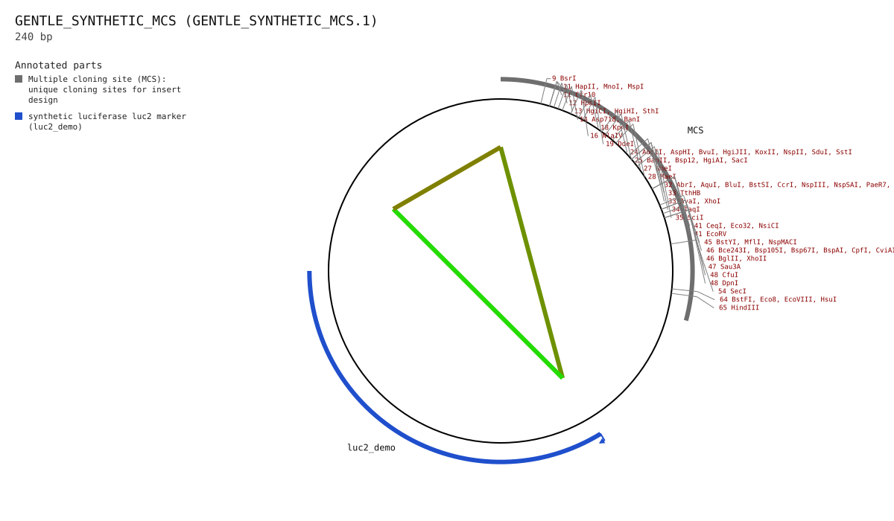
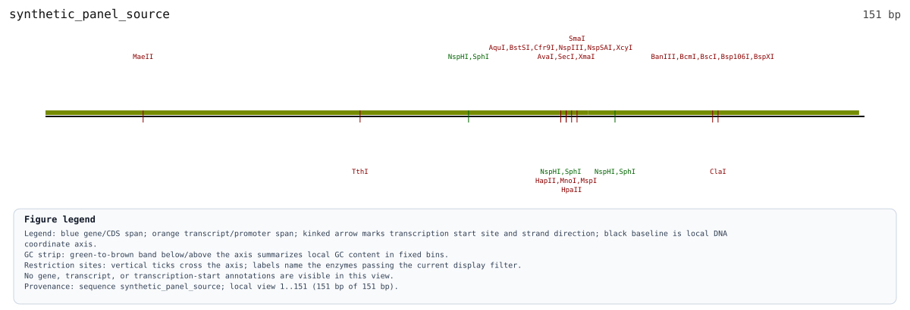

# Promoter-Reporter Panel Planning (Offline Approval-Gated Demo)

Build a read-only, content-addressed promoter-reporter panel proposal from one synthetic motif-anchored fragment and an exactly validated synthetic vector, inspect its evidence and non-claims, then materialize only the exact approved digest.

A reporter-panel design is not one opaque cloning command. GENtle first binds the selected promoter candidate, source sequence, exact vector identity, motif-disruption rule, shared cloning strategy, primers, predicted circular products, and export paths into one proposal digest. Planning runs the full workflow on a detached project state and writes no constructs. A separate materialization request must repeat that exact digest; any changed project sequence, candidate file, helper catalog, or proposal field makes the approval stale.

This chapter stays offline by using a repository-owned 240 bp synthetic MCS-layout vector and a 151 bp synthetic promoter fragment. The vector is deliberately not pGL4.10 and the fragment is not real TP73 regulatory DNA. The candidate response element is sequence-motif evidence only, and its stated-rule mutant is a testable sequence proposal rather than proof of lost occupancy or reporter function.

**Prerequisites:** Read [Chapter 24: Promoter Design Artifact Slice (Offline Synthetic TP73 Locus)](./08-03_promoter_design_artifact_slice_offline.md) first.

## Parameters That Matter

- `approval digest` (where used: promoters panel-materialize --approve)
  - Why it matters: It binds the complete normalized plan rather than merely recording a yes/no confirmation.
  - How to derive it: Copy the exact `proposal_digest` emitted by `promoters panel-plan` after reviewing the proposal.
- `candidate interval 0..151; motif interval 88..108` (where used: fragment extraction and stated-rule motif mutation)
  - Why it matters: The motif interval must remain inside the selected fragment and is reported in source and fragment coordinates.
  - How to derive it: Use the pinned synthetic candidate set; real panels should consume already-reviewed promoter candidate reports.
- `output_dir` (where used: planned GenBank, SVG, and manifest paths)
  - Why it matters: Artifact paths are part of the approval basis and existing files are never overwritten.
  - How to derive it: Choose a new empty directory before planning; re-plan if the destination changes.

## When This Routine Is Useful

- You want to inspect every construct, primer, warning, and output path before a panel changes project state.
- You want a deterministic offline example of exact-vector validation and shared panel cloning strategy selection.
- You want scripts to fail closed when a proposal or any bound input drifts after review.
- You want wild-type and stated-rule motif-mutant products without treating a PWM score change as functional proof.

## What You Learn

- Distinguish read-only panel planning from digest-approved project mutation and file export.
- Explain which source, vector, workflow, product, and path facts are bound by the proposal digest.
- Inspect a fixed p53-family core-edit rule and its PWM/restriction-site audits without turning either into a functional claim.
- Recognize why the synthetic MCS fixture validates only against its own catalog identity and must be rejected as pGL4.10.
- Use the same engine contract from the Promoter design GUI and the `promoters panel-*` shell routes.

## Applied Concepts

- **Shared Engine Contract** (`shared_engine_contract`): GUI, CLI, shell, and scripting interfaces execute the same operation semantics.
- **Deterministic Workflows** (`deterministic_workflows`): Operation chains should produce stable IDs and comparable outputs across repeated runs.
- **Promoter Motif Controls** (`promoter_motif_controls`): Foreground promoter motif signals should be compared with matched controls before being treated as candidate enrichment, depletion, or co-occurrence evidence.
- **Artifact Exports** (`artifact_exports`): Representative outputs (CSV/protocol/SVG/text) are retained for auditability and sharing.
- **Tutorial Drift Checks** (`tutorial_drift_checks`): Tutorial content is generated from executable examples and verified in automated checks.

## At a Glance

1. Open the synthetic MCS vector fixture and synthetic panel source sequence in ...
2. Open Promoter design for the synthetic source and expand Promoter-reporter pa...
3. Paste the request JSON from docs/examples/assets/promoter_reporter_panel_demo...
4. Click Plan panel; confirm the vector validation is verified, the selected mot...
5. Review the shared cloning strategy, primer readiness, exact output paths, war...
6. Type the displayed full proposal digest into the approval field. The material...
7. Click Materialize approved panel only after review; confirm the receipt lists...
8. Change a bound candidate or vector input and confirm the old digest is reject...

## GUI First

CLI snippets use GENtle's default `.gentle_state.json` state unless they say otherwise. Add `--state PATH` or `--project PATH` when you want an explicit sandboxed state file for copied commands.

### Step 1: Open the synthetic MCS vector fixture and synthetic panel source sequence in ...

GUI: Open the synthetic MCS vector fixture and synthetic panel source sequence in GENtle.

CLI:

```bash
cargo run --bin gentle_cli -- workflow @docs/examples/workflows/promoter_reporter_panel_planning_offline.json
```

> Expected: The canonical workflow executes entirely offline and completes the read-only panel plan.

### Step 2: Open Promoter design for the synthetic source and expand Promoter-reporter panel

GUI: Open `Promoter design` for the synthetic source and expand `Promoter-reporter panel`.

CLI:

```bash
cargo run --bin gentle_cli -- --state /tmp/gentle-promoter-panel-state.json op '{"LoadFile":{"path":"test_files/fixtures/reporter_vectors/synthetic_mcs_backbone.gb","as_id":"synthetic_panel_vector"}}'
```

> Expected: The exact 240 bp circular synthetic vector is loaded under the ID required by the request.

### Step 3: Paste the request JSON from docs/examples/assets/promoter_reporter_panel_demo...

GUI: Paste the request JSON from `docs/examples/assets/promoter_reporter_panel_demo_request.json`, adjusting only the loaded sequence IDs or output directory when needed.

CLI:

```bash
cargo run --bin gentle_cli -- --state /tmp/gentle-promoter-panel-state.json op '{"LoadFile":{"path":"docs/examples/assets/promoter_reporter_panel_demo_source.fasta","as_id":"synthetic_panel_source"}}'
```

> Expected: The 151 bp candidate source is loaded under the candidate set's pinned sequence ID.



*Figure: Circular map of the explicitly synthetic MCS-layout vector used to exercise exact-vector validation; this is not pGL4.10. Regenerate with `cargo run --bin gentle_examples_docs -- tutorial-generate`.*

> SVG text labels: `GENTLE_SYNTHETIC_MCS (GENTLE_SYNTHETIC_MCS.1) | 240 bp | MCS | luc2_demo | 9 BsrI | 11 HapII, MnoI, MspI | 12 HpaII | 13 SthI`. If the embedded preview omits text in the GUI, open the linked SVG or use these labels as the figure legend.

### Step 4: Click Plan panel; confirm the vector validation is verified, the selected mot...

GUI: Click `Plan panel`; confirm the vector validation is verified, the selected motif interval is `88..108`, and both wild-type and mutant circular products are listed.

CLI:

```bash
cargo run --bin gentle_cli -- --state /tmp/gentle-promoter-panel-state.json shell 'promoters panel-plan @docs/examples/assets/promoter_reporter_panel_demo_request.json --path /tmp/gentle-promoter-panel-proposal.json'
```

> Expected: Planning writes one proposal JSON but does not add the proposed fragments, primers, or constructs to project state.



*Figure: Linear map of the 151 bp synthetic promoter-fragment input. Regenerate with `cargo run --bin gentle_examples_docs -- tutorial-generate`.*

> SVG text labels: `MaeII | SphI | Cfr9I,XcyI | HapII,MnoI,MspI | XmaI | HpaII | SmaI | SfaNI`. If the embedded preview omits text in the GUI, open the linked SVG or use these labels as the figure legend.

### Step 5: Review the shared cloning strategy, primer readiness, exact output paths, war...

GUI: Review the shared cloning strategy, primer readiness, exact output paths, warnings, and the non-claims that motif evidence is not occupancy or functional proof.

CLI:

```bash
jq '{proposal_id,proposal_digest,vector_validation,cloning_strategy,members,products,artifacts,warnings,nonclaims}' /tmp/gentle-promoter-panel-proposal.json
```

> Expected: The proposal exposes the vector hash/validation, candidate binding, stated-rule mutation audit, shared strategy, primers, circular product hashes, artifact paths, warnings, and non-claims.

### Step 6: Type the displayed full proposal digest into the approval field. The material...

GUI: Type the displayed full proposal digest into the approval field. The materialization button remains disabled for a missing or different digest.

CLI:

```bash
DIGEST=$(jq -r .proposal_digest /tmp/gentle-promoter-panel-proposal.json); cargo run --bin gentle_cli -- --state /tmp/gentle-promoter-panel-state.json shell "promoters panel-materialize @/tmp/gentle-promoter-panel-proposal.json --approve $DIGEST"
```

> Expected: Materialization succeeds only when the supplied digest exactly matches a freshly recomputed proposal; it then writes GenBank/SVG files and a tabular construct/primer manifest.

7. Click `Materialize approved panel` only after review; confirm the receipt lists project sequence IDs, GenBank/SVG outputs, and the construct/primer manifest.
8. Change a bound candidate or vector input and confirm the old digest is rejected as stale rather than silently reused.

## Command Equivalent (After GUI)

Run the same routine non-interactively once the GUI flow is clear:

```bash
cargo run --bin gentle_cli -- workflow @docs/examples/workflows/promoter_reporter_panel_planning_offline.json
cargo run --bin gentle_cli -- shell 'workflow @docs/examples/workflows/promoter_reporter_panel_planning_offline.json'
```

## Follow-up Commands

```bash
jq '.products[] | {member_id,allele,assembly_model,length_bp,sequence_sha256,primer_seq_ids}' /tmp/gentle-promoter-panel-proposal.json
jq '.members[] | {label,fragment_role,motif_start_in_fragment_0based,motif_end_in_fragment_0based_exclusive,mutation}' /tmp/gentle-promoter-panel-proposal.json
cat /tmp/gentle-promoter-reporter-panel-demo-products/synthetic_tp73_demo_panel.construct_primer_manifest.tsv
```

## Checkpoints

- The tutorial workflow executes offline and leaves the engine state free of planned fragments, primers, and assembled products.
- Both retained SVGs are deterministic renderings of explicitly synthetic sequences.
- The planned proposal contains two products for the one selected member: wild type and stated-rule motif mutant.
- The proposal carries a non-empty primer list and preserves the synthetic luc2_demo annotation in both circular predicted products.
- A wrong digest and a changed candidate file are rejected before state or output files change.

## What This Chapter Produces

- [`artifacts/promoter_reporter_panel_planning_offline/artifacts/promoter_reporter_panel_demo.source.svg`](../artifacts/promoter_reporter_panel_planning_offline/artifacts/promoter_reporter_panel_demo.source.svg)

  - Embedded above near Step 4; kept here as an audit link.

> SVG text labels: `MaeII | SphI | Cfr9I,XcyI | HapII,MnoI,MspI | XmaI | HpaII | SmaI | SfaNI`. If this embedded preview omits text in the GUI, open the linked SVG or use these labels as the figure legend.

- [`artifacts/promoter_reporter_panel_planning_offline/artifacts/promoter_reporter_panel_demo.synthetic_vector.svg`](../artifacts/promoter_reporter_panel_planning_offline/artifacts/promoter_reporter_panel_demo.synthetic_vector.svg)

  - Embedded above near Step 3; kept here as an audit link.

> SVG text labels: `GENTLE_SYNTHETIC_MCS (GENTLE_SYNTHETIC_MCS.1) | 240 bp | MCS | luc2_demo | 9 BsrI | 11 HapII, MnoI, MspI | 12 HpaII | 13 SthI`. If this embedded preview omits text in the GUI, open the linked SVG or use these labels as the figure legend.


## Tutorial Provenance

- Chapter id: `promoter_reporter_panel_planning_offline`
- Tier: `core`
- Example id: `promoter_reporter_panel_planning_offline`
- Tutorial source JSON: `docs/tutorial/sources/08-09_promoter_reporter_panel_planning_offline.json`
- Workflow file: `docs/examples/workflows/promoter_reporter_panel_planning_offline.json`
- Generated artifact dir: `docs/tutorial/generated/artifacts/promoter_reporter_panel_planning_offline`
- Example test_mode: `always`
- Executed during generation: `yes`
- Automated status: `passing`
- Review status: `missing_review_manifest_entry`
- Codex reviewed at: `not recorded`
- Human reviewed at: `not recorded`
- Inspect the source JSON when you need full option-level detail.

## Feedback

If this tutorial is confusing, execution-stale, biologically suspect, or missing a useful figure, please open the matching tutorial issue template and include the context below.

- Tutorial title: `Promoter-Reporter Panel Planning (Offline Approval-Gated Demo)`
- Tutorial/chapter id: `promoter_reporter_panel_planning_offline`
- Step reached:
- Expected vs. actual:
- Interface used: GUI / CLI / Agent Assistant / ClawBio

Paste the Tutorial feedback context here:

```text

```
