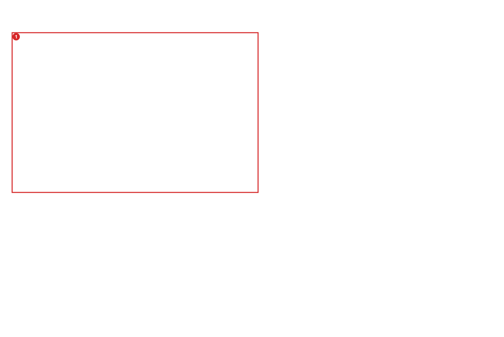
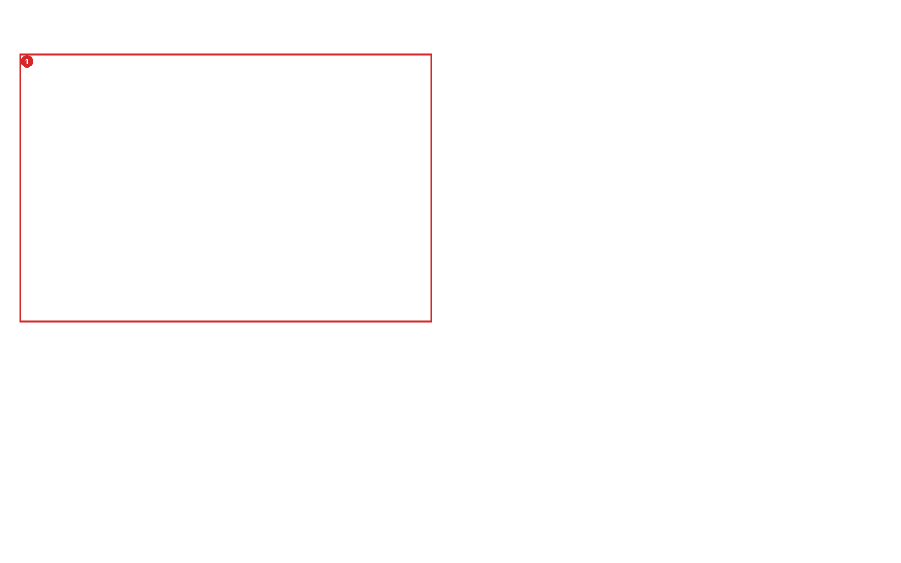
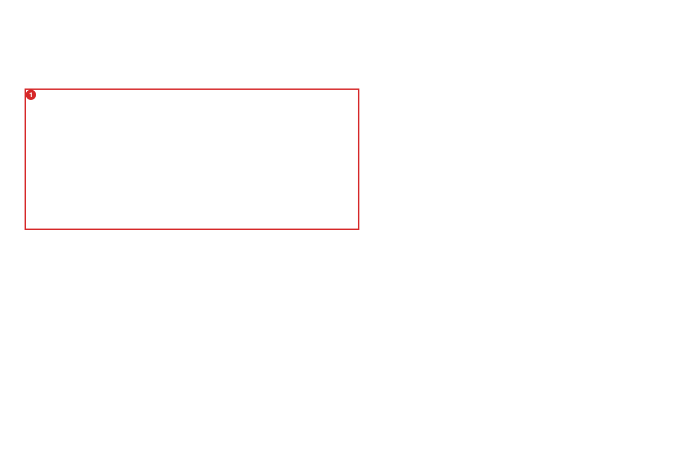
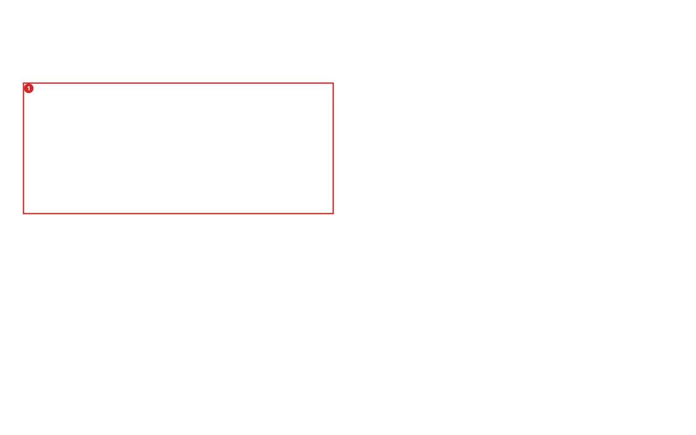

# Conserved Blocks and Testable Promoter-Module Hypotheses

Compare one saved genomic region with validated local genomic indexes, inspect transcript-linked same-genome promoter recurrence as an ordered block matrix, and turn explicitly selected evidence spans into conservative reporter-module hypotheses.

A conserved or selectively recurring promoter segment can be a useful fragment candidate, but sequence similarity does not prove that the segment works alone. This chapter keeps four questions separate: how candidate blocks recur upstream of annotated transcripts in the same genome, whether an explicitly expected ortholog locus supports each query base, whether other species contain merely unassigned similarity, and whether the same genome contains non-promoter competing copies. In the promoter matrix, every row is one distinct strand-aware transcript-promoter window; shared-TSS transcripts remain attached to that genomic occurrence. Blue intensity reports nucleotide identity, labels 1, 2, 3, and so on report the order of blocks in the target promoter, and a red outline marks an order or orientation break. Blocks are never joined across such a break. The Conservation workspace can then evaluate saved CUT&RUN, motif, provider-annotation, or reporter-candidate spans against the exact-support blocks. Its standalone, paired-context, repetitive, and insufficient outcomes are traceable design hypotheses, not regulatory verdicts.

## What You Will Accomplish

- Distinguish explicit orthology evidence from BLAST similarity.
- Read a query-referenced projection that suppresses target insertion columns without losing insertion provenance.
- Interpret a transcript-linked promoter matrix whose colour encodes identity and whose numbers encode target-promoter block order.
- Recognize order/orientation breaks as reasons to split or rearrange experimental reporter constructs, while retaining biological non-claims.
- Interpret exact-support blocks separately by evidence class and available-genome denominator.
- Use same-genome repetition as an ambiguity signal rather than a functional off-target claim.
- Explain why a reporter-module assessment proposes experiments but cannot establish autonomous regulatory function.

## Before You Start

**Prerequisites:** Read [Chapter 30: Save and Share Genomic Regions (Offline SERPINE1 Example)](./08-10_portable_genomic_regions_offline.md) first.

> **How to Run This Locally**
> This offline example still needs already-installed BLAST+ (makeblastdb, blastdbcmd and blastn). Nothing installs tools automatically. Documentation generation does not execute it; tutorial-check runs its starter workflow only when all three tools are available, otherwise reporting an explicit skip rather than BLAST acceptance. For the full walkthrough, run the companion command below after making BLAST+ available.

**Useful when:**

- You want to inspect whether a saved promoter candidate contains cross-species exact-support blocks.
- You want to see which parts of a candidate recur upstream of which genes and transcripts, including changed block order or orientation.
- You want same-genome repetition reported separately from cross-species conservation.
- You want a multiple-alignment-like display whose columns always remain query coordinates.
- You want an inspectable reason for testing one reporter block alone or together with a partner block.
- You need ordinary GENtle use to remain unaffected when optional genomic BLAST indexes are absent.

## At a Glance

1. Prepare or open a project containing an assembly-bound saved upstream region, then open its source sequence in the DNA viewer. The executable GUI fixture uses one synthetic 80 bp candidate so that navigation remains unambiguous; it makes no promoter-function claim.
2. Choose Regions... in the DNA viewer. In Saved genomic regions, locate the exact candidate and confirm its assembly, contig, coordinates, strand, purpose, and source binding before searching.
3. Choose Promoter similarity... on that saved region. GENtle opens the Conservation workspace with the candidate's prepared genome as a required same-genome target, a transcript-linked 2,000 bp upstream plus 200 bp downstream promoter-window policy, and conservative 40 bp / 80% identity defaults.
4. Expand Search request. First constrain the evidence universe: query genome ID, genome catalog/cache, explicit target genome IDs, required/optional status, target role (same_genome, expected_ortholog, or cross_species_unassigned), and—only for expected orthologs—reviewed expected loci with evidence identifiers. An empty target list searches every validated local index; that is broader, not equivalent to a declared promoterome comparison.
5. Scroll within Search request to constrain the alignment and promoter interpretation before running: minimum identity, maximum E-value, minimum aligned bases, maximum chain gap, retained loci per target, HSP processing budget, minimum exact-block length, promoter-matrix on/off, upstream/downstream window lengths, and displayed-row limit. Select Run local screen only after recording these choices; Cancel stops an active search without publishing a partial report, while Export request... preserves the exact reusable request.
6. Inspect target readiness and confirm that expected-ortholog, unassigned cross-species, and same-genome evidence remain separate.
7. Inspect Promoter recurrence matrix. Rows are distinct genomic promoter windows, not raw transcript counts. Read blue intensity as identity and the block number as target-promoter 5'-to-3' order. Hover a row for its genes, transcripts, TSS and coordinates. Treat a red block outline as a structural split candidate: the query order or orientation changed, so GENtle does not join it to the preceding block.
8. Inspect the query-referenced alignment: dots are exact bases, letters are substitutions, dashes are target deletions, and omitted insertions remain in JSON rather than adding columns.
9. Select only synthetic_occupancy_anchor, choose Assess selected evidence, and compare the standalone decision with standalone.json. Add synthetic_left_motif and reassess: the paired decision must cite a shared ortholog locus and compatible target-coordinate gaps, not merely proximity in the query. Select a block to jump to its virtualized alignment tile.
10. Optionally save a selected conserved block as a new portable region. This explicit mutation preserves the report digest and non-claims.

## Walkthrough: GUI, CLI and Inner Agent

The three routes below describe the same operation. CLI snippets assume an installed `gentle_cli` and use GENtle's default `.gentle_state.json` unless stated otherwise. From a source checkout, replace `gentle_cli` with `cargo run --bin gentle_cli --`. Add `--state PATH` or `--project PATH` for an explicit sandbox. Inner-agent examples request a proposal for review; they are not executed during tutorial generation.

### Step 1: Prepare or open a project containing an assembly-bound saved upstream

**GUI**

Prepare or open a project containing an assembly-bound saved upstream region, then open its source sequence in the DNA viewer. The executable GUI fixture uses one synthetic 80 bp candidate so that navigation remains unambiguous; it makes no promoter-function claim.

**CLI / GUI Shell**

```bash
cargo build --locked --bin gentle_cli
```

**Ask the inner agent**

> In the current GENtle project, help me perform this tutorial step: Prepare or open a project containing an assembly-bound saved upstream region, then open its source sequence in the DNA viewer. The executable GUI fixture uses one synthetic 80 bp candidate so that navigation remains unambiguous; it makes no promoter-function claim. Show the exact GENtle operation or command and its expected result for my review. State any missing input. Do not execute it until I approve.

**Expected**

> The workflow uses only hand-crafted local FASTA files and requires no network access; it never downloads or indexes an undeclared genome.

### Step 2: Choose Regions

**GUI**

Choose `Regions...` in the DNA viewer. In `Saved genomic regions`, locate the exact candidate and confirm its assembly, contig, coordinates, strand, purpose, and source binding before searching.

**CLI / GUI Shell**

```bash
python3 docs/examples/run_region_homology_tutorial.py --gentle target/debug/gentle_cli --output /tmp/gentle-conservation-tutorial
```

**Ask the inner agent**

> In the current GENtle project, help me perform this tutorial step: Choose `Regions...` in the DNA viewer. In `Saved genomic regions`, locate the exact candidate and confirm its assembly, contig, coordinates, strand, purpose, and source binding before searching. Show the exact GENtle operation or command and its expected result for my review. State any missing input. Do not execute it until I approve.

**Expected**

> Every projected alignment row has exactly the query length even though one target contains an insertion.



*Figure: The saved-region manager shows the assembly-bound candidate and keeps Conservation and Promoter similarity actions visible at the standard 800×600 DNA-window size. Screenshot captured 2026-09-09.*

### Step 3: Choose Promoter similarity

**GUI**

Choose `Promoter similarity...` on that saved region. GENtle opens the Conservation workspace with the candidate's prepared genome as a required same-genome target, a transcript-linked 2,000 bp upstream plus 200 bp downstream promoter-window policy, and conservative 40 bp / 80% identity defaults.

**CLI / GUI Shell**

```bash
target/debug/gentle_cli --state /tmp/gentle-conservation-tutorial/report_only.project.json shell 'regions render-homology-svg @/tmp/gentle-conservation-tutorial/homology_report.json /tmp/gentle-conservation-tutorial/replayed.svg'
```

**Ask the inner agent**

> In the current GENtle project, help me perform this tutorial step: Choose `Promoter similarity...` on that saved region. GENtle opens the Conservation workspace with the candidate's prepared genome as a required same-genome target, a transcript-linked 2,000 bp upstream plus 200 bp downstream promoter-window policy, and conservative 40 bp / 80% identity defaults. Show the exact GENtle operation or command and its expected result for my review. State any missing input. Do not execute it until I approve.

**Expected**

> The inserted target base is retained under `omitted_insertions` with query anchor, target coordinates, strand, and HSP identity.



*Figure: Whole-screen orientation after Promoter similarity opens the content-bound Conservation workspace for the selected candidate. Screenshot captured 2026-09-09.*

### Step 4: Expand Search request

**GUI**

Expand `Search request`. First constrain the evidence universe: query genome ID, genome catalog/cache, explicit target genome IDs, required/optional status, target role (`same_genome`, `expected_ortholog`, or `cross_species_unassigned`), and—only for expected orthologs—reviewed expected loci with evidence identifiers. An empty target list searches every validated local index; that is broader, not equivalent to a declared promoterome comparison.

**CLI / GUI Shell**

```bash
target/debug/gentle_cli --state /tmp/gentle-conservation-tutorial/report_only.project.json shell 'promoters assess-conserved-modules @/tmp/gentle-conservation-tutorial/paired.request.json'
```

**Ask the inner agent**

> In the current GENtle project, help me perform this tutorial step: Expand `Search request`. First constrain the evidence universe: query genome ID, genome catalog/cache, explicit target genome IDs, required/optional status, target role (`same_genome`, `expected_ortholog`, or `cross_species_unassigned`), and—only for expected orthologs—reviewed expected loci with evidence identifiers. An empty target list searches every validated local index; that is broader, not equivalent to a declared promoterome comparison. Show the exact GENtle operation or command and its expected result for my review. State any missing input. Do not execute it until I approve.

**Expected**

> Only the locus backed by `synthetic_declared_orthology` is labelled `expected_ortholog`; BLAST rank alone never establishes orthology.



*Figure: The expanded request exposes the query genome, catalog/cache, required target genome, and target role before any search starts. Screenshot captured 2026-09-09.*

### Step 5: Scroll within Search request to constrain the alignment and promoter

**GUI**

Scroll within `Search request` to constrain the alignment and promoter interpretation before running: minimum identity, maximum E-value, minimum aligned bases, maximum chain gap, retained loci per target, HSP processing budget, minimum exact-block length, promoter-matrix on/off, upstream/downstream window lengths, and displayed-row limit. Select `Run local screen` only after recording these choices; `Cancel` stops an active search without publishing a partial report, while `Export request...` preserves the exact reusable request.

**Ask the inner agent**

> In the current GENtle project, help me perform this tutorial step: Scroll within `Search request` to constrain the alignment and promoter interpretation before running: minimum identity, maximum E-value, minimum aligned bases, maximum chain gap, retained loci per target, HSP processing budget, minimum exact-block length, promoter-matrix on/off, upstream/downstream window lengths, and displayed-row limit. Select `Run local screen` only after recording these choices; `Cancel` stops an active search without publishing a partial report, while `Export request...` preserves the exact reusable request. Show the exact GENtle operation or command and its expected result for my review. State any missing input. Do not execute it until I approve.

**Expected**

> Same-genome non-self similarity has its own loci, support blocks, coverage percentage, and ambiguity rule.


*Figure: Focused constraints include identity, E-value, aligned length, chain gap, retained-locus and HSP budgets, exact-block length, promoter-window dimensions, and displayed-row limit. Screenshot captured 2026-09-09.*



*Figure: Whole-screen orientation for the lower search-policy and transcript-promoter matrix controls. Screenshot captured 2026-09-09.*

### Step 6: Inspect target readiness and confirm that expected-ortholog

**GUI**

Inspect target readiness and confirm that expected-ortholog, unassigned cross-species, and same-genome evidence remain separate.

**Ask the inner agent**

> In the current GENtle project, help me perform this tutorial step: Inspect target readiness and confirm that expected-ortholog, unassigned cross-species, and same-genome evidence remain separate. Show the exact GENtle operation or command and its expected result for my review. State any missing input. Do not execute it until I approve.

**Expected**

> Promoter-matrix counts distinguish genomic windows, genes and transcripts. If an HSP/locus budget is reached, the report labels all frequency counts as lower bounds instead of implying completeness.

### Step 7: Inspect Promoter recurrence matrix

**GUI**

Inspect `Promoter recurrence matrix`. Rows are distinct genomic promoter windows, not raw transcript counts. Read blue intensity as identity and the block number as target-promoter 5'-to-3' order. Hover a row for its genes, transcripts, TSS and coordinates. Treat a red block outline as a structural split candidate: the query order or orientation changed, so GENtle does not join it to the preceding block.

**Ask the inner agent**

> In the current GENtle project, help me perform this tutorial step: Inspect `Promoter recurrence matrix`. Rows are distinct genomic promoter windows, not raw transcript counts. Read blue intensity as identity and the block number as target-promoter 5'-to-3' order. Hover a row for its genes, transcripts, TSS and coordinates. Treat a red block outline as a structural split candidate: the query order or orientation changed, so GENtle does not join it to the preceding block. Show the exact GENtle operation or command and its expected result for my review. State any missing input. Do not execute it until I approve.

**Expected**

> Changing block order or orientation splits the visual chain. This is structural evidence for testing reporter subfragments or arrangements, not proof that either arrangement is functional.

### Step 8: Inspect the query-referenced alignment

**GUI**

Inspect the query-referenced alignment: dots are exact bases, letters are substitutions, dashes are target deletions, and omitted insertions remain in JSON rather than adding columns.

**Ask the inner agent**

> In the current GENtle project, help me perform this tutorial step: Inspect the query-referenced alignment: dots are exact bases, letters are substitutions, dashes are target deletions, and omitted insertions remain in JSON rather than adding columns. Show the exact GENtle operation or command and its expected result for my review. State any missing input. Do not execute it until I approve.

**Expected**

> Module outcomes retain all thresholds, evidence IDs, passed and failed rules, alternatives, and explicit non-claims.

### Step 9: Select only synthetic_occupancy_anchor

**GUI**

Select only `synthetic_occupancy_anchor`, choose `Assess selected evidence`, and compare the standalone decision with `standalone.json`. Add `synthetic_left_motif` and reassess: the paired decision must cite a shared ortholog locus and compatible target-coordinate gaps, not merely proximity in the query. Select a block to jump to its virtualized alignment tile.

**Ask the inner agent**

> In the current GENtle project, help me perform this tutorial step: Select only `synthetic_occupancy_anchor`, choose `Assess selected evidence`, and compare the standalone decision with `standalone.json`. Add `synthetic_left_motif` and reassess: the paired decision must cite a shared ortholog locus and compatible target-coordinate gaps, not merely proximity in the query. Select a block to jump to its virtualized alignment tile. Show the exact GENtle operation or command and its expected result for my review. State any missing input. Do not execute it until I approve.

**Expected**

> The companion asserts standalone and paired results, an insufficient result for evidence in the deliberately substituted gap, and a repetitive result under an explicitly strict 1% policy. Its receipt records the exact commands, binary and artifact hashes. GENtle alone computes these outcomes. Report-only steps use an empty scratch project because their inputs are self-contained; the original tutorial project is not reopened or rewritten.

### Step 10: Optionally save a selected conserved block as a new portable region

**GUI**

Optionally save a selected conserved block as a new portable region. This explicit mutation preserves the report digest and non-claims.

**Ask the inner agent**

> In the current GENtle project, help me perform this tutorial step: Optionally save a selected conserved block as a new portable region. This explicit mutation preserves the report digest and non-claims. Show the exact GENtle operation or command and its expected result for my review. State any missing input. Do not execute it until I approve.

**Expected**

> Missing or unrequested same-genome evidence cannot pass uniqueness. Query and target gaps must both satisfy the declared bounds; exact spacing is the default unless a gap-difference tolerance is supplied.


## Complete Workflow Replay

When an individual GUI gesture has no standalone shell command, replay the complete canonical workflow:

```bash
gentle_cli workflow @docs/examples/workflows/region_homology_promoter_modules_offline.json
gentle_cli shell 'workflow @docs/examples/workflows/region_homology_promoter_modules_offline.json'
```

## Interpretation and Reference

## Parameters That Matter

- `policy.promoter_similarity_matrix` (where used: ScreenGenomicRegionHomology from Promoter similarity...)
  - Why it matters: The upstream/downstream window defines which same-genome hits count as transcript-promoter recurrence; max_rows limits display only, while the report retains total window, gene and transcript counts.
  - How to derive it: Choose one assembly/release-specific promoter window before search. Keep the default -2,000/+200 bp for broad screening or declare a study-specific window; do not silently mix definitions between candidates.
- `targets[].role and expected_loci[]` (where used: ScreenGenomicRegionHomology)
  - Why it matters: An expected ortholog label is accepted only when an accepted locus overlaps a caller-supplied, evidence-identified expected locus.
  - How to derive it: Use reviewed orthology resources or an explicit expected locus; leave unrelated cross-species searches unassigned.
- `min_identity_percent=70, min_alignment_length_bp=24` (where used: Synthetic homology screen)
  - Why it matters: These default thresholds retain the intended ortholog and 24 bp same-genome copy while excluding incidental 12 bp matches in the hand-crafted teaching sequences.
  - How to derive it: Choose thresholds before search and preserve them in the effective request; do not tune them after seeing a preferred locus.
- `max_hsps_per_target=1000` (where used: Synthetic homology screen)
  - Why it matters: The cap is a post-BLAST processing budget and never a `-max_target_seqs` completeness shortcut.
  - How to derive it: Use a bounded value suitable for the query and fail explicitly when highly repetitive output exceeds it.
- `selected_evidence_spans[]` (where used: AssessPromoterConservedModules)
  - Why it matters: These are caller-selected CUT&RUN, motif, annotation, or reporter spans that the proposed fragment should retain; they are not inferred from conservation.
  - How to derive it: Save reviewed evidence as portable regions or supply content-bound query-local spans with independent provenance.

## Applied Concepts

- **Portable Genomic Regions** (`portable_genomic_regions`): Assembly-bound regions retain one canonical coordinate and evidence identity across project, CLI, GUI, and exported representations.
- **Local BLAST Indexes** (`local_blast_indexes`): Validated local indexes are content-bound optional resources; their absence remains explicit without disabling unrelated work.
- **Query-Referenced Alignment** (`query_referenced_alignment`): The query defines every display column while target insertions remain separate structured provenance.
- **Explicit Orthology Evidence** (`explicit_orthology`): An ortholog label requires a declared, provenance-bearing expected locus and is never inferred from similarity rank alone.
- **Reporter-Module Hypotheses** (`reporter_module_hypotheses`): Conservation and independently selected evidence produce traceable fragment-testing hypotheses, never proof of autonomous regulatory function.
- **Transcript-Linked Promoter Recurrence** (`transcript_linked_promoter_recurrence`): Same-genome sequence matches are counted as distinct strand-aware promoter windows while retaining every associated gene and transcript mapping.
- **Ordered Similarity Blocks** (`ordered_similarity_blocks`): Similarity blocks retain query position, target-promoter order and orientation; order/orientation changes create explicit structural boundaries rather than joined chains.
- **Deterministic Workflows** (`deterministic_workflows`): Operation chains should produce stable IDs and comparable outputs across repeated runs.

## Follow-up Commands

```bash
python3 docs/examples/run_region_homology_tutorial.py --gentle target/debug/gentle_cli --output /tmp/gentle-conservation-tutorial-repeat
```

## Checkpoints

- The homology report binds query region identity, query sequence SHA-256, effective request, tool version, and every genomic database content fingerprint.
- All target rows are query-length projections; insertions are omitted from display columns and retained structurally.
- Unavailable optional indexes remain typed unavailable and do not impair unrelated GENtle use.
- The module decision trace distinguishes standalone, paired-context, repetitive-or-ambiguous, and insufficient-evidence hypotheses.
- The promoter matrix preserves target-promoter order and orientation, separates shared genomic windows from transcript multiplicity, and marks incomplete frequency counts as lower bounds.
- Every presentation repeats that conservation does not prove autonomous promoter function.

## Tutorial Provenance

- Chapter id: `region_homology_promoter_modules_offline`
- Tier: `advanced`
- Example id: `region_homology_promoter_modules_offline`
- Tutorial source JSON: `docs/tutorial/sources/08-12_region_homology_promoter_modules_offline.json`
- Workflow file: `docs/examples/workflows/region_homology_promoter_modules_offline.json`
- Generated artifact dir: `docs/tutorial/generated/artifacts/region_homology_promoter_modules_offline`
- Example test_mode: `optional_blast`
- Executed during generation: `no`
- Automated status: `skipped`
- Review status: `codex_reviewed`
- Codex reviewed at: `2026-09-07`
- Human reviewed at: `not recorded`
- Inspect the source JSON when you need full option-level detail.

## Feedback

If this tutorial is confusing, execution-stale, biologically suspect, or missing a useful figure, please open the matching tutorial issue template and include the context below.

- Tutorial title: `Conserved Blocks and Testable Promoter-Module Hypotheses`
- Tutorial/chapter id: `region_homology_promoter_modules_offline`
- Step reached:
- Expected vs. actual:
- Interface used: GUI / CLI / Agent Assistant / ClawBio

Paste the Tutorial feedback context here:

```text

```
