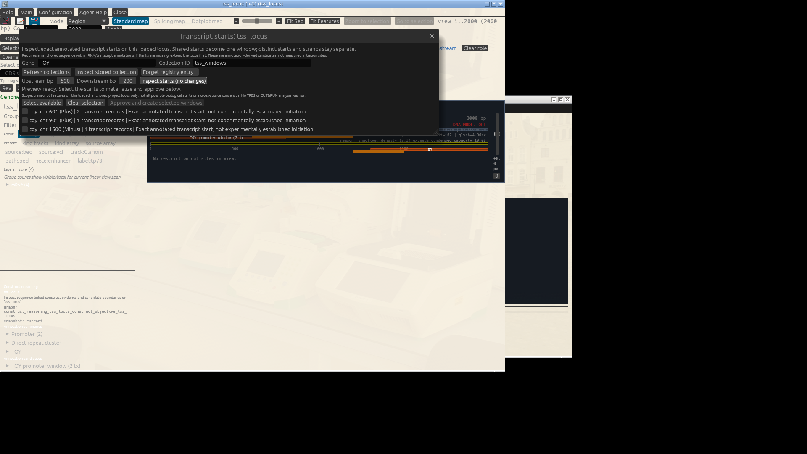
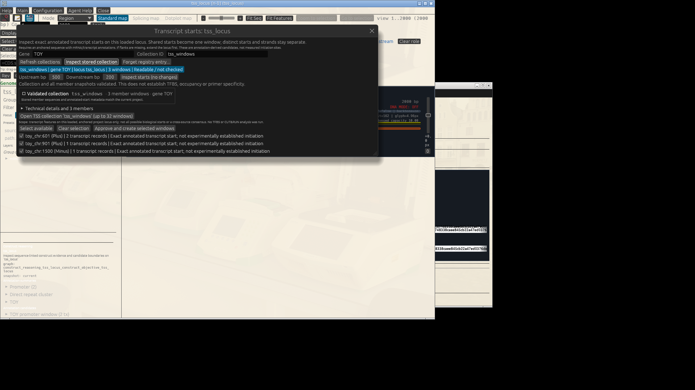

# From annotated transcript starts to reusable TSS windows (offline)

Preview and approve annotated starts, distinguish registry discovery from validation, then open the three reusable transcript-oriented windows.

Two transcripts can share a first base without being the same transcript. In this artificial 2 kb locus, plus_a and plus_b share start 601; plus_c starts at 901; minus_a starts at 1500 on the opposite strand. Their common TOY label selects two separate gene IDs without merging them. Three 701 bp windows result, oriented in transcript direction with the annotated start at local base 501. The executable GUI path deliberately ends after opening those windows. Destructive registry maintenance, restart and stale-member damage tests are a separate contributor checklist rather than obstacles in the learner path. These annotations are not experimental evidence for active promoters, and the repetitive toy DNA is not suitable for primer or biological TFBS conclusions.

See also: guided walkthrough [docs/tutorial/08-15_tss_collection_gui.md](../../08-15_tss_collection_gui.md). Use that page first when you want a human-led path; this chapter is the executable reference.

## What You Will Accomplish

- Interpret transcript-oriented starts without inferring a preferred biological TSS.
- Use preview-bound approval and identity-preserving collection operations.
- Retain typed evidence independently from screenshots.

## Before You Start

**Useful when:**

- Learn why a transcript count differs from a distinct-start count.
- Separate an unchecked stored record from a currently validated collection.
- Practice without network access, private genes, model services or a prepared human genome.

## At a Glance

1. Prepare the synthetic starter with the command in the companion walkthrough; open its project and double-click tss_locus. Never open the oracle as the starter.
2. Choose TFBS scan > Transcript starts / TSS windows.
3. Set Gene to TOY; keep Collection ID tss_windows and upstream/downstream 500/200. Inspect starts without changing project state.
4. Check starts 601 (+), 901 (+), 1500 (-), with plus_a/plus_b sharing the first row. Select available and explicitly approve creation of all three windows.
5. Refresh collections: readable / not checked is expected, not pass. Inspect stored collection; compare the validated report with the independent oracle.
6. Open TSS collection once. Expect exactly three member viewers plus the original locus. GENtle brings the first collection member forward and places the others in a bounded cascade; use the native Window menu to raise another named member.
7. Only contributors testing registry recovery should continue with the separate forget/undo, restart and deliberately stale-member checklist. Repeated-open reuse remains covered by the focused application regression rather than by asking a learner to repeat a visually disruptive action.

## Walkthrough: GUI, CLI and Inner Agent

### Step 1: Prepare the synthetic starter with the command in the companion walkthrough; open its project and double-click tss_locus. Never open the oracle as the starter

**GUI**

Prepare the synthetic starter with the command in the companion walkthrough; open its project and double-click tss_locus. Never open the oracle as the starter.

**Ask the inner agent**

> In the current GENtle project, help me perform this tutorial step: Prepare the synthetic starter with the command in the companion walkthrough; open its project and double-click tss_locus. Never open the oracle as the starter. Show the exact GENtle operation or command and its expected result for my review. State any missing input. Do not execute it until I approve.

**Expected**

> The starter has one locus and no TSS collection.

### Step 2: Choose TFBS scan > Transcript starts / TSS windows

**GUI**

Choose TFBS scan > Transcript starts / TSS windows.

**Ask the inner agent**

> In the current GENtle project, help me perform this tutorial step: Choose TFBS scan > Transcript starts / TSS windows. Show the exact GENtle operation or command and its expected result for my review. State any missing input. Do not execute it until I approve.

**Expected**

> Opening the form does not approve or derive windows.

### Step 3: Set Gene to TOY; keep Collection ID tss_windows and upstream/downstream 500/200. Inspect starts without changing project state

**GUI**

Set Gene to TOY; keep Collection ID tss_windows and upstream/downstream 500/200. Inspect starts without changing project state.

**Ask the inner agent**

> In the current GENtle project, help me perform this tutorial step: Set Gene to TOY; keep Collection ID tss_windows and upstream/downstream 500/200. Inspect starts without changing project state. Show the exact GENtle operation or command and its expected result for my review. State any missing input. Do not execute it until I approve.

**Expected**

> Preview exposes three exact starts and its approval digest.



*Figure: The read-only preview groups plus_a and plus_b at one shared start while keeping the second plus-strand start and the minus-strand start separate; no window has been created yet. Screenshot captured 2026-09-29.*

### Step 4: Check starts 601 (+), 901 (+), 1500 (-), with plus_a/plus_b sharing the first row. Select available and explicitly approve creation of all three windows

**GUI**

Check starts 601 (+), 901 (+), 1500 (-), with plus_a/plus_b sharing the first row. Select available and explicitly approve creation of all three windows.

**Ask the inner agent**

> In the current GENtle project, help me perform this tutorial step: Check starts 601 (+), 901 (+), 1500 (-), with plus_a/plus_b sharing the first row. Select available and explicitly approve creation of all three windows. Show the exact GENtle operation or command and its expected result for my review. State any missing input. Do not execute it until I approve.

**Expected**

> Only the reviewed preview and explicit selection authorize derivation.

### Step 5: Refresh collections: readable / not checked is expected, not pass. Inspect stored collection; compare the validated report with the independent oracle

**GUI**

Refresh collections: readable / not checked is expected, not pass. Inspect stored collection; compare the validated report with the independent oracle.

**Ask the inner agent**

> In the current GENtle project, help me perform this tutorial step: Refresh collections: readable / not checked is expected, not pass. Inspect stored collection; compare the validated report with the independent oracle. Show the exact GENtle operation or command and its expected result for my review. State any missing input. Do not execute it until I approve.

**Expected**

> The validating engine report contains three 701 bp windows; not checked and validated are distinct.



*Figure: After explicit approval, registry discovery still says not checked; Inspect stored collection produces a concise validated summary while keeping the full fingerprint, JSON and member table in collapsed technical details. Screenshot captured 2026-09-29.*

### Step 6: Open TSS collection once. Expect exactly three member viewers plus the original locus. GENtle brings the first collection member forward and places the others in a bounded cascade; use the native Window menu to raise another named member

**GUI**

Open TSS collection once. Expect exactly three member viewers plus the original locus. GENtle brings the first collection member forward and places the others in a bounded cascade; use the native Window menu to raise another named member.

**Ask the inner agent**

> In the current GENtle project, help me perform this tutorial step: Open TSS collection once. Expect exactly three member viewers plus the original locus. GENtle brings the first collection member forward and places the others in a bounded cascade; use the native Window menu to raise another named member. Show the exact GENtle operation or command and its expected result for my review. State any missing input. Do not execute it until I approve.

**Expected**

> Opening yields the same four exact subject-bound DNA viewers represented in the saved project; queued is not yet opened.

### Step 7: Only contributors testing registry recovery should continue with the separate forget/undo, restart and deliberately stale-member checklist. Repeated-open reuse remains covered by the focused application regression rather than by asking a learner to repeat a visually disruptive action

**GUI**

Only contributors testing registry recovery should continue with the separate forget/undo, restart and deliberately stale-member checklist. Repeated-open reuse remains covered by the focused application regression rather than by asking a learner to repeat a visually disruptive action.

**Ask the inner agent**

> In the current GENtle project, help me perform this tutorial step: Only contributors testing registry recovery should continue with the separate forget/undo, restart and deliberately stale-member checklist. Repeated-open reuse remains covered by the focused application regression rather than by asking a learner to repeat a visually disruptive action. Show the exact GENtle operation or command and its expected result for my review. State any missing input. Do not execute it until I approve.

**Expected**

> Registry forget/undo, application restart and stale-member rejection remain explicitly separate contributor checks.


## Complete Workflow Replay

When an individual GUI gesture has no standalone shell command, replay the complete canonical workflow:

```bash
gentle_cli workflow @docs/examples/workflows/tss_collection_gui_oracle.json
gentle_cli shell 'workflow @docs/examples/workflows/tss_collection_gui_oracle.json'
```

## Interpretation and Reference

## Parameters That Matter

- `upstream_bp / downstream_bp` (where used: TSS inventory and materialization)
  - Why it matters: The annotated start itself adds one base: 500 + 1 + 200 = 701. Minus-strand windows reverse-complement their genomic interval.
  - How to derive it: Use the reviewed biological question and loaded flanks; this tutorial fixes 500/200 for an entirely synthetic locus.

## Applied Concepts

- **Shared Engine Contract** (`shared_engine_contract`): GUI, CLI, shell, and scripting interfaces execute the same operation semantics.
- **Deterministic Workflows** (`deterministic_workflows`): Operation chains should produce stable IDs and comparable outputs across repeated runs.
- **Sequence Lineage** (`sequence_lineage`): Derived sequences are explicit products linked to upstream inputs and operations.

## Checkpoints

- Starter completion is unsatisfied; the independent oracle satisfies it.
- Typed collection report and persisted sequences agree, including both strands.
- The core GUI path has retained Linux/X11 evidence; Windows/macOS, human scientific review and live TP73 acceptance remain separate.

## Tutorial Provenance

- Chapter id: `tss_collection_gui`
- Tier: `core`
- Example id: `tss_collection_gui_oracle`
- Tutorial source JSON: `docs/tutorial/sources/08-15_tss_collection_gui.json`
- Workflow file: `docs/examples/workflows/tss_collection_gui_oracle.json`
- Generated artifact dir: `docs/tutorial/generated/artifacts/tss_collection_gui`
- Example test_mode: `always`
- Executed during generation: `yes`
- Automated status: `passing`
- Review status: `codex_reviewed`
- Codex reviewed at: `2026-09-29`
- Human reviewed at: `not recorded`
- Inspect the source JSON when you need full option-level detail.

## Feedback

If this tutorial is confusing, execution-stale, biologically suspect, or missing a useful figure, please open the matching tutorial issue template and include the context below.

- Tutorial title: `From annotated transcript starts to reusable TSS windows (offline)`
- Tutorial/chapter id: `tss_collection_gui`
- Step reached:
- Expected vs. actual:
- Interface used: GUI / CLI / Agent Assistant / ClawBio

Paste the Tutorial feedback context here:

```text

```
