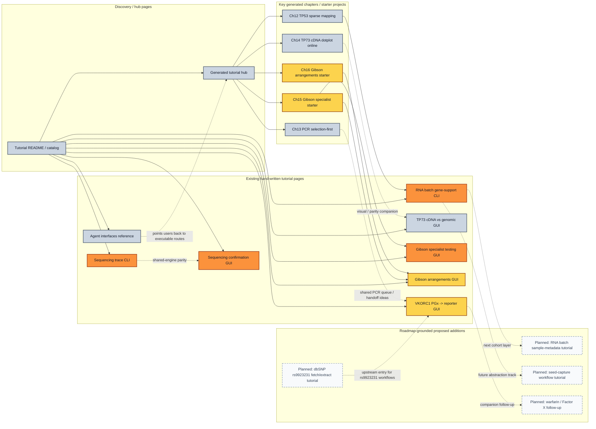

# GENtle Tutorial Landscape Overview

> Type: `operational reference + planning map`
> Status: `manual/reference`
> Drift note: this page mixes committed tutorial pages from the current catalog
> with roadmap-grounded proposed additions. The feedback-loop intensity labels
> are heuristic, not measured telemetry.

This page is a graphical overview of:

- the tutorial surfaces we already have,
- the strongest current dependencies between them,
- the roadmap-grounded tutorial additions we are likely to want next, and
- how intensively each route appears to have been shaped by direct human
  feedback versus mostly generated/automated drift checks.

## How to Read the Map

- Solid arrows: current dependency or strong onboarding handoff
- Dotted arrows: softer parity/companion relationship
- Dashed-outline nodes: proposed additions, not committed tutorial pages yet
- Node color:
  - red/orange: high human feedback-loop intensity
  - amber: medium human feedback-loop intensity
  - blue/gray: lower direct human feedback-loop intensity
  - pale gray: planned / not yet established

The feedback-loop intensity is a practical editorial heuristic:

- High: manual/hybrid tutorials with explicit checkpoints, parity checks, or
  recent user-driven iteration
- Medium: manual/hybrid tutorials with real operational grounding, but fewer
  explicit human checkpoints
- Low: generated/reference/tutorial-hub material where the stronger safety net
  is automated generation/checking rather than repeated human walkthroughs
- Planned: roadmap-grounded proposal only

## Dependency and Maturity Map

## Current Tutorial Bands

### High human feedback-loop intensity

- [`docs/tutorial/gibson_specialist_testing_gui.md`](./gibson_specialist_testing_gui.md)
  - explicit GUI checkpoints and shared CLI parity check
- [`docs/tutorial/sequencing_confirmation_gui.md`](./sequencing_confirmation_gui.md)
  - specialist-driven GUI workflow with concrete review checkpoints
- [`docs/tutorial/sequencing_confirmation_trace_cli.md`](./sequencing_confirmation_trace_cli.md)
  - CLI/shared-shell parity route around one deterministic real trace fixture
- [`docs/tutorial/rna_read_batch_gene_support_cli.md`](./rna_read_batch_gene_support_cli.md)
  - recent workflow shaped directly around a real batch-analysis need

### Medium human feedback-loop intensity

- [`docs/tutorial/vkorc1_warfarin_promoter_luciferase_gui.md`](./vkorc1_warfarin_promoter_luciferase_gui.md)
  - long-form manual walkthrough with explicit engine/CLI mapping
- [`docs/tutorial/gibson_arrangements_gui.md`](./gibson_arrangements_gui.md)
  - deterministic starter-project grounding plus arrangement export flow
- generated starter chapters:
  - [`docs/tutorial/generated/chapters/15_gibson_specialist_testing_baseline.md`](./generated/chapters/15_gibson_specialist_testing_baseline.md)
  - [`docs/tutorial/generated/chapters/16_gibson_arrangements_baseline.md`](./generated/chapters/16_gibson_arrangements_baseline.md)

### Lower direct human feedback-loop intensity

- [`docs/tutorial/generated/README.md`](./generated/README.md)
  - strong automation and drift checks, but less direct human narrative shaping
- [`docs/tutorial/two_sequence_dotplot_gui.md`](./two_sequence_dotplot_gui.md)
  - screenshot-backed and useful, but still awaiting fuller screenshot/checklist
    completion
- [`docs/agent_interfaces_tutorial.md`](../agent_interfaces_tutorial.md)
  - operational/reference value is high, but it is less of a bench workflow
    feedback loop than the specialist tutorials

## Proposed Next Tutorial Additions

These are not committed pages yet. They are the most defensible next additions
based on current roadmap signals.

### 1. dbSNP rs9923231 fetch/extract tutorial

Why it belongs next:

- the roadmap now exposes `FetchDbSnpRegion` directly in the fetch specialist
- the specialist already pre-populates the tutorial rsID `rs9923231`
- this would give the VKORC1 / warfarin route a clearer “start from rsID”
  upstream entry point

Roadmap grounding:

- [`docs/roadmap.md`](../roadmap.md) around the `FetchDbSnpRegion` specialist
  and tutorial rsID notes

### 2. RNA batch sample-metadata tutorial

Why it belongs next:

- the RNA batch gene-support tutorial now covers the evidence metrics layer
- the roadmap still calls out user metadata for sample-sheet cohorts as the
  next missing layer (`condition`, `timepoint`, `replicate`, extraction notes)
- once that lands, users will need a tutorial that explains how to merge the
  biological evidence metrics with cohort annotations cleanly

Roadmap grounding:

- [`docs/roadmap.md`](../roadmap.md) sample-sheet cohort metadata follow-up

### 3. Seed-capture workflow tutorial

Why it belongs next:

- the roadmap explicitly tracks seed-capture/enrichment as a future reusable
  workflow abstraction
- once implemented, it will need a tutorial that explains where it fits
  relative to today’s two-pass RNA-read flow

Roadmap grounding:

- [`docs/roadmap.md`](../roadmap.md) seed-capture workflow abstraction track

## Important Caveat About the Feedback Map

This page does **not** claim to measure real user counts or exact usage
telemetry.

Instead, it is a planning/maintenance map that asks:

- which tutorials are tightly coupled to repeated human-facing workflows,
- which ones mostly rely on generated/runtime validation,
- where one tutorial clearly hands off into another, and
- which new pages would reduce the highest navigation or onboarding gaps next.

That makes it useful for tutorial planning even before we have formal product
analytics for documentation usage.

## Related Reading

- tutorial landing page:
  [`docs/tutorial/README.md`](./README.md)
- generated tutorial hub:
  [`docs/tutorial/generated/README.md`](./generated/README.md)
- roadmap tutorial baseline and pending follow-ups:
  [`docs/roadmap.md`](../roadmap.md)
