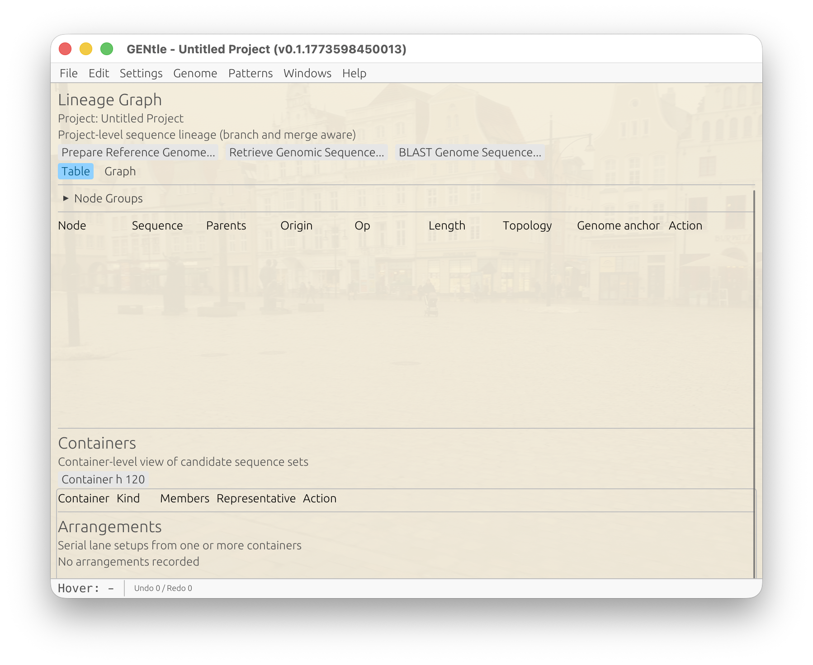
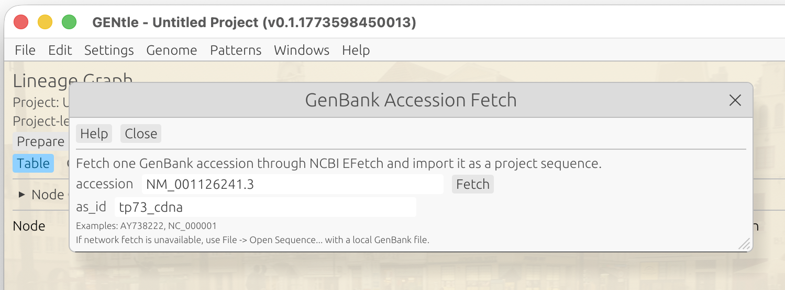
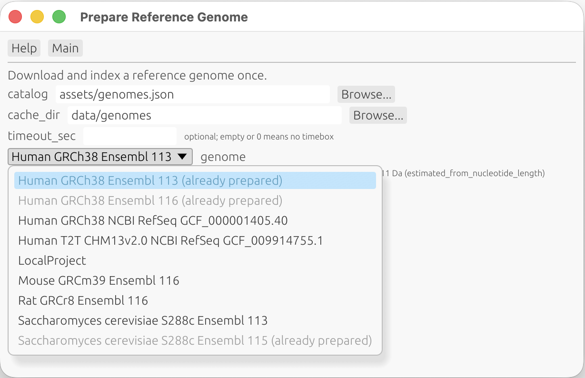
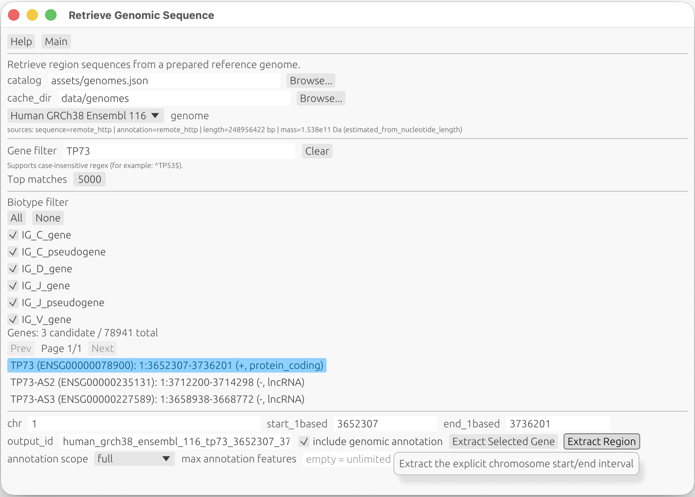
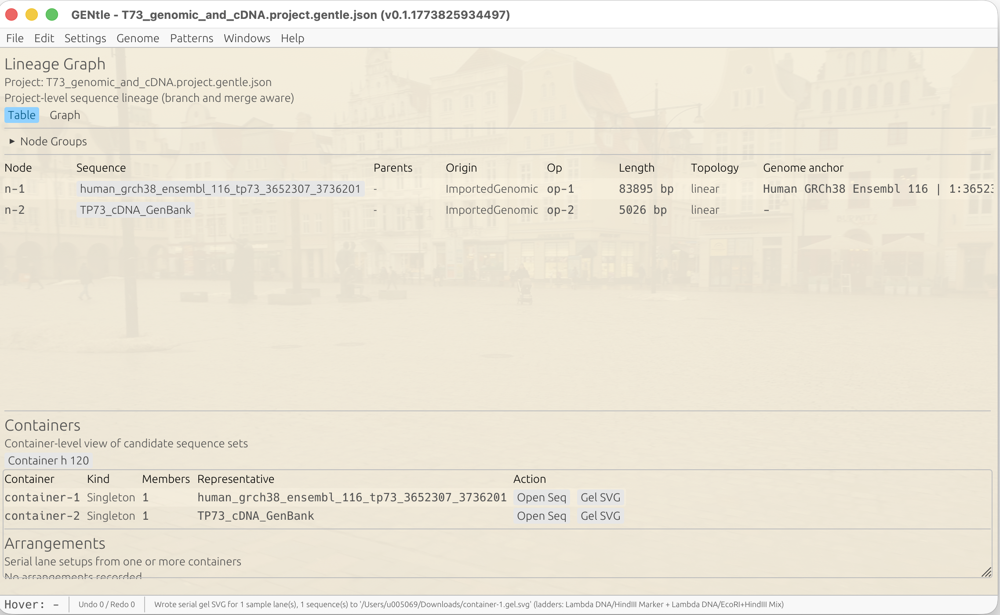
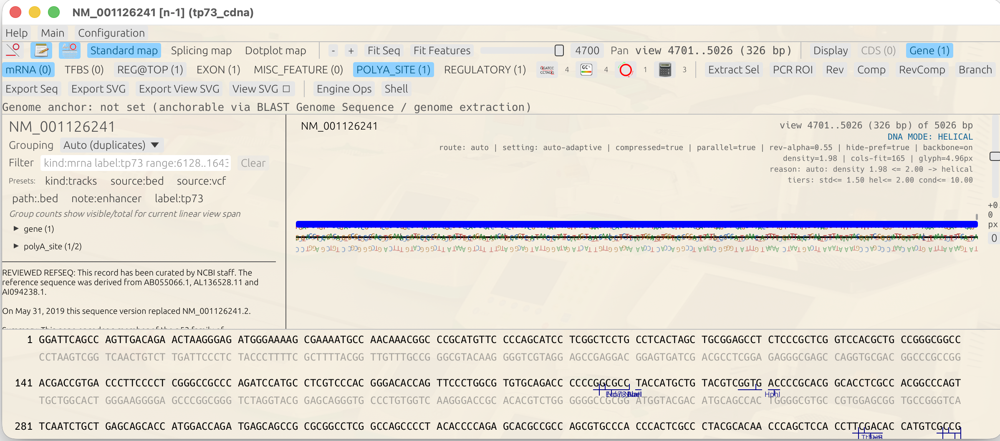
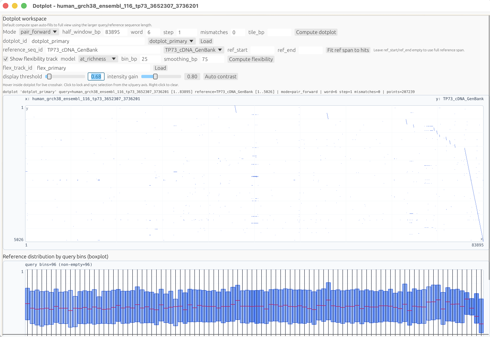
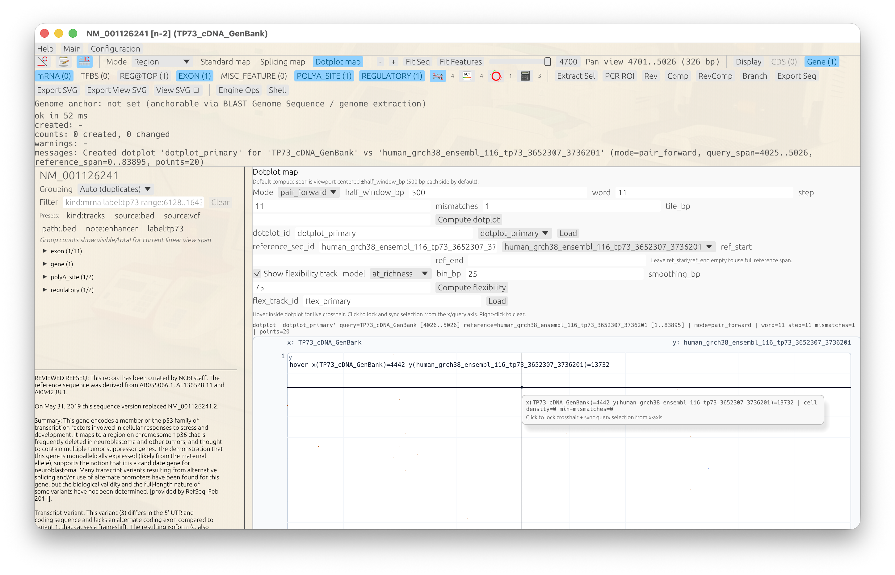
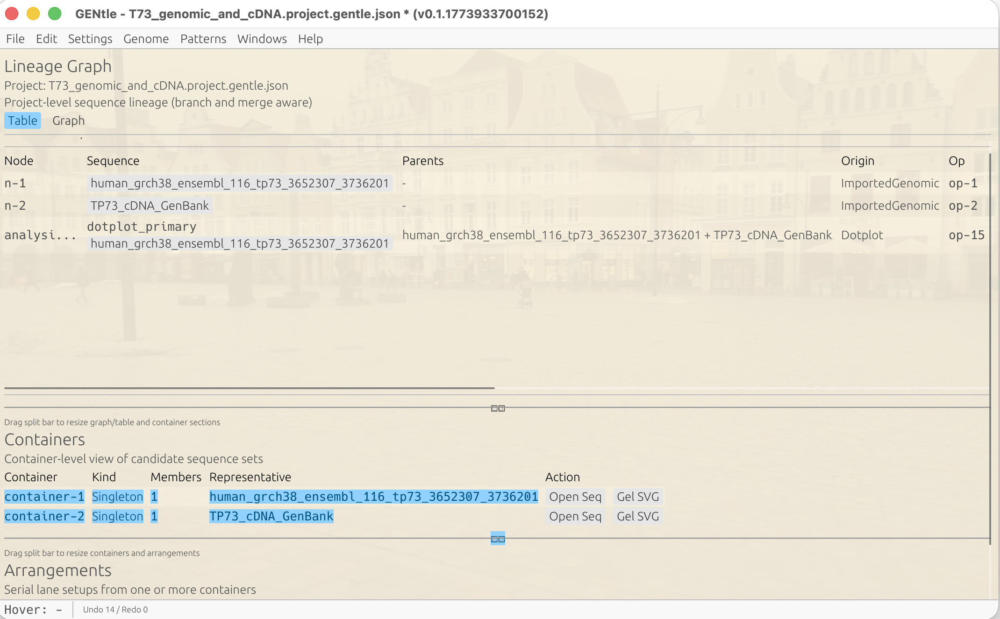

# Retrieve a cDNA and Compare It Against the Genomic Sequence (Dotplot Tutorial)

> Type: `GUI walkthrough`
> Status: `manual`
> Drift note: this page is screenshot-backed and useful for visual onboarding,
> but it is more exposed to GUI layout drift than generated tutorial chapters.

This tutorial shows a practical and biologically meaningful comparison:

1. fetch one TP73 cDNA sequence,
2. retrieve TP73 genomic context,
3. compare cDNA (query) against genomic DNA (reference) in the Dotplot map.

## Goal

Use this pair:

- cDNA/query: `NM_001126241.3`
- genomic/reference: TP73 locus extracted from `Human GRCh38 Ensembl 116`

This gives an exon-vs-intron-aware view where cDNA blocks align to genomic exon
regions.

## Quick Path (Minimal Controls)

Use this first; only tune parameters if needed:

1. Fetch cDNA (`NM_001126241.3`) as `tp73_cdna`
2. Retrieve genomic TP73 locus as `tp73_genomic`
3. Open sequence window for `tp73_cdna`
4. Switch primary map mode to `Dotplot map`
5. Set `Mode=pair_forward` and `reference_seq_id=tp73_genomic`
6. Click `Compute dotplot`

Default behavior now aims at a full first picture:

- `half_window_bp`: auto-filled to the larger query/reference length
- `word`: default `7`
- `step`: default `1`
- `mismatches`: default `0` (exact-seed baseline)

## GUI Workflow

Initial state:


*Figure 1. Main window before starting the cDNA-vs-genomic tutorial.*

### Step 1: Fetch TP73 cDNA (query)

1. Open `File -> Fetch GenBank Accession...`
2. Accession: `NM_001126241.3`
3. `as_id`: `tp73_cdna`
4. Click `Fetch and Import`


*Figure 2. GenBank fetch dialog for the TP73 cDNA accession.*

### Step 2: Prepare and retrieve TP73 genomic context (reference)

1. Open `File -> Prepare Reference Genome...`
2. Select `Human GRCh38 Ensembl 116`
3. Click `Prepare`
4. Open `File -> Retrieve Genomic Sequence...`
5. Gene query: `TP73`
6. Occurrence: `1`
7. Output ID: `tp73_genomic`
8. Click `Retrieve`


*Figure 3. Reference-genome preparation/retrieval dialog used to extract the TP73 genomic locus.*


*Figure 4. Retrieve Genomic Sequence dialog with TP73 query and output ID prefilled.*


*Figure 5. Main lineage view after both `tp73_cdna` and `tp73_genomic` are loaded.*

### Step 3: Open query sequence window (cDNA view) and switch to Dotplot map

1. Open sequence window for `tp73_cdna`
2. Verify the cDNA is visible in the standard sequence/DNA map view
3. Switch primary map mode to `Dotplot map`


*Figure 6. `tp73_cdna` sequence window before switching to dotplot mode.*

### Step 4: Configure pairwise dotplot

Set only the required controls first:

1. `Mode`: `pair_forward`
2. `reference_seq_id`: `tp73_genomic`
3. Keep `ref_start` / `ref_end` empty for first pass
4. Keep or set:
   - `word <= 7` (recommended start: `7`, or `6` for higher sensitivity)
   - `step = 1`
   - `mismatches = 0`
5. Click `Compute dotplot`

If the first pass is sparse/noisy, tune in this order:

1. Click `Auto contrast`
2. Keep `mismatches=0`, reduce `word` (for example `7 -> 6`)
3. Keep `step=1` where feasible for exon-stripe continuity
4. If you entered explicit `ref_start/ref_end`, click `Fit ref span to hits`, then recompute


*Figure 7. Dotplot workspace showing a successful TP73 cDNA-vs-genomic map with high-sensitivity settings (`word<=7`, `step=1`, `mismatches=0`).*


*Figure 8. Pair-forward result highlighting exon-aligned block structure for TP73 cDNA versus genomic reference.*

### Step 5: Graphical inspection

What to expect in cDNA-vs-genomic mode:

- cDNA exons appear as separated diagonal blocks on genomic coordinates.
- Gaps between blocks correspond to intronic distances in genomic space.
- Strong continuous diagonal across the full range is not expected for
  spliced cDNA vs unspliced genomic reference.

Interaction notes:

- Hover shows `x(query)` and `y(reference)` coordinates.
- Click locks crosshair.
- In pair mode, selection sync is from the query/x axis.
- Right-click clears crosshair.

### Interpretation Card (Quick Read)

- Expected positive-control pattern:
  - separated forward-diagonal blocks corresponding to exon-aligned cDNA matches
  - non-matching gaps between blocks correspond to intronic genomic distances
- Sparse/noisy map usually means sensitivity is too low for this span:
  - increase seed sensitivity first (`word <= 7`)
  - keep dense sampling (`step = 1`)
  - keep exact seeds first (`mismatches = 0`)
- Recovery baseline for this TP73 route:
  - `mode = pair_forward`
  - `word = 7` (or `6` if needed)
  - `step = 1`
  - `mismatches = 0`
  - default includes automatic reference-span fitting when `ref_start/ref_end` are left empty

### Step 5b: Confirm analysis artifact in lineage

1. Return to the main lineage window.
2. Confirm the computed dotplot appears as an analysis node.
3. Open/select that node to revisit the same artifact context.


*Figure 9. Dotplot artifact represented as an analysis node in the main lineage view.*

### Step 6: Optional orientation sanity check

Set mode to `pair_reverse_complement` and recompute.

For a same-orientation mapping, this usually weakens or removes the main
forward block structure.

## Equivalent CLI Commands

Canonical reusable workflow source:

- `docs/examples/workflows/tp73_cdna_genomic_dotplot_online.json`

Run the same end-to-end route as one canonical workflow:

```bash
cargo run --bin gentle_cli -- workflow @docs/examples/workflows/tp73_cdna_genomic_dotplot_online.json
```

Fetch cDNA:

```bash
cargo run --bin gentle_cli -- shell 'genbank fetch NM_001126241.3 --as-id tp73_cdna'
```

Prepare genome and retrieve TP73 genomic locus:

```bash
cargo run --bin gentle_cli -- genomes prepare "Human GRCh38 Ensembl 116" --catalog assets/genomes.json --cache-dir data/genomes
cargo run --bin gentle_cli -- genomes extract-gene "Human GRCh38 Ensembl 116" TP73 --occurrence 1 --output-id tp73_genomic --catalog assets/genomes.json --cache-dir data/genomes
```

Compute pairwise dotplot (baseline practical pass):

```bash
cargo run --bin gentle_cli -- shell 'dotplot compute tp73_cdna --reference-seq tp73_genomic --mode pair_forward --word-size 7 --step 1 --max-mismatches 0 --id tp73_cdna_vs_genomic'
```

Inspect result:

```bash
cargo run --bin gentle_cli -- shell 'dotplot show tp73_cdna_vs_genomic'
```

## Notes

- Pair modes require `reference_seq_id`.
- If `ref_start` / `ref_end` are omitted, compute starts with full reference
  span and then auto-fits to the hit envelope (+padding) with one recompute.
- Default `half_window_bp` is auto-filled from the larger sequence length to
  show the full context on first compute.
- Refine `word`/`step` only when needed.

## Screenshot Coverage Plan

Available and already embedded:

- `docs/screenshots/tutorial_cdna_genomic_01_main_start.png`
- `docs/screenshots/tutorial_cdna_genomic_02_fetch_cdna_dialog.png`
- `docs/screenshots/tutorial_cdna_genomic_03_prepare_genome_dialog.png`
- `docs/screenshots/tutorial_cdna_genomic_04_retrieve_tp73_genomic_dialog.png`
- `docs/screenshots/tutorial_cdna_genomic_05_sequences_loaded.png`
- `docs/screenshots/tutorial_cdna_genomic_06_cdna_sequence_window.png`
- `docs/screenshots/tutorial_cdna_genomic_07_dotplot_window.png`
- `docs/screenshots/tutorial_cdna_genomic_08_pair_forward_result.png`
- `docs/screenshots/tutorial_cdna_genomic_09_dotplot_as_node.png`

Optional additions (not required for this template):

1. `docs/screenshots/tutorial_cdna_genomic_10_dotplot_fit_ref_span.png`
   - Could illustrate manual refit only when explicit reference spans are set.
2. `docs/screenshots/tutorial_cdna_genomic_11_dotplot_reverse_complement_check.png`
   - Could illustrate an optional `pair_reverse_complement` orientation sanity check.
