# Experimental Follow-Up Request Graph

Audience: ClawBio/OpenClaw developers and GENtle integration maintainers.

This graph explains how the machine-readable request catalog should be read.
It is intentionally more annotated than a compact dependency graph because the
catalog mixes user intent, external evidence, deterministic GENtle artifacts,
and practical routine planning.

The current catalog-derived graph is generated in
`experimental_followup_catalog_graph.mmd` by
`generate_experimental_followup_catalog_graph.py`. Keep this human-readable
document as the semantic legend, and regenerate the `.mmd` file whenever
`experimental_followup_request_catalog.json` changes:

```sh
python3 integrations/clawbio/generate_experimental_followup_catalog_graph.py
```

## Annotated Flow

```mermaid
flowchart LR
  subgraph ORIGIN["1. Request origin"]
    PROMPT["User prompt<br/>Examples: effect of this SNP, overexpress this gene"]
    GUI["Optional GUI/session context<br/>Selected sequence, feature, locus, project"]
    DATA["Optional uploaded data<br/>VCF row, expression table, splice event, pasted sequence"]
  end

  subgraph ROUTING["2. ClawBio routing decision"]
    INTENT["Catalog intent<br/>intent_id such as snp_effect or knockdown_planning"]
    CLASSES["Evidence classes<br/>variant_context, differential_expression,<br/>splice_isoform_context, protein_context,<br/>regulatory_context, perturbation_intent"]
    INPUTS["Required and optional inputs<br/>What must be known before execution"]
  end

  subgraph EVIDENCE["3. Evidence gathering"]
    EXTERNAL["External or ClawBio-side evidence<br/>VEP, SpliceAI, expression stats,<br/>literature, eQTL, off-target predictors"]
    GENTLE_CONTEXT["GENtle sequence context<br/>Local feature geometry, transcript/gene context,<br/>TFBS, restriction, splicing, isoform views"]
  end

  subgraph EXECUTION["4. GENtle execution surface"]
    REQUESTS["Request templates<br/>skills/gentle-cloning/examples/*.json"]
    SHELL["Shared shell commands<br/>routines list/explain/compare,<br/>planning profile/objective"]
  end

  subgraph OUTPUTS["5. Two distinct output classes"]
    ARTIFACTS["Artifacts<br/>Portable files or records: SVG/PNG, BED,<br/>JSON reports, TSVs, protocol cartoons"]
    PLANNING["Routine planning<br/>Method comparison: time, cost,<br/>local fit, guardrails, missing materials"]
  end

  subgraph DECISION["6. Follow-up menu and gates"]
    CANDIDATES["Follow-up candidates<br/>Reporter, overexpression, knockdown,<br/>CRISPRi/a, editing, RT-PCR/qPCR, protein gel"]
    GATES["Confirmation gates<br/>Network predictors, reference prep,<br/>viral delivery, genome editing, planning-profile changes"]
    RESPONSE["ClawBio response<br/>Separate uncertainty-bearing evidence from<br/>deterministic GENtle artifacts and practical estimates"]
  end

  PROMPT --> INTENT
  GUI --> INTENT
  DATA --> INTENT
  INTENT --> CLASSES
  INTENT --> INPUTS
  CLASSES --> EXTERNAL
  CLASSES --> GENTLE_CONTEXT
  INPUTS --> REQUESTS
  GENTLE_CONTEXT --> REQUESTS
  REQUESTS --> ARTIFACTS
  SHELL --> PLANNING
  ARTIFACTS --> CANDIDATES
  PLANNING --> CANDIDATES
  EXTERNAL --> CANDIDATES
  CANDIDATES --> GATES
  GATES --> RESPONSE
```



## Reading the Layers

| Layer | Meaning | Owner |
| --- | --- | --- |
| Request origin | The raw material that triggered planning: prompt, selected GUI locus, uploaded table, VCF row, or pasted sequence. | User, GUI, ClawBio session |
| Catalog intent | The normalized routing label chosen from `experimental_followup_request_catalog.json`. This is the planner's first structured decision. | ClawBio planner |
| Evidence classes | Additive biological tags that explain why tools are relevant. One prompt may have several classes. | ClawBio planner |
| External evidence | Probabilistic or context-heavy evidence from tools and knowledge sources outside GENtle. | ClawBio/external tools |
| GENtle sequence context | Deterministic sequence-grounded context and renderable views. | GENtle |
| Request templates | Concrete example requests that ClawBio can adapt instead of inventing shell syntax. | GENtle integration scaffold |
| Artifacts | Durable outputs that can be attached, inspected, checksummed, or replayed. | GENtle |
| Routine planning | Practical comparison of possible methods using time/cost/local-fit estimates and guardrails. | GENtle planning layer plus ClawBio constraints |
| Follow-up candidates | The menu of plausible next actions presented to the user. | ClawBio planner, informed by GENtle |
| Confirmation gates | Points where ClawBio should ask before doing expensive, network-heavy, policy-sensitive, or strategy-defining work. | ClawBio planner |

## Key Distinctions

`intent` is not the biological result. It is the routing decision that says
which family of requests and evidence should be considered first. For example,
`snp_effect` can still end in a reporter assay, coding-variant construct,
splicing reporter, or "insufficient local evidence" response.

`evidence_classes` explain why an intent needs particular evidence. They are
additive. A single observation may be both `variant_context` and
`splice_isoform_context`, or both `differential_expression` and
`perturbation_intent`.

`artifacts` are concrete GENtle outputs: maps, protocol cartoons, BED files,
JSON reports, TSV exports, and context bundles. They are the evidence objects
that can be displayed or archived.

`routine planning` is not an artifact in the same sense. It is a decision aid
for comparing candidate methods: estimated time, estimated cost, local material
fit, missing materials, procurement delay, and guardrail status. It may produce
JSON/text output, but semantically it answers "which route is practical?" rather
than "what does the sequence look like?"

`follow-up candidates` are the combined interpretation of external evidence,
GENtle artifacts, and routine planning. They should remain labeled as candidate
actions unless dedicated evidence supports stronger wording.

## How This Should Fill the Catalog

New catalog entries should start from observed user requests, not from a broad
biology ontology. For each new entry, capture:

1. representative phrases users actually ask,
2. required inputs that must be known before execution,
3. additive evidence classes,
4. external evidence that ClawBio may gather,
5. GENtle example requests that can be adapted,
6. optional shell commands for routine/planning checks,
7. follow-up families the user may see,
8. confirmation gates that prevent accidental expensive or policy-sensitive
   work.

The generated graph should stay synchronized with the catalog, while this
human-readable graph remains useful as the contract for what those fields mean.
